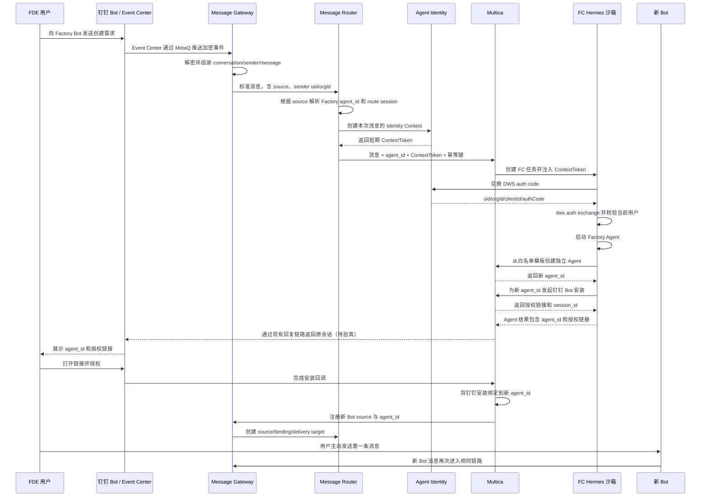

# Factory Bot 创建 Bot：MVP 目标、现状与缺口

> 状态：架构现状快照，不是实施计划
>
> 日期：2026-07-14
>
> 分支审计：2026-07-13 已对五个仓库执行远端更新并核对远端主干、release 和 feature 分支；2026-07-14 又核对了 `dt-fde-multica` 本地集成分支。本文明确区分“代码已具备”“本地分支已集成”和“线上/Runtime 已采用”，不从其中一项推断另外两项。
>
> 范围：只讨论“用户通过一个 Factory Bot 创建另一个 Bot”的最小闭环，不讨论数字员工、每个 Agent 独立 Git 仓库、Agent 自我迭代等后续能力。

## 0. 2026-07-14 本地实施更新

当前本地分支已补齐 Multica 侧的 Git Agent 模板目录与 CLI，但尚未提交、push、部署或进入 Runtime 镜像：

- 服务端从 `MULTICA_GIT_AGENT_TEMPLATES_JSON` 加载 0..N 个受信任 Git 模板仓库，并提供 workspace-scoped 的 list/get/create API；未来可替换为数据库 provider 和管理 UI，不改变 CLI 契约。
- CLI 已新增 `multica agent template list/get`、`multica agent create-from-template` 和 `multica dingtalk install begin/status`。
- `create-from-template` 只接受模板 key、`runtime_id` 和可选实例名称/描述，不暴露 repository/ref/installation/SHA，也不提供 model/thinking-level 参数。
- Git manifest 的 name/description 现在是创建默认值；Agent 创建时可覆盖，创建后可在 Multica 修改，Git 同步不会覆盖。Instructions 和 repository-managed skills 仍由 Git 同步管理。
- 每个 Git Agent Source 使用独立的 source-scoped skill 快照，允许多个 Agent 从同一模板创建，且一个 Agent 的同步不会修改另一个 Agent 的 skill row。
- 本地 `.env` 已把 `D1-2004/multica-agent-base-git@main` 注册为 `factory-default`；`./.multica/start-local.sh restart` 已在本地 PostgreSQL 模式完成构建并通过 backend/frontend 健康检查。
- 当前平台和 Linux AMD64 CLI 均已构建；Multica 测试覆盖 task token 的 owner/member/cross-workspace 权限契约。没有执行真实 FC Sandbox、线上 Multica、镜像或钉钉授权联调。

## 1. 结论

这个 MVP 在当前架构上可实现，不需要新增一个独立的 Agent Provisioning Service，也不需要为每个新 Agent 创建 GitHub 仓库。

当前基础能力分布在 `agent-message-gateway`、`agent-message-router`、`agent-identity`、`dt-fde-multica` 和 `multica-fc-hermes-runtime` 中，但五段链路还没有闭环。真正缺少的不是 Agent 的基本增删改查，而是以下连接能力：

1. Gateway 将钉钉原始事件正确转换为 Router 要求的标准消息，不能继续使用硬编码 source，也不能丢失发送者 `uid/orgId`。
2. Router 根据标准消息中的可信发送者创建短期身份 ContextToken，并随消息传给 Multica。
3. Multica 已实现 ContextToken 的接收、保存和透传，本地集成分支也已把这部分能力合入最新 `origin/develop` 基线；剩余问题是让实际部署版本和 Runtime 镜像采用同一套兼容实现，并覆盖 Router 的真实消息入口。
4. `multica-fc-hermes-runtime` 要在启动 Agent 前兑换 ContextToken，并用 DWS auth code 覆盖为本条消息发送者的 DWS 登录态。
5. Factory Bot 需要一组受限、稳定、可幂等调用的能力，用于从固定模板创建 Agent、选择 Runtime、发起钉钉 Bot 授权并查询结果。
6. 新 Bot 授权后需要把真实 Bot source 注册到 Gateway/Router 并绑定新 `agent_id`。
7. Agent 结果返回原钉钉会话的出站链路需要验真，创建流程还需要防重复、安全边界和明确验收状态。

钉钉事件 DTO 已经包含数值 `senderId` 和 `extension.realmOrgid`，DWS CLI 代码中也存在隐藏的 `dws auth exchange --code ... --uid ...` 能力，因此身份闭环有明确实现路径；但两组字段的真实语义、Runtime 固定版本是否包含该命令、auth code 的实际兑换兼容性仍必须通过真实联调确认。满足这些条件后，这套方案没有已知的架构性阻断。

## 2. MVP 目标

### 2.1 用户体验

FDE 用户只需要和一个已存在的 Factory Bot 对话，例如：

> 帮我创建一个用于代码评审的 Bot，使用代码评审模板。

Factory Bot 在沙箱内理解需求，并通过确定性的 Multica 能力完成创建。最终至少向用户返回：

- 新建 Multica Agent 的稳定标识，即 `agent_id`；
- 新 Bot 的钉钉授权链接；
- 当前创建或授权状态。

用户打开链接完成授权后，新钉钉 Bot 与刚创建的 `agent_id` 绑定。用户随后主动给新 Bot 发消息，消息路由到该 Agent，并以本次消息发送者的 DWS 身份执行。

MVP 不要求新 Bot 在授权完成后主动发送第一条消息。只要能够明确知道创建的是哪个 `agent_id`，并且用户能通过新 Bot 发起对话即可。

### 2.2 核心对象关系

- 一个新 Bot 对应一个独立的 Multica Agent。
- 多个用户可以基于同一个固定模板创建不同的 Agent。
- 每个 Agent 绑定一个 `runtime_id`。
- 多个 Agent 可以共享一个 Runtime，但应通过 Runtime 池分散 Agent，避免所有 Agent 固定在同一个 Runtime 上形成单点并发瓶颈。
- 模板可以由少量 GitHub 仓库维护，但 MVP 创建时不复制仓库，也不为每个 Agent 新建仓库。
- DWS 身份属于“当前消息发送者 + 当前任务”，不能永久写入 Agent，也不能复用为 Agent 的固定身份。

### 2.3 非目标

以下内容不属于本次 MVP：

- 数字员工账号自动创建；
- 每个 Agent 一个 GitHub 仓库；
- Agent 修改自身仓库并迭代能力；
- 新建独立的 Provisioning Service；
- 新 Bot 授权完成后主动向用户发第一条消息；
- 重新实现 Multica 已有的 Issue 分配、沙箱创建和按 `agent_id` 路由能力；
- 开放任意 GitHub 仓库、任意模板或任意 Runtime 给 Factory Bot 自由选择。

## 3. 几个仓库的作用与边界

这套 MVP 涉及五个工程仓库和一类模板仓库。它们不是重复实现同一件事，而是分别处于钉钉接入、消息路由、身份凭证、Agent 控制、沙箱执行和内容供应六个层面。

| 仓库 | 在 MVP 中的定位 | 已负责的核心对象 | 本次需要补的能力 | 明确不负责 |
| --- | --- | --- | --- | --- |
| `agent-message-gateway` | 钉钉事件接入和标准化适配层 | Event Center/MetaQ 消费、消息解密、钉钉原始字段、订阅和绑定入口、向 Router 推送事件 | 按 Router v2 契约组装 source/conversation/sender/message，正确透传 `senderId`、`realmOrgid` 和明文，去掉硬编码和敏感日志 | 不选择目标 Agent；不创建 Agent；不签发身份凭证；不启动沙箱 |
| `agent-message-router` | 标准消息路由和 Agent 派发层 | 消息来源、来源到 `agent_id` 的绑定、会话、去重、派发任务、`Idempotency-Key` | 调用 `agent-identity` 创建 ContextToken、在派发协议中携带 Token、把消息安全派发给 Multica | 不解析钉钉密文；不创建/修改 Agent；不管理模板和 Runtime；不保存长期 DWS 凭证 |
| `agent-identity` | 短期身份凭证代理 | Identity Context、ContextToken、DWS auth code 兑换、TTL、撤销和 Token 哈希存储 | 配置可用的 DWS Client、向 Router 开放可信 HSF 调用、向沙箱开放受控 redeem 地址并完成联调 | 不接收或路由钉钉消息；不决定消息发给哪个 Agent；不创建 Agent/Bot；不选择 Runtime |
| `dt-fde-multica` | Agent 控制面 | Agent、`agent_id`、模板、Runtime、任务队列、FC/E2B 沙箱调度、钉钉 Bot 安装，以及 Issue/快速创建到任务和沙箱的 ContextToken 传输 | Router 可信派发入口、部署和 Runtime 版本对齐、Factory Bot 的受限创建能力、Runtime 池分配和创建幂等 | 不作为用户真实身份源；不解析钉钉原始消息；不签发 DWS 凭证；不在镜像内实现 DWS 登录 |
| `multica-fc-hermes-runtime` | FC Agent Sandbox 执行镜像 | Hermes、Multica CLI、DWS CLI/Skill、模型配置、固定 DWS profile 导入、`daemon run-once` | ContextToken redeem、DWS auth code exchange、身份覆盖与验证、镜像版本兼容和身份回归测试 | 不保存 Agent 定义；不路由消息；不创建 Bot 安装；不决定使用哪个用户身份 |
| Agent 模板 GitHub 仓库 | 经审核的 Agent 内容源 | Agent 指令、Skill、脚本和其他模板文件 | 确定版本策略、私有仓库读取方式、审核和发布到 Multica 的流程 | 不是 Agent 的运行目录；不承载任务产物；MVP 不为每个新 Agent 复制一个仓库；不负责运行和身份认证 |

### 3.1 `agent-message-gateway`：把钉钉原始事件变成标准消息

Gateway 是钉钉 Event Center 与内部 Router 之间的协议适配器。它消费 MetaQ 事件、解析钉钉字段、解密 `authorityOpenContent`，并通过 HSF 把标准事件推给 Router。它也是订阅 Event Center、向 Router 注册 source/agent 绑定的入口。

Gateway 是最早拿到可信 `senderId` 和组织上下文的服务，但它不应自行决定目标 Agent，也不应自行签发执行凭证。它的职责是无损、可信地把发送者和消息标准化后交给 Router。

### 3.2 `agent-message-router`：确定“这条消息交给哪个 Agent”

Router 接收 Gateway 已标准化的消息，根据消息 source 找到绑定的 `agent_id`，按 conversation 和 sender 建立会话范围，执行事件去重，并通过 Agent 对应的 `dispatchUrl` 派发。

Router 拥有 `dispatchTaskId`、目标 `agent_id` 和标准发送者身份，因此最适合在派发前调用 `agent-identity`，为本次派发创建 ContextToken。Router 不负责钉钉 AES 解密，也不负责 Agent 生命周期。

### 3.3 `agent-identity`：把可信身份变成短期执行凭证

`agent-identity` 是凭证代理，不是用户目录，也不是消息路由器。可信 Router 向它提供 DWS 数字 `uid/orgId` 和任务上下文，它签发短期 ContextToken；沙箱使用该 Token 兑换短期 DWS auth code。

它解决的是“不把用户长期凭证交给 Gateway、Router、Multica 或 Agent”的问题。它不判断应该使用哪个用户，也不知道消息目标 `agent_id` 是否正确，这些判断必须由 Gateway 的可信字段、Router 的绑定以及 Multica 的权限校验共同完成。

### 3.4 `dt-fde-multica`：创建、保存和调度 Agent

Multica 是最终保存新 Agent 的系统，也是新 Agent 被派发任务和启动沙箱的系统。Factory Bot 创建出来的结果必须落成一个 Multica `agent_id`，其模板、Runtime、权限和钉钉安装关系都由 Multica 管理。

它处于身份链路的下游：接收 Router 传来的短期 ContextToken，把 Token 随任务交给 FC Runtime，但不应根据客户端随意传入的用户 ID 自行冒充用户，也不应承担钉钉发送者身份的真实性判断。

### 3.5 `multica-fc-hermes-runtime`：在沙箱里真正运行 Agent

该仓库构建当前 FC/E2B 使用的 Hermes Runtime 镜像。镜像内包含 Hermes、Multica CLI、DWS CLI v1.0.51、DWS Skill 和 `multica-fc-hermes-runner`。Runner 配置模型、为每个任务创建独立 DWS 配置目录，然后执行 `multica daemon run-once` 领取一个任务。

Runner 只接受逐任务 ContextToken 身份：有 Token 时兑换 DWS AuthCode 并校验登录 UID；无 Token 时使用全新的空配置目录继续普通任务。任务结束后删除该目录，不读取或导入 Agent 历史 DWS profile。

### 3.6 Agent 模板 GitHub 仓库：提供能力内容

模板仓库只定义 Agent 应具有的指令、Skill 和脚本。MVP 中，模板应经过审核并以固定版本进入 Multica 白名单。多个用户可以从同一个模板创建不同的 Multica Agent，但这些 Agent 不需要各自复制一份 Git 仓库。

GitHub 仓库不是 Agent 工作目录。Agent 每次仍在 Multica 分配的沙箱内工作，运行产物和后续持久化不属于本次 MVP。

## 4. 目标端到端流程



Factory Bot 是这个流程的业务编排者，Gateway、Router、Identity、Multica 和 Runtime 才是可信执行链。Factory Bot 不应直接获得 GitHub 组织管理、数据库写入或无边界工作区管理员权限，它调用的应是经过约束的产品能力。

## 5. 当前已经具备的能力

### 5.1 agent-message-gateway

仓库：`agent-message-gateway`

当前已有：

- 通过 MetaQ 消费钉钉 Event Center 的 `message-create` 事件；
- 兼容事件 `data` 为 JSON 对象或 Base64 字符串；
- 解析 `messageId`、`conversationId`、`receiverId`、数值 `senderId`、`senderNickName` 和 `extension.realmOrgid`；
- 使用 AES 解密 `authorityOpenContent`，得到 `plainText`；
- 通过 Router HSF `receiveEvent` 推送事件；
- 通过 HSF/HTTP 完成 Event Center 订阅、Router source/agent binding 和 subscription 创建。

这意味着“从真实钉钉事件取得用户 uid、组织上下文、会话和消息正文”的原始材料已经存在。

当前实现仍不能直接满足 Router v2 消息契约：

- `source.tenantId` 被硬编码为 `dingtalk`；
- `source.externalId` 被硬编码为 `123`，没有使用真实接收 Bot/Robot ID；
- `event.data` 只放了 `msg.getContent()`，而 Router 要求完整的 `conversation/sender/message` 对象；
- 解密后的 `plainText` 没有放进标准消息的 `message.text`；
- `senderId` 和 `extension.realmOrgid` 没有进入 `event.data.sender`；
- `rawPayload` 被置为 `null`；
- 当前日志会输出完整 MetaQ body、AES key、密文片段和解密明文，真实用户联调前必须删除或脱敏。

按当前代码，事件可能因为硬编码 source 找不到绑定，或者因为 `event.data` 结构不符合 `ChannelMessageCreatedData` 而被 Router 拒绝。因此 Gateway -> Router 标准消息闭环是独立的 P0，不应假设已经完成。

### 5.2 Multica

#### Agent 与任务执行

Multica 已具备：

- Agent 数据模型和 `agent_id`；
- Agent 与单个 `runtime_id` 的绑定；
- Issue/任务创建、队列分配和沙箱启动；
- 按指定 `agent_id` 派发 Agent；
- Agent 级 `max_concurrent_tasks`；
- 本地 Daemon 和 FC/E2B Runtime 启动链路。

需要注意：同一 Daemon 上即使配置多个 Runtime，仍共享 Daemon 的全局并发上限。仅创建多个 Runtime 记录不会自动增加实际执行容量。FC/E2B 的沙箱则按 Runtime 和会话/Issue 维度创建或复用。

#### 从 Git 仓库模板创建 Agent

本地集成分支已新增面向 Factory Bot 的 Git 模板目录接口：

```text
GET  /api/workspaces/{workspace_id}/git-agent-templates
GET  /api/workspaces/{workspace_id}/git-agent-templates/{template_key}
POST /api/workspaces/{workspace_id}/git-agent-templates/{template_key}/agents
```

对应 CLI 为：

```bash
multica agent template list --output json
multica agent template get <template-key> --output json
multica agent create-from-template <template-key> --runtime-id <runtime-id> --output json
```

模板目录只保存受信任仓库的稳定 key、repository/ref 和展示元数据；服务端在创建时根据工作区 GitHub installation 重新解析仓库、固定 commit、编译 `multica-agent.yaml` 并原子创建 Agent、Agent Source 和独立的 repository-managed skill 快照。调用方不能传入任意仓库或 SHA。

旧的内部静态模板接口仍存在于代码中，但不属于本次 Factory Bot 契约；这里的“模板”只指 Git 仓库 Agent 模板。

#### 钉钉 Bot 安装

Multica 已有设备授权流程：

```text
POST /api/workspaces/{workspace_id}/dingtalk/install/begin?agent_id={agent_id}
GET  /api/workspaces/{workspace_id}/dingtalk/install/{session_id}/status
```

`begin` 会返回：

- `session_id`
- `qr_code_url`，实际可作为用户点击的授权 URL
- 过期时间和轮询间隔

授权成功后，状态接口会返回安装结果，Multica 会将安装记录绑定到发起流程时指定的 `agent_id`。

当前限制：

- 接口要求工作区 Owner/Admin 权限；
- 最新 release 已将安装会话状态持久化到数据库，不同副本可以查询同一个会话；但设备码和轮询协程仍由发起授权的副本持有，该副本消失时会话会转为过期，用户需要重新发起授权；
- 本地集成分支已提供安装开始和状态查询 CLI，但线上/镜像是否包含该 CLI 仍未验证；
- Factory Agent 如果直接持有管理员用户的通用任务 Token，理论上可调用，但权限范围过大，不适合作为正式安全边界。

#### ContextToken 传入沙箱

Multica 在这段链路中的职责已经明确：它不生成 ContextToken，也不根据客户端传入的用户 ID 冒充用户；它只接收上游 Agent Identity 已签发的任务级 Token，将其保存在内部任务上下文，并在任务启动时透传给 Daemon 或 FC/E2B 沙箱。

字段约定：

| 位置 | 名称 |
| --- | --- |
| HTTP JSON 字段 | `agent_identity_context_token` |
| `agent_task_queue.context` JSON key | `agent_identity_context_token` |
| 沙箱/Agent 进程环境变量 | `AGENT_IDENTITY_CONTEXT_TOKEN` |
| 协议常量 | `server/pkg/protocol/messages.go` |

当前已确认的输入入口包括：

- 页面创建 Issue：`POST /api/issues`；
- 页面智能创建：`POST /api/issues/quick-create`；
- CLI 创建 Issue：`multica issue create --agent-identity-context-token ...`；
- 上游系统使用 PAT 或服务账号 Token 直接调用上述 HTTP API。

其中，普通 Issue 只有在指派给可运行的 Agent/Squad 且状态不是 backlog 时才会入队；quick-create 会直接创建没有 Issue 绑定的 `agent_task_queue` 任务。当前没有开放通用的 `POST /api/tasks` 允许上游任意插入内部任务。

实现最初进入以下功能/release 历史：

```text
feature/20260713_30155297_codex/agent-identity-context-token_1
```

该分支核对点 `9f537021` 已进入已核对的 release
`releases/20260713210640872_r_release_342160_dt-fde-multica-code` 的
`bdd31ee8`，因此不能再把它描述为“只存在于功能分支”。当前本地分支
`codex/factory-bot-mvp-integration` 又从 `origin/develop@cd1dc5cd` 出发，合入了
`origin/feature/20260713_30171661_agent-identity-context-token_1@68d02346`；对应
merge commit 为 `cb776d61`。这说明本地集成代码已经同时包含最新 develop 基线和
ContextToken 能力，但仍不能据此推断线上部署或 Runtime 镜像已经采用该分支。

已实现：

- CLI 创建 Issue 时接受 `--agent-identity-context-token`；
- Issue 创建和快速创建接受 `agent_identity_context_token`；
- 普通 Issue、Squad leader 和 quick-create 入队时将 Token 写入 `agent_task_queue.context`；
- Token 不写入 Issue 正文、评论或附件；
- Daemon claim 普通任务或 quick-create 任务时在响应中返回 Token；
- 本地 Daemon 启动 Agent 进程时注入：

```text
AGENT_IDENTITY_CONTEXT_TOKEN
```

- FC/E2B Launcher 从任务 context 读取 Token，或者在 DWS Chat 启动前依据 Agent 已绑定的钉钉身份创建 Token，并在创建或复用沙箱时注入：

```text
AGENT_IDENTITY_CONTEXT_TOKEN
MULTICA_AGENT_IDENTITY_BASE_URL
MULTICA_AGENT_IDENTITY_TIMEOUT_SECONDS
```

- ContextToken 任务要求服务端配置 `MULTICA_AGENT_IDENTITY_BASE_URL`；缺少配置时会拒绝启动该任务，不会使用其他身份；
- Chat 的 DWS 身份只来自 Agent 绑定的钉钉账号；未绑定时不注入身份，绑定后创建或兑换失败则任务失败；
- 日志脱敏规则已覆盖 `agent_identity_context_token` 和 `dws_auth_code`。

这说明“Token 从 Multica 的 Issue/quick-create 请求进入任务，再进入 Daemon/沙箱环境”的链路已经存在。后续 Runtime 可以统一从环境变量读取 Token，不需要直接访问 Multica 数据库。

当前限制：

- Router、普通评论、重跑、频道消息等入口尚未统一为每次任务生成并传递新 Token；
- 该实现只完成 Token 传输，没有调用 `agent-identity` 创建 Token；
- 原始 `origin/develop` 分支本身仍不包含该能力；当前只有本地集成分支同时包含最新 develop 基线与 ContextToken，因此实际部署分支和 Runtime 镜像的 Multica 构建版本仍必须显式对齐；
- 当前沙箱启动脚本没有兑换 Token 和初始化 DWS 的逻辑；
- 当前随项目打包的 DWS CLI 未发现原生识别 `AGENT_IDENTITY_CONTEXT_TOKEN` 的能力；
- 页面上的手工 Token 输入仅适合调试，不应成为生产交互，也不应向用户暴露。

### 5.3 agent-message-router

仓库：`agent-message-router`

当前已有：

- 钉钉来源与 `agent_id` 的绑定；
- 每个 Agent 的派发地址配置；
- 会话范围和事件存储；
- 入站消息规范化为 `channel.message.created`；
- 派发内容中包含发送者 ID、租户 ID、会话、消息和 `agentId`；
- HTTP 派发时携带 `Idempotency-Key`；
- 根据来源自然标识订阅目标 Agent 的能力。

Router 当前明确不负责 Agent 生命周期，也不管理 Bot 凭证，这与目标架构一致。

当前缺少：

- 对 `agent-identity-client` 的依赖；
- 调用 HSF `createAgentIdentityContext`；
- 在派发协议中携带 ContextToken；
- 面向 Multica 的正式适配器；
- Router 到 Multica 派发端点的服务级认证。当前 HTTP 派发主要依赖环境或网关隔离。

### 5.4 agent-identity

仓库：`agent-identity`

当前已有：

- Java Client 模块和 HSF 接口 `AgentIdentityContextService`；
- 创建和撤销 Identity Context；
- DWS 身份类型和 `DWS_AUTH_CODE` 凭证；
- 短期 ContextToken；
- 沙箱侧通过 HTTP 使用 Bearer Token 兑换 DWS auth code；
- Token 只以 SHA-256 哈希形式存储在 Tair；
- ContextToken 默认和最大 TTL 为 15 分钟。

创建 Context 时，调用方需要提供可信的：

- `taskId`
- `agentId`
- DWS 数字 `uid`
- DWS 数字 `orgId`
- `requestId`

兑换接口返回：

- `uid`
- `orgId`
- `clientId`
- `authCode`
- 有效时间

当前限制：

- 它不是一个任意字符串 `userId -> token` 的公共接口；调用方必须已经知道正确的 DWS `uid/orgId`；
- 相同 `requestId` 再次创建会返回 `DUPLICATE_REQUEST`，不会返回上一次的原始 Token，因此调用方需要设计明确的重试策略；
- 同一个 ContextToken 在过期前可以重复兑换；
- HSF 服务信任调用方传入的 `uid/orgId`，因此只有可信服务可以调用，不能让 Agent 或普通客户端自行指定；
- 沙箱必须能够访问兑换 HTTP 服务。

### 5.5 multica-fc-hermes-runtime

仓库：`multica-fc-hermes-runtime`

当前已有：

- 面向 FC Agent Sandbox/E2B 的 Hermes Runtime 镜像；
- 镜像内包含 Hermes、Multica CLI、Python、DWS CLI v1.0.51 和 DWS Skill；
- Runner 根据 Multica 注入的环境变量配置 MaaS/OpenAI 兼容模型；
- Runner 最终执行 `multica daemon run-once`，只领取指定 Runtime 的一个任务；
- Runner 为每个任务创建独立 `DWS_CONFIG_DIR`，避免复用沙箱时继承其他任务身份；
- 有 ContextToken 时，Runner 兑换短期 AuthCode，执行 `dws auth exchange`，再校验 `dws auth status` 和 `dws contact user get-self`；
- Runtime smoke test 会检查 `multica`、`hermes`、`dws` 和 DWS Skill 是否存在。

历史授权包和 Agent 固定 DWS profile 链路已经删除。Chat 的唯一 DWS 身份来源是 Agent 绑定的钉钉账号；Issue 仍可显式携带 ContextToken。Multica 会按 Chat Session 或 Issue 复用 FC sandbox，因此 Runner 每次都使用独立临时配置目录并在结束时清理。

DWS CLI 代码中存在隐藏命令：

```text
dws auth exchange --code <authCode> --uid <uid>
```

这为 Runner 初始化用户身份提供了直接候选实现，但仍需在镜像实际固定的 v1.0.50 上验证：命令是否存在、如何使用 `agent-identity` 返回的 `clientId`、是否能正确保存可供后续 DWS 命令使用的 Token，以及复用沙箱时能否强制替换旧身份。

## 6. 当前缺少的端到端能力

以下项目按 MVP 阻断程度排序。

### 6.1 P0：没有这些能力就无法完成真实闭环

#### 1. Gateway 按 Router v2 契约发送真实标准消息

Gateway 必须把当前钉钉事件转换为 Router 的 `ChannelMessageCreatedData`：

- `source.platform/type/tenantId/externalId` 使用和订阅记录一致的真实 Bot source；
- `conversation.id/type` 使用真实会话；
- `sender.id` 使用可信数值 `senderId`；
- `sender.tenantId` 使用经过确认的 DWS `orgId`；
- `message.id/type/text/createdAt` 使用真实消息字段和解密后的 `plainText`；
- `eventId` 保持上游消息 ID，以便 Router 去重；
- 保留必要的 raw metadata，但不得把敏感密文或凭证写入日志。

必须删除 `tenantId=dingtalk`、`externalId=123` 和字符串型 `event.data` 的临时实现，并增加 Gateway -> Router 契约测试。否则后续 Router 绑定、会话、身份和 Multica 派发都没有可靠输入。

#### 2. Router 创建并传递每次消息的身份 ContextToken

Router 收到消息后，需要：

1. 从 Gateway 标准消息中取得发送者 DWS 数字 `uid` 和 `orgId`；
2. 使用本次派发的唯一 ID 生成 `requestId`；
3. 调用 `agent-identity` HSF 创建 ContextToken；
4. 将 ContextToken 加入发给 Multica 的可信派发请求；
5. 确保一个用户触发的新任务使用一个新 Token，而不是把 Token 固化在 Agent 上。

Gateway DTO 已有 `senderId` 和 `extension.realmOrgid`，但必须用真实事件确认二者分别等于 `agent-identity` 所需的 DWS `uid/orgId`。如果 `realmOrgid` 不是用户执行 DWS 时的目标组织，需要在 Gateway 或可信身份服务中增加映射，不能让 Agent 自行指定。

#### 3. Router 到 Multica 的消息适配器

需要一个受认证的入口，把 Router 的：

- `agentId`
- 消息内容
- 会话标识
- ContextToken
- `Idempotency-Key`

转换为 Multica 的聊天、Issue 或任务，并保证 Token 在任务启动前进入 `agent_task_queue.context`。

这个适配器可以实现在 Multica 内，不需要独立部署一个 Provisioning Service。

#### 4. 将已集成的 ContextToken 能力对齐到实际部署和 Runtime CLI

已核对 release `bdd31ee8` 和当前本地集成分支都包含服务端、Daemon 和 FC/E2B 的 Token 传输实现；剩余问题不是重新实现这段链路，而是把本地集成结果纳入实际部署基线、消除 Runtime 构建版本分叉，并覆盖真正的消息入口。需要：

1. 确认实际部署使用包含该能力的 release，或将当前本地集成分支作为后续部署基线；
2. 让 Router 消息入口、评论/继续对话和实际使用的任务入口都能写入逐任务 Token；
3. 保留并验证 FC Launcher 在创建/复用 sandbox 时把本任务 Token 注入 Runner 的能力；
4. `multica-fc-hermes-runtime` 构建与服务端兼容且包含相应协议的 Multica CLI，而不是继续无条件从原始 `develop` 构建；
5. 用 commit、版本号或 digest 固定 Runtime 镜像/E2B Template，避免服务端和 CLI 协议漂移；
6. 增加从 Multica 入队到 Runner 环境变量可见的集成测试。

#### 5. Runtime 在 Agent 启动前兑换 ContextToken 并初始化 DWS

这是当前最明确的执行链缺口。只把 Token 放进环境变量不会自动获得 DWS 身份。

`multica-fc-hermes-runner` 需要在 Agent 主进程启动前执行：

1. 读取 `AGENT_IDENTITY_CONTEXT_TOKEN`；
2. 调用 `agent-identity` redeem 接口；
3. 获取 `uid/orgId/clientId/authCode`；
4. 设置正确的 DWS client 配置，并调用候选命令 `dws auth exchange --code ... --uid ...`；
5. 对复用 sandbox 使用独立临时 DWS 配置目录，并在任务结束时删除；
6. 使用 `dws auth status` 和 `dws contact user get-self` 验证 `uid/orgId`；
7. 清除 shell 中的 ContextToken/authCode，并确保日志不输出；
8. 再执行 `multica daemon run-once` 启动真正的 Agent Runtime。

Factory Bot 和新建 Bot 的身份策略统一为逐任务 ContextToken；不再保留或读取固定 DWS profile。

#### 6. Factory Bot 的受限创建能力

Factory Agent 需要可在沙箱中调用的确定性工具，至少包括：

- 列出允许使用的模板；
- 从白名单模板创建 Agent；
- 从 Runtime 池选择或请求一个 Runtime；
- 返回新 `agent_id`；
- 为该 `agent_id` 发起钉钉安装；
- 返回授权 URL 和安装状态。

可以采用两种实现形式：

- 给现有 Multica CLI 增加对应命令；
- 提供窄权限的内部 HTTP Capability API，并包装成 Factory Agent 的 Skill/脚本。

不应让 Factory Agent 直接操作数据库，也不应把通用管理员凭证放进沙箱。

#### 7. 创建幂等性

对话、网络和 Agent 执行都可能重试。需要由服务端使用稳定的 provisioning key 保证：

- 同一次用户创建请求不会生成两个 Agent；
- Agent 已创建但钉钉授权未完成时，重试返回同一个 `agent_id` 并重新生成或返回授权入口；
- 不依赖模型自行记住是否已经调用过工具。

#### 8. Runtime 池选择

每个新 Agent 仍必须落到一个具体 `runtime_id`。MVP 至少需要固定 Runtime 白名单，并采用简单可预测的分配策略，例如：

- Round Robin；
- 按用户或 Agent 哈希；
- 在可观测数据足够时选择当前负载最低的 Runtime。

MVP 不要求一个 Agent 一个 Runtime，但不能默认把所有新 Agent 永久固定到同一个 Runtime。

#### 9. 新 Bot 授权后建立 Gateway/Router 绑定

Multica 的钉钉安装记录绑定到 `agent_id`，并不自动证明外部 Gateway/Router 已认识这个新 Bot source。授权成功后必须有一个确定性步骤：

1. 得到新 Bot 在 Event Center/Gateway 中使用的真实 source identity；
2. 通过 Gateway 注册 Event Center 消息订阅；
3. 在 Router 创建或确认 source；
4. 建立 `source -> 新 agent_id` binding；
5. 配置该 Agent 的 Multica `dispatchUrl`；
6. 重试时复用已有 active binding，不创建冲突记录。

Gateway 和 Router 已有订阅/绑定 API，但当前 Multica 钉钉安装回调是否调用它们尚未得到代码证据。如果没有，这段集成就是新 Bot 收到第一条消息前的 P0。

#### 10. 验证 Agent 结果返回钉钉的链路

用户已确认按 `agent_id` 把消息路由到目标 Agent 的能力存在，但“Agent 结果如何回到原钉钉会话”仍要做一次真实验真：

- 当前 Gateway 代码只实现钉钉入站，没有发送钉钉回复；
- 当前 Router 的 Agent Task Result API 只保存 `resultMessage/executionResult`，没有看到向钉钉回推；
- 如果 Multica 现有钉钉 Channel 已经负责回复，应明确复用它并用 Router session 关联原会话；
- 如果没有其他已部署服务负责出站，则必须补充 `Agent result -> Router/Gateway -> 钉钉会话`，否则 Factory Bot 无法把授权链接返回用户。

这一项可以通过真实 Factory Bot 回声测试快速确认，不应仅根据“入站能分配 Agent”推断出站也已完成。

### 6.2 P1：不阻断演示，但上线前必须补齐

#### 权限边界

当前可通过“Factory Agent 所属用户恰好是工作区管理员”让它调用创建和钉钉安装接口，但这会把过宽权限带入可被自然语言驱动的沙箱，容易受到提示词注入和误操作影响。

正式方案应提供专用 Capability：

- 固定工作区；
- 固定模板白名单；
- 固定 Runtime 池；
- 只允许创建 Agent 和发起对应 Agent 的 Bot 安装；
- 禁止修改已有无关 Agent；
- 限制单用户、单租户和单时间窗口创建数量；
- 记录发起用户、Factory Agent、模板、目标 Agent 和操作结果。

#### 服务间认证

Gateway -> Router、Router -> `agent-identity`、Router -> Multica、沙箱 -> `agent-identity`、Factory Agent -> Multica Capability 都需要明确的服务身份、签名或短期凭证，不能只依赖“接口不暴露在公网”。

#### 敏感信息保护

- ContextToken 和 DWS auth code 不得写入普通日志；
- 不得通过面向用户的 API 或页面返回；
- Multica 当前会在任务上下文和环境变量中短期持有明文 Token，需要限制读取范围并确保日志脱敏；
- Gateway 当前会输出完整 MetaQ body、AES key 和解密明文，这些日志必须在真实用户测试前移除；
- Runtime 调用 redeem 和 `dws auth exchange` 时不得把 ContextToken/authCode 放在可被进程列表或调试日志长期保留的位置；
- 页面手工输入 ContextToken 的能力只应存在于受控调试环境；
- 15 分钟 TTL 要求任务及时启动。队列等待过长时需要临近执行再签发、刷新或重新派发，而不是延长为长期凭证。

#### Runtime 身份隔离

Multica 会按 Chat Session 或 Issue 复用 FC sandbox。每次任务都必须确认当前 DWS 身份等于本次消息发送者；不同身份时应清理并强制覆盖旧认证。不能因为镜像 README 称其为“一次性 Runtime”就假设 HOME 一定为空。

#### 钉钉安装会话可靠性

最新 release 已把安装会话可观察状态持久化到数据库，跨实例状态查询不再是缺口。剩余风险是设备码和轮询驱动仍在发起副本内：该副本退出时会话会过期。MVP 可接受对同一个 `agent_id` 重新发起授权；正式环境需决定是否持久化授权驱动状态，或明确把“副本消失后重新授权”作为恢复策略。

#### 模板来源治理

如果模板继续放在 GitHub，需要明确：

- 模板版本如何进入 Multica；
- 固定 commit/tag 还是跟踪分支；
- 私有仓库凭证由谁保管；
- 模板和 Skill 更新是否影响已创建 Agent；
- 谁可以将模板加入白名单。

MVP 最简单的做法是使用少量经审核、固定版本的内置模板，不做运行时任意仓库导入。

## 7. 哪些是我们可以直接实现的

在现有五个工程项目范围内，可以实现：

- Gateway 按 Router v2 契约组装真实 source/conversation/sender/message；
- Gateway 删除硬编码 source、敏感日志并增加契约测试；
- Router 集成 `agent-identity-client` 并创建 ContextToken；
- Router 派发协议增加 ContextToken；
- Multica 增加受认证的 Router 消息入口；
- Multica 已有的 Token 接收、保存和透传能力不需要重写；只需让 Router 真实消息入口把每次消息的 Token 写入任务；
- 将当前本地集成分支中的 ContextToken 能力对齐到实际部署基线，并让 Runtime 镜像构建兼容版本的 Multica CLI；
- `multica-fc-hermes-runner` 增加 redeem、`dws auth exchange`、身份覆盖和自检；
- 固定并发布包含该能力的 FC/E2B Template；
- Multica CLI 或 Capability API 增加从模板创建、发起钉钉授权、查询状态；
- 钉钉安装成功后调用 Gateway/Router 的 subscription/binding API，把新 source 绑定到新 `agent_id`；
- 固定模板目录、Runtime 池和简单分配策略；
- 创建幂等、限流、审计和日志脱敏；
- Factory Bot 的指令、Skill 和创建流程编排。

这些工作不要求重构整个 AgentSpec，也不要求改变现有手工创建 Agent 的路径，可以作为旁路能力交付。

## 8. 哪些依赖外部条件，当前代码本身无法保证

以下条件需要联调或由外部系统确认：

1. 钉钉事件中的 `senderId` 和 `extension.realmOrgid` 是否分别等于 `agent-identity` 所需的 DWS 数字 `uid/orgId`，以及群聊/跨组织场景应选哪个 org。
2. `agent-identity` 的 Diamond 配置中是否有正确的 DWS `clientId`、权限范围和线上可用的 HSF 依赖。
3. 沙箱网络是否能访问 `agent-identity` redeem 地址。
4. Runtime 已固定 DWS CLI v1.0.51 并包含 `dws auth exchange`；仍需在预发用真实绑定身份验证 `agent-identity` 返回的 `clientId/authCode/uid` 能生成有效登录态。
5. 钉钉租户是否允许当前用户创建/安装 Bot，以及是否存在审批、配额或频控。
6. Runtime/FC 沙箱是否具备目标并发容量。
7. 如果模板或 Skill 位于私有 GitHub 仓库，是否有可用且最小权限的 GitHub App 安装凭证。
8. 当前部署中是否已有 Agent 结果返回原钉钉会话的出站服务；如果依赖 Multica 原生钉钉通道，需要确认它与 Router session 的关联方式。

最先应做三个真实探针：Gateway 标准事件能被 Router 接受并命中 Factory `agent_id`；Runtime 能用 ContextToken 登录成消息发送者；Agent 的文本结果能回到同一个钉钉会话。三者分别验证入站、身份和出站，任何一个失败都无法形成 Bot MVP。

## 9. 建议的最小实现边界

为了尽快形成可演示、可验证的闭环，建议第一版只支持：

- 一个 Factory Bot；
- 一个工作区；
- 2～3 个固定模板；
- 一个明确配置的 Runtime 池；
- 一种已经验证的钉钉消息类型，第一版只支持纯文本单聊；
- 每次只创建一个独立 Agent；
- 创建成功后返回 `agent_id` 和钉钉授权链接；
- 用户主动给新 Bot 发送第一条消息；
- Gateway 只实现这一种消息的标准化，其他类型明确拒绝或忽略；
- Router 为每条需要执行的用户消息签发新的 ContextToken；
- Factory Bot 和新 Bot 使用固定版本的 ContextToken Runtime Template，不绑定 Agent 固定 DWS profile；
- 新 Bot 授权后自动完成 Event Center 订阅和 Router source/binding；
- 不支持用户提供任意 GitHub URL、任意模板内容或任意 Runtime；
- 不支持 Factory Bot 修改和删除已有 Agent；
- 授权失败、发起授权的副本退出或会话过期后，基于同一个 `agent_id` 重新发起安装。

## 10. 最小验收标准

MVP 完成必须通过以下真实链路验收：

1. 一个真实 FDE 用户向 Factory Bot 发送纯文本创建请求。
2. Gateway 使用真实 Bot source 组装标准消息，Router 成功命中 Factory `agent_id`，没有硬编码 `123/dingtalk`。
3. Router 为该消息创建 ContextToken，并把相同 `dispatchTaskId`/`agent_id` 上下文传给 Multica。
4. Multica 使用指定版本 FC Runtime 启动任务，ContextToken 在 Runner 中可见。
5. Factory Agent 沙箱内执行 `dws contact user get-self --format json`，返回的确实是本次对话用户，而不是 Factory Bot 所有者、旧沙箱用户或固定服务账号。
6. Factory Bot 只能选择白名单模板，并成功创建一个独立 Multica Agent。
7. 创建结果包含稳定的 `agent_id`。
8. Factory Bot 把一个可点击的钉钉 Bot 授权链接回复到原钉钉会话。
9. 用户授权后，安装记录绑定到同一个 `agent_id`。
10. 新 Bot 的 Event Center subscription、Router source、binding 和 delivery target 已创建，并指向同一个 `agent_id`。
11. 用户主动给新 Bot 发消息，Gateway/Router 将消息路由到该 `agent_id` 对应的 Agent。
12. 新 Agent 的沙箱再次以该条消息发送者的 DWS 身份运行。
13. 相同创建请求重试不会生成重复 Agent 或冲突 binding。
14. 两个用户基于同一模板创建时得到两个不同 Agent，并按配置策略分配 Runtime；若命中复用沙箱，DWS 身份仍正确切换。
15. Gateway、Router、Multica、Runtime 普通日志、浏览器页面和面向用户的 API 响应中不出现 AES key、消息明文、ContextToken 或 DWS auth code。

## 11. 已经确定的架构决策

- Factory Bot 自己运行在 Multica 分配的沙箱中。
- 钉钉原始事件由 Gateway 解密和标准化，Router 只处理统一消息模型。
- 用户身份按每条消息/每次任务注入，不作为 Agent 永久身份。
- Runtime 中逐任务 ContextToken 身份优先于 Agent 固定 DWS profile。
- 新 Bot 对应一个新的 Multica Agent。
- 模板数量少且受控，MVP 不为每个 Agent 创建 Git 仓库。
- 使用现有 Multica Agent、Runtime、任务和钉钉安装模型，不新增独立 Provisioning Service。
- Factory Bot 通过受限工具编排流程，而不是获得数据库、GitHub 组织或工作区的无限权限。
- 新 Bot 不需要主动发送初始化消息，返回并持有正确的 `agent_id` 即可。
- 消息路由和沙箱分配以现有能力为基础，本次只补齐身份和创建链路。

## 12. 实施前仍需回答的问题

1. Gateway 事件里的 `senderId/realmOrgid/receiverId` 在单聊、群聊、跨组织场景下分别对应哪个 DWS 和 Bot 标识？
2. Runtime 固定的 DWS v1.0.50 能否用 `dws auth exchange --code --uid` 消费 `agent-identity` auth code，`clientId` 应通过参数还是环境变量传入？
3. Router -> Multica 最终落到 Chat 任务还是 Issue 任务，哪一种现有链路最少改动？
4. Multica 的 Chat/Issue Session 是否与 Router 的 `routeSessionId` 一一对应，能否避免不同发送者共用同一沙箱身份？
5. 当前哪个已部署组件负责把 Agent `resultMessage` 发回钉钉原会话？
6. Factory Bot 使用 CLI 还是窄权限 HTTP Capability；服务间凭证如何签发？
7. 第一版模板清单、Runtime 池和每用户创建额度分别是什么？
8. provisioning 幂等键由 Router 生成，还是由 Factory Bot 在确认用户需求后生成？
9. 钉钉 Bot 安装成功后，Router 的“来源 -> agent_id”绑定由谁创建，现有安装回调是否已经完成该映射？

前五项应先用真实消息、真实 Runtime 和真实回复做联调验证；其余项可以在 Multica 内按最小能力面实现。

## 13. 本次现状核对范围

本文中的其他四个仓库状态仍基于 2026-07-13 对五个仓库执行 `fetch --all --prune` 后，对远端主干、release 和 feature 分支的检查。`dt-fde-multica` 则在 2026-07-14 追加核对了当前本地集成分支；该分支没有 upstream，尚未 push，也未据此触发线上部署。

| 仓库 | 最新相关核对点 | 分支审计结论 |
| --- | --- | --- |
| `dt-fde-multica` | 本地集成分支 `62ede8ef`、`origin/develop@cd1dc5cd`、ContextToken feature `68d02346`、已核对 release `bdd31ee8` | 本地集成分支以最新 develop 为基线并已合入 ContextToken、FC Hermes model routing 和既有 GitHub Agent Source 改动；原始 `origin/develop` 仍不含 ContextToken。是否进入线上部署和 Runtime 镜像仍需单独确认 |
| `agent-message-gateway` | release `80c3d6a` | 当前 release 已是最新相关业务代码，没有未合入的新业务分支；标准消息硬编码和字段缺失问题仍存在 |
| `agent-message-router` | release `6636561`、feature `91c1768` | 较新的 feature 只为 staging 开启 JPDA 调试，没有 Router、Identity 或 Multica 业务逻辑变化 |
| `agent-identity` | `master@d43e80d`、release `d5e9b55` | 远端有一条提交历史未合入 `master` 的旧 release，但两者 tree 完全一致，没有额外业务代码；ContextToken 和 DWS auth code exchange 结论不变 |
| `multica-fc-hermes-runtime` | `master@74b99fb` | 当前 `master` 已是最新，没有 ContextToken redeem 或 DWS exchange 的新分支实现 |

其他关联核对范围：

- `dt-fde-multica` 当前本地分支为 `codex/factory-bot-mvp-integration@62ede8ef`，无 upstream、未 push；基线为 `origin/develop@cd1dc5cd`；
- 当前本地分支通过 `cb776d61` 合入 `origin/feature/20260713_30171661_agent-identity-context-token_1@68d02346`；历史上已核对的 release `releases/20260713210640872_r_release_342160_dt-fde-multica-code@bdd31ee8` 也包含同类 ContextToken 传输能力；
- `agent-message-gateway` 当前分支为 `releases/20260710110212464_r_release_342157_agent-message-gateway-code`；
- `agent-message-router` 当前分支为 `releases/20260710191313812_r_release_342152_agent-message-router-code`；
- `agent-identity` 的 DWS auth code exchange 能力已包含在 `master@d43e80d`；
- `multica-fc-hermes-runtime@74b99fb` 包含 DWS v1.0.50、固定 profile 导入和 sandbox 身份覆盖逻辑，但不包含 ContextToken redeem；
- `dingtalk-workspace-cli`：本地 `main` 中核对到隐藏的 `dws auth exchange --code --uid` 实现；Runtime 固定版本仍需在实际镜像中复验；
- Agent 模板 GitHub 仓库：作为内容来源类别讨论，当前测试仓库可以用于验证模板内容，但本文不把某一个测试仓库认定为最终生产模板目录。

后续 Gateway/Router 契约、Multica 部署基线对齐、Runtime 镜像或 DWS CLI 升级后，应重新核对标准消息、身份兑换、沙箱 bootstrap 和钉钉回复四项结论。
