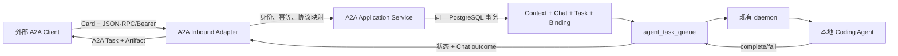

# Agent 级 Inbound A2A 实施计划

> 工作流：Plan
> 状态：托管 FC OpenCode 全 runtime 版本兼容实现与预发验收中（后续协议里程碑待执行）
> 创建日期：2026-08-09
> 计划 ID：20260809-agent-a2a-inbound
> 最后更新时间：2026-08-11 CST
> 当前分支：`codex/agent-a2a-inbound`
> 目标执行分支：`codex/agent-a2a-inbound`
> 基线 Commit：`4d4394f09fdfdc1fa4ba6ac45dfae70138ed9d63`
> Worktree：`/Users/yuanzhan/.codex/worktrees/9df9/dt-fde-multica`
> 当前里程碑：让托管 Aliyun FC OpenCode Agent 的 A2A admission 与 runtime 模板/manifest/capability 版本解耦，使现有 m2 等旧云沙箱和后续版本使用同一 Card/RPC；通过 daemon 能力协商在原生 tokenless 隔离与旧执行器预发兼容模式之间选择，并对目标预发 Agent 完成真实黑盒 E2E

## 一句话结论

在 Multica server 新增一个按 Agent 开启的 A2A v1.0 JSON-RPC inbound adapter，把外部 `SendMessage(returnImmediately=true)` 原子物化为现有 Chat session、`agent_task_queue` 和 user message，并用 `GetTask` 轮询结果；后续继续走现有 daemon 与本地 Coding Agent 执行链。首切只做单轮文本 Send/Get，daemon 显式识别 A2A task，禁止为其签发 owner-backed task token，并隔离本地控制能力。不实现 Multica 主动调用其他 Agent。

## 可行性结论

整体可实现，主链路复用度高，但不是“加一个 HTTP handler”这么简单。

- 容易复用的部分：Chat 上下文、任务排队、daemon claim、本地 Claude 执行、完成/失败回写和 workdir。
- 需要新增的部分：A2A wire adapter、Agent Card、外部调用方与凭证、幂等、A2A context/task 与本地数据的持久绑定、逻辑 Task 状态投影、调用方隔离、Agent 设置 UI。
- 风险最高的部分：auto-retry 后一个 A2A Task 对应多个本地 task、取消与 retry 的竞态、不能把 Agent owner 冒充为外部请求发起人、跨副本与重启后的状态一致性。
- 单人完整交付预估：8–12 个工作日；若只做无 UI、单凭证、无 TCK 的内部 spike，可压缩到 3–5 个工作日，但不建议作为正式能力上线。

## 背景与现状证据

### 1. upstream PR 的定位

参考 [upstream PR #2613](https://github.com/multica-ai/multica/pull/2613) 和 [Issue #2605](https://github.com/multica-ai/multica/issues/2605)。该 PR 是 daemon 作为 A2A client 调用远端 Agent 的 outbound runtime spike：从 YAML/registry 发现远端 Agent Card，再把远端 Agent 注册成 Multica runtime。它没有实现 Multica Agent 被外部 A2A client 调用的 server endpoint。

| PR #2613 内容 | 本计划处理 |
|---|---|
| A2A adapter 单独成模块 | 复用模块边界思想 |
| Send/stream/cancel 生命周期测试 | 复用测试维度 |
| 显式状态映射 | 复用设计方法，重写映射 |
| daemon runtime discovery、YAML、port scan | 不复用，方向属于 outbound |
| 手写 Agent Card、Message、Task 类型 | 不复用，改用官方 SDK |
| 手写 SSE parser | 不复用，第一期也不声明 streaming |
| 本地 task ID 直接作为远端 task ID | 不复用，A2A ID 与本地 ID 必须分离 |

PR 还缺少 A2A v1.0 所需的 `A2A-Version`、完整 `supportedInterfaces`、必填 `messageId`、Artifact 与正确的远端 task ID 持久映射。因此本次不 cherry-pick 其代码，只把它当协议探索和测试组织参考。

### 2. 当前仓库可复用链路

- `server/internal/service/task.go::SendDirectChatMessage` 已能在一个事务中创建本地 task、设置 input owner、写 user Chat message，并在提交后通知 daemon。
- `server/pkg/db/queries/chat.sql` 提供 Chat session/message 与 task input ownership 的持久模型。
- `server/internal/daemon/**` 已负责本地 Coding Agent 探测、claim、workdir、Codex Home、执行、取消和结果上报。
- `TaskService.CompleteTask` / `FailTaskWithResultMessage` 已把 Chat task 的 terminal outcome 与 task 状态原子落库。
- `server/internal/handler/agent_dispatch_acceptance.go` 可参考其“claim + fingerprint + replay/recovery”的幂等模式。
- `server/internal/handler/agent_dispatch_observability.go` 可参考 task summary、message 与访问隔离，但其 DingTalk Router endpoint/secret 不能被外部 A2A 复用。
- `server/migrations/198_unified_dingtalk_router_registration.up.sql` 已证明“稳定 endpoint 属于 Agent”这一抽象可行，但 `agent_dispatch_endpoint` 的 actor、密钥和生命周期均属于 DingTalk Router。

### 3. 协议基线

- 规范基线：[A2A v1.0 Specification](https://github.com/a2aproject/A2A/blob/main/docs/specification.md)。
- Go 实现基线：[官方 a2a-go SDK](https://github.com/a2aproject/a2a-go)，固定 `github.com/a2aproject/a2a-go/v2@v2.4.0`；其 Go >= 1.25 要求与本仓 Go 1.26.1 兼容。
- 一致性验证：[官方 A2A TCK](https://github.com/a2aproject/a2a-tck)。
- 只支持 `A2A-Version: 1.0`；缺失 Header 按规范会被视为旧版 client，并返回 VersionNotSupported，不静默按 v1.0 解析。
- wire types、JSON-RPC method/error、Card 与安全方案全部由官方 SDK 生成或解析，不在业务代码中复制一套协议结构。

### 4. 外部开源产品披露调研与导出合同

2026-08-09 以官方文档和官方仓库为主完成 hosted-agent disclosure 调研。成熟产品尚未形成一个统一的“含 endpoint + secret 的 A2A 配置包”；稳定共识是公开 discovery 与秘密凭证分离：

| 产品 | 披露方式 | 对本实现的取舍 |
|---|---|---|
| Google ADK | 单 Agent 使用 root well-known；多 Agent 使用 `/a2a/{app}/.well-known/agent-card.json` 与 per-Agent RPC 前缀 | 采用 per-Agent opaque path 和独立 Card，不依赖 `tenant` 双重路由 |
| Langflow A2A | owner-scoped catalog 返回每个 Agent 的 Card URL；Card 匿名读取；按 flow ID 的 A2A endpoint | 采用 owner-only 管理面、公开 Card、不可枚举 public ID；不提供跨 owner 公共目录 |
| Agent Stack | 以 Agent Card URL 导入/发现 managed 或 unmanaged Agent，CLI `list/info/run` 围绕 Card 工作 | Card URL 是首要连接信息，平台私有配置只是辅助，不替代标准 Card |
| Dify / Coze Studio | endpoint 与 app/bot key 分开；Coze key 只在创建时显示一次 | client principal 与 credential 分层，secret 一次显示、之后只保留 prefix/status |
| Flowise API Code | 可复制 snippet 会插入用户选择的真实 API key | 明确作为反例：Multica snippet/download 永不嵌入 raw secret |

因此 UI 导出合同固定为四层：

1. `Agent Card URL`：默认复制项，供标准 client discovery。
2. `agent-card.json`：下载服务端当前 Card builder 生成的原样标准 JSON；不含任何 credential。
3. `multica-a2a.json`：明确标为 Multica 私有 connection preset，而非 A2A 标准文件；只含 `agentCardUrl`、`protocolVersion=1.0`、`preferredBinding=JSONRPC` 与 `tokenEnv=MULTICA_A2A_TOKEN`。
4. `multica-a2a.local.json`：只在一次性 credential 创建结果 dialog 内生成，包含本次 raw token、Card/RPC URL、headers 和 Send/Get 示例，专供本地调试；关闭 dialog 后前端不再保留 secret，下载文件需由用户按敏感凭证管理。

常规调用示例只引用 `$MULTICA_A2A_TOKEN`。raw token 仅在创建 credential 的一次性 dialog、该 dialog 内的可复制 cURL 和显式下载的本地调试包中出现，不进入 query cache、常规导出或日志。Card 中声明 Bearer security scheme 只代表协议声明；验收还必须证明无凭证请求实际收到 401/403。

## 已确认需求

- 只做 inbound：外部系统调用 Multica Agent。
- A2A 以 Agent 为单位启用、停用和管理调用凭证。
- 第一阶段的调用目标是现有 Multica Agent，不增加一种新 daemon runtime。
- 验证必须通过本地 Coding Agent 真正执行任务，在本地 workdir 中搭建并测试一个项目。
- upstream PR #2613 仅作为参考，不以其 outbound 结构为实现基线。
- 界面必须支持导出当前 Agent 的 A2A 配置；导出合同参考外部开源 Agent 平台的 hosted-agent disclosure 模式后定稿。

## 目标

1. Agent owner 能在 Agent 设置中启用 A2A、编辑公开 Card 信息、创建/吊销命名 client 与凭证。
2. Agent owner 能从界面导出该 Agent 的标准 Agent Card 和不含 secret 的 A2A client bootstrap 配置，并复制使用环境变量占位符的调用示例。
3. 外部 A2A client 能读取 Card，并通过 Bearer 凭证调用 `SendMessage(returnImmediately=true)` 和 `GetTask`；未实现方法明确返回 UnsupportedOperation。
4. 每次 A2A `SendMessage` 对应一个稳定的 A2A logical Task 和一个由服务端生成的新 context；首切不接受 context/task continuation。
5. 所有业务状态以 PostgreSQL 为真相源，server 重启或请求落到另一副本后仍可查询、去重和取消。
6. A2A 请求不能获得 Agent owner 的个人 Composio/MCP 连接，也不能伪造为某个 human user 发起。
7. 本地 Claude Code Coding Agent 能在任务 workdir 中创建项目、运行测试，最终通过 A2A Task Artifact 返回可验证结果；该测试只证明可信固定输入的功能链路。
8. `local + claude` 与受管 `cloud + opencode + aliyun_fc` 是当前已验证的 runtime family；在 family 内，provider CLI 版本、模板版本、manifest 版本及 `a2a_inbound_opencode_v1` 均不参与 Card/Send admission。旧云沙箱执行器不能获得 owner-backed task token，但兼容执行仍只允许预发可信调用，不宣称具备原生隔离强度。

## 非目标

- Multica 主动调用其他 A2A Agent、远端 runtime discovery、registry、port scan 或 health probe。
- A2A v0.3 兼容。
- `SendStreamingMessage`、SSE、task resubscribe、push notification。
- gRPC、HTTP+JSON/REST binding；第一期只做 JSON-RPC。
- FilePart、DataPart、URL/raw/data 附件、外部 Artifact 文件下载。
- blocking Send、`ListTasks`、`CancelTask`、context/task continuation、client rate/concurrency limit 和 TCK；这些保留在后续里程碑，不在首切 UI/API 中伪装成可用能力。
- `INPUT_REQUIRED`、`AUTH_REQUIRED` 的持久暂停与继续；Coding Agent 要求补充信息时，第一期仍按普通文本结果完成。
- OAuth/OIDC 流程、mTLS、Agent Card 签名和 authenticated extended Card。
- 在常规导出文件、复制示例或下载文件中包含 Bearer secret；secret 仍只允许在 credential 创建时显示一次。
- root domain 的 `/.well-known/agent-card.json` 为每个 Agent 自动分流；这需要 per-Agent hostname、registry 或另一层 discovery。
- 为 A2A 新建执行引擎、绕开 Chat/Task 或把 SDK 默认内存 TaskStore 当生产状态源。

## 执行假设

- 第一阶段输入和输出只接受 `text/plain`；请求只能包含 `ROLE_USER` TextPart。
- Agent Card 使用不可枚举的 `public_agent_id` 作为 direct-discovery URL；Card 可匿名读取，调用接口必须 Bearer 鉴权。
- Card 只展示 owner 显式确认的公开名称、描述和 skills，不从 Agent instructions、tools、MCP 或私有 source 自动推导。
- 首切拒绝 caller 提供的 `contextId` 或 `taskId`；每次 Send 由服务端生成独立 context。
- A2A endpoint 的启用即 owner 对该 Agent 的精确调用授权；A2A client 不是 Multica member/user。
- endpoint 启用前要求 Agent 有 owner、未 archived、已配置 runtime，且 `MULTICA_PUBLIC_URL` 可生成合法 Card URL；runtime 暂时 offline 不阻止后续 admission。
- 本地 Coding Agent 验证使用 daemon 已有的空 task workdir 直接创建项目，不为第一期增加 `projectId` 私有协议扩展。

## 关键设计决定

### 1. 系统边界



A2A 是协议与身份接入层。Multica 继续拥有 Agent、Chat、Task、执行、回执和审计的权威状态；daemon 通过 durable origin marker 感知 A2A，用于 token、环境变量、MCP 和本地控制面隔离，但不另建执行引擎。

### 2. Agent Card 与路由

公开路由：

| 路由 | 行为 |
|---|---|
| `GET /api/a2a/agents/{publicAgentId}/.well-known/agent-card.json` | per-Agent discovery Card；enabled 时匿名可读 |
| `POST /api/a2a/agents/{publicAgentId}/v1` | A2A v1.0 JSON-RPC endpoint；Bearer 必需 |

Card 的首选 `supportedInterfaces` 指向同一个 Agent 的 `/v1` URL，`protocolBinding=JSONRPC`、`protocolVersion=1.0`。因为 URL 已按 Agent 分流，第一期不设置 `tenant`；client 因而也必须省略 request tenant。未来若改成共享 endpoint，再由 Card 声明 opaque tenant 并严格校验。

后续 TCK 里程碑需要 loopback shim：官方 TCK 固定从 `{sut-host}/.well-known/agent-card.json` 取 Card，且 runner 没有 Bearer header 参数；生产不增加一个无法表达“哪个 Agent”的 root alias。首切只验证 per-Agent direct Card、Bearer、Send/Get 的真实链路，不声称已通过 TCK。

Card 固定声明：

- `streaming=false`
- `pushNotifications=false`
- `extendedAgentCard=false`
- `defaultInputModes=["text/plain"]`
- `defaultOutputModes=["text/plain"]`
- HTTP Bearer security scheme 与 security requirement

`MULTICA_PUBLIC_URL` 是 Card 绝对 URL 的唯一来源，不信任 `Host`/`X-Forwarded-Host`。生产只允许 HTTPS；本地 E2E 仅允许 loopback HTTP。Card 使用 ETag 和短时 Cache-Control，disabled/archived/global-off 时不再对新 discovery 暴露。

### 3. 管理 API 与权限

受保护的 Workspace 路由：

| 路由 | 用途 |
|---|---|
| `GET /api/agents/{id}/a2a` | 查询 endpoint、Card、clients 与状态，不返回 secret |
| `PUT /api/agents/{id}/a2a` | 启用/停用并更新公开 Card 配置 |
| `POST /api/agents/{id}/a2a/clients` | 创建命名 A2A client |
| `PATCH /api/agents/{id}/a2a/clients/{clientId}` | 重命名、启停或调整 scope/限额 |
| `POST /api/agents/{id}/a2a/clients/{clientId}/credentials` | 创建/轮换凭证，明文只返回一次 |
| `DELETE /api/agents/{id}/a2a/clients/{clientId}/credentials/{credentialId}` | 立即吊销凭证 |

- 仅 Agent owner 能启用、编辑 Card 和管理 clients/credentials；不引入 private Agent 的 admin bypass。
- server 全局 feature flag 是运维 emergency kill switch。
- Agent owner 变化时，endpoint 因 `delegated_by_user_id != current owner` 自动 fail closed，需新 owner 显式重新启用。
- Agent archived/endpoint disabled 后拒绝新的 `SendMessage`，但未吊销的 client 仍可读取/取消自己已有的 Task，避免任务失联；吊销 credential 才会切断全部访问。
- Agent 删除或 Workspace 删除按 FK cascade 清理；普通 disable 不删除历史 context/task binding。

### 4. 外部调用方身份与凭证

endpoint、client 和 credential 必须分层：

- endpoint 表示“这个 Multica Agent 可被 A2A 调用”。
- client 表示稳定的外部调用方 principal；首切只接受 `send`、`read` scopes。
- credential 只是 client 的可轮换认证材料；轮换后旧 Task 的访问归属不改变。

Token 格式为 `mca2a_<random-secret>`。沿用仓库现有 token 边界：服务端以 `auth.HashToken` 保存和定位完整高熵 token 的 SHA-256 hash，同时保存可展示 prefix；数据库不保存明文，明文只在创建响应出现一次。日志、错误、activity 和本地 E2E 命令行都不能包含 raw token。

不复用以下凭证：

- `agent_dispatch_endpoint` 的 Router keyring/HMAC secret：权限和生命周期属于 DingTalk internal router。
- internal message router secret：可注入受信 external identity/context，不能暴露给第三方。
- human PAT：会错误继承用户身份与 Workspace 权限。

### 5. 数据模型

执行前从 rebase 后的 migration 列表分配下一个空闲 fork-owned 编号，不在 Plan 中锁死 `270`。

| 表 | 核心字段与约束 | 责任 |
|---|---|---|
| `agent_a2a_endpoint` | `workspace_id`、`agent_id UNIQUE`、`public_agent_id UNIQUE`、`enabled`、公开 Card 字段、`delegated_by_user_id`、timestamps | Agent 级 A2A 配置与 discovery locator |
| `a2a_client` | `endpoint_id`、`name`、`status`、`scopes`、预留 rate/concurrency 字段、timestamps | 稳定外部 principal；首切拒绝非空 rate/concurrency 配置 |
| `a2a_client_credential` | `client_id`、`key_id UNIQUE`、`secret_hash`、`status`、`expires_at`、`last_used_at` | 可轮换 Bearer 凭证 |
| `a2a_context` | `endpoint_id`、`client_id`、`public_context_id`、`chat_session_id UNIQUE`、activity/expiry | A2A context 到 Chat session 的持久映射 |
| `a2a_task_binding` | `public_task_id UNIQUE`、context/client/endpoint、`root_local_task_id UNIQUE`、`message_id`、fingerprint、stable artifact ID、预留 cancel/finalization 字段、timestamps | A2A logical Task、幂等与后续 lineage/cancel 扩展入口 |

关键唯一约束：

- 一个 Agent 最多一个 endpoint。
- `(endpoint_id, client_id, public_context_id)` 唯一。
- `(client_id, message_id)` 唯一；client 已天然属于一个 endpoint。
- 一个 root local task 只能绑定一个 A2A logical Task。
- 所有公开 ID 为 server 生成或验证长度/字符集的 opaque ID，不暴露 Workspace、Agent、Chat 或本地 task UUID。

`chat_session.creator_id` 目前要求 human user。A2A context 创建时以 `delegated_by_user_id` 作为内部 ownership plumbing，但 `agent_task_queue.initiator_user_id` 和 `originator_user_id` 必须为 NULL。人类 Chat list/unread 查询通过 `NOT EXISTS a2a_context` 排除 A2A session，避免把外部消息渲染成 owner 自己发送的消息。

### 6. SendMessage 接入事务

```text
鉴权并解析 endpoint/client
  → 校验版本、method、Agent 未 archived 且仍有 runtime、role、TextPart、大小和 messageId
  → 计算 canonical request fingerprint
  → PostgreSQL transaction
      1. claim (client_id, message_id) 幂等键
      2. 创建服务端生成的 a2a_context + chat_session
      4. 创建 agent_task_queue，initiator/originator=NULL，MCP overlay 为空
      5. 设置 chat_input_task_id=self，创建 user chat_message
      6. 创建 a2a_task_binding
    commit
  → 广播 task queued + 通知 daemon
  → returnImmediately=true 立即返回；否则等待 terminal/interrupted
```

幂等规则：

- 相同 client + `messageId` + 相同 fingerprint：返回原 A2A Task，不创建第二份 context/message/local task。
- 相同 client + `messageId` + 不同 fingerprint：返回明确 conflict/InvalidRequest，不覆盖旧请求。
- 并发重复请求依赖 PostgreSQL unique/row lock，不依赖进程 cache。
- context、Chat、task、message、binding 任一步失败时整个事务回滚；daemon 只在提交后收到通知。

首切 context 规则：

- request 不带 `contextId`/`taskId`，server 为每次新消息生成 context。
- caller 提供 `contextId` 或 `taskId` 时返回 UnsupportedOperation；不静默创建、复用或串接会话。
- context continuation、同一 Chat/workdir/session 的后续消息属于里程碑 3。

### 7. A2A logical Task 与本地 retry lineage（后续里程碑）

不能把 A2A Task 永久等同于单个 `agent_task_queue.id`。现有 auto-retry 会创建带 `parent_task_id` 的 child；A2A Task ID 必须稳定，而实际执行 task 可能变化。

- binding 永远保存 root local task ID。
- 当前 `GetTask` 从 caller-scoped binding 投影已接受任务；`ListTasks`、`CancelTask` 和完整 retry lineage 解析留待后续。
- root failed 但 retry child 已 queued/running 时，A2A logical Task 仍为 submitted/working，不能提前暴露 failed。
- 最终状态、timestamps、status message 和 Artifact 从最终 leaf 投影，A2A task/context/artifact ID 保持不变。
- 第一阶段不把 Agent 间 delegation child 并入 A2A task lineage；源 Agent 自己的 Task 负责等待/汇总协作结果。递归查询以同 Agent、同 Chat input ownership 的 retry chain 为边界。

现有失败路径有两种，Plan 必须同时覆盖：

1. `FailTaskWithResultMessage` 会在同一事务中 fail parent 并决定是否创建 retry child。
2. raw-SQL/sweeper 可能先提交 `failed`，再由 `task_completion.go::finalizeFailedTask` 在另一事务中决定 retry 或最终失败。

因此本地裸 `failed` 只是 provisional state，不能直接投影为 A2A terminal。`a2a_task_binding.failure_finalized_local_task_id` 是 durable 判据：

- 两条 failure finalization 路径都必须锁定 local task 与 binding，并在同一事务中二选一：创建 retry child，或把 `failure_finalized_local_task_id` 写为当前 failed leaf。
- `GetTask/ListTasks` 看到 failed leaf 且已有 child 时继续解析 child；看到 marker 等于 leaf 时才返回 failed；两者都没有时返回 working/finalizing，而不是 terminal failed。
- 所有涉及 A2A binding + local task 的路径统一按“先 binding、后 task”的顺序取 row lock，避免 cancel、immediate fail 和 background finalizer 互相死锁。
- 新增 A2A failure finalizer worker，周期扫描“current leaf failed、无 child、marker 为空”的 binding，以 `FOR UPDATE SKIP LOCKED` 多副本安全收敛；现有 Router completion reconciler 和该 worker 复用同一个 failure-finalization helper，但查询范围互不冒充。
- 进程在 raw failure 与 finalization 之间崩溃时，A2A worker 继续完成决策；A2A 读路径只发出低成本 wakeup，不能自行猜测 terminal 或依赖 client 持续轮询来触发 retry。
- 该 marker 只在“确认不会再 retry”的 leaf 上写入；若创建了 child，后续由 child 的状态和最终 marker 决定 logical terminal。

### 8. 状态映射

wire enum 由官方 SDK 序列化，业务层只维护下列语义映射：

| 本地状态 | A2A 状态 |
|---|---|
| binding 已持久接受 `cancel_requested_at` | cancelled |
| `deferred`、`queued` | submitted |
| `dispatched`、`waiting_local_directory`、`running` | working |
| `completed` | completed |
| `failed`、没有 retry child，且 `failure_finalized_local_task_id` 等于该 leaf | failed |
| `cancelled` | cancelled |

failed leaf 尚未完成 retry finalization 时仍投影为 working/finalizing。状态必须单调，terminal 后不能回到 working；durable marker 用于消除 raw-SQL/sweeper 路径中可能出现的 `failed → retry child` 窗口。

### 9. Message 与 Artifact 投影

- A2A input TextPart → task-owned user `chat_message.content`。
- A2A `contextId` → `a2a_context.public_context_id` → `chat_session_id`。
- A2A Task ID → `a2a_task_binding` → root/current/final local task。
- completed Chat task 的 durable assistant outcome 是文本结果权威来源。
- binding 在创建时生成稳定 `artifact_id`；completed 时返回一个名为 `result` 的 text Artifact。
- failed/cancelled 的 status message 只返回脱敏、长度受限的错误或取消说明；只有确有 durable output 时才附 Artifact。
- 第一阶段省略 task history 和文件 Artifact，不把 internal task messages、tool calls、workdir、本地 ID 或 token usage 暴露给 A2A client。

### 10. CancelTask（后续里程碑，首切返回 UnsupportedOperation）

A2A cancel 不能直接调用当前浏览器语义的 `CancelTaskWithResult(root)`：

- root 可能已经 failed，实际 active 的是 retry leaf。
- 现有 `finalizeCancelledChatMessage` 会在尚无执行消息时删除 user message，用于恢复网页 draft；外部 A2A 的原始请求必须保留用于幂等与审计。

实现要求：

1. 在同一事务中锁定 binding 与 current leaf，确认 logical Task 尚未 terminal，再持久写入 `cancel_requested_at` 并取消 active leaf；cancel intent 成功落库即是 A2A logical cancelled 的 durable fence。
2. 解析并取消 current active leaf，而不是只取消 root；若当前 leaf 是尚未 finalization 的 provisional failed，cancel 可赢得竞态并直接封住后续 retry。
3. 两条 retry admission 都必须检查同 lineage 的 A2A cancel intent：`task.go::FailTaskWithResultMessage` 和 `task_completion.go::finalizeFailedTask`。检查必须与 `CreateRetryTask`/failure-finalized marker 位于同一锁定事务；已请求取消时不得再创建 child。
4. 为 TaskService 增加 `CancelTaskOptions{PreserveChatInput:true}` 或等价专用方法；现有 Web 调用默认行为不变。
5. cancel 先取得 binding lock 时，后续 failure finalizer 看到 intent 并跳过 retry；failure-finalized marker 先提交时，CancelTask 返回 TaskNotCancelable。重复 CancelTask 返回同一个 cancelled Task，状态不能倒退。
6. HTTP client 断开只结束 blocking waiter，不隐式取消已接收 Task。

### 11. Blocking 与多副本（后续里程碑）

- 首切只接受 `returnImmediately=true`，立即返回 submitted/working Task；false/缺省返回 UnsupportedOperation。
- 本地 Coding Agent E2E 使用 `returnImmediately=true`，避免模型执行时长占用请求连接。
- blocking waiter 周期性从 PostgreSQL 读取 logical Task；现有 completion event 或 Redis/Tair 只能作为降低延迟的 wakeup，不是状态真相源。
- 任一 server 实例重启后，client 通过 `GetTask` 恢复查询；请求连接失败不影响 daemon 后台执行。
- SDK 默认 in-memory TaskStore、进程内 idempotency map 和本地文件均禁止作为生产真相源。

### 12. 安全边界

- endpoint client grant 只授权调用一个精确 Agent，不授予 Workspace API 权限。
- A2A task 的 human initiator/originator 为 NULL；task context 记录 A2A client/credential/request ID 用于审计。
- A2A 入站任务显式不调用 `buildRuntimeMCPOverlay`，因此不会挂载 Agent owner 的个人 Composio 连接。
- 限制 HTTP body、parts 数量、单 TextPart 长度、metadata 深度和分页大小；拒绝 URL/file/data/raw Part。
- 复用/抽象现有 Redis webhook limiter，使用独立 A2A key prefix，先做 absolute-IP、失败凭证 IP、成功 credential/client 三层限流；无 Redis 的本地模式只使用内存安全网。
- production Card/interface 必须是 HTTPS；只对 loopback local E2E 放行 HTTP。
- 日志不记录 Authorization、credential hash、完整请求正文、Agent instructions、owner 私有信息或 tool transcript。
- unknown/disabled Agent、跨 client task 与跨 Agent credential 均 fail closed，不通过错误差异泄露资源存在性。

当前首切的生产阻断条件：本地 Coding Agent 与 daemon 仍共享宿主 OS 身份。即使 A2A task 不获得 Multica task token、个人 MCP overlay，且 ambient/inherited 敏感环境变量已清理，Claude 工具 shell 仍可能通过共享 `HOME`、provider state directory 或绝对路径读取宿主登录材料；Claude 还会读取宿主 `settings.json`、hooks、plugins、skills 和 commands。provider CLI 自身需要的认证材料和它开放给工具 shell 的文件权限目前没有 broker/isolation 边界。可信固定任务的本地 E2E 只能证明功能链路，不能证明恶意 prompt 的安全性。

因此 `agent_a2a_inbound` 保持默认关闭；production 无条件拒绝。常规本地验证只有同时设置 `MULTICA_A2A_ALLOW_UNSAFE_LOCAL_RUNTIME=true`、PublicURL 为精确 loopback、HTTP socket peer 直连 loopback，且 Agent 使用 `local + claude` 并由声明 `a2a-invocation-v1` 的 daemon 执行，才能启用、Send、claim 和 StartTask。该豁免只用于可信固定 E2E，不得经代理转发或对不可信调用方开放。

为验证 Aone 托管入口的完整 inbound 路径，允许一次显式的非生产预发模式：同时设置 `MULTICA_A2A_ALLOW_UNSAFE_PRERELEASE_RUNTIME=true` 与 `MULTICA_A2A_UNSAFE_PRERELEASE_PUBLIC_URL=<expected>`，且规范化后的 `MULTICA_PUBLIC_URL` 必须与 expected 完全相同、使用 HTTPS、host 非 loopback。该模式允许负载均衡器远端 socket peer；对受管 `cloud + opencode + aliyun_fc` family，runtime 模板/manifest/capability 版本不再参与 Card、Send 或执行时 admission，运行时行仍需存在且与任务 Workspace 绑定。其他尚无原生 MCP/env 隔离 adapter 的 provider 保持 fail closed。生产继续无条件拒绝。该模式不降低 feature flag、Agent enabled、Bearer credential 或 claim/StartTask 二次门禁。验收后吊销临时测试 credential/client；目标 Agent 的 endpoint 与交付给用户的本地调试 credential 按需求保留。

daemon claim 采用显式的版本协商，而不是用版本号做 admission：新 daemon 通过 `a2a-invocation-v1` 声明理解 tokenless A2A wire contract；现有 m5 OpenCode 镜像早于该 header，因此其 `a2a_inbound_opencode_v1` 只保留为 claim-mode 向后兼容证明，不再影响 Card/Send。`local + claude` 和受管 `cloud + opencode + aliyun_fc` 的新执行器走原生模式，响应携带 `a2a_invocation=true`、不返回 token，并执行既有 HOME/XDG、MCP 与环境隔离。只有受管 Aliyun FC OpenCode 旧执行器可走 `unsafe_legacy`：服务端清空 workspace 数据、custom env/args、Agent MCP/runtime config、history/attachment/identity 等可选输入，使用 `FinalizeTaskClaimWithoutToken`，并返回一个不写入 `task_token` 表的随机 `mat_` 形状哨兵，使旧 daemon 通过启动校验。该哨兵自身无 API 权限；但旧 daemon 仍可能把进程级 daemon/provider credential 暴露给 Coding Agent，因此该模式只在固定预发 gate 下用于可信 credential holder 的功能兼容，不构成通用安全资格。旧本地 daemon 和其他 provider 直接 fail closed。

FC launcher 的 `runtime_start_attempt` 不能继续只把 `task_token` 当作 claim 完成证明。finalize SQL 增加显式 `allow_tokenless_a2a` 参数，但仍锁定 exact task/runtime/status，并从数据库中的 durable task context 独立校验 `multica_origin=a2a`；只有 handler 在完整 payload 构建完成后的事务中可传 `true`。launcher 轮询始终传 `false`，避免仅凭较早写入的 `dispatched` 状态抢先把尚未完成响应构建的 A2A claim 误判为成功。普通任务即使错误传入该参数，也会因缺少 durable A2A origin 而保持 fail closed。

生产启用至少要求以下任一方案及 adversarial 验证：

2026-08-10 真实预发启用验证发现，Aone 镜像以 build arg 注入且不通过应用 runtime-env trait 暴露 `AONE_ENV_TYPE=pre`，同时应用按正常公网运行方式配置 `APP_ENV=production`。后者表达应用运行模式（禁用测试验证码、启用生产构建），不是 Aone 发布层级；把四个变量无优先级合并会把真实预发误判成生产并返回 403。环境判定因此收窄为 Aone 特例：`AONE_ENV_TYPE` 存在时由该平台层级标记判定，故允许 `pre + APP_ENV=production`；Aone 标记缺失时遍历所有 `ENV_TYPE / GO_ENV / APP_ENV` 通用标记，任何 production 或未知值都 fail closed，不允许 staging 遮蔽 production。必须新增 `AONE_ENV_TYPE=pre + APP_ENV=production` 允许预发、`AONE_ENV_TYPE=production + APP_ENV=staging` 拒绝生产、通用 marker 冲突拒绝、未知 marker 拒绝和 fallback 行为测试，再重新部署后继续 E2E。

2026-08-10 UI 复核补齐两个管理面边界：A2A config 的 GET/PUT 仍通过统一 `parseWithFallback` 记录脱敏 schema warning，但校验失败不再降级为空配置并显示“保存成功”；owner 管理响应只要包含持久 Card/RPC URL 就保持可查看、复制，即使 runtime/gate 暂时使 endpoint 投影为 disabled。导出可调用连接、调用提示与 credential 创建仍严格要求 `endpoint.enabled=true` 且两个 URL 非空，避免把暂不可用地址描述为可调用端点。

1. A2A 专用隔离执行环境（容器/沙箱/独立 OS 用户），provider credential 只进入 supervisor 或 broker，不进入工具 shell；或
2. 运行时可证明的文件系统与进程权限策略，阻止读取宿主 `HOME`、provider auth、DWS/GitHub/cloud CLI 配置和 daemon/profile 配置；
3. adversarial canary 证明 `gh auth token`、默认 DWS profile、provider auth file 与已知绝对路径均不可读/不可外传。

本切片仍做纵深防御：A2A claim 不创建任何 owner-backed `task_token`；原生模式不返回 token，legacy 模式返回的未登记哨兵本身无权限。原生子进程清理从 daemon/宿主 ambient 继承的 Multica/DWS/GitHub/cloud/provider 敏感环境变量，不继承 daemon local port；Agent 显式配置的 `custom_env` 仍被视为该 Agent 的主动 grant 并传入，因此 UI 明确要求先移除不应对外的环境设置/密钥。原生 A2A 不合并 runtime/宿主 MCP，只接受 Agent 显式配置；daemon `/repo/checkout` 使用仅普通 active task 持有、按 task/workspace/workdir/repo 绑定的短期 capability，`/shutdown` 使用 daemon-only HMAC 控制 token。claim 与 StartTask 都会重新检查当前 runtime/unsafe gate，策略拒绝会原子终结匹配的 runtime start attempt 并保留 A2A binding/input。legacy 模式仍会继承旧执行器自身的 process/Home/provider 行为，甚至可能看到 run-once daemon token，因此只能作为预发功能兼容，不能替代上述 OS/provider credential 隔离。

## 协议方法合同

| Method | 第一阶段行为 |
|---|---|
| `SendMessage` | text-only；仅 `returnImmediately=true`，始终返回 Task |
| `GetTask` | 仅 client 自己的 task；从 PostgreSQL 投影 current/final lineage |
| `ListTasks` | UnsupportedOperation；client scope 也拒绝 `list` |
| `CancelTask` | UnsupportedOperation；client scope 也拒绝 `cancel` |
| `SendStreamingMessage` | UnsupportedOperation，Card 不声明 streaming |
| task subscribe/resubscribe | UnsupportedOperation |
| push notification config | UnsupportedOperation，Card 不声明 push |
| extended Agent Card | UnsupportedOperation，Card 不声明 extended card |

Transport 前置错误如无/错 Bearer和 body 超限使用 HTTP 401/403/413；完成鉴权并进入 JSON-RPC 后的协议错误交由官方 SDK 输出标准 A2A error。rate/concurrency limit 尚未实现，管理 API 对非空配置明确返回 400。

## 文件与职责

### Backend / 数据

- `server/go.mod`、`server/go.sum`：固定官方 `a2a-go` SDK 版本。
- `server/migrations/<next>_agent_a2a_inbound.{up,down}.sql`：新增 endpoint/client/credential/context/task binding，以及必要索引与 FK；up additive/idempotent，production rollback 不依赖 destructive down。
- `server/pkg/db/queries/agent_a2a.sql`：当前包含配置管理、凭证解析、Send admission、幂等 claim、context/binding 和 caller-scoped Get 投影；list/retry/cancel 查询属于后续里程碑。
- `server/pkg/db/queries/chat.sql`：增加 A2A session 创建所需查询，并在人类 Chat list/unread 路径排除 `a2a_context`。
- `server/internal/integrations/a2a/`：实现官方 SDK `a2asrv.RequestHandler`、Card builder、wire/application mapping、error/status/Artifact projection；使用 `a2asrv.NewJSONRPCHandler`，不启用 SDK 默认内存 TaskStore/EventQueue。
- `server/internal/service/a2a.go`：当前实现 Send、独立 context、idempotency 和 caller-scoped Get projection；list/cancel orchestration 后续实现。
- `server/internal/service/a2a_failure_finalizer.go`（后续）：扫描 provisional failed binding，复用统一 failure-finalization helper，使用 PostgreSQL row lock/skip-locked 保证多副本收敛。
- `server/internal/service/task.go`：当前增加 A2A execution-safety fail path；preserve-input cancel 与 retry intent 后续实现。
- `server/internal/service/task_completion.go`（后续）：抽取/复用统一 failure-finalization helper，并在锁定事务中处理 retry/cancel intent。
- `server/internal/handler/agent_a2a_public.go`：公开 Card/JSON-RPC transport、版本、body limit 与 Bearer 接线；rate limit 后续实现。
- `server/internal/handler/agent_a2a_config.go`：owner-only 配置、clients、credential 生命周期与审计。
- `server/internal/handler/handler.go`、`server/cmd/server/router.go`：service/SDK/limiter wiring 与公开/受保护路由。
- `server/cmd/server/main.go`（后续）：启动、唤醒并优雅停止 A2A provisional-failure finalizer；worker 不持有进程内业务状态。
- `server/internal/featureflags/keys.go`：新增 `agent_a2a_inbound`，默认 false，并按需暴露前端 public decision。
- `server/internal/metrics/**`（后续）：低基数 A2A request/task/idempotency/cancel 指标。

`server/internal/daemon/**` 与 `server/cmd/multica/**`：A2A task 使用显式 origin marker，claim 后不签发/传递 `mat_` token；子进程清理 inherited credential env 和 daemon port。普通 task 继续使用 task-scoped token。daemon loopback `/repo/checkout` 只接受 active 普通 task 的短期 capability，`/shutdown` 只接受 profile credential、daemon ID 与每进程 nonce 派生的控制 token。该变更是首切 security gate，不改变普通任务的业务协议。

### Core / Views

- `packages/core/types/agent-a2a.ts`：配置、client、credential-once response schemas/types。
- `packages/core/agent-a2a/**`：query keys/options/mutations。
- `packages/core/api/client.ts`、`packages/core/api/schemas.ts` 与 exports：管理 API client 与边界解析。
- `packages/views/agents/components/tabs/a2a-tab.tsx`：启停、Card 预览/复制、clients、凭证创建/吊销、一次性 secret 提示。
- `packages/views/agents/components/agent-overview-pane.tsx`：在 Settings 中加入 A2A tab，feature flag 关闭时隐藏。
- `packages/views/locales/*/agents.json`：所有现有 locale 的文案；明确 Card 是公开信息、secret 只显示一次、A2A 不继承个人连接。
- 对应 Core/Views tests：权限、secret 一次显示、缓存刷新、disabled/owner-only 状态。

### 独立验证资产

- `server/cmd/a2a-smoke-client/main.go`（后续）：只依赖官方 SDK + stdlib 的外部 client，逐步覆盖 card/send/get/list/wait/cancel。
- `server/cmd/a2a-tck-shim/main.go`（后续）：仅测试使用的 loopback reverse proxy；提供 root well-known Card、重写 interface URL、从 `0600` secret file 注入 Bearer，且不记录 secret/body。
- `examples/a2a-inbound-coding-agent/task.md`：固定 Coding Agent 任务文本。
- `examples/a2a-inbound-coding-agent/verify.mjs`：独立行为 oracle，不信任 Agent 自己写的测试。
- `scripts/a2a-inbound-local-e2e.sh`：preflight、进程生命周期、backend 重启、daemon profile、trap 与安全清理。
- `scripts/a2a-inbound-local-e2e.mjs`：API bootstrap、并发幂等、DB readback、workdir 定位与结果断言。
- `server/internal/integrations/a2a/testdata/`（后续）：由官方格式固化的 Card/Send/Get/List/Cancel golden fixtures。
- `Makefile`（后续）：`test-a2a-inbound`、`test-a2a-tck-local` 与 opt-in 的 `e2e-a2a-inbound-local`。

## 实施步骤

- [x] 里程碑 0：从最新目标基线创建 `codex/agent-a2a-inbound`，确认 migration 编号，完成官方 SDK server/client API spike，固定 `a2a-go/v2@v2.4.0` 和 wire contract；TCK shim 留待协议验证里程碑实现。
- [x] 里程碑 1：实现 additive schema、sqlc、endpoint/client/credential 管理 service/API 与 owner-only 权限；全局 flag 默认关闭。
- [x] 里程碑 2：实现 Card 与 JSON-RPC transport，打通 text-only `SendMessage(returnImmediately=true)` 到 Chat/task/daemon 的纵向 happy path。
- [ ] 里程碑 3：在当前 caller-scoped Get 与 stable Artifact 基础上，补齐 blocking Send、List projection、context follow-up 和多副本/重启验证。
- [ ] 里程碑 4：实现两条 failure finalization 的 durable marker、retry lineage、cancel intent、preserve-input cancellation、terminal race 与多副本/重启一致性。
- [x] 里程碑 5：实现 Agent Settings A2A tab、一次性凭证 UX、Card 安全说明、feature flag 与 locales。
- [ ] 里程碑 6：增加协议 golden、官方 SDK client、PostgreSQL integration、TCK 与安全/限流/回归验证。
- [x] 里程碑 7：运行本地 Claude Code Coding Agent 的可信固定任务黑盒 E2E，记录 workdir、响应和测试证据；不把该结果表述为不可信 prompt 的隔离验收。
- [ ] 里程碑 8：按 schema-first、flag-off、全副本升级、内部 Agent canary、逐 Agent 开启的顺序发布；当前只执行短期 unsafe prerelease E2E，并在同一轮内验证关闭与凭证吊销回滚路径。
- [ ] 里程碑 9：将 Aliyun FC OpenCode A2A admission 与模板/manifest/capability 版本解耦，部署 server/UI 到预发，直接使用授权目标 Agent 当前的 m2 云沙箱启用 endpoint，并以本地外部 Agent 完成 Card/401/Send/Get/Artifact 黑盒验收；最终吊销一次性测试 credential，但按用户要求保留 endpoint 与单独的本地调试 credential。

## 验证策略

| 验收项 | 主要风险 | 验证方式 |
|---|---|---|
| Card / JSON-RPC v1.0 | wire 合同错误 | 首切使用官方 SDK server types + direct curl/JSON-RPC E2E 并校验 `A2A-Version`；golden/TCK 后续 |
| 凭证与隔离 | 跨 Agent/client 读写 task | Handler/API integration tests；Agent B token 调 Agent A 必须失败且不建 task |
| 幂等事务 | 重复 task/message、半落库 | 真实 PostgreSQL 下 8 个并发相同 `messageId`，唯一 binding/task/message；冲突 payload 拒绝 |
| context（后续） | 会话串线或并发合并 | 同 client follow-up 复用 Chat；跨 client context fail closed；active context 第二条拒绝 |
| retry lineage | provisional parent failed 被错误暴露 terminal | immediate fail 与 raw-SQL/sweeper 两条路径；无 marker 时 working、child 后继续、marker 后 failed |
| cancel（后续） | 只取消 root、两条 retry 路径复活、输入被删 | queued/provisional-failed cancel、两个 retry admission race、重复 cancel、completed cancel、preserve user message |
| blocking（后续） | 早退违反协议或 client 断开误取消 | terminal wait、request context cancel、Task 后台继续、随后 Get 成功 |
| 多副本/重启（后续） | 状态丢失 | 两个 Handler/server 实例共享 PostgreSQL；A accept、B get/cancel；backend restart 后继续 |
| 安全 | owner 身份/个人连接泄露 | initiator/originator NULL、A2A MCP strict replace、token/env/local-control isolation、claim/StartTask 双门禁；production 始终拒绝 |
| UI | secret 泄露或 owner-only 失效 | Core schema + Views tests；secret 只在创建结果存在且缓存不保存明文 |
| 既有 Chat/daemon | A2A 改动破坏普通 Chat | direct Chat/daemon 定向与包级回归；普通任务分支保持原 token/MCP 行为 |

确定性的 Go/DB/Core/Views 测试可以进入常规 CI。真实 Coding Agent 用例依赖本机登录、耗时和模型费用，只作为显式 opt-in 的本地/夜间验收，不放进 Playwright 或默认 `make check`。

TCK 留在后续里程碑：届时通过 loopback shim 运行，shim 的 well-known Card 与 auth 注入只解决 TCK runner 的固定入口限制，不算生产 discovery/auth 验收。首切验证 direct Card URL、Card security declaration、Bearer、credential rotation 与 Send/Get。

## 本地 Coding Agent 黑盒验收

### 1. 首切手工入口（后续再固化单命令）

本次使用隔离的 `.env.worktree`、短期 profile 与 curl/JSON-RPC 手工执行；后续再固化为 `make e2e-a2a-inbound-local`。

preflight：

- Docker、Go、Node 22、pnpm 可用。
- `claude auth status` 成功，且 daemon 能发现已登录的本地 Claude Code runtime。
- `.env.worktree` 存在并使用本 worktree 独立数据库/端口。
- `MULTICA_PUBLIC_URL=http://127.0.0.1:<backend-port>`；仅 local loopback 测试允许 HTTP。
- 使用 `mktemp -d` 创建本轮 `RUN_DIR`，daemon 使用唯一 profile；绝不清理整个 `~/.multica`。

建议运行配置：daemon poll 500ms、最大并发 1、Agent timeout 10m、关闭自动更新和 GC。只启动 backend 与 daemon，不依赖 frontend。

### 2. Bootstrap

脚本通过真实 API：

1. 使用 dev verification code 登录并创建唯一 Workspace。
2. 创建短期 PAT，仅供本轮 daemon profile 注册。
3. 启动 daemon，等待 Claude runtime online。
4. 创建绑定该 runtime 的私有 Agent。
5. 开启该 Agent 的 A2A，创建 client 与一次性 Bearer credential。
6. 跨 Agent token 与并发场景留在后续集成验收，不作为本次真实模型调用的前置条件。

credential 写入权限 `0600` 文件或 stdin/env，不出现在命令参数、日志或测试报告。

### 3. Coding Agent 固定任务

外部官方 SDK client 以 `returnImmediately=true` 发送固定文本，要求 Coding Agent 在空 workdir 中创建 dependency-free Node.js 22 ESM 项目：

- `package.json`
- `src/normalize-sku.mjs`
- `test/normalize-sku.test.mjs`
- `a2a-proof.json`

`normalizeSku(value)` 的确定规则：非字符串抛 `TypeError`、NFKC、trim、uppercase、连续非 A-Z/0-9 转单个 `-`、去首尾 `-`。Agent 必须运行 `npm test`，proof JSON 必须是 `{"protocol":"A2A","runtime":"claude","result":"ok"}`，最终回复包含 `A2A_E2E_COMPLETED`。

独立 oracle 从 `a2a_task_binding → agent_task_queue.work_dir` 定位目录，并自行验证：

- `npm test` 成功。
- `" ab cd " → "AB-CD"`。
- `"Ｆｏｏ／bar" → "FOO-BAR"`。
- `"--x__y--" → "X-Y"`。
- 空字符串保持空，非 string 抛 `TypeError`。
- proof JSON 精确匹配。
- 过滤 Multica sidecar 后只出现允许的项目文件。
- A2A Task completed，stable Artifact 的 TextPart 包含 `A2A_E2E_COMPLETED`。
- local task 的 `started_at`、`completed_at`、`work_dir` 非空。

首切只执行这一条独立 context 的固定任务。context continuation 在里程碑 3 实现后再增加第二轮断言。

### 4. 后续必须追加的黑盒场景（不属于本次首切完成条件）

- daemon 停止时 Send：快速返回 submitted；启动 daemon 后最终 completed。
- 同一 `messageId` 并发发送 8 次：全部返回同一个 A2A Task；DB 只有一个 binding/local task/user message。
- 同 `messageId` 不同正文：明确冲突；backend 重启后重放仍返回原 Task。
- backend 在 submitted 时 TERM/重启：GetTask 仍返回同一 Task；daemon 完成后再次重启，Artifact 仍稳定。
- 启动 loopback `a2a-tck-shim`，从 `0600` 文件读取本轮 token，运行 `./run_tck.py --sut-host <shim> --transport jsonrpc`；Card interface 必须被重写到 shim，报告归档到 `RUN_DIR`。
- Agent B credential 调 Agent A：401/403/not found，且数据库无新 task。
- queued cancel：daemon 停止、创建 Task、连续取消两次、重启 backend/daemon；Task 保持 cancelled、`started_at IS NULL`、原 user message 保留、无项目文件。
- completed Task 再 cancel：TaskNotCancelable，状态不倒退。
- 扫描 server/daemon/client logs：raw token 和完整任务正文均不存在。
- 可选 `A2A_E2E_ACTIVE_CANCEL=1` 做运行中取消；默认验收不依赖模型稳定停留在长工具调用。

### 5. 清理

清理只按本轮精确 ID：吊销 A2A credential、停止唯一 daemon profile、吊销短期 PAT，并停止本轮 backend/daemon；不清理整个 `~/.multica`。为便于复核，首切可保留隔离 Workspace 与项目产物。

## 可观测性与审计（后续完善）

计划补齐的结构化事件：

- `A2A_INBOUND_REQUEST`
- `A2A_TASK_CREATED`
- `A2A_TASK_DEDUP_HIT`
- `A2A_TASK_STATE_CHANGED`
- `A2A_TASK_CANCELLED`
- `A2A_CREDENTIAL_CREATED/REVOKED`

允许字段：request ID、client/credential key ID、Agent endpoint ID、A2A task ID、local task ID、method、状态、latency、outcome；敏感正文与 raw secret 禁止记录。

指标保持低基数：method/outcome/version 的请求量与延迟、auth/rate-limit reject、dedup hit、task terminal outcome、blocking waiter 数量。Agent/client/task ID 只进日志，不进 metric label。首切已有日志必须保持不记录 raw token 与完整 request body，但不宣称上述事件/指标已全部实现。

## 发布、回滚与兼容

发布顺序：

1. rebase 后分配唯一 migration 编号，先部署 additive schema。
2. 部署包含新表兼容代码的所有 server 副本，`agent_a2a_inbound=false`。
3. 验证 Card/API 在 flag-off 下 fail closed，普通 Chat/daemon 无回归。
4. 完成容器/独立 OS 身份或等价文件系统与 provider credential 隔离，移除临时 production hard deny。
5. 开启全局 flag，仅对内部 canary Agent 建 endpoint/client，并运行官方 SDK/TCK 与 adversarial isolation E2E。
6. 再逐 Agent 开启，不做全量自动 enable。

回滚优先级：全局 flag off → endpoint disable → credential revoke → 应用回滚。历史 context/task/binding 留在 PostgreSQL，不用 destructive down；旧 binary 不读取新表，additive schema 可安全保留。已接收 Task 继续由 daemon 完成，必要时由 client/owner 显式取消。

## 失败模式与恢复

- credential 创建成功但明文响应丢失：不能恢复旧 secret，只能新建 credential 并吊销旧 credential。
- transaction 中任一步失败：整体回滚，不通知 daemon；同 `messageId` 可安全重试。
- daemon/runtime 暂时 offline：Task 保持 submitted/deferred，A2A ingress 不把基础设施暂时离线当 admission failure；Agent 未配置 runtime 则在 enable/Send preflight 明确拒绝。
- blocking 连接中断/server 重启：Task 不取消；client 使用 GetTask 恢复。
- terminal callback 重试：现有 task terminal CAS + stable binding/Artifact 保证响应不重复或漂移。
- raw-SQL/sweeper 先写 failed：marker 产生前对外保持 working/finalizing；reconciler 最终在锁定事务中创建 retry 或写 failure-finalized marker。
- retry 与 cancel 竞争：binding cancel intent 是 durable fence，两条 retry admission 与 cancel 都在 PostgreSQL 中协调。
- endpoint disable/archive：拒绝新 Send；client/credential 仍有效时可 Get 自己的历史 Task，credential revoke 会切断访问。Cancel 合同留待后续。
- `MULTICA_PUBLIC_URL` 缺失或 production 非 HTTPS：禁止启用 endpoint，不从请求 Host 猜 URL。

## 被排除方案

- **直接 cherry-pick PR #2613**：方向是 outbound，且协议模型与 current main/daemon 已明显过时。
- **把 A2A server 放进 daemon**：daemon 是本地执行端且可离线，不适合作为公开、多副本、持久 inbound endpoint。
- **复用 `agent_dispatch_endpoint` 表/secret**：会把 DingTalk trusted router 身份与外部 client 混在一起，无法独立轮换和隔离。
- **A2A Task ID 等于 local task ID**：泄露内部 ID，且 auto-retry 后映射失真。
- **调用时冒充 Agent owner**：会错误写入 initiator/originator，并意外启用 owner 的个人连接。
- **第一期做 streaming/push/file**：需要事件游标、Artifact append/chunk、外部下载授权和断线恢复，显著扩大状态机。
- **只写 mock client/server 自测**：容易像参考 PR 一样 wire model 自洽但不符合正式协议；必须由官方 SDK/TCK 做外部验证。
- **用内存保存 context/task/idempotency**：无法满足 Aone 多副本、滚动部署和重启恢复要求。

## 复杂度与执行路由

- 规划复杂度：P3。
- 执行复杂度：E2。
- 主要耦合：协议、认证、PostgreSQL 事务、Chat/task retry/cancel、Core/Views 与真实 Coding Agent 黑盒验收。
- 推荐分阶段提交：schema/config、协议 happy path、logical task/cancel、UI、测试/E2E；每个阶段都保持 global flag 默认关闭。
- 实施中若发现需要改变 daemon 正常任务协议、引入 A2A 私有 project extension 或支持 interrupted state，先更新本 Plan 再扩大范围。

## 执行记录

| 里程碑 | 状态 | Commit | 验证命令 | 结果与证据 |
|---|---|---|---|---|
| 调研与 Plan | 已完成 |  | upstream PR、A2A spec/SDK、Google ADK、Langflow、Agent Stack、Dify/Coze/Flowise、本仓库 Chat/Task/daemon/UI 只读检查 | 确认 per-Agent Card + credential 分离；定稿无 secret 导出合同 |
| 协议 spike | 已完成 |  | `a2a-go/v2@v2.4.0` API/source 与 TCK runner 检查 | 采用 SDK RequestHandler/JSONRPC；补自有 version guard、Bearer middleware、Card HTTP cache |
| Schema / 管理面 | 首切已完成 |  | migration 270、sqlc、Handler PostgreSQL integration tests | endpoint/client/credential 分层；secret 只返回一次；member revoke 与 owner transfer 使用固定锁序永久吊销旧 grant |
| Inbound happy path | 首切已完成 |  | A2A service/handler/daemon 定向测试 + 真实 Claude E2E | Card、Bearer、官方 SDK JSON-RPC、Send/Get 与持久 binding 已打通；仅支持 `returnImmediately=true` |
| Logical task / cancel | 待执行 |  |  |  |
| UI | 已完成 |  | Core/Views typecheck；Core 930 tests；Views 2053 tests；A2A Core 39 tests + Views 7 tests | owner-only A2A tab；Card URL/Card JSON/Multica preset/curl 导出均不含 secret；raw token 仅一次性 dialog；schema drift 不假成功，disabled 投影仍保留 owner URL 可见性但不开放导出/credential |
| 自动化验证 | 首切已完成 |  | Go A2A/daemon/auth/service/CLI 定向测试、Core/Views tests、`make build`、`git diff --check` | 相关测试与构建通过；Card/transport/auth/claim/env/local-daemon 能力已覆盖；List/Cancel/TCK/rate-limit 属于后续里程碑。更宽的既有 Handler/Service integration suite 仍受本地旧 fixture/schema/date 基线问题影响，不计作本切片通过 |
| 本地 Coding Agent E2E | 已完成 |  | direct Card + JSON-RPC Send/Get、真实本地 Claude、DB readback、`npm test`、独立 Node oracle、proof JSON | 匿名 Card 成功，无 Bearer RPC 返回 401；Task 依次为 submitted/working/completed；Claude 实际执行 Write/Bash 并产出 1 个稳定 Text Artifact，包含 `A2A_E2E_COMPLETED`；独立 5-case oracle 和 Agent 生成的 5 tests 均通过 |
| Aone 预发托管入口 E2E | 已完成 | `41cd46323` / release `4d4394f09` | 预发 Card + JSON-RPC Send/Get、本地隔离 profile/daemon/Claude、`npm test`、独立 Node oracle；删除 override 后再次部署 | run `3102808691` 构建/部署/集成测试成功并停在人工预发验证；Card 匿名 200、无 Bearer RPC 401，Task `tsk_sY3XgiP7MBE9thrbysi8SqH1OuBAmt49` 观察到 submitted/working/completed，Artifact 含 `A2A_E2E_COMPLETED`；一次性 credential/client/Agent/daemon/PAT/profile 已清理，3 个 env key 已删除且非目标项完整保留；最终 run `3102813830` 代码/配置合并、构建、扫描、预发部署与集成测试均成功并停在人工预发验证，flag-off Card/RPC 各 12 次请求均返回 404 |
| 托管 OpenCode Agent A2A | 进行中 | 当前分支 | runtime-version-independent handler/SQL、native/legacy daemon claim 协商、tokenless runtime-start finalize 数据库集成测试；目标 m2 Agent 预发真实 Send/Get | 已删除 Aliyun FC OpenCode family 内 Card/Send/config 对 m5 capability 与模板版本的依赖；m2 旧 daemon 使用不落库的哨兵并剥离可选私有输入，m5/新 daemon 保留 tokenless 隔离；handler 事务可基于 durable A2A origin 完成 attempt，launcher 不得提前确认；legacy 进程 credential 风险明确维持 prerelease unsafe；等待再次推送、预发部署和目标 Agent 黑盒证据 |

## 首切结果与遗留项

首个纵向切片已完成：外部 caller 可发现单个 Agent 的标准 Card，使用独立 Bearer credential 调用 `SendMessage(returnImmediately=true)`，再以 `GetTask` 读取持久化状态与 stable Artifact；owner 可在 Agent Settings 中管理 endpoint/client/credential，并导出 Card URL、标准 Card JSON、不含 secret 的 Multica 私有 preset 和 curl 模板。

2026-08-09 本地黑盒 E2E 使用隔离 profile、数据库、Workspace 和 loopback backend。A2A Task 经真实 daemon 驱动本机 Claude Code，在 `/Users/yuanzhan/multica_workspaces_a2a-e2e-9df9/e1c3e65c-b6a3-4b08-b9e2-c8df5ec02705/49da33d2/workdir` 创建 Node.js 项目并完成测试。数据库确认 local task 为 completed，`started_at`、`completed_at`、`work_dir` 均非空；独立 oracle 验证 NFKC/大小写/分隔符/空字符串/类型错误和 proof JSON。管理响应未出现完整 `mca2a_` secret，数据库只保存 64 字符 SHA-256 hash；验收结束后 A2A credential 与专用 PAT 均已吊销，本地 profile token 已移除，daemon/backend 已停止，Workspace 与项目证据保留。

2026-08-10 Aone 预发黑盒 E2E 使用独立 CLI profile、1 天 PAT、owner 测试 Workspace、私有 Agent 和 local+claude runtime。第一次 `SendMessage` 已调度本地 Claude，但验收脚本按 plain Task 误解析 A2A v1 tagged union；脚本立即吊销 caller 并关闭 endpoint，该 Task 仍正常完成，项目位于 `/Users/yuanzhan/.multica/a2a-e2e/20260810-9df9/98e6ad8c-2501-43b9-bf76-3f259b962aa8/24cb3f35/workdir`，Agent 生成 6 个测试全通过，独立 6-case oracle 也通过。第二次按正确 `.result.task` 结构完成全链路：公共 Task `tsk_sY3XgiP7MBE9thrbysi8SqH1OuBAmt49` 经 `TASK_STATE_SUBMITTED → TASK_STATE_WORKING → TASK_STATE_COMPLETED`，只返回稳定 Text Artifact 且含 `A2A_E2E_COMPLETED`；daemon 证据显示本地 task `f9320997-0e19-4753-9354-7d06e2511d78` 由 Claude 在 `/Users/yuanzhan/.multica/a2a-e2e/20260810-9df9/98e6ad8c-2501-43b9-bf76-3f259b962aa8/f9320997/workdir` 执行，Agent 生成 5 个测试与独立 6-case oracle 全通过。

预发 E2E 结束后，两组 A2A credential 均返回吊销 204，client 均为 revoked，endpoint 已关闭，Card 为 404；临时 Agent 已归档，daemon 已停止，1 天 PAT 已吊销且复用返回 401，CLI profile 已登出。Aone `env-vars` trait 从 48 项减为 45 项，仅删除 `FF_AGENT_A2A_INBOUND`、`MULTICA_A2A_ALLOW_UNSAFE_PRERELEASE_RUNTIME`、`MULTICA_A2A_UNSAFE_PRERELEASE_PUBLIC_URL`，无重复键且非目标项完全一致。一次预发数据库连接凭证曾在本地工具输出中暴露，必须由平台侧完成密码轮换，这不属于 A2A 代码验收。

最终 flag-off run `3102813830` 的代码合并、配置合并、构建、制品扫描、预发部署和预发集成测试均为 SUCCESS，流水线仅停在人工“预发验证”，未触发生产发布。部署后再读 trait 仍为 45 项、三个目标键均不存在；对同一公共 Agent Card/RPC URL 分别连续请求 12 次，全部返回 404，证明两个预发实例都已恢复 feature flag off 与 runtime fail closed。

仍未完成的是 blocking Send、List、context follow-up、Cancel/retry 完整状态机、多副本/重启、rate limit、官方 TCK 和生产发布。尤其生产仍被宿主 OS/HOME、Claude settings/hooks/plugins/skills、provider credential 与工具 shell 文件权限未隔离所阻断；当前 hard deny 与 unsafe loopback gate 必须保留，不能把本次可信固定 prompt E2E 解读为恶意 prompt 安全验收。由于总 Plan 仍有后续里程碑，本文件暂不改名为 `*-done.md`。
