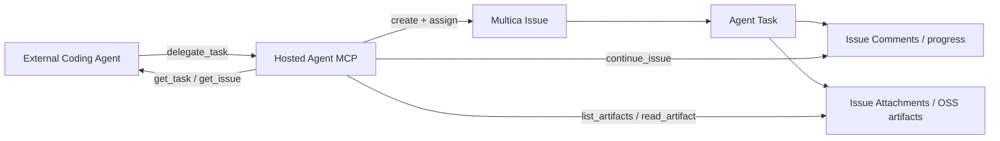

# Agent MCP Issue-backed Delegation 计划

> 工作流：Plan
> 状态：已完成
> 创建日期：2026-08-11 CST
> 当前分支：`codex/agent-a2a-inbound`
> 目标环境：Aone 预发 `pre-testing`
> 目标 Agent：`b7bb85af-99a2-4ce3-acdd-416b2dd6144d`

## 结论

Hosted Agent MCP 不应把一次委托只建模为隐藏 Chat Task。默认调用必须创建一个分配给目标 Agent 的 Multica Issue，再在该 Issue 上执行任务。Issue 是调用方、平台用户和 Agent 共同可见的持久工作对象；Task 是某一轮执行；Comment 是 follow-up 和进度时间线；Attachment/OSS 是文件产物交付面。

## 预发基线证据

2026-08-11 在目标 Agent 上运行 `scripts/agent-mcp-deep-e2e.mjs`：

- missing/invalid credential 均为 401；不可信 Origin 为 403；capability URL 返回 `Cache-Control: no-store, private` 和 `Referrer-Policy: no-referrer`。
- `tools/list` 只有 `delegate_task`、`get_task`。
- 6 个并发相同 `request_id` 返回同一个公共 Task `tsk_iO7j2gl6G6401cQxxP-xM2oMTbwraR9J`；相同 ID、不同 instruction 返回冲突。
- 文件任务经历 `SUBMITTED → WORKING → COMPLETED`，中间无 history、status message 或 Artifact；完成时只有一个 TextPart `REMOTE_FILE_CREATED`，没有文件内容或资源引用。
- follow-up 新任务 `tsk_MaeZ9R6cF6AMn3YnW8Whj33t-CGOF1VV` 无法读取上一任务工作区，返回 `MISSING_PREVIOUS_FILE`。
- 委托前后目标 Agent 的 Issue 列表均为空，证明当前 MCP 绕过了平台主工作流。

## 产品合同

### 工具

1. `delegate_task`
   - 默认 `mode=issue`，创建并分配 Issue，立即返回 `issue_id`、`identifier`、`task_id`、`status`。
   - `mode=direct` 只作为现有纯 Chat Task 的显式兼容入口。
   - Issue 模式接受原生创建语义的必要子集：`title`、`instruction`、`priority`、`project_id`、`parent_issue_id`、`stage`、`start_date`、`due_date`、`attachment_ids`、`allow_duplicate`、`request_id`。
   - `status` 固定为 `todo`，因为 `backlog` 不启动 Agent；assignee 固定为当前 MCP 暴露的 Agent；creator 固定为 endpoint 当前 owner。
2. `get_task`
   - 返回执行状态、Issue 引用、最终文本、评论增量和附件元数据。
3. `get_issue`
   - 返回当前 client 通过 MCP 创建的 Issue 的稳定字段和最新任务状态。
4. `continue_issue`
   - 在同一 Issue 创建 member comment 并触发下一轮 Agent Task；复用 Issue 的 prior workdir/session。
5. `list_artifacts`
   - 列出 Issue/Comment 中持久化的附件，不枚举短生命周期 sandbox 文件系统。
6. `read_artifact`
   - 读取属于当前 client Issue 的附件；文本限额内返回 text resource，二进制限额内返回 base64 blob，超限只返回元数据并要求走后续短期下载 URL 能力。
7. `describe_agent`
   - 返回公开名称、描述和声明 skills，避免调用方根据营销文案盲猜内部工具。

### 为什么不直接提供 `list_files/read_file(workdir)`

- 云沙箱 workdir 不是 server 可跨副本读取的持久存储，任务结束后还可能被 GC。
- 本地 runtime 的 workdir 在用户机器上，server 不能安全访问。
- 暴露任意路径会扩大目录穿越、跨任务和凭证泄漏风险。
- Multica 已有 Attachment + OSS、Issue Comment 和相同 Issue 的 prior workdir/session 续接机制；复用它们才是跨 runtime、跨副本和可吊销的稳定合同。

## 持久化与幂等

新增最小 `agent_mcp_delegation` claim/binding：

- 唯一键 `(client_id, request_id)`，保存 canonical request fingerprint。
- 公共 `task_id` 与本地 task UUID 分离。
- 保存 `issue_id`、root local task、operation 和 accepted credential。
- claim 先持久化；Issue 以 `origin_type=agent_mcp`、`origin_id=claim.id` 创建。若进程在 Issue commit 后、binding update 前退出，重试通过 origin 恢复，不重复建 Issue。
- client/credential revoke 只阻止新调用；已授权 client 读取自身历史 Issue/Task 的策略与 A2A 历史读取保持一致。

## 验收矩阵

| 维度 | 验收 |
|---|---|
| discovery | initialize instructions、工具 schema、Agent public skills |
| auth | Bearer、X-API-Key、capability URL、missing/invalid、Origin、revoke/expiry |
| idempotency | 同 ID 串行/并发重放、不同 payload 冲突、进程中断恢复 |
| Issue | UI 可见、identifier、creator/assignee/status/priority/project/parent/stage/date 与原生 Create 一致 |
| lifecycle | submitted/working/terminal、失败、重试 lineage、Issue 状态不被错误覆盖 |
| follow-up | 同 Issue comment 触发新 task，上一轮 workdir/session 可恢复，active task 时明确冲突 |
| artifact | Agent 上传文件后 list/read 内容精确；跨 client/Issue/Workspace 不可读；大小和 MIME 限制 |
| observability | comments/events 可轮询；SSE/notifications 作为后续 Streamable HTTP session 里程碑，不伪装成已支持 |
| compatibility | `mode=direct` 保持现有行为；未传 mode 默认 issue |
| local Coding Agent | 隔离 Codex 实际创建 Issue、轮询、follow-up、读取附件并在本地校验内容 |

## 发布边界

- 本轮可以增加 Issue-backed 请求持久化，因为“不新增存储”的早期偏好无法同时满足并发幂等、进程恢复、Issue ownership 和 follow-up；该表只存索引和身份，不存文件正文。
- 文件正文继续进入现有 OSS/Attachment，不进入 PostgreSQL 新表。
- SSE 需要 MCP session、断点游标和 durable event log，不与本轮 polling API 混做；先把 Issue comments/status 作为可验证进度面。
- 预发完成全部黑盒验收后仍停在人工“预发验证”，不自动进入生产。

## 执行记录

| 里程碑 | 状态 | 证据 |
|---|---|---|
| 当前 MCP 深度基线 | 已完成 | 2 个真实任务、6 路并发幂等、协议/鉴权负向测试、Issue 前后对比 |
| Issue-backed schema/service | 已完成 | `agent_mcp_delegation` 持久 claim/binding；Issue origin 恢复；同 Issue comment follow-up；原生 Issue 字段映射 |
| MCP tools 与 artifact projection | 已完成 | 7 个工具；Issue task 上传自动绑定 Issue；`get_task/list_artifacts/read_artifact` 返回持久资源 |
| 本地回归 | 已完成 | fresh PostgreSQL 定向 handler 集成测试覆盖 6 路并发、字段映射、隔离、文件与 follow-up；CLI/daemon 定向测试与受影响包 `go vet` 通过 |
| 全仓基线 | 已记录 | 全仓测试仍有与本改动无关的既有环境/fixture 失败；migration lint 报告既有 266/270 重号，本迁移 271 唯一 |
| Aone 部署与协议 E2E | 已完成 | pipeline 66 run `3103140882`：代码合并、构建、预发部署、预发集成测试均成功；停在预期的人工预发验证门禁。6 路并发仅创建 `PRE-1`，附件正文精确匹配，同 issue follow-up 恢复上一轮文件 |
| 本地 Coding Agent E2E | 已完成 | Codex CLI 通过 header token 环境变量连接 MCP，自主创建 `PRE-2`，轮询至 `TASK_STATE_COMPLETED`，通过 `get_issue/list_artifacts/read_artifact` 精确读回正文 |
