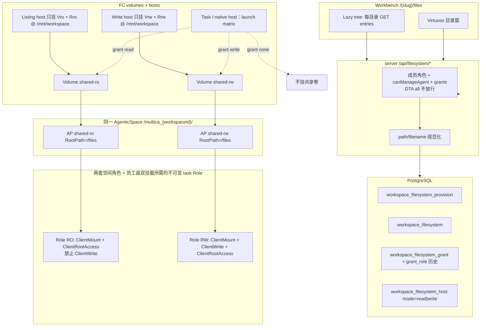
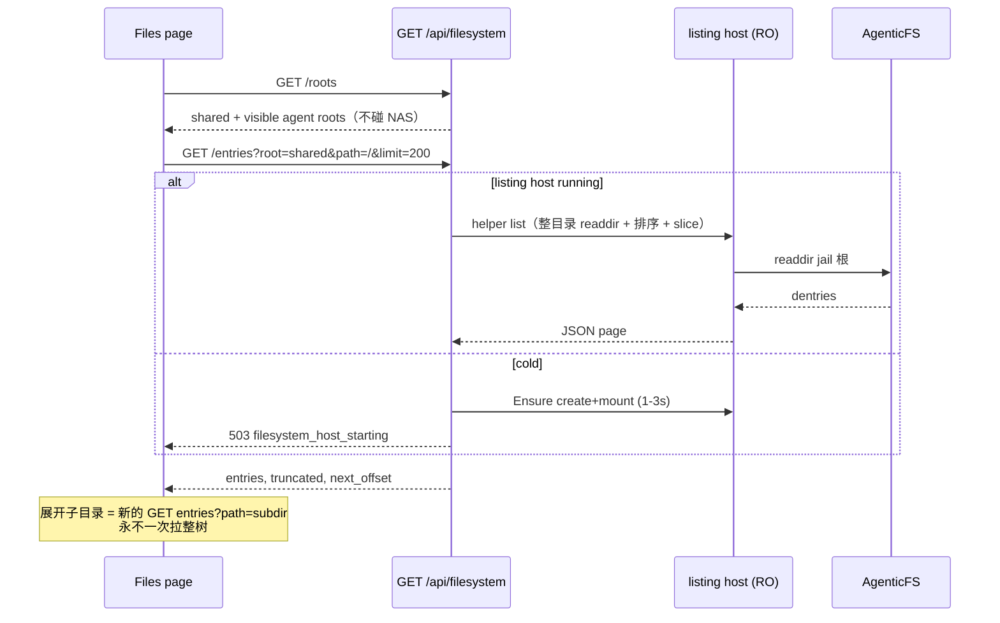

# 工作区文件系统：统一列表、按目录分页、读写隔离

| 字段 | 值 |
| --- | --- |
| Status | Draft |
| Date | 2026-09-20 |
| Revised | 2026-09-20（第二轮：helper 分 uid、单 Role 下 dual-mount 依赖复合 Role、RoleName 用 per-generation UUID、RootPath=/files 缺目录 fail-closed）；2026-09-23 预发实测更正见下方引用块 |
| Author | Grok (design loop) |
| Workspace | dt-fde-multica Aone fork (`/Users/yuanzhan/.grok/worktrees/d1-dt-fde-multica/file-system`) |
| Audience | 后端 / 前端 / 运行时 / 部署 |

> **预发实测更正（2026-09-23，优先于下文）**
>
> 1. **AgenticFS 接入点不能设根目录。** NAS `CreateAccessPoint` 的参数叫 `RootDirectory`（不是 `RootPath`），且文档注明「Agentic 文件系统不支持」。预发上两个共享 AP 的实际 `RootPath` 都是 `/`，即 AgenticSpace 根 `/multica_{workspaceId}/`。代码已不再传该参数，校验改为 `RootPath == "/"`：**共享盘的团队文件树就是 Space 根**。下文所有 `RootPath=/files` 以及 `/files` 目录是否自动创建的讨论均作废，读写隔离仍靠两个 AP + 两套 RAM + 两个卷。
> 2. **RAM 前缀。** 预发开通用户 `multica-dsh-pre-storage` 原策略只允许 `role/policy` 的 `multica-dsh-*`，共享盘的 `multica-wsfs-*` 和复合角色 `wsfst-*` 的 `CreateRole` 被拒，开通卡在 `role_ro`。已给 `MulticaDSHPreStorageProvisioner20260914-U2232880` 发布 v2 加入这两个前缀（v1 保留可回滚）。**正式环境发布前需要同样处理。** RAM 的角色、策略、挂载按名全局唯一，开通在 `creating` 查不到时会重发创建，不会再永久等待。
> 3. **挂载矩阵不阻塞启动。** 共享盘或复合角色未确认（Pending、Changed 或错误）时，任务只挂 `/mnt/multica` 照常启动，并打 `workspace filesystem mount not ready` 日志，错误里带云 API 的 Action、HTTP 状态和错误码。仍带共享卷的旧沙箱在这条回退路径上会被退役重建，不会复用，降级或撤销的授权不会借此保留。

---

## Overview

今天员工盘是 **按智能体隔离的 AgenticFS**（路径 `/multica_{workspaceId}_{agentId}/`），工作台 `?view=filesystem` 只显示开通状态，**没有列目录 API**。NAS 控制面没有 Space 内 `ListDir`；RAM 策略在 `accessPolicy` 里永远带 `nas:ClientWrite`；FC 创建只挂一块盘、只注入一个 `fc.sandbox.auth.role`，且 `matches()` 要求 `len(Mounts)==1 && Path==/mnt/multica`。附件是 Issue/Comment 的 OSS 对象（单文件 100MB，`size_bytes` / `sha256`），不能冒充 POSIX 工作区盘。

本设计增加一块 **工作区共享 AgenticSpace**（路径 `/multica_{workspaceId}/`），与现有员工私有盘在同一个工作台「文件」页里以两棵根列出。共享盘用 **两个 Access Point（RootPath=/files）、两套 RAM Role/Policy、两个 FC Volume** 做真正的读写隔离：读方只拿到 RO 卷和 RO 角色，写方才拿到 RW 卷。POSIX 与 HTTP 共用同一 jail：挂载点 `/mnt/workspace` **就是** 团队文件根（`MULTICA_WORKSPACE_FS_ROOT=/mnt/workspace`）。人类浏览/上传走 Multica HTTP；智能体任务与 native DSH host 按同一张 launch matrix 挂载。目录树 **只按当前目录分页**（算法 A：整目录 readdir → 按名排序 → slice），展开即新请求，永不一次拉整树。

---

## Background & Motivation

### 现状（已在本树核实，不以记忆为准）

| 事实 | 代码位置 |
| --- | --- |
| 开通路径不可改名，不可嵌套 | `dshhost.Provision.Path()` = `"/multica_" + workspaceId + "_" + agentId + "/"`（`server/internal/dshhost/provision.go`） |
| 开通唯一键 `(workspace_id, agent_id)` | 表 `dsh_storage_provision`（`9233`），唯一索引 `9234_dsh_storage_provision_identity` |
| 六步开通：Space → AP → Role → Policy → Attach → Volume | `ProvisionSpace`…`ProvisionVolume`，`Provisioner.Ensure` |
| RAM 永远可写 | `accessPolicy()`：`nas:ClientMount` + `nas:ClientWrite` + `nas:ClientRootAccess`，条件绑 `nas:AccessPointArn`（`server/internal/dshhost/cloud_storage.go`） |
| 无只读策略 | 仓库内不存在 RO policy 变体 |
| FC 挂载与对账 | `Create`：`volumeMounts: [{volumeName, /mnt/multica}]`，`metadata["fc.sandbox.auth.role"]=h.RoleARN`，要求 `h.AgentID != uuid.Nil`。`identity()` 总写 `multica.dsh.agent`。`matches()`：`len(info.Mounts)==1 && Path==MountPath`（`dshhost/fc.go`）。`Manager.Ensure` 同样要求非空 `AgentID`（`host.go`） |
| 无员工盘时的 FC 创建 | `FCE2BLauncher.createSandbox` 是 `e2b sandbox create`，**无** `volumeMounts`、无 `fc.sandbox.auth.role`（`fc_e2b.go`） |
| 环境变量 | `MULTICA_FS_ROOT=/mnt/multica`，用户文件 `$MULTICA_FS_ROOT/files`，`DSH_HOME=/mnt/multica/home`（`fc_e2b.go` extraEnv） |
| 配额默认 | `runtime.agentic_fs`：100 GiB / 1e9 files；NAS 下限 10 GiB / 10000；整 GiB（`server/pkg/runtimeconfig/config.go`，`docs/runtime-config.md`）。Placement 解析在 `server/cmd/server/dsh_storage_options.go` |
| NFS | 历史探测为 NFS v3 + `nolock,local_lock=all`（`dshhost/README.md`）。跨沙箱文件锁无效。写冲突「交给用户和智能体」 |
| 开通延迟 | 官方 AgenticFS 挂载 1–3s，是 **沙箱创建** 成本，不是 UI 树成本。AZ 内 metadata ~2ms |
| 工作台 | `DshHomeTab` 在 `agent-overview-pane.tsx` 以 `nativeEnabled={false}` 渲染：只开通，不列文件 |
| 人类 API | `GET/POST /api/agents/{id}/filesystem`（别名 `/dsh-home`），`RequireHumanActor` + `canManageAgent` + FC runtime（`handler/dsh_home.go`，`router.go`） |
| 无列目录 API | 全仓无 NAS `ListDir` / E2B files list 封装。Local Runner 才有 `ReadDir(1001)` + `truncated` 且 **无 offset、不按名排序**（`cmd_runner_tools.go` `runnerListDirectory`） |
| Skill FileTree | `packages/views/skills/components/file-tree.tsx` `buildTree(allPaths)`；上限 200 files / 8MB（`agentsource.MaxSkillFiles` / `MaxSkillSize`）。**禁止复用为共享盘树** |
| 侧栏 | `app-sidebar.tsx` 协作组无「文件」；`reserved-slugs.ts` 已保留 `files`；`route-icons.ts` 有 `File*` 图标名但无 files page |
| 权限 | `normalizeMemberRole`：`owner` / `admin` / `member`。`canManageAgent`：智能体 owner 或工作区 owner/admin（`handler/agent.go:2035`）。私有智能体 **调用** 不让 admin 绕过：TS `canAssignAgentToIssue`（`packages/core/permissions/rules.ts`）与 Go `canInvokeAgent`（`handler/agent_access.go`）。文件系统人类 API 跟 **管理** 闸，不跟调用闸 |
| DTA | `RequireHumanActor` **先** 放行 `WorkspaceAccessPrincipal` 且 `WorkspaceAccessRequestAllowed`。`WorkspaceAccessAll` 匹配任意 path（`workspace_access_principal.go`），随后 `WorkspaceAccessMember` 把角色改成 `owner`。`dta_` + `permission=all` 不是「人类」 |
| ASB | `ASBCreateSandboxInput` 无 AgenticFS volume。v1 共享盘 POSIX 挂载 **仅 FC** |
| 附件 | `handler/file.go` `maxUploadSize = 100 << 20`，`maxPreviewTextSize = 2 << 20`。OSS，不是 POSIX |
| 工作区删除 | `DeleteWorkspace` 是长 SQL 事务（`handler/workspace.go` + `workspace_delete.sql`）。**不** 触碰 `dsh_employee_host` / `dsh_storage_provision` / `employee_filesystem_sandbox`。`DestroyAndConfirmAbsent` 是带确认的 FC HTTP，不能放进该事务 |
| 本 worktree 沙箱 TTL | `fcE2BTaskSandboxTimeout = time.Hour`（`fc_e2b_timeout.go`）。续约是 `FCE2BLauncher.renewSandboxForTask` → `POST /sandboxes/{id}/timeout`，**不是** `dshhost.FCProvider` |
| `runE2BCommand` | `Runner.Run` 返回单个 `string` stdout（`fc_e2b.go`）。不能流式传 100MB |
| 最新 fork 迁移 | `9270_dsh_session_epoch_scope`。本功能从 **9271** 起号 |

### 痛点

1. 工作区没有共享 POSIX 盘。智能体之间、人类与智能体之间无法在同一颗树上协作文件。
2. 现有员工盘 RAM 全是 RW。若把共享盘也「每人挂 RW、应用层过滤路径」，智能体有 shell，隔离是假的。
3. 若用 Skill FileTree 或一次返回整树，目录一大就卡死；产品约束是 **每个目录单独分页**。
4. NAS 没有控制面列目录，必须经已挂载沙箱 `readdir`。因此需要 **常驻 listing host**，不能每点一次文件夹就 CreateSandbox（1–3s）。

---

## Goals & Non-Goals

### Goals

1. 工作台 `/{slug}/files` 一棵懒加载树：虚拟根 `shared/` + `agents/{agentId}/`。展开某目录只请求该 path 的一页。
2. 共享盘读写隔离是 **RAM + 挂哪块 Volume**，不是禁用 Save。读沙箱/读 host 拿不到 write 凭证，也挂不上 RW 卷。
3. 人类与智能体的工作台浏览/上传/下载走 Multica HTTP，绑定现有成员角色与 `canManageAgent`。智能体 **任务沙箱与 native DSH host** 另获与 grant 一致的 POSIX 挂载（同一张 launch matrix）。
4. 员工私有盘出现在同一 UI，但 **永不** 挂进另一智能体沙箱；`root=agent:` 的 exec 不得打到 `workspace_filesystem_host`。
5. 默认新智能体对共享盘 `none`；人类 owner/admin 默认可写，member 默认可读。

### Non-Goals

- 多写者冲突合并、NFS 文件锁、单写者队列（v1 不阻塞；可后续做 single-writer grant）
- 嵌套 AgenticSpace（NAS 约束）
- 用 OSS 附件 / Skill files / git repo 冒充工作区盘
- ASB POSIX 挂载（ASB 无 volume API）
- 重写 DSH native UI
- 改员工私有挂载点 `/mnt/multica` 或其 AP `RootPath=/`
- 给员工私有 Space 再开一套 RO AP（私有盘隔离语义是「不共享」，不是人类 RO/RW）
- 移动端 Files 页（web/desktop 共享 `packages/views`；mobile 另议）
- 跨 root 的 move/copy、工作区级回收站
- 工作区删除时自动拆 NAS/RAM/FC 云资源（与员工盘相同，走运维/异步对账）

---

## Proposed Design

### 产品形态：两棵根，一份合约不同

```
Workbench  /{slug}/files
  ├─ shared/                 新建 Workspace AgenticSpace。AP RootPath=/files。按智能体 none|read|write
  └─ agents/{agentId}/       现有员工 AgenticSpace（AP RootPath=/）。永不挂进其他智能体
```

对调用方，HTTP `root` 取值：

- `shared`
- `agent:<uuid>`（`parseUUIDOrBadRequest`）

**共享盘**：Access Point `RootPath=/files`，FC 挂在 `/mnt/workspace`。POSIX 与 HTTP 看到的就是团队文件根。环境变量 `MULTICA_WORKSPACE_FS_ROOT=/mnt/workspace`（**不是** `.../files`）。智能体 `ls /mnt/workspace` 不会看到 Space 根上的兄弟目录。

**私有盘**（不变）：员工 AP `RootPath=/`，挂 `/mnt/multica`，用户文件仍在 `$MULTICA_FS_ROOT/files`。HTTP `root=agent:` 仍 jail 到该 Space 的 `files/`，不暴露 `home/`、workspaces、插件目录。

### 总架构



### 共享盘开通（一个 Space，两条 RAM 车道，RootPath=/files）

**路径**：`/multica_{workspaceId}/`。NAS 一级目录，不嵌套员工路径。UUID 稳定，Path 开通后不可改。

**Placement**：复用 `runtime.agentic_fs.placement` + `credential_resource`（`server/cmd/server/dsh_storage_options.go`）。配额同样读 Diamond 快照；已开始的 intent 锁定当时配额（与员工盘相同）。

**不要** 把 `dsh_storage_provision.agent_id` 写成 sentinel UUID。

开通状态机照搬 `Provisioner.Ensure`：每步 `planned → creating → planned`，intent+step 作为云侧幂等键，丢失回执只 **Find** 不 **Create**。

| Step | 常量 | 动作 |
| --- | --- | --- |
| 0 | `ProvisionSpace` | `CreateAgenticSpace`，`FileSystemPath=/multica_{workspaceId}/` |
| 1 | `ProvisionAccessPointRO` | `CreateAccessPoint`，`EnabledRam=true`，**`RootPath=/files`** |
| 2 | `ProvisionAccessPointRW` | 同上，独立 AP，**`RootPath=/files`** |
| 3 | `ProvisionRoleRO` | RAM Role，trust `fc.aliyuncs.com` |
| 4 | `ProvisionRoleRW` | 独立 Role |
| 5 | `ProvisionPolicyRO` | **无 ClientWrite** |
| 6 | `ProvisionPolicyRW` | 现网员工同款三动作 |
| 7–8 | Attach RO / RW | 各 Role 只挂自己那条 Policy |
| 9–10 | Volume RO / RW | `fcsandbox CreateVolume`，`userID/groupID=1000`，`serverAddr=apDomain:/` |

`VerifyStorage` 必须读回并断言：

- 两个 AP 的 `RootPath == "/files"`、`EnabledRAM`、`Status=active`。
- RO policy JSON **精确等于** `ClientMount` + `ClientRootAccess`。**禁止** `ClientWrite`。
- RW policy 精确等于现网 `accessPolicy` 三动作，且 `nas:AccessPointArn` 只绑 RW AP。
- 每个 Role 的 `ListPoliciesForRole` 恰好一条 Custom policy（抄 `attachment()`）。
- Volume 的 `ServerAddr` 分别等于对应 AP domain，`StorageClass=AGENTIC_FS`，`Status=AVAILABLE`。
- Space path/quota/zone 与 intent 一致。

命名：`multica-wsfs-{intent}-ro` / `multica-wsfs-{intent}-rw`（RoleName 64 字符内）。Description 带 workspace id。禁止「列表空就再 Create」。

`ClientRootAccess` 不是写权限。若预发发现 RootAccess 在缺 ClientWrite 时仍能写，RO policy 去掉 RootAccess，改为开通后对 `/files` `chown -R 1000:1000`。代码硬条件仍是「RO 不含 ClientWrite」。

#### `files/` 引导（fail-closed）

本树 `CreateAccessPoint`（`cloud_storage.go`）**不传** `RootPath`，员工盘默认 `/`。共享盘必须显式传 `RootPath=/files`。NAS 是否在路径不存在时自动建目录 **未在本仓库验证**。

**v1：fail-closed，不做 bootstrap mini-chain。**

1. Space `Running` 后 `CreateAccessPoint`，RO/RW 均 `EnabledRam=true`、`RootPath=/files`。
2. `DescribeAccessPoint` 断言 `RootPath=/files` 且 `Status=active`。
3. 若 create/describe 因目录不存在失败（或 RootPath 不是 `/files`）：该步保持 `creating` / 返回 `ErrPending`，**不** `BindStorage`，**不** 创建 listing/write host。运维看开通 step；不要把缺目录当成空树。
4. 绑定完成前，listing host 不得对外服务。首次 `GET /entries?path=/` 在 jail 根 `openat` 仍缺目录 → 503 `filesystem_unavailable`。

若预发探测证明 NAS 会自动创建 `RootPath` 目录，把证据写进开通测试，仍不引入第二套 AP。

**明确不做（除非另开设计）：** 用 `RootPath=/` 的 throwaway AP 去 `mkdir /files`。那种 AP 能看到整个 Space；`EnabledRam=false` 或把 RW Role 绑到 `/` AP 会在 lasting RO/RW AP 之外留一扇门。若将来必须做 bootstrap，完整合约是：`EnabledRam=true`；throwaway Role+Policy **只** 绑 bootstrap AP ARN 且含 `ClientWrite`；throwaway sandbox `mkdir+chown 1000`；`DestroyAndConfirmAbsent` 并删除 bootstrap AP/Role **之后** 才创建 lasting RO/RW AP；Find-not-Create 防崩溃重入；**永不** 把 bootstrap ARN 写入 `workspace_filesystem`。v1 不实现这条链。

员工盘不改：仍然 `RootPath=/`，HTTP 自己 jail 到 `files/`。

### 读写隔离边界（硬约束）

| 主体 | 挂载 | RAM |
| --- | --- | --- |
| 人类 listing/download/stat | **仅** listing host → `shared-ro` volume @ `/mnt/workspace` | **仅** RO role |
| 人类 upload/mkdir/rename/delete | **仅** write host → `shared-rw` volume | **仅** RW role |
| 智能体 grant=`none` | 只有私有 `/mnt/multica`（若已开通员工盘）；否则无 AgenticFS 卷 | 员工 role 或无 |
| 智能体 grant=`read` | 见 launch matrix | RO 共享 Role（或该 generation 的不可变复合 Role） |
| 智能体 grant=`write` | 见 launch matrix；写者 **不要** 同时挂 RO+RW | RW 共享 Role（或该 generation 的不可变复合 Role） |
| 智能体 A 看 B 的私有盘 | **禁止** | 无 B 的 AP 权限 |

**禁止**：

- 全员挂 RW，靠 handler 滤 path（智能体有 shell）。
- 共用一个 AP，靠 chmod/uid 隔离（现网 volume 全是 uid/gid 1000）。
- 把 RW role 发给 listing host「但只跑 ls」。
- 把员工私有 volume 放进另一智能体的 `volumeMounts`。
- list 失败时回退到 write host。
- 在同一 Role ARN 上改 default policy 来「降级」（见下一节）。

NFS v3 + `nolock`：**多个 writer 仍会互相覆盖**。本设计的隔离是 **读者不能写**，不是 POSIX 锁。v1 允许多个 grant=`write` 的智能体与 owner/admin 同时写。

### Grant 变更：next-sandbox，且 Role 文档不可变

与 ASB 网络 allowlist 相同（`docs/security/asb-network-allowlist.md`）：**只在下一次 sandbox create 生效**。正在跑的任务保留 **创建时** 的 volumeMounts 与 **创建时的 Role ARN**，直到任务结束回收。

**禁止** 在 grant 变更时 `CreatePolicyVersion` / 改同一 Role 的 default policy。本树 `cloud_storage.go` `policy()` 读的是 **当前** default version；RAM 在每次 NAS 请求时评估该文档。原地改 policy 会热吊销或热提权，与 next-sandbox 矛盾，且仓库没有 version-retention 代码。

**v1 合约**：

- `workspace_filesystem_grant.generation` 每次 `access` 变化 +1。
- 运行中沙箱 metadata 记录 `multica.wsfs.grant-generation` 与创建时 `role-arn`。对账用这些值，不读 grant 表的「当前」ARN 去改正在跑的沙箱。
- 紧急吊销：`POST /api/agents/{id}/cancel-tasks`（drain 现有任务）。不把 grant PUT 做成静默 kill。

UI 文案：「权限将在该智能体下一次任务沙箱创建时生效。」

### 双挂载凭证与不可变 task Role

现网 `FCProvider.Create`（`dshhost/fc.go:135-150`）只支持单卷 + 单 Role，且 `matches` 写死一块 `/mnt/multica`。ACS 先验：同一沙箱可对 RO/RW 使用不同 CredentialProvider。这是目标形态。

**本树现状是单一 `fc.sandbox.auth.role`（`dshhost/fc.go:146-150`）。v1 按单 Role 实现复合 Role；per-volume 只是探测成功后的优化，不能当 PR 8 的前提。**

1. **探测（不阻塞复合 Role）** FC `POST /sandboxes` 是否支持 per-volume credential（`volumeMounts[].role`）以及 `volumeMounts[].readOnly`。成功才允许「两卷两 Role」；失败则继续用复合 Role。
2. **`selectVolumeMounts` 硬闸（单 Role）**：已绑定员工盘的沙箱，**只有** `workspace_filesystem_grant.task_role_arn` 非空时才追加 `/mnt/workspace`。`task_role_arn` 为空（grant=`none`、复合 Role 尚未开通、或实现漏了 PR 9）→ **只挂 `/mnt/multica`**，sandbox-wide Role 仍是员工 Role。禁止把共享卷挂到员工 Role 上（共享 AP RAM 403），也禁止把工作区 Role 套到带私有卷的沙箱（员工 AP RAM 403）。
3. **无私有盘 + grant read/write**：只挂共享卷，sandbox-wide Role = 工作区 `shared-ro` 或 `shared-rw` Role（开通时已有，不必复合）。走 FC HTTP create，不是 `e2b sandbox create`。
4. **复合 Role（有私有盘 + grant read/write，单 Role FC）**：每个 `(workspace, agent, generation)` **新建** Role+Policy，**永不** 改旧 generation 文档：
   - `access=read`：Statement1 = 员工 AP 三动作；Statement2 = 共享 **RO** AP 的 `ClientMount`+`ClientRootAccess`。**不得** 含共享 RW AP。
   - `access=write`：Statement1 员工 AP；Statement2 共享 **RW** AP 三动作。
   - `access=none`：不建 task Role。
   - **RoleName**：`workspace_filesystem_grant_role.role_id`（非零 UUID，INSERT 时生成）→ RAM 名 `wsfst-{role_id}`（前缀 6 + UUID 36 = 42，低于 64）。**禁止** 截断 agent UUID。Find 按 RoleName + Description（含 workspace/agent/generation/role_id），与员工 `provisionName`/`provisionDescription` 同构；丢失回执只 Find 不 Create。
5. 读 grant 的 `volumeMounts` 只挂 RO 卷。写者不挂 RO+RW 两块共享卷。

FC OSS 单沙箱最多约 5 个 OSS volume；v1 **最多 2 挂载**：私有 + 共享。

### FC Create 通用输入与 `matches()`

不要把「可选第二挂载」塞进员工 `Host` 的现有单字段语义，也不要让 listing host 走「AgentID 必填 + `/mnt/multica`」的 `FCProvider.Create`。

新增 create 输入（名称示例 `SandboxCreateSpec`），员工 Create 是它的一个特例：

```go
type VolumeMountSpec struct {
    Name     string // FC volume name
    Path     string // /mnt/multica or /mnt/workspace
    RoleARN  string // empty unless per-volume creds
    ReadOnly bool   // set if FC honors it; still never pass RW volume to readers
}

type SandboxCreateSpec struct {
    WorkspaceID  uuid.UUID
    AgentID      uuid.UUID // uuid.Nil for workspace listing/write hosts
    Scope        string    // "employee" | "wsfs-read" | "wsfs-write" | "task"
    Generation   int64
    CreateIntent uuid.UUID
    TemplateID   string
    TimeoutSec   int
    RoleARN      string            // sandbox-wide fc.sandbox.auth.role (required today)
    Mounts       []VolumeMountSpec // 1 or 2; order stable
    Labels       map[string]string
}
```

规则：

- **Listing host**：`AgentID=uuid.Nil`，`Mounts=[{roVolume, /mnt/workspace}]`，`RoleARN=ro_role_arn`。labels **不** 写 `multica.dsh.agent`；写 `multica.wsfs.mode=read`、workspace、intent、generation、volume、role。
- **Write host**：同上，`mode=write`，RW volume + RW role，path 仍 `/mnt/workspace`。
- **有私有盘的任务 / native host**：`Mounts` 至少 `{employeeVolume, /mnt/multica}`。仅当 `task_role_arn != ""`（或 per-volume 探测已成功）时追加 `{sharedVolume, /mnt/workspace}`。单 Role 时 sandbox-wide `RoleARN` **必须** 是该 generation 的复合 Role，不能是员工 Role，也不能是工作区 RO/RW Role。
- **无私有盘、grant read/write 的 FC 任务**：`Mounts=[{sharedVolume, /mnt/workspace}]`，`RoleARN` = 工作区 `ro_role_arn` 或 `rw_role_arn`。**必须走这份 FC HTTP create**，禁止 `e2b sandbox create`。
- **无私有盘、grant none**：保持今天的 `e2b sandbox create`，无 AgenticFS。

`matches(info, spec)`：

1. 所有 durable labels 精确相等（intent、workspace、generation、template-id、sandbox-wide role、mode/agent 若有）。
2. `len(info.Mounts)==len(spec.Mounts)`。
3. 每个 `(name, path)` 对都出现（允许实现按 path 排序后比较）。
4. **拒绝** listing spec 对上 RW volume name 或 RW role ARN。
5. **拒绝** 读 grant 任务对上 RW 共享 volume。

`FindCreated` / `ReconcileCreate` 用新 `matches`。若仍用旧「恰好一块 `/mnt/multica`」，双挂载会永远停在 `creating`。

员工路径：现有 `FCProvider.Create`/`matches` 改为调用通用实现，传入单挂载 `/mnt/multica`，行为与今天字节级兼容（单测锁死 `len==1` 的员工用例）。

### Launch matrix（任务与 native DSH 同一张表）

`fc_e2b.go` 里员工盘只在 `dsh_employee_host` 存在时走 `resolveFilesystemScopeSandbox`。共享挂载 **不能** 只写在这条分支。`ensure` native DSH host（`fc_e2b_dsh_host.go`）必须调用同一 `selectVolumeMounts(runtime, agent, grant, employeeHost *Host)`。

| employee FS | grant | `task_role_arn` / 凭证 | mounts | create 路径 |
| --- | --- | --- | --- | --- |
| 已绑定 `dsh_employee_host` | none | 空；员工 Role | `/mnt/multica` only | 现有 dshhost Create |
| 已绑定 | read/write | **空（复合 Role 未就绪）** | **仍只有** `/mnt/multica` | 现有 dshhost Create；**不得** 加共享卷 |
| 已绑定 | read | 非空复合 Role（或 per-volume） | 私有 + `/mnt/workspace` **RO volume** | 通用 Create（2 mounts），sandbox Role = 复合 Role |
| 已绑定 | write | 非空复合 Role（或 per-volume） | 私有 + `/mnt/workspace` **RW volume** | 同上 |
| 无私有盘，FC | none | — | 无 AgenticFS | 现有 `e2b sandbox create` |
| 无私有盘，FC | read/write | 工作区 RO 或 RW Role（不必复合） | **仅** `/mnt/workspace` | **FC HTTP 通用 Create** |
| ASB | 任意 | — | 无 POSIX | grant 只存库 |

`extraEnv`（仅当共享卷实际挂上）：

- `MULTICA_WORKSPACE_FS_ROOT=/mnt/workspace`
- `MULTICA_WORKSPACE_FS_ACCESS=read|write`

`isAllowedFCE2BRunnerExtraEnv` 白名单加上这两项。无共享挂载则 **不** 注入，避免智能体误以为有盘。

测试（PR 8 必写）：

- **单 Role + 员工 host + grant=write + `task_role_arn=""` → 只有 `/mnt/multica`，无 `/mnt/workspace`。**
- grant=write 且无 `dsh_employee_host` → 单共享 RW 挂载，sandbox Role = 工作区 `rw_role_arn`。
- grant=none 且有员工盘 → 只有 `/mnt/multica`。
- 员工盘 + 非空 `task_role_arn` + grant=write → 两挂载，sandbox Role = `task_role_arn`（不是员工 Role）。
- 永不把 agent B 的 volume name 传给 A。
- native ensure 与 task launch 对同一 fixture 产生相同 Mounts。
- `FindCreated` 接受两挂载；listing host 若回来 RW volume/role 则 `matches` 失败。

### Listing / Write host

NAS 没有 Space 内 ListDir。人类 HTTP 必须在已挂载沙箱里做 I/O。

`workspace_filesystem_host`：每工作区 `mode=read|write` 各至多一个 running 行。

- 生命周期抄 `dshhost.Manager`：`offline → creating → running → retiring → offline`。intent 先落库再 Create；销毁必须 GET 404（`DestroyAndConfirmAbsent`）。
- 读请求禁止打 write host；写请求禁止打 listing host。Handler 按 verb 选 `mode`。出错 **不得** 跨 mode 重试。
- 复用 running host；禁止每次点击 CreateSandbox。
- TTL：与 FC create 同一 `TimeoutSeconds`。每次成功 I/O 后调用与 `renewSandboxForTask` 相同的 `POST /sandboxes/{id}/timeout`（host 专用 wrapper，例如 `renewWorkspaceFilesystemHost`，不要让 dshhost 依赖 FCE2BLauncher 的 task 语义）。Sweeper 在 TTL/2 续约。
- 冷启动：503 `filesystem_host_starting`，UI 重试。热目录 p95 **< 300ms**（不含冷启动）。
- 模板：当前工作区 FC stable 模板。不跑 agent CLI，不注入 `MULTICA_DAEMON_TOKEN`。
- 并发：v1 一个 mode 一个沙箱。list 与 write **已经** 分沙箱。同一 host 上的 `exec` 必须可并发（helper 无全局锁文件）；实现若发现 FC exec 串行，在文档/指标里暴露 queue wait。100MB upload 使用独立超时（建议 120s），不得占死 listing。p95 若被大上传拖垮，后续可加 burst write exec；v1 不静默借用 write host 做 list。
- 私有盘人类浏览：`employee_filesystem_sandbox` 的独立 `scope_id`（常量 UUID `human-browse` namespace），只挂 **该员工** volume。授权 `canManageAgent`。硬不变量：`root=agent:` 的 `sandbox_id` ∈ 该员工 browse scope，**∉** `workspace_filesystem_host`。

### Host I/O protocol

`FCE2BLauncher.runE2BCommand` / `Runner.Run` 返回 **一个 `string`**，不能流式 100MB，也不能把 multipart 送进沙箱。v1 **禁止** 用它做 `GET content` / `POST upload`。

#### Helper 调用

固定 argv，从不 `sh -c`，path 只走 env：

```
multica-wsfs-helper <verb>
```

`verb` ∈ `list|stat|mkdir|rename|delete`。

环境变量（由 API 进程设置，helper 校验）：

| env | 含义 |
| --- | --- |
| `WSFS_ROOT` | 绝对 jail。共享 host：`/mnt/workspace`。私有 browse：`/mnt/multica/files` |
| `WSFS_PATH` | 相对 jail 的 POSIX 路径，已在 API 侧规范化 |
| `WSFS_OFFSET` / `WSFS_LIMIT` | 仅 list |
| `WSFS_FROM` / `WSFS_TO` | 仅 rename |
| `WSFS_RECURSIVE` | 仅 delete：`0`/`1` |
| `WSFS_MAX_ENTRIES` | list/recursive delete 上限（10000 / 1000） |

**两类 exec，禁止共用一个 uid：**

| 步骤 | uid | 先例 |
| --- | --- | --- |
| **安装** helper（每 host generation 一次） | `--user root` | `dshHomePrepareArgs`（`fc_e2b_dsh_host.go:440`）写 `/usr/local/libexec` |
| **I/O 动词** `list\|stat\|mkdir\|rename\|delete\|content-*` | `--user user` | `fc_e2b_dsh_native.go`、`fc_e2b_dsh_plugin_sync.go` |

两类都清空 `LD_PRELOAD` / `LD_LIBRARY_PATH` / `LD_AUDIT` / `GCONV_PATH` / `BASH_ENV` / `ENV`。不要把 I/O 的 `--user user` 套到安装上（`/usr/local/libexec` 为 root 所有，uid 1000 写不进去，checksum 失败会让 host 永远离开 `running`）。也不要用 root 跑 I/O。

JSON 只用于元数据动词，stdout **上限 1MB**，可继续用 bounded `Run`。

#### Helper 如何进入 stock 模板

v1 **不** 为 Files 单独发镜像。Host Ensure 成功且 Healthy 之后、对外服务之前：

1. 仓库内钉死脚本 `server/internal/wsfs/helper.py`（或 Go 源码生成的 blob），单测锁 SHA-256。
2. **安装 exec（`--user root`）**：streaming stdin 写入 `/usr/local/libexec/multica-wsfs-helper`（`fcE2BRootRunnerInstallDir`），chmod 0755，读回 checksum。失败则该 generation 不得标 `running`。
3. **之后所有 I/O** 只 exec 该路径，且 **`--user user`**。模板日后若自带同 checksum 文件可跳过安装。
4. 不要改装到 `/tmp/...` 来回避 root 安装：I/O 仍须是 uid 1000，安装仍须进镜像 libexec，与 DSH home helper 一致。

#### 100MB 上传/下载（流式，内存 ≪ 100MB）

新增 `Runner.Stream(ctx, name, args, env, stdin io.Reader, stdout io.Writer) error`，`io.Copy` 缓冲 **256KiB**。禁止把整个对象读进 `[]byte`/`string`。

探测顺序：

1. FC HTTP files API（`GET/PUT /sandboxes/{id}/files?path=`）若预发确认支持 **流式** body：优先用 `FCProvider.request` 的流式变体（今日 `request` 把 body `json.Marshal` 且读响应上限 1MB，**不能** 原样复用）。
2. 否则：helper 增加 `content-get` / `content-put`：bytes 走 stdout/stdin，**前面没有** 混在同一 stream 里的 JSON。API 先 `stat`（JSON exec）再 stream。Upload：写 `$WSFS_ROOT/$WSFS_PATH/.tmp-$intent` 再 `rename` 到最终名（`WSFS_FILENAME` 已是单 segment）。

`http.MaxBytesReader` 100MB 包在 API 的 upload 入口。Download 先看 `stat.size_bytes`，>100MB → 413，不开始 stream。

#### Helper errno → HTTP

Helper JSON：`{"ok":true,...}` 或 `{"ok":false,"code":"...","errno":"ENOSPC"}`。映射：

| errno / 条件 | helper `code` | HTTP | `writeErrorCode` |
| --- | --- | --- | --- |
| `ENOENT` | `not_found` | 404 | |
| `ENOTDIR` | `not_directory` | 400 | `filesystem_invalid_path` |
| `ELOOP` / 命中 symlink 且动词不允许 | `symlink` | 400 | `filesystem_invalid_path` |
| `EEXIST` | `exists` | 409 | `filesystem_exists` |
| `ENOTEMPTY` | `not_empty` | 409 | `filesystem_not_empty` |
| `ENOSPC` / `EDQUOT` | `quota_exceeded` | **507** | `filesystem_quota_exceeded` |
| `EACCES` / `EPERM` | `denied` | 403 | `filesystem_write_denied` |
| 路径校验失败 | `invalid_path` | 400 | `filesystem_invalid_path` |
| 目录 > 10000 entries | `directory_too_large` | 413 | `filesystem_directory_too_large` |
| recursive delete 将超过 1000 | `delete_too_large` | 413 | `filesystem_delete_too_large` |
| 其它 | `internal` | 502 | `filesystem_unavailable` |

**只有** `ENOSPC`/`EDQUOT`（及 helper `quota_exceeded`）映射 507。其它写失败不得猜成配额。本树 handler 尚未使用 507；引入合法。

测试：假 helper `ENOSPC` → 507；Describe 失败 → quota 响应只有 limit、`size_used: null`。

### 列目录 helper（算法 A）

**v1 选定算法 A**（不要与 `ReadDir(limit+1)` 混写）：

1. 对 `WSFS_ROOT/WSFS_PATH` 做 `openat(..., O_DIRECTORY|O_NOFOLLOW)`，解析后仍必须在 jail 内。
2. **readdir 整个目录**（不是 `ReadDir(limit+1)`）。若 entries 数（不含 `.`/`..`）> **10000** → 413 `filesystem_directory_too_large`，不返回部分页。
3. 按名字 **字节序** 排序。
4. slice `[offset:offset+limit]`。默认 `limit=200`，最大 `1000`，`offset>=0`。
5. `truncated = offset+len(page) < total`。`next_offset = truncated ? offset+count : null`。
6. 每个返回 entry `lstat`（不跟随）。`type=file|directory|symlink|other`。symlink **列入列表**，`GET content` / 写动词对 symlink → 400（`O_NOFOLLOW`）。
7. **永不递归。list 响应不含文件内容。**
8. 忽略 `.` / `..`；点文件照常返回。

这是 **单目录** 分页，不是整树。并发写入时排序快照仍可能与下一次 GET 不一致；v1 接受。成本是一个目录的 dentries，有 10k 硬帽。

`runnerListDirectory` 的 `ReadDir(1001)` **不是** 本 API 的分页算法（它无 offset、不排序）；只借鉴「单目录、有 truncated、不含 content」。

### 路径安全

抄 `protocol.ValidDSHWorkdir` 精神（`server/pkg/protocol/dsh_native.go`），推广到 jail 相对路径。

对 **每一个** `path`、`from`、`to` 独立校验：

- UTF-8；无 NUL / `\r\n\` / 反斜杠；`path.Clean` 恒等；无 `..` 段；无空段；非绝对路径；总长 ≤ 4096。
- 空或 `/` = jail 根（共享：`/mnt/workspace`；私有 HTTP：`/mnt/multica/files`）。
- 解析后必须 `strings.HasPrefix(resolved, jail+"/")` 或等于 jail。

**`filename`（upload）**：必须是 **单个 path segment**（无 `/`、无 `..`、无 NUL）。默认用 multipart part 的 basename，但仍走同一校验。禁止靠 filename 建子目录或逃出 `path` 目录。最终路径 = `join(path, filename)`，再跑一遍 jail 检查。

**rename**：`from` 与 `to` 各自校验，必须同一 `root`、同一 jail。任一侧是 symlink → 400（v1 不对 symlink 做 rename）。目标存在 → 409。

**delete**：`path` 同样校验。无 `recursive`：文件或空目录；目录非空 → 409 `filesystem_not_empty`。`recursive=true` 仅 owner/admin：helper **先** 统计将删除的 entries（上限 1000+1），若 >1000 → 413 `filesystem_delete_too_large` 且 **零删除**（NFS 无事务，禁止部分删）。

**symlink**：list 可见；content/upload/mkdir/rename/delete 全部 `O_NOFOLLOW`，把 symlink 当非法目标而不是跟随。

**root 隔离**：

- `root=shared` → 只 exec listing/write `workspace_filesystem_host`。
- `root=agent:<uuid>` → 只 exec 该员工 human-browse sandbox。测试锁死不会拿到共享 host 的 `sandbox_id`。
- `filename=../x`、`path=files/../home`、symlink content 均有 handler 测试。

### 权限矩阵

路由：`/api/filesystem/*` 在 workspace-scoped 组（`RequireWorkspaceMember` + `X-Workspace-ID`）+ `RequireHumanActor`。

**DTA：v1 从 `WorkspaceAccessAll` 排除 `/api/filesystem*`。** 改 `WorkspaceAccessRequestAllowed`：path 前缀 `/api/filesystem` 对 **任何** DTA permission（含 `all`、`dsh_config`）返回 false。于是 `RequireHumanActor` 落到 `workspace_access_token` denylist → 403。不新增 DTA permission。实现者 **不得** 以为 `RequireHumanActor` 已足够。

必写测试：`dta_`+`all` → 403；`dta_`+`dsh_config` → 403；`mat_` task token → 403；人类 member GET list shared → 200；人类 member POST upload shared → 403；人类 owner upload → 200。

| 操作 | shared | agent private |
| --- | --- | --- |
| 见根 / list / stat / content / quota | 任意成员；私有盘还要已开通且 `canManageAgent` | |
| mkdir / upload / rename / delete | `owner`/`admin` | `canManageAgent` |
| 开通共享盘 | `owner`/`admin` | n/a（`POST /api/agents/{id}/filesystem`） |
| GET/PUT grants | `owner`/`admin` | n/a |

智能体 HTTP：v1 不对 `mat_` 开放。POSIX only。

成员默认可读、不可写。v1 无 per-member 写授权表。新智能体默认 **none**（缺行 = none）。

私有智能体：admin 可通过 `canManageAgent` 浏览私有盘（管理闸 ≠ 调用闸）。`GET /roots` 会把该工作区 **所有已开通** 且调用者可管理的智能体列给 admin。产品选择，不是漏洞。UI 文案：「管理员可浏览（管理闸，非调用闸）。」对比测试：非 owner 的 member → `root=agent:` 403 `filesystem_private_denied`；admin → 200。

### 文件树（最简单，产品硬约束）



- UI 每节点 `expanded` 才请求；折叠不预取。
- 目录窗用 Virtuoso（`packages/views/common/virtuoso-seed.tsx`）。禁止 `buildTree(allPaths)`。
- 根请求只查 Postgres + 可见性。
- Query key 必须含 `wsId`：`filesystemKeys.entries(wsId, root, path, offset)`、`filesystemKeys.roots(wsId)`。
- 删除/重命名：**await 服务器成功后再** 从 React Query 缓存去掉该行（CLAUDE.md：navigate/confirm 流禁止乐观删除实体）。

---

## API / Interface Changes

前缀：`/api/filesystem`。错误体：`writeError` / `writeErrorCode`。前端 zod + `parseWithFallback` + malformed-response 测试（抄 `dsh-home-client.test.ts`）。

### 公共查询参数

| 字段 | 规则 |
| --- | --- |
| `root` | `shared` 或 `agent:<uuid>` |
| `path` | 相对 POSIX，见路径安全 |
| `limit` | 默认 200，最大 1000 |
| `offset` | 默认 0，≥0 |

### `GET /api/filesystem/roots`

```json
{
  "roots": [
    {
      "id": "shared",
      "kind": "shared",
      "name": "shared",
      "provisioned": true,
      "state": "complete",
      "step": 11,
      "writable": true,
      "access": "write"
    },
    {
      "id": "agent:0ec8a7cb-7b91-423c-9ee8-1994b399178c",
      "kind": "agent",
      "agent_id": "0ec8a7cb-7b91-423c-9ee8-1994b399178c",
      "name": "DWH-317",
      "provisioned": true,
      "state": "running",
      "writable": true,
      "runtime_backend": "aliyun_fc"
    }
  ]
}
```

- `shared` 始终出现。`writable` = owner/admin。
- agent 根：`dsh_employee_host` 已绑定 **且** `canManageAgent`。ASB / 未开通：不出现。

### `POST /api/filesystem/provision`

Body `{}`。仅 owner/admin。已 complete → 200；进行中 → 202。拒绝 client placement。

### `GET /api/filesystem/entries?root=&path=&offset=&limit=`

算法 A。共享走 listing host。

```json
{
  "root": "shared",
  "path": "specs",
  "offset": 0,
  "limit": 200,
  "entries": [
    { "name": "rfc.md", "type": "file", "size_bytes": 1204, "modified_at": "2026-09-20T08:00:00Z" },
    { "name": "images", "type": "directory", "size_bytes": 0, "modified_at": "2026-09-20T07:00:00Z" },
    { "name": "link", "type": "symlink", "size_bytes": 0, "modified_at": "2026-09-20T07:00:00Z" }
  ],
  "count": 3,
  "truncated": false,
  "next_offset": null
}
```

不含 content。目录 >10000 → 413。

### `GET /api/filesystem/stat?root=&path=`

同 entry + 可选 `mode`。symlink 返回 `type=symlink`，不跟随。

### `GET /api/filesystem/content?root=&path=`

流式。symlink / 非 regular → 400。`size_bytes>100MB` → 413。`Content-Disposition: attachment`；`Content-Type` 抄 `handler/file.go` `extContentTypes`。

UI preview：仅当 `stat.type==file` 且 `stat.size_bytes <= 2MiB`（与 `maxPreviewTextSize` 同一常量，不要在 views 另发明）且看起来是文本时才 GET content 内嵌预览；否则只提供下载。

### `POST /api/filesystem/upload`

`multipart/form-data`：`root`、`path`（目标 **目录**）、`file`。可选 `filename`（默认 part basename，仍须单 segment 校验）。

- 单 part ≤ 100MB。
- 只打 write host（shared）或员工 browse sandbox（private）。
- 临时文件再 rename。
- helper `quota_exceeded` → 507。
- 无写权限 → 403 `filesystem_write_denied`。
- 目录不存在 → 404。不自动 mkdir 多层。

### `POST /api/filesystem/mkdir`

```json
{ "root": "shared", "path": "specs/2026" }
```

只建最后一级；父目录必须存在。已存在 → 409。

### `POST /api/filesystem/rename`

```json
{ "root": "shared", "from": "specs/old.md", "to": "specs/new.md" }
```

`from`/`to` 独立校验。跨 root、symlink、覆盖 → 400/409。

### `DELETE /api/filesystem/entries?root=&path=&recursive=`

见路径安全。recursive 超 1000 → 413 且零删除。

### `GET /api/filesystem/quota?root=`

```json
{
  "root": "shared",
  "size_limit": 107374182400,
  "file_count_limit": 1000000000,
  "size_used": null,
  "file_count_used": null,
  "usage_as_of": null,
  "usage_lag_hint_seconds": null
}
```

v1 **默认用量为 null**。本树 `spaceInfo`（`cloud_storage.go`）只解析 `Quota.SizeLimit` / `FileCountLimit`，**没有** usage 字段。预发对 `GetAgenticSpace` / `DescribeAgenticSpaces` 探测真实 JSON 名之后，若确认用量且滞后约 15 分钟，再填 `size_used` / `file_count_used` / `usage_lag_hint_seconds: 900`。探测失败保持 null，**不要** 编造 `SpaceUsage` / `FileCountUsage`。limit 来自 `workspace_filesystem` 绑定行。Describe 失败：仍返回 limit + null 用量。

`SetAgenticSpaceQuota` 仍是运维/后续 API。

### `GET /api/filesystem/grants`

owner/admin。未归档智能体；缺行 = `none`。归档智能体从列表隐藏（grant 行可保留）。

```json
{
  "default_access": "none",
  "human_shared_policy": { "owner_admin": "write", "member": "read" },
  "grants": [
    {
      "agent_id": "...",
      "agent_name": "DWH-317",
      "access": "read",
      "generation": 3,
      "runtime_backend": "aliyun_fc",
      "mount_effective": "next_sandbox"
    }
  ]
}
```

### `PUT /api/filesystem/grants`

```json
{ "agent_id": "0ec8a7cb-7b91-423c-9ee8-1994b399178c", "access": "none"|"read"|"write" }
```

`parseUUIDOrBadRequest` + 确认该 workspace 的 agent。upsert。`access` 变化时 `generation++`。有员工盘且 grant 为 read/write 时，本树 **必须** 为新 generation 创建不可变复合 Role 并写 `task_role_arn`（PR 9；per-volume 探测成功后才允许留空）。无私有盘不建复合 Role。**不** 修改旧 generation 的 RAM policy。`none` 保留行并清空 `task_role_arn`。

智能体 **归档**：`GET /grants` 隐藏。**硬删除**：应用层删 grant 行 + `workspace_filesystem_grant_role` 行。不删共享 Space。复合 Role 云对象不在删除事务里拆；进运维对账清单。

### 状态码

| HTTP | code | 何时 |
| --- | --- | --- |
| 400 | `filesystem_invalid_path` | `..`、NUL、坏 filename、symlink 目标、非 UTF-8、坏 root |
| 401 | | 未登录 |
| 403 | `filesystem_write_denied` / `filesystem_private_denied` | 角色 / DTA / `canManageAgent` |
| 404 | | 缺文件/缺 agent |
| 409 | `filesystem_exists` / `filesystem_not_empty` | mkdir/rename/delete |
| 413 | `filesystem_too_large` / `filesystem_directory_too_large` / `filesystem_delete_too_large` | upload/download/目录帽/递归删 |
| 202 | | provision 进行中 |
| 503 | `filesystem_host_starting` / `filesystem_unavailable` | 冷启动、引导未完成、FC 故障 |
| 507 | `filesystem_quota_exceeded` | helper `ENOSPC`/`EDQUOT` |
| 502 | | 云开通回执不确认 |

### Agent POSIX（非 HTTP）

- 私有：`$MULTICA_FS_ROOT/files`（`/mnt/multica/files`）
- 共享（env 存在）：`$MULTICA_WORKSPACE_FS_ROOT`（`/mnt/workspace`，**根就是文件**）
- 无该 env = 无共享盘

更新 `server/internal/service/builtin_skills/multica-runtimes-and-repos/SKILL.md` 与 `references/*-source-map.md`。

---

## Data Model Changes

Fork 迁移从 **9271** 起。无 FK、无 cascade。每个 `CREATE [UNIQUE] INDEX CONCURRENTLY` 单独文件。`IF NOT EXISTS`。表名单数 `snake_case`。

风格对齐 `9233_dsh_storage_provision`、`9257_employee_filesystem_sandbox`。编号以合并时 max+1 为准；下列按当前 tip `9270` 起算。

### `workspace_filesystem_provision`（9271）+ unique（9272）

```sql
CREATE TABLE IF NOT EXISTS workspace_filesystem_provision (
    workspace_id uuid NOT NULL,
    spec jsonb NOT NULL CHECK (jsonb_typeof(spec) = 'object'),
    intent uuid NOT NULL,
    step integer NOT NULL DEFAULT 0 CHECK (step BETWEEN 0 AND 11),
    state text NOT NULL DEFAULT 'planned' CHECK (state IN ('planned', 'creating', 'complete')),
    resources text[] NOT NULL DEFAULT '{}',
    updated_at timestamptz NOT NULL DEFAULT now(),
    CHECK (cardinality(resources) = step),
    CHECK (state <> 'complete' OR step = 11),
    CHECK (state <> 'creating' OR step < 11)
);
```

`9272`: `CREATE UNIQUE INDEX CONCURRENTLY IF NOT EXISTS workspace_filesystem_provision_workspace_idx ON workspace_filesystem_provision (workspace_id);`

11 步 = indices 0–10，complete 时 `step=11` 且 `cardinality(resources)=11`（与员工盘 `step=6` / 步骤 0–5 同构）。

### `workspace_filesystem` 绑定（9273）+ 唯一索引（9274–9279，**六条**）

```sql
CREATE TABLE IF NOT EXISTS workspace_filesystem (
    workspace_id uuid NOT NULL,
    file_system_id text NOT NULL CHECK (file_system_id <> ''),
    space_id text NOT NULL CHECK (space_id <> ''),
    vpc_id text NOT NULL,
    security_group_id text NOT NULL,
    vswitch_ids text[] NOT NULL,
    ro_access_point_arn text NOT NULL,
    rw_access_point_arn text NOT NULL,
    ro_role_arn text NOT NULL,
    rw_role_arn text NOT NULL,
    ro_volume_name text NOT NULL,
    rw_volume_name text NOT NULL,
    size_limit bigint NOT NULL,
    file_count_limit bigint NOT NULL,
    updated_at timestamptz NOT NULL DEFAULT now()
);
```

各文件一条 CONCURRENTLY：

| 文件 | 索引 |
| --- | --- |
| 9274 | `UNIQUE (workspace_id)` |
| 9275 | `UNIQUE (ro_volume_name)` |
| 9276 | `UNIQUE (rw_volume_name)` |
| 9277 | `UNIQUE (ro_access_point_arn)` |
| 9278 | `UNIQUE (rw_access_point_arn)` |
| 9279 | `UNIQUE (file_system_id, space_id)` |

工作区 RO/RW Role 开通后 **不再改 policy 文档**。

### `workspace_filesystem_grant`（9280）+ unique（9281）

```sql
CREATE TABLE IF NOT EXISTS workspace_filesystem_grant (
    workspace_id uuid NOT NULL,
    agent_id uuid NOT NULL,
    access text NOT NULL CHECK (access IN ('none', 'read', 'write')),
    generation bigint NOT NULL DEFAULT 0 CHECK (generation >= 0),
    task_role_arn text NOT NULL DEFAULT '',
    task_policy_name text NOT NULL DEFAULT '',
    updated_at timestamptz NOT NULL DEFAULT now(),
    updated_by uuid
);
```

`9281`: `CREATE UNIQUE INDEX CONCURRENTLY IF NOT EXISTS workspace_filesystem_grant_identity_idx ON workspace_filesystem_grant (workspace_id, agent_id);`

无行 = `none`，`generation=0`。`task_role_arn`：有员工盘且 grant 为 read/write 时，指向当前 generation 复合 Role；无私有盘或 grant=`none` 时为空。**Launcher 把空串当成「不要把共享卷加到员工沙箱」。** `updated_by` 无 FK。

这些列在 **schema PR 就存在**，不是「后续列」。Launcher 在 create 时读取并打进 sandbox labels；不在运行中回写。

### `workspace_filesystem_grant_role` 历史（9282）+ unique（9283）

```sql
CREATE TABLE IF NOT EXISTS workspace_filesystem_grant_role (
    workspace_id uuid NOT NULL,
    agent_id uuid NOT NULL,
    generation bigint NOT NULL CHECK (generation >= 1),
    role_id uuid NOT NULL CHECK (role_id <> '00000000-0000-0000-0000-000000000000'),
    access text NOT NULL CHECK (access IN ('read', 'write')),
    role_arn text NOT NULL,
    policy_name text NOT NULL,
    created_at timestamptz NOT NULL DEFAULT now()
);
```

`9283`: `CREATE UNIQUE INDEX CONCURRENTLY IF NOT EXISTS workspace_filesystem_grant_role_identity_idx ON workspace_filesystem_grant_role (workspace_id, agent_id, generation);`

`9284`: `CREATE UNIQUE INDEX CONCURRENTLY IF NOT EXISTS workspace_filesystem_grant_role_id_idx ON workspace_filesystem_grant_role (role_id);`

一行 = 一次不可变 Role+Policy。`role_id` 在 INSERT 时 `uuid.New()`，RAM RoleName = `wsfst-{role_id}`（account-global 唯一，42 字符）。grant 变更只 **INSERT** 新 generation，绝不 UPDATE 旧行的 ARN/policy/role_id。运行中沙箱继续用旧 `role_arn` 直到回收。Find 用 RoleName + Description（workspace/agent/generation/role_id）。本树单 Role：有员工盘的 read/write grant **必须** 有对应行，不能等 per-volume 探测。

### `workspace_filesystem_host`（9285）+ unique（9286）

```sql
CREATE TABLE IF NOT EXISTS workspace_filesystem_host (
    workspace_id uuid NOT NULL,
    mode text NOT NULL CHECK (mode IN ('read', 'write')),
    state text NOT NULL DEFAULT 'offline' CHECK (state IN ('offline', 'creating', 'running', 'retiring')),
    generation bigint NOT NULL DEFAULT 0 CHECK (generation >= 0),
    create_intent uuid,
    sandbox_id text NOT NULL DEFAULT '',
    template_id text NOT NULL DEFAULT '',
    volume_name text NOT NULL DEFAULT '',
    role_arn text NOT NULL DEFAULT '',
    updated_at timestamptz NOT NULL DEFAULT now(),
    CHECK ((state = 'offline' AND sandbox_id = '' AND create_intent IS NULL)
        OR (state = 'creating' AND sandbox_id = '' AND create_intent IS NOT NULL AND template_id <> '')
        OR (state IN ('running', 'retiring') AND sandbox_id <> '' AND create_intent IS NOT NULL AND template_id <> ''))
);
```

`9286`: `CREATE UNIQUE INDEX CONCURRENTLY IF NOT EXISTS workspace_filesystem_host_mode_idx ON workspace_filesystem_host (workspace_id, mode);`

Ensure 时 volume/role 从 `workspace_filesystem` 填入。read 必须是 RO 绑定，write 必须是 RW。

### 工作区 / 智能体清理（禁止在 DeleteWorkspace SQL 事务里调 FC）

`DeleteWorkspace` 是长 SQL 事务（`workspace_delete.sql`），今天也不删员工盘表。`DestroyAndConfirmAbsent` 是网络往返，放进该事务会锁超时、堵副本、踩 fence。

分三段：

1. **事务前（best-effort）**：将 `workspace_filesystem_host` 标 `retiring`，对每个 `sandbox_id` 调 `DestroyAndConfirmAbsent`。失败则保持 `retiring`，返回 409「filesystem hosts must finish retirement」（对齐 `dshprofile.GuardBuildDeletion`），或允许 owner 重试删除。**不要**在 `qtx.DeleteWorkspace*` 里面调 FC。
2. **事务内**：扩展 `workspace_delete.sql`（或同事务里额外 `Exec`）`DELETE` provision / binding / grant / grant_role / host 行。无 FK，显式删。
3. **云资源**：NAS Space/AP、RAM Role/Policy、FC Volume **不** 在删除事务或 down.sql 里拆。与员工盘相同：运维清单 + 可选异步 reconciler。Rollback 只丢 PG 行。

智能体归档：`GET /grants` 与 Files 树隐藏。硬删除：只删该 `agent_id` 的 grant + grant_role；不 retire 共享 listing host。

---

## UI

### 导航

协作组「文件」，`/{slug}/files`（slug 已保留）。

- `packages/core/paths/paths.ts`：`files: () => \`${ws}/files\``
- `packages/core/paths/route-icons.ts`：`WorkspacePageKey`/`NavLabelKey` + `WORKSPACE_PAGES.files = { segment: "files", icon: "File", navKey: "files" }`
- `packages/core/paths/route-icons.test.ts`：segment 覆盖（现有测试遍历 `WORKSPACE_PAGES`，加上 `pageForSegment("files")=="files"`）
- `tab-subject.ts`：`pageForSegment` 即可，不必单独 `case "files"`
- `packages/views/layout/app-sidebar.tsx`：协作组 `{ key: "files", labelKey: "files" }`
- `packages/views/locales/{en,zh-Hans,ja,ko}/layout.json`：`nav.files` = Files / 文件 / ファイル / 파일
- `packages/views/package.json`：`"./files": "./files/index.ts"`（web re-export 对齐 `sitehosting`）
- `apps/web/app/[workspaceSlug]/(dashboard)/files/page.tsx`：`export { FilesPage as default } from "@multica/views/files"`
- `apps/desktop/.../routes.tsx`：session route `path: "files"`
- `packages/core/filesystem/queries.ts` + `tree-store.ts`（Zustand 只在 core）
- `packages/views/files/` 页面组件

### 页面结构

- 左：懒树。「共享」「智能体（非共享）」。智能体根旁注：「管理员可浏览（管理闸，非调用闸）。」
- 共享未开通：owner/admin「准备共享文件系统」。
- 智能体根：已开通且 `canManageAgent`。ASB 不出现。
- 右：Virtuoso + 面包屑。Preview 仅 `size_bytes<=2MiB` 的文本文件。
- 写入口仅 `writable` 渲染；不是安全边界。
- 侧栏 grant 编辑（owner/admin）。三段 `none|read|write`。不复用 `invocation_targets`。
- 配额条：有用量才展示；v1 可能只有 limit。

### 智能体配置 Filesystem tab

保留 `DshHomeTab`。增加链到 `/{slug}/files`；只读展示该智能体 `access`；说明 next-sandbox。不要把共享开通塞进员工 tab。

---

## Alternatives Considered

### A. 全员 RW 挂载 + handler 滤路径

智能体有 shell。**否决。**

### B. 单 AP + chmod/uid

uid/gid 全是 1000。**否决。**

### C. 每智能体一个共享 Space 再同步

违背一块团队盘。**否决。**

### D. OSS 附件 / Skill 文件

无 POSIX。**否决。**

### E. 等 NAS ListDir

阻塞产品。**v1 否决。**

### F. Grant 降级立即 drain + 或原地改 RAM policy

Drain 杀长任务。原地改 policy 是热吊销，与 ASB allowlist 和 next-sandbox 矛盾。**v1：不可变 Role + next-sandbox；紧急用 cancel-tasks。**

### G. 默认 grant=`read`

扩大泄露面。**选 none。**

### H. 共享 AP `RootPath=/` + HTTP 自己 jail 到 `files/`

实现少一步，但读 grant 的 shell 能 `ls` Space 根兄弟目录。**否决。** 选 `RootPath=/files`。

---

## Security & Privacy Considerations

| 威胁 | 严重度 | 缓解 |
| --- | --- | --- |
| 只读智能体写共享盘 | P0 | RO volume + RO RAM；不可变 Role 不含 RW AP；read host ≠ write host |
| 改同一 Role policy 造成热提权/热吊销 | P0 | 每 generation 新 Role；禁止 CreatePolicyVersion 当 grant 更新 |
| 智能体 A 挂上 B 的私有卷 | P0 | launcher 只挂 self 的 employee volume；HTTP `root=agent:` 要 `canManageAgent` 且 exec 不进共享 host |
| 路径穿越 / upload filename | P0 | 单 segment filename；from/to 独立校验；`O_NOFOLLOW` |
| Listing host 被写 | P0 | 独立沙箱/Role/Volume；禁止 list 失败改打 write host |
| `matches` 仍要求单 `/mnt/multica` 导致双挂载对不上 | P0 | 通用 mount list 对账；测试 RW listing 被拒 |
| `dta_` `all` 以 owner 写盘 | P0 | `/api/filesystem*` 从 `WorkspaceAccessAll` 排除；测试 |
| Task token / cloud_pat | P1 | `RequireHumanActor` denylist |
| 配额打满 | P2 | Space quota；100MB；仅 ENOSPC/EDQUOT → 507 |
| 下载撑爆 API 内存 | P2 | Stream 256KiB；禁止 `Run() string` |
| Grant 窗口期仍可写 | P2 | 文案 + cancel-tasks |
| 多写者覆盖 | P2 | 接受 |
| Helper/agent CLI 滥用 | P2 | 固定 argv；无 daemon token |
| 日志泄露凭证 | P1 | 现网 FC 不把 body 放进 error |
| Admin 浏览他人私有盘 | P2 | 管理闸产品选择；UI 标明；member 403 测试 |

多副本：intent/generation/grant 只活在 Postgres。

---

## Observability

日志（无密钥、无文件内容）：`workspace_id`、`root`、`mode`、`sandbox_id`、`generation`、`grant_generation`、`grant_access`、`step`、`latency_ms`、`truncated`、`code`、`errno`。

指标：`multica_filesystem_list_seconds`、`host_state`、`host_cold_starts_total`、`write_denied_total`、`quota_errors_total`、`provision_step`、`host_exec_wait_seconds`（若 FC exec 排队）。

告警：listing host 非 running > 5min；开通 `creating` > 15min；507 突增。

---

## Rollout Plan

1. 迁移 9271+ 上预发。
2. 开通（RootPath=/files）暗发。
3. FC 通用 Create/`matches`（员工路径行为不变）。
4. Host + helper + 续约 + 删除前 retire。
5. 读 HTTP → 写 HTTP。
6. Grants HTTP；launcher matrix（旧二进制不得挂第二块它对不上的卷 → 与新 Create 同发或其后）。
7. Files 页。预发 `dwh-e2e`。
8. 文档 / skill。

回滚：UI 可回；不要降迁移号；云资源运维拆；旧 launcher 看不到绑定则当未开通。

预发验收：

- RO policy 无 ClientWrite。
- 读 host `touch /mnt/workspace/x` 失败（注意：jail 根就是 files）。
- 写 host 同一路径成功。
- 读 grant 沙箱看不到 Space 根兄弟（RootPath=/files）。
- A 的 `/mnt/multica` 不在 B 的 mounts。
- 无员工盘 + grant=write 仍挂上 `/mnt/workspace`。
- listing `matches` 拒绝 RW volume。
- `dta_` all 调 upload → 403。
- 热 list p95 < 300ms。
- 网络面板多次 `entries?path=`，从无全树。
- `filename=../` → 400。
- 单 Role + 员工盘 + grant=write + 空 `task_role_arn` → mounts 仅 `/mnt/multica`。
- helper 安装 exec 含 `--user root`；I/O exec 含 `--user user`、不含 root。

---

## Open Questions

实现期探测（产品已拍板）：

1. **FC per-volume CredentialProvider**：成功后可省略复合 Role，并用工作区 RO/RW Role 做第二挂载。**失败或未探测完：PR 9 必做**；PR 8 不得在 `task_role_arn==""` 时给员工沙箱加 `/mnt/workspace`。
2. **FC `volumeMounts[].readOnly`**：若支持，读挂载置 true。不替代 RAM。
3. **RO + ClientRootAccess 是否意外可写**。
4. **FC files HTTP 是否能流式** PUT/GET；否则用 `Runner.Stream`。
5. **GetAgenticSpace 用量 JSON 名与滞后**；未确认前 quota usage 保持 null。
6. **CreateAccessPoint(RootPath=/files) 是否自动建目录**：v1 fail-closed，不 Bind。探测成功只作为「开通不再 Pending」的证据，不引入 bootstrap AP。

已拍板：默认 grant=`none`；member 只读；next-sandbox + 不可变 Role；分页算法 A；ASB 无 POSIX；私有盘不开第二套 RO AP；共享 AP `RootPath=/files` 且缺目录 fail-closed；DTA 不放行 filesystem；不在 DeleteWorkspace 事务里 Destroy；helper 安装 `--user root`、I/O `--user user`；复合 RoleName = `wsfst-{role_id}`。

---

## Key Decisions

1. **两根一树，合约不同。** 共享可配置 none/read/write；私有永不跨挂。
2. **一个 Space、两套 AP/Role/Volume。** 隔离在 RAM 与挂载。共享 AP **`RootPath=/files`**，`MULTICA_WORKSPACE_FS_ROOT=/mnt/workspace`。
3. **Listing host 与 write host 是不同沙箱。** 读 API 不接触 RW 角色；失败不跨 host。
4. **新智能体默认 none。**
5. **人类：owner/admin 写，member 读。** Grant 表只针对智能体。
6. **按目录分页，算法 A**：整目录 readdir → 按名排序 → slice；默认 200 / 最大 1000；目录 >10k → 413。不是 `ReadDir(limit+1)`。
7. **常驻 listing host + `renewSandboxForTask` 同款 `/timeout`。** 热 list < 300ms p95。
8. **Grant 变更 next-sandbox；Role+Policy 按 generation 不可变。** 禁止改 default policy。紧急 cancel-tasks。
9. **v1 HTTP 不对 `mat_`、不对 DTA（含 `all`）开放。** 改 `WorkspaceAccessRequestAllowed`。
10. **专用表，不用 sentinel agent_id。** grant 的 generation / task_role_arn 在 schema PR 就有。
11. **单请求 100MB，Stream 256KiB。** 507 仅 ENOSPC/EDQUOT。
12. **多写者覆盖是已知限制。**
13. **FC Create 使用 mount list + 新 `matches`。** Listing/write host 允许 `AgentID=Nil`、挂 `/mnt/workspace`。
14. **Launch matrix 覆盖无私有盘的 FC 智能体与 native DSH。** 无私有盘 + grant 用工作区 RO/RW Role 单挂载。有员工盘时 **必须** `task_role_arn` 非空才加 `/mnt/workspace`。
15. **工作区删除：先 retire host，再 SQL 删行，云资源异步。** 不在 `qtx.DeleteWorkspace*` 里调 FC。
16. **Helper 安装与 I/O 分 uid。** 安装 `--user root` → `/usr/local/libexec/multica-wsfs-helper`（同 `dshHomePrepareArgs`）；I/O `--user user`。
17. **复合 RoleName 用 per-generation UUID**：`wsfst-{role_id}`，不截断 agent id。
18. **`RootPath=/files` 缺目录 fail-closed。** 不 Bind；v1 不做 bootstrap AP。

---

## Risks

| 风险 | 严重度 | 缓解 |
| --- | --- | --- |
| 单 Role 迫使复合 Role 数量随 generation 增长 | P1 | 本树必须建复合 Role；none / 无私有盘不建；旧 Role 回收前只是 RAM 对象；RoleName 用 `role_id` UUID |
| PR 8 在 `task_role_arn` 空时双挂载 | P0 | 硬闸 + 单测：grant=write + 空 ARN → 仅 `/mnt/multica` |
| Helper 用 uid 1000 写 `/usr/local/libexec` | P0 | 安装 `--user root`，I/O `--user user` |
| RootPath=/files 不存在仍 Bind | P1 | fail-closed，ErrPending，无 bootstrap AP |
| 原地改 policy 造成热吊销（若实现偷懒） | P0 | 单测：PUT grant 后 GetPolicyVersion(旧 ARN) 不变；新 generation 新 RoleName |
| Listing 冷启动 1–3s | P1 | 续约；503 + 重试 |
| 单 listing/write host 成为瓶颈 | P2 | 分沙箱；Stream 超时；exec wait 指标；禁止 list 借用 write host |
| 目录 10k 帽 | P2 | 413；产品上拆目录 |
| 开通 11 步易卡 | P1 | Find 不重 Create；告警 |
| PolarDB 非幂等 | P1 | IF NOT EXISTS；CONCURRENTLY 单语句 |
| 旧 Desktop | P2 | parseWithFallback |
| Skill FileTree 误用 | P1 | PR 审查 |
| 用量字段名猜错 | P2 | v1 null；预发探测 |

---

## References

- `server/internal/dshhost/{provision.go,cloud_storage.go,fc.go,filesystem_sandbox.go,README.md,postgres.go,provision_postgres.go,host.go}`
- `server/internal/handler/dsh_home.go`，`agent.go` `canManageAgent`，`agent_access.go` `canInvokeAgent`，`workspace.go` `normalizeMemberRole` / `DeleteWorkspace`，`file.go` `maxUploadSize` / `maxPreviewTextSize`，`actor_guards.go`
- `server/internal/middleware/workspace_access_principal.go` `WorkspaceAccessAll` / `WorkspaceAccessRequestAllowed` / `WorkspaceAccessMember`
- `server/cmd/server/router.go`；`server/cmd/server/dsh_storage_options.go`
- `server/internal/service/fc_e2b.go` `createSandbox` / extraEnv / `runE2BCommand`；`fc_e2b_dsh_host.go` `dshHomePrepareArgs`（`--user root` + `/usr/local/libexec`）；`fc_e2b_timeout.go` `renewSandboxForTask`
- `server/cmd/multica/cmd_runner_tools.go` `runnerListDirectory`（对比：无 offset）
- `server/pkg/protocol/dsh_native.go` `ValidDSHWorkdir`
- `server/pkg/runtimeconfig/config.go` `agentic_fs`；`docs/runtime-config.md`
- `docs/security/asb-network-allowlist.md`
- `server/pkg/db/queries/workspace_delete.sql`
- `packages/core/permissions/rules.ts`；`packages/core/paths/{paths.ts,route-icons.ts,route-icons.test.ts,tab-subject.ts,reserved-slugs.ts}`
- `packages/views/layout/app-sidebar.tsx`；`packages/views/package.json` exports；`dsh-home-tab.tsx`；`agent-overview-pane.tsx`
- `packages/views/skills/components/file-tree.tsx`（反模式）
- `packages/views/common/virtuoso-seed.tsx`
- 迁移：`9233`/`9234` provision，`9223`–`9227` employee host，`9257`–`9259` sandbox
- `server/internal/service/builtin_skills/multica-runtimes-and-repos/SKILL.md`
- CLAUDE.md：无 FK、CONCURRENTLY、fork 9000+、`parseWithFallback`、handler UUID、query key 含 `wsId`、Aone 多副本

---

## PR Plan

每个 PR 可独立审查合并。迁移号 = 合并时 `server/migrations` 最大号 +1。

### PR 1 — Schema

- **Title:** `feat(filesystem): add workspace filesystem provision, grant, host, and immutable grant-role tables`
- **Files:** `9271`–`9286` 表与 CONCURRENTLY 索引（含 `generation`/`task_role_arn`/`role_id` UUID、`UNIQUE (role_id)`、grant_role 历史）
- **Deps:** 无
- **Description:** 只加表。复合 Role 身份不放到「后续列」。

### PR 2 — Provisioner（RootPath=/files）

- **Title:** `feat(filesystem): provision workspace AgenticSpace with RO/RW access points rooted at /files`
- **Files:** `server/internal/dshhost/` 或 `wsfs` 开通代码；RO policy 无 `ClientWrite` 测试；`RootPath=/files` 断言；目录不存在 → `ErrPending`、不 Bind
- **Deps:** PR 1
- **Description:** 11 步 Ensure + Verify。不改员工 `accessPolicy`。不创建 host。v1 **没有** bootstrap AP；缺 `/files` fail-closed。

### PR 3 — FC mount list Create / `matches`

- **Title:** `feat(dshhost): generalize FC sandbox create to a mount list and full-set matches`
- **Files:** `dshhost/fc.go`、`host.go`；员工单挂载回归测试；双挂载与 `AgentID=Nil` listing spec 测试；`matches` 拒绝 listing+RW
- **Deps:** 无（可与 PR 1 并行）。无产品 HTTP
- **Description:** 抽出 `SandboxCreateSpec`。现有员工 Create 变为单元素 mount list。**不** 在此 PR 给 listing host 加产品逻辑。任务双挂载的 launcher 调用留到 PR 8。

### PR 4 — Hosts、I/O helper、续约、删除前 retire

- **Title:** `feat(filesystem): workspace read/write hosts, helper protocol, and pre-delete retirement`
- **Files:** host Ensure/Retire；helper 脚本 + SHA-256 测试；`Runner.Stream`；`renewWorkspaceFilesystemHost`（`POST /sandboxes/{id}/timeout`，与 `renewSandboxForTask` 同 API）；`DeleteWorkspace` 事务 **前** retire；`workspace_delete.sql` DELETE 五行；errno 单测
- **Deps:** PR 2、PR 3
- **Description:** 每 mode 单卷（RO 或 RW）@ `/mnt/workspace`。Helper **安装** `--user root` 写入 `/usr/local/libexec/multica-wsfs-helper`；**I/O** `--user user`。content 走 Stream。禁止用 `Run() string` 传文件体。删除路径不在 SQL 事务里调 FC。

### PR 5 — HTTP 读 API

- **Title:** `feat(filesystem): human read APIs with per-directory sorted pagination`
- **Files:** `handler/filesystem.go`；router；算法 A；`packages/core/api/filesystem-schema.ts` + malformed 测试；`WorkspaceAccessRequestAllowed` 排除 `/api/filesystem*` + DTA/mat_/member 测试
- **Deps:** PR 4
- **Description:** roots/entries/stat/content/quota。content 流式。quota usage 默认 null。`root=agent:` 不碰共享 host。

### PR 6 — HTTP 写 API

- **Title:** `feat(filesystem): human write APIs isolated on the RW host`
- **Files:** provision/upload/mkdir/rename/delete；filename 单 segment 测试；recursive 零部分删除；ENOSPC→507
- **Deps:** PR 5
- **Description:** member 写 shared → 403。写请求 sandbox_id 必须是 write host。

### PR 7 — Grants HTTP

- **Title:** `feat(filesystem): per-agent shared FS grants with immutable generation`
- **Files:** GET/PUT grants；generation++ 测试；「PUT 后旧 Role policy 文档不变」
- **Deps:** PR 1（表）、PR 5（路由组）。可与 PR 6 并行
- **Description:** 不改 launcher。有员工盘的 read/write 在 PR 9 写 `task_role_arn`；PR 8 把空 ARN 当成不加共享卷。

### PR 9 — 复合 Role provisioner（本树必做）

- **Title:** `feat(filesystem): immutable per-grant-generation task roles for single-role FC`
- **Files:** INSERT `workspace_filesystem_grant_role`（含 `role_id` UUID）；RAM 名 `wsfst-{role_id}`；Find by name+description；Verify 读 grant 不含 RW AP；PUT grant 后填充 `task_role_arn`
- **Deps:** PR 7（HTTP + generation++）、PR 2（共享 AP ARN）
- **Description:** **本树单 `fc.sandbox.auth.role`，此 PR 不是可选。** 排在 PR 8 之前。禁止 CreatePolicyVersion。禁止截断 agent UUID。无私有盘的 grant 不建复合 Role。per-volume 探测成功后可停开新的复合 Role，但不能让 PR 8 在 ARN 为空时双挂载。

### PR 8 — Launcher mount matrix

- **Title:** `feat(filesystem): mount shared RO/RW volumes on FC task and native host create`
- **Files:** `fc_e2b.go`、`fc_e2b_dsh_host.go`、extraEnv 白名单；`selectVolumeMounts` 硬闸
- **Deps:** PR 3、PR 2（binding）、PR 7（读 grant）、**PR 9（员工盘双挂载所需的 `task_role_arn`）**
- **Description:** 实现 launch matrix。`task_role_arn==""` 且有员工盘 → 只有 `/mnt/multica`（单测必写）。无私有盘 + grant → 工作区 RO/RW Role 单挂载，FC HTTP create。有 `task_role_arn` 才 2 mounts 且 sandbox Role = 该 ARN。永不挂 B 的卷。

### PR 10 — Nav 与空 Files 页

- **Title:** `feat(filesystem): add workspace Files nav route for web and desktop`
- **Files:** paths、route-icons、route-icons.test.ts、app-sidebar、四语言 `nav.files`、`package.json` `./files`、web page、desktop `path: "files"`
- **Deps:** 无（可与 PR 1 并行）
- **Description:** 空态即可。

### PR 11 — Lazy tree UI

- **Title:** `feat(filesystem): lazy per-directory file tree and Virtuoso pane`
- **Files:** `packages/views/files/**`；`packages/core/filesystem/{queries,tree-store}.ts`；preview 2MiB；无乐观删除
- **Deps:** PR 5、PR 6、PR 10
- **Description:** `filesystemKeys.*` 含 `wsId`。禁止 Skill FileTree。

### PR 12 — Grant 编辑器与员工 tab 链接

- **Title:** `feat(filesystem): grant editor and agent filesystem tab link`
- **Files:** Files 侧栏；`dsh-home-tab` 链接；`canWriteWorkspaceFilesystem`；admin 浏览私有盘文案
- **Deps:** PR 7、PR 11
- **Description:** next-sandbox 文案。不复用 invocation_targets。

### PR 13 — Docs / skills

- **Title:** `docs(filesystem): document workspace FS isolation, listing, grants, and DTA exclusion`
- **Files:** `docs/runtime-config.md`；skill + source-map；可选 `docs/workspace-filesystem.md`
- **Deps:** PR 8
- **Description:** RootPath=/files fail-closed、算法 A、不可变 Role、`wsfst-{role_id}`、helper 分 uid、nolock、usage null、ASB N/A、DTA 403。
