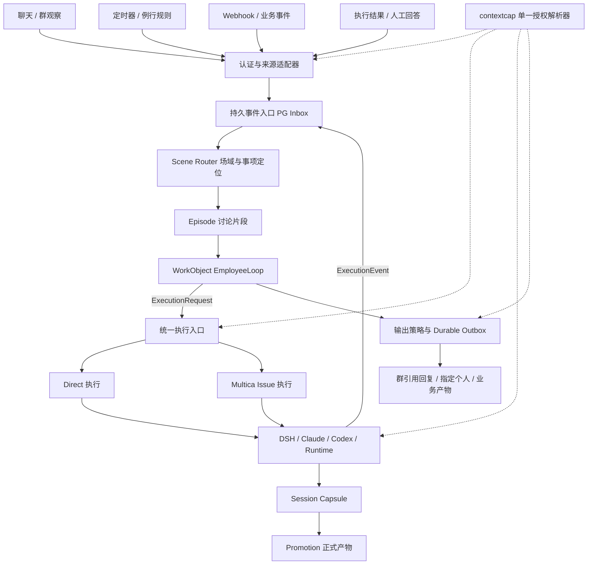
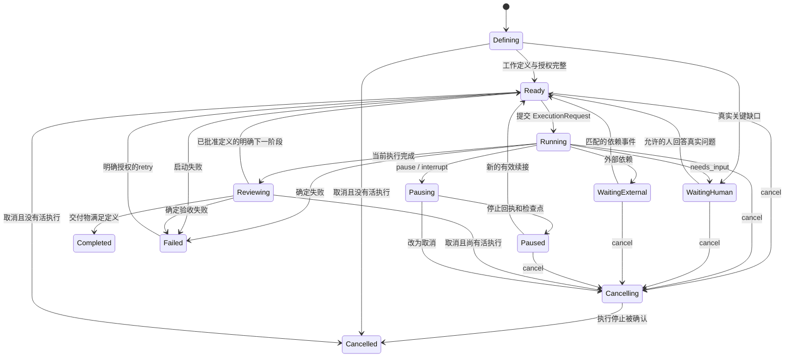

# EmployeeLoop：事件、事项与执行的统一协调方案

日期：2026-09-30。状态：设计提案，未实施。配套：[简版](employee-loop-overview.md)。

## 1. 结论与代码基线

建议将现有 Coordinator 演进为 **Scene 路由 + WorkObject EmployeeLoop + 可替换执行器**。保留现有有限动作、Host 校验、终结审查、可靠入站和送达证据；扩展其持久化工作对象和唤醒来源。具体干活继续交给 DSH、Claude Code、Codex 等 Harness。

EmployeeLoop 是员工在一件事上跨事件、跨等待、跨执行的协调循环。它等待外部执行、人的回答、定时器或 webhook，醒来后推进事项；不重新实现一套通用 LLM↔Tool 执行循环，也不在现有 Coordinator 后再串一个重复制定业务方案的模型。

本次事实基线：

| 对象 | 固定版本 | 用途 |
| --- | --- | --- |
| 最新 `origin/develop` | `2a520dea5ce616c05861aec0e72192c7c09fb596` | 当前实现 |
| `origin/feat/context-capabilities` | `5aa21b5c31a74ae99529509719eff7b65ea1f512` | 已建设但未合入的场域能力底座 |
| 两分支共同祖先 | `3cc998050d4dc8ef58ade627ffb574e8d48ab454` | 区分功能差异和 develop 后续演进 |
| 本方案分支 | `codex/employee-loop-design-20260930` | 只保存方案 |
| 讨论来源 | [比较消息处理架构](chatgpt-conversation://6abcd6d8-c3f4-83e8-82ad-8d8a0881a925) | 读取全部 11 轮；作为需求和设计讨论，不作为代码证明 |

`develop` 和能力分支分别有 36 / 8 个独有提交。只读 `git merge-tree --write-tree` 检查发现 7 个冲突文件：连接器文档、四份 agents 翻译、`handler/daemon.go`、`handler/internal_connector.go`。此次没有合并能力分支；实施应先把能力分支 rebase 到最新 develop，处理 claim 和连接器鉴权冲突，再做本方案。文本自动合并不等于权限行为正确。

下文区分 **已存在**、**建议新增**、**待测目标**。不将旧讨论中的阈值、开源生产状态或未运行验收升级为事实。

## 2. 当前可以复用什么

| 当前事实 | 代码依据（develop，除注明者） | 设计含义 |
| --- | --- | --- |
| Coordinator 已有 inbound、task_finished、finish_check 等循环类型 | `server/internal/service/inboundcoord/coordinator.go:72`；`docs/inbound-coordinator-loop.md` | EmployeeLoop 复用决策内核，扩展事件/目标协议 |
| 当前有限动作以 start_work / continue_work 提交业务工作，结果回报只处理当前 result_ref | `docs/inbound-coordinator-loop.md:121`；`policy/registry.json` 的 F04/F07/F12/F13/F17 | 不回退旧通用 reply 协议，不把分析塞进协调回复 |
| 自动化有 `create_issue`、`run_only` 两种执行模式 | `server/internal/service/autopilot.go:474`、`:510` | 不建 Issue 的执行能力已存在 |
| run_only 创建 agent_task_queue 并唤醒原 TaskService | `server/internal/service/autopilot.go:917`、`:952` | 复用任务队列、调度、claim、启动与完成链 |
| 但 run_only 的归属、任务构建和运行状态仍依赖 AutopilotRun/Autopilot | `server/internal/service/autopilot.go:893`；见第 8 节 | 不能只换一次 INSERT 就宣称支持 WorkObject direct |
| 定时自动化已有 PG lease、planned_at 幂等与过期恢复 | `server/internal/scheduler/jobs_autopilot.go:40`、`:55`、`:89` | 复用现有 scheduler，增事件 materializer |
| webhook 已有认证、签名、过滤、delivery 去重、持久受理和异步恢复 | `server/internal/handler/autopilot_webhook.go:345`、`:547`、`:562` | 复用 ingress；签名只证来源，不能证明业务授权 |
| 群观察消息已进入普通可靠 Coordinator 入口；proactive 标记由 Host 产生 | `server/internal/handler/agent_event_trigger.go:108` | 不另建一条群消息直派执行路径 |
| 旧 EventTriggerService 有 PG inbox / frozen batch / 事务派发模式 | `server/internal/service/event_trigger.go:125`、`:219`、`:381` | 可复用可靠性模式；不能当现行群处理入口重开 |
| events.Bus 是进程内同步 pub/sub | `server/internal/events/bus.go:28`、`:58` | 可用于本地通知，不能作为企业服务的可靠事件层 |
| 员工私有盘和工作区共享盘已分离；私有盘挂载 `/mnt/multica` | `docs/workspace-storage-boundaries.md:3` | 沙箱结束不等于所有文件消失，但现有盘仍不等于 Capsule |

本方案用这些存量能力补齐四个缺口：统一事件边界、独立事项事实、运行控制协议、过程输出与执行现场生命周期。

## 3. 分层与对象关系



三个循环分别回答：

1. **Scene Router**：在什么场域，这条信息对应哪个讨论/事项？先做Host确定性定位和有界候选投影，只串行化场域的路由状态变更。
2. **EmployeeLoop**：这件事接下来应协调什么？在事项内串行推进状态、输入、等待和回报。
3. **Execution Loop**：怎么完成业务工作？由已有 Harness 执行，可异步并行。

Employee Identity 是租户内的稳定数字员工；一个员工可服务多个 Scene。一个群只有一个对外员工身份，内部可以有多个 WorkObject。Actor 亲近度用于候选排序，不作为员工或事项 Session 的唯一键。

没有确定工作绑定的输入，在scene窗口调用一次当前Coordinator决策内核，生成已审查计划；有可信绑定的输入，在work mailbox调用同一内核。计划提交/拆项后mailbox只执行或恢复已保存效果，不再对同份输入跑第二轮语义路由与业务决策。图中的两个层次表示调度范围，不表示两次串联模型调用。

第一期 Episode 只存锚点、相关事件、参与者和小摘要，可没有 WorkObject；产生明确持续工作时才绑定 WorkObject。不为每条群消息创建永久认知 Session，不为所有 ambient 消息调用 LLM 分段。

**最小实现粒度：**Scene 的有界协调窗口 + 每个 WorkObject 的 durable mailbox。Episode 可先作为轻量归属记录，不另增加常驻执行器。不同事项并行；同一事项默认只有一个主执行 lane。允许显式拆子事项，但不能为了同群多人 @ 自动多开会操作同一业务对象的 Worker。

## 4. 身份、场域和权限模型

### 4.1 ID 必须分开

| 身份/范围 | 含义 | 不能被替代成 |
| --- | --- | --- |
| `workspace_id` | Multica 数据隔离域 | 任意 webhook body 声明的 workspace |
| `tenant/org binding` | 外部企业及安装/账号的验证映射 | 群 CID 或单独 UID |
| `employee_id / agent_id` | 稳定员工及执行配置 | 当前发言人 |
| `employee_external_identity` | 员工绑定的企业账号 UID/org | 连接器的个人凭据主体 |
| `scene_ref` | 可信安装下的平台群、单聊或资源场域 | 当前执行器 Session ID |
| `trigger_actor` | 这一条事件是谁触发；系统事件可为空 | 配置创建者或责任人 |
| `requester / accountable` | 谁提出工作、谁对规则/事项负责 | 使用个人连接器的自动授权 |
| `capability_principal` | 此执行能使用哪份已授能力 | 最新说话人，或 LLM 推断的人 |
| `output_recipient` | 此次输出应找谁、在哪说 | 当前 sender 或配置 owner 的默认替代 |

企业与工作区不假设一一对应。保留外部 org + uid/staffId 的命名空间和 Host 绑定；数值字符串也不跨 org 混用。`externalIdentity.dws.uid` 是执行身份描述，`event.data.sender` 是触发者事实，两者按可信契约处理（`docs/agent-dispatch-v2-execution-contract.md:220`）。

Scene Actor key 建议为 `(workspace, employee, verified scene_ref)`；组织/安装边界包含在 scene_ref 中。Work lane key 为 `(workspace, employee, work_object_id)`。执行复用再加 principal、安全上下文版本、runtime、session epoch。引入这些字段不另造一套连接器 ACL。

### 4.2 接续 context-capabilities

能力分支提供能力 offer、场域/个人 binding、配置 grant、凭据和任务 claim/call-time 解析；由它继续决定“能用什么”。EmployeeLoop 只提供可信的事件场域、当前授权请求和执行身份，不复制 binding 表、不让模型根据 memory/catalog 判权限。

`context_config_grant` 仅授权修改场域/个人配置；到期并不自动撤销已保存的binding或credential。它不能当作工具数据授权、个人例行任务的delegation或群披露授权。后文的AuthorityRef标明原请求/规则授权证据；连接器可用性仍查原binding与credential。确需个人无人任务时，新增可撤销的invocation delegation应与原resolver集成，而非再建平行Connector ACL。

必须明确当前边界：群场域能力与单一触发者个人能力已建设；DM 配置、`share_in_groups` 等字段不能仅因 UI/DB 存在就当成有效控制；cron/webhook/plain chat 没有匹配 dispatch 时目前仅全局能力，不能宣称已支持所有事件的场域授权。详细代码证据见第 15 节。

新增 `CapabilityRequest` 是对原 resolver 的输入扩展：origin scene、operation、validated principal、授权证据、配置 revision、purpose boundary；resolver 返回引用和有效快照。凭据不放进 InputEvent、模型 prompt、公共日志或 WorkObject JSON。

**建议新增/保留的复查边界：**受理 → 启动/claim → 敏感工具调用 → 恢复 Session → 产物与输出披露。当前connector每次调用已有复查，但skill bundle prepare只重验仍offered，不重新核scene/person binding；旧模型上下文不会自动清除。权限快照/fingerprint只帮助定位和复用，不能代替在线授权复查。撤权后旧日志、工具结果和Session内存也可能携带数据，不能只禁后续MCP调用就宣称已经隔离。

当前credential选择为person→scene→workspace，可在个人凭据不可用或场域层读取失败时回落。对于“查我的日历”或长期无人规则，必须保存实际选定的credential/account身份和显式fallback policy；默认固定主体，失效则阻塞/重新授权，不能悄悄换企业共享账号继续做另一份数据。群使用opt-in须同时控制person binding和person credential覆盖global connector的路径。

### 4.3 群里多人补充

张三请求查自己的日历，李四补一句“也考虑周三”，可以归入同一讨论。是否能把它转成对张三日历的新查询，必须检查张三原授予的范围及允许参与者；李四不因进入同一 Episode 就继承凭据，也不成为张三的授权代理。

遇到新主体、新资源或超出原 purpose：新建执行范围，或形成明确授权等待。不同 principal 的私有工具正文、native Session、工作目录及 Capsule 不相互注入。共享 Coordinator 只接收可在该场域披露的摘要；私有结果保留在对应执行域，通过独立的授权输出送给本人。

文件夹路径分离不构成安全隔离。若两个执行挂同一可读写员工盘，命令行工具仍可读另一个目录；需验证挂载、运行身份/ACL或使用独立受限工作区。做不到时，该 runtime 不承接个人私有连接器并行任务。`/mnt/workspace/shared` 更不能作为个人 session-log 的默认存放处。

### 4.4 定时与 webhook 的授权

定时器是 `actor=system`；webhook 是验证后的 service/provider identity。配置 owner 只负责归属审计，不能自动变成个人凭据的授权主体。现有自动化已将 schedule/webhook 的 originator 留空，责任人从 trigger/rule owner 解析（`autopilot.go:893`）。

建议规则保存明确 `run_as`：employee/service grant，或本人事先授予的 delegated grant。个人例行任务需具备服务端可验证、可撤销、限定操作/场域/期限的 delegation；首次可用当前全局/员工能力，不以人工 UID 填空绕过 resolver。每次 firing 都检查规则启用、授权、有效 scope，历史受理不延续已撤销授权。

delegation必须绑定本人、委托执行的employee/service、操作与资源、场域、期限和撤销版本。`run_as`引用验证后的记录而非裸UID。**基础MVP明确仅开放已有employee/service/global能力的cron/webhook；个人无人执行属于后续能力扩展，不是借当前配置grant就已具备。**

Webhook payload 中的 `scene_id / work_id / uid / recipient` 只作为数据提示。Host 从受信 subscription 配置限定可指向的 scene、work 和输出目标，再做资源访问校验。有效签名不允许回调修改任意事项。

## 5. 统一事件层

### 5.1 三种事件，三种证据

| 类别 | 示例 | 是否唤醒 | 持久用途 |
| --- | --- | --- | --- |
| InputEvent | message.addressed、message.observed、timer.due、webhook.received、human.answer | 按规则唤醒/仅观察 | 可靠输入、来源、去重、原授权水位 |
| WorkEvent | work.defined、work.amended、work.waiting、work.cancelled | 投影/依赖者按规则 | 状态迁移证据；WorkObject 行仍是当前状态权威 |
| ExecutionEvent | started、progress、needs_input、checkpointed、completed、failed、control_ack | 状态事件唤醒；遥测不逐条推理 | 过程事实、输出锚点、执行回执 |

token/text delta、thinking、工具原始输出留在执行流/日志，不进入高优先级业务 mailbox，也不默认发群。可靠执行终态和等待事件应先入库；现有 events.Bus / Tair 只做唤醒与实时展示提示。

以下为建议协议示意，不是已实现 Go 类型：

```go
type InputEvent struct {
    SchemaVersion int
    ID, SourceID, SourceEventID string
    WorkspaceID, EmployeeID string
    SceneRef, SubjectRef string
    TriggerKind string
    ActorRef *ActorRef
    AuthorityRef string
    OccurredAt, ReceivedAt time.Time
    CausationID, CorrelationID string
    OriginMessageRef, ReplyToRef string
    PayloadRef string
    SourceRevision int64
}

type WorkObject struct {
    ID, WorkspaceID, EmployeeID string
    OriginSceneRef, EpisodeID string
    DefinitionRevision int64
    Goal, Deliverable string
    RequesterRef, AccountableRef string
    DefinitionRef, AuthorityRef string
    State string
    CurrentExecutionID string
    LastAppliedEventSeq int64
    Revision int64
}
```

Actor/Authority/Scene 是 Host 在验证阶段构建的描述或引用。`payload_ref` 可以保存有界原文快照与平台证据引用；权限敏感正文放受限 blob。最小机器日志需要当前授权原句、引用、作者、水位、摘要/hash，不能只存一个将来可能读不到的钉钉消息 ID。

钉钉仍是人类对话历史的主来源；不额外镜像所有群历史作为机器唯一事实。现有可靠入站副本用于短期恢复、去重与协调审计；平台回读失败时明确 `unavailable`，不将缓存替代品伪装成完整历史。

### 5.2 来源与幂等

| 来源 | 去重锚点 | 场域/权限来源 | 路由策略 |
| --- | --- | --- | --- |
| IM addressed / observed | verified source/install + native event ID + employee | 安装绑定、原事件作者/CID | 现有资格判断和有界窗口 |
| 周期规则 | trigger + canonical UTC planned_at | 已版本化规则、run_as grant | 可已定义直达；无需虚构聊天发言 |
| 一次性等待 timer | wait_id + generation + due_at | 所属事项已有等待边界 | 只唤醒对应等待；旧 generation 失效 |
| webhook | subscription + provider delivery ID | 签名/credential + subscription 允许范围 | 已注册模板直达，或有界协调 |
| 人工审批/回答 | request_id + submission_id | 待答问题、允许回答者、有效期 | 先校验真实等待，再解除 |
| 执行回调 | execution_id + attempt + event_id/seq | 已绑定 runtime 身份 | 核验 generation/revision，不接受越界结果 |

缺稳定 provider ID 的事件不能仅以正文相同无条件去重；采用调用方幂等键，或为该 subscription 定义明确的有限去重策略。重试仍指同一受理事件；人工“重做”是新事件、新 execution attempt。

可靠受理事务写入 input row、mailbox 路由/待路由记录和受理结果后才 ACK。业务效果通过同一事务内 effect intent/outbox提交，不在事务持锁期间调用模型、provider 或 DWS。稳定唯一键包含 workspace/employee/source，保证不会跨租户命中。

一次输入可产生多个明确工作，保存 `event_work_link(relation, source_refs, authority_ref)`，不能把 Event 与 WorkObject 建成一对一。一个事项可接多个事件；源 webhook、cron occurrence 和最终输出之间保留 causation。

### 5.3 PG actor 与多副本

使用短事务、`FOR UPDATE SKIP LOCKED`、租约、revision CAS 和 fencing generation。PG 持有当前业务事实、mailbox、控制命令及副作用 intent；Tair 负责跨副本唤醒、速率限制和短期协调，OSS 存受限大对象。无须给每个员工/群/事项保持永久 goroutine。

逻辑串行不等于一整轮推理独占数据库锁。读取版本后在锁外决策；提交时比较 revision、最新控制边界与授权快照，变化则重新编译。旧 lease owner 的提交、迟到执行完成、旧 output intent 必须被 fence 拒绝。

执行 lease 过期也不证明旧外部 Worker 已停止。重开主 lane 前确认停止，或撤销其工具/写入能力并隔离 workspace；结果 fencing 只能防止状态污染，不能撤回外部业务副作用。对同一资源有并发变更风险的 WorkObject，还需资源版本/幂等策略，单事项单写者并不足以保护跨事项资源。

## 6. 钉钉离散讨论、历史与事项关联

顺序采用“结构证据优先，语义判定补齐”：显式 WorkObject/Issue 引用 → 被引用消息/已发问题的绑定 → 同场域已确认工作链接 → 有界召回候选 → 现有 Coordinator 的 deliverable / advancement 审查。

**引用只解决定位，不能自动授权执行。**“做完了吗”即使精准引用也只是 report_status；“再发一次原报告”是明确 redelivery；“查最新 VOC”即使主题相同也可能是新交付物。唯一候选、同一个人、时间接近、排名第一都只用于检索。歧义保留未绑定或必要澄清，不自动 steering 任意忙任务。对应现行 F05/F07/F08/F13。

不强制用户使用 Thread。员工对外的引用回复、交付物名和短事项摘要逐步产生结构锚点；后续顶层散句由场域路由找候选。用户说“停一下”但同群有两项且缺指向，保留安全暂停意图并询问具体事项，不猜一个 task，更不停止全群。

合窗保留每句 source_ref、稳定 actor、平台 message ID、引用及原时间。工作定义从本次原文生成，不继承员工曾自行扩写的步骤。容量沿用现行“场景×委托人”的公平性，加 workspace/employee/runtime 总预算；先判定聊天/状态/控制，再判断执行容量。控制消息不能等在 4 秒静默/12 秒普通收集窗口后面；仅在明确目标和控制权限已由 Host 验证时走控制快路。

上下文编译建议顺序：

1. 当前触发与精确来源/限制；不能被摘要剪掉。
2. WorkObject definition、真实等待、当前 attempt、最新 control seq。
3. 有水位的 quote/reply chain 和 Episode 相关消息。
4. 场域稳定记忆及已允许共享的 delta；不包含他人私有工具结果。
5. 按需读取历史、相关业务产物引用、Capsule resume manifest。

ambient 消息是场域观察材料，默认不成为 user turn，也不成为新授权。主动参与继续用现有 Host 配置及 qualification / participation checks。只订阅平台真实可获取的历史；不假设钉钉能够读取加入前全量消息。`last_seen_seq` 是编译水位而非用户授权范围；跨权限变化不因“上次看过”就继续可见。

Scene Memory 延用已提交 revision、CAS、容量和来源规则；Episode 摘要、工作状态及稳定记忆分开。已完成/取消的事项不能因 ambient 摘要中的旧承诺复活。

## 7. EmployeeLoop 的状态机与决策边界



工作状态、执行状态、送达状态分别记录。`Completed` 证明业务完成；群输出可为 pending/unknown/failed，界面和回报不能合称“已完成并已告知”。`Paused` 不是未知网络状态，需执行器确认；无法确认则继续 Pausing 并展示真实阻塞。

图中Ready只允许不存在可继续的活execution。WaitingHuman/WaitingExternal可能保留一个仍活着且安全等待的handle；匹配answer/dependency时优先通过Control恢复该handle并转Running，不再Start。只有旧execution已terminal或quiescent且需下一次执行时才转Ready、新建attempt。无execution的Defining澄清同理，回答后才能首次Start。checkpoint/停止的失败保留Pausing/Cancelling与错误事实；审核暂不可用停留Reviewing并退避，确定失败才Failed；授权撤销先进入控制停止并阻断敏感effects，不默默改principal继续。

任意非终态取消分两类：没有活execution即Cancelled，有活execution即Cancelling等待确认。图中只画典型边，Host迁移表须覆盖Defining、Ready、Running、Waiting、Reviewing、Pausing、Paused。Completed/Cancelled不被timer复活；Failed仅明确重试或既定有界重试策略回Ready。已完成产物的redelivery是独立输出动作，不重开业务执行。

每次 wake 最多推进一个有界协调计划：build facts → 现有有限决策/校验 → commit state/effect intents → return。Waiting 状态不占模型请求或常驻 CPU；deadline、输入、回调唤醒。确定的 lease 恢复、控制 ACK、到期处理可纯 Host 状态迁移，无需每件事再请模型判断。

Reviewing仅是执行结果/交付证据与已定义阶段的协调门槛，不是另设业务质量执行器。现行task_finished仍只有report_result/ignore。自动推进下一阶段必须来自已批准、不可变WorkDefinition或已审持久计划；不能从结果正文自己发明“再补做一步”。新增业务工作必须重新进入同一finish/finish_check工作审查；需要内容级评估时作为用户已授权定义中的独立执行任务。

事件优先级：撤权与 cancel/安全限制 > 已授权人类 steer/回答 > 可靠 execution 终态/待输入 > 普通补充 > 例行 timer > ambient。每类内部保持 seq；priority 不重排因果依赖，限制每轮 drain 数量并对低优先级 aging，防止 timers 永久饥饿。control 与 completion 竞争时执行第 9 节的 fence 规则。

复用 `finish(actions)` 和 `finish_check`，把合法目标从仅 recalledIssueIDs 扩展成 Host 验证的 WorkRef。start_work 产生 WorkObject；continue_work 仍需 same_deliverable 与本轮推进。executor mode 由 Host/已版本化工作定义选择，模型不任意指定 run_as、credential、输出账号或绕过审查。新增 pause/cancel/answer 动作时同步 schema、工具 hint、Host、policy module/registry/cases 和现行合同，不通过“在 prompt 尾部加一个指令”实现。

已有用户决策模式、人类选择记录和审查保留。同一明确批准不重复请求，批准绑定具体定义 revision；工作定义改变或授权过期时，不把旧批准移植到新范围。已注册确定模板的自动触发可跳过语义识别，仍经过相同 Host 权限与副作用校验。

## 8. WorkObject 与 Issue / 自动化复用

### 8.1 Issue 是业务投影与执行方式

WorkObject 是事件层承载的工作事实；Issue 是 Multica 的人类管理实体及现有执行入口。建议关系：一个 WorkObject 可零或一个主要 Issue，多次 Execution attempt；必要时显式子事项。直接工作不要求先建 Issue，但人工跟踪、负责人协作、代码交付或现有 Issue 工作流可选择 Issue adapter。

这里的 adapter 是用户明确要求的多执行方式边界，不是维护两套重复内部流程。TaskService 的 claim、Runtime 选择、启动、归属、取消与完成继续共享。

**直接执行不等于不持久化。**WorkObject、ExecutionRequest、任务行和输出意图必须先持久化。Issue 与 WorkObject 若都有状态，WorkObject 以自己的目标/等待为权威；Issue 的 assigned/status/comments 通过明确映射同步，不让两个状态机相互反复触发。已有历史 Issue 可以通过唯一外部 ref 绑定 WorkObject，恢复不重复创建。

### 8.2 为什么不能直接调 Autopilot.run_only

当前 `dispatchRunOnlyTask` 已验证 agent、run、归属并写 task，但 claim、prompt、workspace lookup、completion 和 GC 会继续读取 run→autopilot。若为每个聊天 WorkObject 临时造一个 Autopilot，反而多出规则配置、run、权限和生命周期，难以变快。

建议抽出内部共用执行入口，以下为契约示意：

```go
type ExecutionRequest struct {
    ID, WorkspaceID, EmployeeID, WorkObjectID string
    WorkRevision int64
    Mode string
    OriginEventID, AuthorityRef, CapabilityRequestRef string
    InstructionSnapshotRef, DefinitionRef string
    OutputPolicyRef, ResumeCapsuleID string
    RuntimeSelectorRef string
    IdempotencyKey string
}

type ExecutionDriver interface {
    Start(context.Context, ExecutionRequest) (ExecutionHandle, error)
    Control(context.Context, ExecutionControl) (ControlReceipt, error)
    Inspect(context.Context, ExecutionHandle) (ExecutionSnapshot, error)
}
```

`Mode` 是平台执行入口（direct / issue）；DSH、Claude、Codex 是执行 backend/harness；FC/本机是计算宿主。这三维不要混成同一个 enum。Capabilities 由 backend 与宿主共同报告，运行事实由 Inspect/回执证明。

抽取顺序：定义不可变 ExecutionRequest 与 task binding → 统一 workspace/attribution/capability/指令装配 → 衔接现有 claim/complete → Autopilot、Issue 和 WorkObject direct 共同调用。迁移后 claim 不再依赖可变化的 Autopilot 当前 description 才能理解这次工作；规则更新只影响后续 firing。

任务行增加明确的execution request/work scope关联，并扩展claim串行组。当前SQL主要按Issue/Chat串行，无这些关联的任务会落到同Agent的quick-create组（`pkg/db/queries/agent.sql:829`）。只把work_id塞进JSON会导致独立事项互挡，或同事项不能保证单主lane。建议`serialization_scope=(workspace,employee,work_id,primary_lane)`，使用数据库claim谓词和适当并发索引，保留runtime实际容量上限；不是在进程内加一个map就完成。

不能省掉 `NotifyTaskEnqueued`、empty-claim cache 清理、运行时 launch lease 和退役 Session 检查。现有 run_only 正因绕过 Enqueue 才显式唤醒（`autopilot.go:952`）。

### 8.3 明确工作快速触发

已有经过配置校验的 WorkDefinition 保存：版本、输入 schema、目标/交付物、允许来源、principal grant、scene/output policy、runtime selector、超时与 overlap policy。调度或 webhook 匹配受信定义、输入有效、授权有效且无需人工决定时：

`Event → validate definition → WorkObject/ExecutionRequest → enqueue → claim`。

一般聊天仍经过当前 Coordinator 识别/审查；已经确认且定义不变的续接由已保存计划恢复，不重复做整轮业务解释。无需每次 firing 再建一个人工 Issue。模板的“方法步骤”来自已批准定义，不由协调器自行替用户发明。

例行规则定义 `skip/coalesce/queue`，第一版默认同规则同目标不重叠、过期 firing latest-only；支持历史每次都执行时必须显式配置。一次性人类等待 deadline 不能套用周期任务 latest-only 而被吞掉。现有 cron 时区默认 UTC，用户配置用 Asia/Shanghai 时显式保存，planned_at 统一 UTC，测试 DST 和停机补偿。

### 8.4 速度评估

现在可以证明路径上有 Issue 创建/评论续接、窗口、模型审查、claim/运行时启动等成本；**没有现场测量，不能说 Issue 就是主要瓶颈，也不能承诺 direct 快多少。**当前 scheduler 默认 30 秒 tick（`scheduler/manager.go:23`），Coordinator普通窗口有 4 秒静默/12 秒上限（F09）；这些不能被归因成 Issue 数据库写耗时。

实施前按同工作定义采样：ingress_commit、route_done、review_done、execution_enqueued、runtime_ready、claimed、first_progress、first_human_output、completed。对比 warm direct / warm issue / cold direct；分开 p50/p95、模型调用数和 token。先删冗余编排，再优化冷启动。下面指标是验收目标，不是当前成绩：

- 已注册工作：受理至 enqueue 的服务端 p95 ≤ 300ms，排除 provider 网络、冷启动；公开样本数及负载。
- 控制受理 p95 ≤ 300ms；健康且支持控制的 runtime p95 ≤ 2s 回 received/applied ACK。
- 确定进度事件持久化后至输出 intent p95 ≤ 1s；实际钉钉发送单独计时，不合并宣称。
- 自由语言协调保留审查，不承诺与上述模板直达相同延迟。

## 9. 沙箱 Session 的补充、中断和恢复

当前 TaskService 的 steer/cancel 和 runtime session resume 是可复用基础，但必须区分“结束当前任务再开下一次”与“将新输入插入正在运行的 turn”。原生DSH协议已接受queue/steer并能传给loopback Host（`pkg/protocol/dsh_native.go:125`），但native浏览器/反向输入入口已撤回（`internal/dshhost/README.md:129`）；因此应复用原语补齐受信控制传输，不宣称公共平台已具备运行中插话。原生DSH路径和传统CLI backend分别核验，见第15节。

建议 durable control command：`command_id, execution_id, attempt, expected_work_revision, expected_generation, actor_ref, authority_ref, input_seq, kind, body_ref, expires_at`。所有 input 先保存，明确 ACK 阶段：persisted → received → applied；supported/rejected/superseded/expired/unknown 分开。HTTP 202 只证明 persisted，不能回复“已经改好了”。

| 命令 | 语义 | backend 不支持时 |
| --- | --- | --- |
| append | 当前合法范围的补充，下一安全边界消费 | 可靠排队，告知尚未应用 |
| steer | 更新当前执行要求，需消费后方可声称遵循 | 停止当前 turn，保存边界，再 resume/new attempt |
| interrupt | 停止当前 turn，保留可恢复工作 | 使用既有取消路径，但等待停止确认 |
| pause | interrupt + checkpoint，进入可恢复等待 | 停止失败保持 Pausing；不伪造检查点 |
| cancel | 撤销该执行后续动作，不自动续跑 | fencing +取消 +对已产生效果记账 |
| answer | 对真实 question_id 的已验证答复 | 转成已绑定的续接输入 |

每个 backend 报告 `append/steer/interrupt/checkpoint/native_resume/needs_input` 等能力及版本；宿主也需支持传输与隔离。 unsupported 是显式结果。第一期可以交付诚实的 cancel+resume steering，但界面不能显示“正在运行的任务已实时吸收”。原生 turn 注入只在真实 canary 证明后打开。

数据库cancelled仅证明平台受理停止。当前steer事务取消旧task后立即唤醒下一task（`service/task.go:2824`、`:2859`），旧daemon可能随后才收到取消。复用DSH已有workspace lock/witness与`NativeHostTaskQuiescent`原语，在重用同一工作区或Capsule前等quiescent receipt；未确认停止则不开新writer。新控制回执因此还应有`quiescent`阶段，不把applied ACK等同于进程/子进程已停止。

**控制竞争：**WorkObject 的 control seq/revision 和 execution attempt/generation 是提交门槛。cancel 已在数据库受理时，旧 Worker 的 completed 不能把工作改回成功；新 execution 已启动时旧结果只留审计。steer 与 completion 竞争时，Host判断该输入是否已被消费：未消费的合法变更需要下一步，旧结果不能覆盖它。最终群输出也校验同一结果版本/限制，不因迟到回调重复刷屏。

“先别上线”需迅速撤销后续部署权限；单靠对 CLI 发 SIGTERM 不能保证已发 HTTP 的外部动作未发生。对可经平台网关的写动作使用 operation/idempotency token 和在线 fence；CLI 可直接走外网的动作不能宣称零竞态，需以步骤执行、确认边界和外部回读证明真实效果。不支持可控写动作的 backend 不能承担需要强即时停写保障的工作。

恢复三级：同一健康且安全上下文一致的 Session → 从 Capsule 恢复受限文件/摘要并重新授权 → Capsule过期后只用工作状态与正式产物新开 execution。native session ID 是优化项，不是工作连续性的权威。权限、principal、runtime/workspace不匹配时重建，不盲目 resume。

长任务还必须处理计算和token期限：当前FC默认沙箱约80分钟、daemon token约1小时；本机AgentTimeout=0不能据此推断FC可无限运行。需要按固定镜像/协议能力验证续租、凭据轮换、网络断开后恢复，以及期限前checkpoint。续租失败形成blocked/可恢复停止，而不是等provider销毁才保存现场。这是代码路径风险，尚未做跨60/80分钟现场测试。

## 10. 长任务与人的交互、知道要找谁

WorkObject 保存 requester、accountable、允许参与者和每个输出目标；真实 `HumanQuestion` 保存 question_id、work_revision、询问目的、允许回答者、answer schema、deadline、origin message、所用 grant。发出问题是协调效果，收到答复后精确关联真实问题，不把“好/行”泛化成任意权限批准。

原请求群里的关键里程碑引用原消息并 @正确请求者；替某人问第三方时，第三方是 question recipient，结果仍回原 requester。webhook来源与人类结果目的地可以不同，但须在受信规则里明确绑定；无 output target 的事件不猜一个群发送。

| 输出 | 是否值得打断人 | 谁/哪里 | 证据 |
| --- | --- | --- | --- |
| 受理 | 一次，真实保存/提交后 | 本次请求来源 | event/work/queue commit |
| 关键阶段进度 | 新阶段、重要阻塞或实质变化 | 工作 output policy 指定对象 | 确定 progress/checkpoint |
| 请求输入/授权 | 明确问题且需要此人 | question recipient | 等待记录与可用选项 |
| 执行失败 | 应说明真实阻塞与已做步骤 | requester/规则责任人按授权 | failed attempt/error code |
| 最终结果 | 当前结果尚未覆盖本目标 | result audience | result_ref +产物 +送达证据 |
| token/tool 噪声 | 默认不发 | 机器日志 | 不冒充业务进度 |

复用existing response outbox、引用回复、DWS receipt与去重。增加唯一键`(work, execution attempt, result/stage version, audience, output kind)`；每条output保存可信`recipient principal / CID / anchor message / anchor author`元组，区分原requester与本轮trigger actor。sync wrapup实际传递work/task/输出身份，不能只把task ID拼入requestID。sender/昵称不作为recipient identity。

“已覆盖本目标”要求权威receipt匹配输出kind、当前result/stage版本和准确audience/recipient；执行器直接DWS发送的receipt也记录相同身份。已发question/progress不能覆盖final result；引用回复已有正确作者mention时无需重复@。

**新增发送门槛：**发送前在线验证AuthorityRef/有效grant、work revision、execution generation、output policy revision与目标元组；当前worker只发送冻结快照，需补这个guard（`dingtalkresponse/worker.go:135`）。撤权/取消可原子撤销未提交的pending intent；已进入unknown/provider_accepted的输出只reconciliation，不宣称还能撤回。门槛校验与外部网络写仍存在边界竞态，应以发送attempt/fence记录受理顺序；平台不保证撤销已经向DWS提交的消息。

当前`SandboxResponseState`按task/issue/CID汇总任意delivered，中间问询或进度可能使最终结果被当AlreadyToldScene而静默（`dingtalkresponse/sandbox.go:159`→`handler/task_finished_loop.go:115`）；需改成明确输出类型和覆盖版本。合窗后每项输出保存它自己的trigger actor/message，不沿最初窗口route一概兜底；现有sync wrapup未保留root/terminal task ID的链路须专项验证。这些是代码结构发现/推断，不是已重现的线上事故。

执行器输出只提报语义事件/结果；EmployeeLoop通过现有终结审查和策略生成可发文本。关键进度模板可在Host验证事实后直接形成intent，避免每个progress再走长协调推理。原始 connector数据必须先确定披露 audience；具有工具权限不等于可以在群公开。对确实需要执行器直接发业务通知的岗位工作，沿当前已授权 DWS路径留下receipt，避免与EmployeeLoop二次发送。

发送不确定要进入 reconciliation，回读平台 receipt/message，不能自动重发造成重复。个人明文不经群outbox；需要本人单聊且路径不可用时保存待交付，不能退化群发。通知频控以真实stage/change计，同一问题超时提醒按授权规则有限次处理；成功完成不由“assistant说完成”证明。

## 11. Session Capsule 与产物

按讨论约束：**session-log、工作区增量、临时产物和恢复元数据用一个生命周期单元；正式交付产物经明确 Promotion 独立保存。**这不是现有员工私有盘的简单改名。

建议结构：

```text
capsule/{workspace}/{employee}/{capsule_id}/
  manifest.json
  session-log.jsonl
  summary.md
  context-manifest.json
  workspace/base.json + delta + allowed-untracked
  temporary-artifacts/
  tool-receipts.jsonl
```

manifest 包含 source execution/attempt、native session ref、principal/sensitivity labels、权限安全上下文、base image/repo SHA、checksums、checkpoint seq、retention deadline。Capsule 的 log不要求模型提供隐藏思考内容；保存可获得的会话、工具、结果、运行事件与摘要即可。

重要文件、HITL前、外部等待、阶段完成、回收前和正常终结时checkpoint；保留最近完整checkpoint。代码工作保存base commit+commits/diff+允许untracked；分析工作保存输入引用+脚本+必要输出。目录明确allowlist，过滤credential/config/token/cookie/env/cache。工具正文也可能有密钥，需递归脱敏；业务敏感数据仍按principal受限保存，不能当普通公共日志。

当前run_only终态会立即清整个taskDir（`internal/daemon/gc.go:544`），Codex sessions与其他memory又各有不同TTL；必须将清理改为Capsule提交确认后进入统一retention。`task_message`流式flush失败没有本批可靠重投（`daemon/daemon.go:7240`），不能当完整session-log；可复用DSH加密immutable trajectory存储，但通用CLI日志/工作区需补传输确认和manifest。删除Chat/Issue投影也不等于按Capsule删执行现场。

PG与OSS之间无法用一个数据库事务物理原子保存/删除，采用 **逻辑原子可见性**：staging上传 → 校验manifest/hash → PG事务发布完整revision；失败staging不可恢复并由GC回收。删除事务先置deleting、撤销恢复/下载并阻止并发promotion，再异步删整prefix/本地native session副本；核验无残留后置deleted。每组件不设互相独立TTL。

GC需覆盖native Session、私有盘临时目录、对象版本/缓存及备份保留边界；对象存储/备份受既定保留策略时，明确物理清除延迟，不能把索引删除当成字节立即清零。最小审计元数据可保留hash/来源/删除receipt，不保留被删除session正文。

Promotion 记录 artifact ID、source capsule/execution、hash、业务类型、独立存储ref、ACL、发布者及交付receipt。复制并校验成功后才提交promotion；不能只给临时文件换名字。正式产物不依赖将来会删的Capsule链接。引用已有PR/钉钉文档时保留外部ACL和稳定ref；删除本地Capsule不等于自动删除外部正式产物。

Capsule只能恢复到兼容安全域；撤权或principal变化不能重新注入旧私有对话。共享学习/记忆只从经过审批或授权的脱敏总结另行提升；不默认把session-log当员工公共记忆。

## 12. 方案比较与决策

| 路径 | 收益 | 主要代价 | 判断 |
| --- | --- | --- | --- |
| 所有工作继续通过 Issue，增强现有Coordinator | 改动较少，沿用管理UI | 无法完整满足无Issue直达；控制/事件边界仍要补 | 可作第一阶段承接，不能作为最终方案 |
| 在当前Go服务抽取WorkObject/ExecutionRequest并复用已有底座 | 保留权限、任务与渠道能力；满足多来源和多执行方式 | 需要改claim/complete/关联目标协议，认真处理数据迁移 | **推荐** |
| 引入完整GawkBot运行底座或另起员工服务 | 自带不少task/channel/worker编排模式 | 重复权限与数据权威；Go internal导入、存储、多租户/多副本及许可证差异 | 借鉴设计并独立实现；代码复用先核许可和接口，不整体接入 |

决策驱动：权限来源唯一；工作连续性独立于沙箱；控制和送达诚实可证；复用当前Go执行链；减少自由语言以外的冗余模型调度。

代价：新WorkObject成为协调权威后，需要明确Issue映射和历史回填；事件actor不能只在内存；native session和私有盘按更细安全范围隔离可能影响热启动收益。接受这些代价，不用以共享个人session换速度。

## 13. 分阶段实施与文件责任

以下是实施顺序和验收边界，不是本次已完成清单。每阶段独立review；允许先上线只使用已有能力的事件源，不提前开放未验证权限模式。

**按纵向切片交付，下面A–F是模块责任，不要求横向全部完成才运行第一条链路：**

1. **V1 持续协调切片：**一个试点员工、一个已验证backend、IM及执行结果两类事件、已有授权、WorkObject+原Issue adapter。证明两件工作独立、原Session答复恢复、结果版本/正确actor回报、重复事件及重启恢复。仅抽实际需要的Start/Inspect；Episode用锚点记录，Capsule先保留现有现场但明确未完成统一生命周期。
2. **V2 明确工作直达切片：**在V1底座增加已注册timer/webhook定义→direct ExecutionRequest，补run_only相关claim、workspace、指令快照、串行组和completion。证明真实无Issue执行并测量warm/cold收益。这一步是本需求的核心直达MVP，不以整个自由聊天改造作前提。
3. **V3 可交互与恢复闭环：**增加durable Control、quiescent证明、关键问题/进度、Capsule统一留存删除；后续按能力逐个开放更多backend、自由聊天direct、个人delegation和原生turn注入。每项分别验收，不能因一个backend通过就宣称全Runtime支持。

V1/V2内只抽被使用的执行契约；未迁移来源保留它当前正常域服务入口，不能对同一次输入双写两个工作权威或跑两套决策。迁移某来源时切到唯一新入口并移除相应旧内部流程，不引入永久兼容shim。所有source最终收口是终态架构，不是V1先一次性重构全平台的前置条件。

| 阶段 | 主要修改范围 | 交付及通过条件 |
| --- | --- | --- |
| A：基线整合与测量 | 能力分支rebase；`handler/daemon.go`、connector鉴权、运行时观测 | 能力分支行为保留；已有Coordinator合同不倒退；记录warm/cold基线 |
| B：统一事件入口 | 建议新增`internal/employeeevent`；dispatch/webhook/scheduler适配；PG inbox/mailbox/outbox | 重复IM/cron/webhook只受理一次；崩溃后恢复；scope/actor不可由payload伪造 |
| C：独立工作与执行入口 | 建议新增`internal/workobject`、`service/execution_request.go`；抽取autopilot/task/claim/complete | direct无Issue但有正确workspace/attribution/指令/capability；旧Issue/自动化仍通过同入口 |
| D：持续协调与Episode | 现有`inboundcoord`、`assoc`、`userdecision`、`scenememory` | 混合多人窗口逐句认人；同工作推进才续接；状态询问不重跑；待输入可恢复 |
| E：运行控制与过程输出 | `pkg/protocol`、daemon/runner、backend adapters、responseworker | 命令三阶段ACK；cancel/steer竞争不丢；真实backend支持矩阵；关键进度找到指定对象 |
| F：Capsule与Promotion | 建议新增`internal/executioncapsule`；DSH session/workdir、存储、GC | 完整checkpoint才可恢复；撤权不可复用；逻辑删除同生共死；正式产物独立有效 |

V1仅称持续协调试点；V2完成才称含明确工作直达的EmployeeLoop MVP。E控制与交互通过后才称“可交互长任务”；F是恢复现场闭环，不能用“私有盘还在”代替验收。A–F覆盖完整需求，后续切片也属于交付范围。

新表建议最小化：employee_input_event、employee_mailbox、work_object、event_work_link、execution_request、execution_control、execution_capsule及manifest revision；Episode/等待/输出先复用合适的存量结构或作为work内有界结构。不要另造所有已有outbox。最终表名和拆分以查询/并发测试决定，所有状态都含workspace/employee范围。

迁移使用fork `9000+`命名空间，无foreign key/cascade；每个索引单独`CREATE [UNIQUE] INDEX CONCURRENTLY`迁移；显式事务完成关系校验和清理。包含deployment fence安装、软删除/归档和租户删除manifest。多副本滚动期间旧节点只接受它能处理的schema/控制版本，新事件按声明能力路由；不把新kind交给旧节点猜。必要兼容仅放已安装daemon/runner公开协议边界，内部不长期双写两份事项权威。

## 14. 可测试验收与运行证据

### 14.1 核心用例

| 用例 | 必须观察到 | 禁止效果 |
| --- | --- | --- |
| 同群三人同时@做不同事 | 三个WorkObject，身份各自正确，受公平容量控制 | 群级串行长任务；一个人的额度占掉别人 |
| 第三人补同一报告范围 | 原事项输入有seq和authority；只一主lane | 无依据继承个人connector；多worker改同工作区 |
| 唯一旧事项但新样本请求 | 新事项；或确有缺口才澄清 | 自动continue唯一候选 |
| 精准引用但问“做完了吗” | 真状态回报，无新增execution | 引用自动触发重跑 |
| 未@聊天 | 观察/资格判断，有界上下文 | 每句变执行授权；自己消息自激 |
| cron两副本同planned_at | 同一occurrence产生一个工作执行 | 重复启动/过期连续补跑 |
| 签名webhook伪造他人scene/UID | 资源校验拒绝；事件/错误可追溯 | 使用body身份扩大权限 |
| 工作定义更新时旧事件重试 | 恢复旧不可变definition，重新查当下grant | 静默执行新范围 |
| 人工选项/批准后重启 | 原wait和submission恢复，只提交一次 | 丢选择；把旧批准转给新定义 |
| cancel与completed交错 | 取消门槛阻止旧终态推进；真实副作用可回读 | Cancelled变Completed；虚报完全撤回 |
| backend无turn注入 | 明确unsupported或cancel+resume及应用回执 | HTTP202宣称已吸收 |
| 私有查询输出群 | 私有结果只到授权audience或等待交付 | 共享coord/memory含个人工具明文 |
| DWS发送成功但响应丢 | send_unknown reconciliation、回读去重 | 无脑重发两份结果 |
| capsule上传半失败 | 不发布不完整manifest；旧完整revision可恢复 | 半log半workspace被当可恢复 |
| 删除和恢复/promotion并发 | deleting之后不能新恢复；完整清理回执 | 残留可下载session-log |
| Capsule过期但正式产物仍在 | 新execution使用工作+正式产物 | 承诺能恢复原现场；正式链接失效 |

单测采用真实边界输入/状态转换，避免复制实现；fake backend只证Host合同。PG并发测试使用独立connection/transaction，包含lease steal、callback重投、outbox失败与旧节点拒绝新kind。

实施验证命令以仓库Makefile/SPEC为准：受影响Go包先定向`go test`、`go test -race`；Coordinator协议修改运行`python3 scripts/check-coordinator-policy.py`；SQL修改`make sqlc`及migration/fence测试；TS API修改schema+malformed response验证。不把结构检查当模型语义或钉钉送达证明。

如果涉及daemon/FC运行协议，按仓库 `fc-runtime-dev-loop` 做不可变镜像溯源、本机与FC的old/new滚动兼容矩阵和真实任务canary；真实agent测试遵守`agentintegration`门禁。模型冻结回放覆盖F01/F03/F04/F05/F07/F08/F09/F10/F12/F13/F17；预发真人同CID回读证明@对象、quote和receipt，再报告“真实送达通过”。

### 14.2 预先验尸

1. **权限串场**：同群或同盘session误复用，李四可读张三日历。缓解：principal+安全上下文分域、调用与披露复查、撤权重建、负向文件可见性canary。
2. **失控或重复执行**：两副本lease竞争、cancel迟到、Webhook重投产生重复发信。缓解：PG唯一键、generation fence、共享ExecutionRequest入口、外部操作幂等及receipt reconciliation。
3. **看似保存实则丢现场**：沙箱回收前只保存结果文本，恢复缺文件；删log留下临时附件。缓解：manifest完整性发布、重要边界checkpoint、Capsule统一GC、promotion独立存储和故障注入。

### 14.3 当前证据边界

本次完成代码/分支/讨论分析和方案文档。没有修改业务代码、部署、发钉钉消息或跑真实任务；上表的目标和canary都是未来验收。性能数字为建议SLO，尚未测量。具体代码证据与开源复用评估见下节。

## 15. 代码依据补充与外部复用评估

这一节归集本次固定版本的代码评估；文中的设计类型/模块路径是建议新增。当前行为以 `docs/inbound-coordinator-loop.md` 与registry为准，旧dispatch文档的历史段落不得恢复已撤回的“唯一事项就续接”等行为。

本节`handler/`、`service/`、`daemon/`、`contextcap/`为`server/internal/`下路径，`pkg/`为`server/pkg/`；带`internal/`的路径从`server/`开始。

### 15.1 Coordinator与送达

| 可复用点 / 缺口 | 精确依据 | 改造方式 |
| --- | --- | --- |
| reliable admission + read-only Chat + acceptance落同事务 | `handler/inbound_coordinator_job.go:667`、`:731` | 复用可靠受理；Chat是界面投影，不是WorkObject权威 |
| claim lease / 同CID候选排他 | `pkg/db/queries/inbound_coordinator_job.sql:24` | 扩展work mailbox；跨副本/故障注入再证正确性 |
| 4s/12s窗口与逐句callbacks | `handler/inbound_coordinator_collect.go:16`、`:72` | 分离控制快路，普通窗口仍保水位/封存 |
| source_refs整窗覆盖与委托人 | `service/inboundcoord/window_plan.go:261`、`:381`；`handler/assoc.go:594` | 原生ActorRef传递，取消显示名桥接 |
| 容量在source actor精确回填前仍有name overlay | `handler/agent_dispatch_v2_handler.go:1235`对比`:1297` | 容量预判也按source_ref可信身份 |
| 快圈仅channel/message.created | `handler/agent_dispatch_v2_handler.go:1617`；`handler/inbound_coordinator_job.go:1026` | cron/webhook/DSH schedule通过新adapter，不只改enum |
| 现有finish唯一审查通路 | `service/inboundcoord/loop.go:184`；`service/inboundcoord/finish_check.go:57` | WorkRef/合法目标集替换Issue耦合，同次审查完成 |
| 场域记忆不含Session，不存任务状态/权限 | `service/scenememory/model.go:64`；`service/scenememory/flush.go:434` | 独立work状态、Episode摘要与稳定memory |
| TaskService progress仅事件总线 | `service/task.go:5665` | 新ExecutionEvent到IM output materializer |
| 当前执行器已有DWS发送shim与receipt | `daemon/execenv/dws_shim.go:176`；`daemon/execenv/dws_shim_policy.go:250` | 保留直接业务发送证据，避免Host重复发 |
| 任意已发送内容被汇总为已告诉该群 | `service/dingtalkresponse/sandbox.go:159`；`handler/task_finished_loop.go:115` | 按question/progress/result版本+audience分别覆盖 |
| 合窗Host最终兜底route可能仍引用第一人 | `service/task_completion.go:591`；`pkg/db/queries/task_completion.sql:227`；`integrations/agentmessagerouter/completion_worker.go:324` | 每output绑定实际work/execution/trigger；多同名/多作者canary |
| 可靠发信底座及发送unknown/Query确认 | `service/dingtalkresponse/service.go:26`；`service/dingtalkresponse/worker.go:139`、`:181` | 扩展事实字段，复用outbox而非重写渠道 |

### 15.2 能力场域（能力分支固定版本）

所有本节行号指向`origin/feat/context-capabilities@5aa21b5c3`，不是当前develop已有文件。

| 能力 | 依据 | 状态与接入要求 |
| --- | --- | --- |
| org / group cid / single trigger staffId | `contextcap/scope.go:101`、`:228`、`:276` | 多人/身份不明清person层；不能给一个混合窗口强填首人 |
| TaskBindings offer+scope过滤 | `contextcap/store.go:226` | 复用workspace/agent/org/scene/person与enabled offer |
| 配置grant与已知scene管理 | `handler/context_capabilities.go:342`；`handler/agent_scenes.go:98`；`contextcap/store.go:603` | 配置授权，非数据或invocation授权；manager不能代用个人 |
| 同org换员工UID未纳入drift判定 | `handler/context_capabilities_task.go:51`、`:92` | 输入加employee binding epoch，恢复时校验 |
| skill claim / bundle prepare | `handler/daemon.go:2046`、`:3550`；`service/task.go:5758` | skill prepare只重验offered，不可泛称撤权即时清上下文 |
| connector每次调用重验task及授权tool | `handler/internal_connector_mcp.go:266`、`:347`、`:364` | 复用现有resolver和audit |
| person credential可覆盖global connector | `handler/context_capabilities_task.go:241`、`:251` | share_in_groups控制同时覆盖binding和credential路径 |
| credential密封scope及OAuth刷新 | `contextcap/seal.go:38`、`:140`；`handler/internal_connector_oauth_refresh.go:140` | 保留密封和并发刷新，不复制token |
| credential默认可回落 | `handler/context_capabilities_task.go:209`、`:278` | 长任务选定账号固定；显式fallback，失败不偷偷换principal |
| MCP transport缓存按connector+token hash | `handler/internal_connector_catalog.go:329`；`pkg/remotemcp/session.go:63` | 传输session优化，不代表模型/工作区隔离 |
| DM、scene prompt、share_in_groups未runtime生效 | `docs/context-capabilities.md:136`、`:145`；`contextcap/scenes.go:326` | 作为后续接入工作，不依UI存在宣称实现 |
| cron/webhook/plain chat/机器人限制 | `docs/context-capabilities.md:188`、`:190`、`:574` | 无可信dispatch当前global-only；以真正事件invocation扩resolver |

### 15.3 执行抽取与生命周期

| 抽取点 / 风险 | 代码依据 | 方案要求 |
| --- | --- | --- |
| run_only claim取run→Autopilot配置 | `handler/daemon.go:2813` | workspace/指令由不可变ExecutionRequest供给 |
| run_only prompt依赖autopilot描述 | `internal/daemon/prompt.go:744` | 不为每work造临时规则；运行配置快照 |
| completion和workspace lookup依赖run/ap | `service/autopilot.go:1018`；`service/task.go:6642` | 共用completion/归属解析器，显式work binding |
| claim串行组主要按Issue/Chat | `pkg/db/queries/agent.sql:829`、`:870` | work primary lane及runtime预算进入SQL |
| queue wakeup/cache/launch现成 | `service/task.go:5908`、`:6339` | 所有materializer同入口通知 |
| 无Issue progress/workspace推送不完整 | `handler/daemon.go:4029`、`:4895` | 共用workspace解析，不因消息DB有记录就声称群/工作台已展示 |
| run_only workdir终态立即清理 | `daemon/gc.go:544` | Capsule先完整commit，再按统一deadline清 |
| stream message batch失败不可靠重投 | `daemon/daemon.go:7240` | session-log单独可靠上传，不用UI流替代 |
| DSH加密trajectory与事务index已有 | `handler/dsh_trajectory.go:220`；`handler/dsh_trajectory_store.go:22` | 存储模式可复用，扩完整capsule manifest |
| native DSH queue/steer原语 | `pkg/protocol/dsh_native.go:125`；`pkg/agent/dsh_native.go:212` | typed调用复用；公开持续输入和应用ACK需新增/验证 |
| 原生浏览器/反向输入已移除 | `internal/dshhost/README.md:129` | 不沿废弃入口重开权限绕行 |
| 多scope共员工私有盘 | `internal/dshhost/README.md:1`；`docs/workspace-storage-boundaries.md` | 工作目录分离不证私有权限隔离 |
| native DSH workdir与普通scratch不同 | `service/fc_e2b.go:1766`、`:1777`；`daemon/daemon.go:6108`；`daemon/config.go:570` | 明确要checkpoint的真实路径；挂NAS不证所有CLI HOME/log持久 |
| FC期限与token风险 | `service/fc_e2b.go:79`、`:82`、`:1797`；`daemon/run_once.go:42`；`pkg/db/queries/daemon_token.sql:8` | 补续租/rotation/checkpoint；实际长期canary待做 |

backend能力不能以一个统一“支持Session”布尔字段表示；实施必须分开native DSH与传统CLI，具体矩阵在真实控制canary后回填。

**仓库当前实现矩阵（尚未做现网控制canary）：**

| Backend类别 | 后续turn/恢复 | 当前运行中人类输入 | 可复用的停止基础 |
| --- | --- | --- | --- |
| Claude / CodeBuddy stream-json | resume session | Claude保持stdin，但只接初始帧/工具授权响应；无用户追加控制接口 | context取消及进程组清理 |
| Codex app-server | thread/resume + turn/start | 未调用turn/steer或turn/interrupt | context取消杀进程组 |
| ACP adapters | session/resume或session/load + prompt | Session接口没有再次输入的控制handle | context取消与子进程清理 |
| OpenCode / Cursor / Pi / Qwen等CLI | provider session/文件resume | 初始prompt/EOF，无平台live通路 | context取消；按provider检查清理完整性 |
| Managed native DSH | scope/epoch、native session/request绑定 | typed queue/steer原语已有；公共持续输入闭环尚缺 | Host task.cancel/release、quiescent收据 |

通用`agent.Backend`和`Session`证据：`pkg/agent/agent.go:17`、`:142`。Claude：`pkg/agent/claude.go:150`、`:491`；Codex：`pkg/agent/codex.go:1407`、`:995`。DSH：`pkg/agent/dsh_native.go:212`、`:399`；任务steer：`service/task.go:2785`；daemon默认5秒状态探测：`daemon/daemon.go:4759`。Runner的calls_cancelled取消的是工具call context（`cmd/multica/cmd_runner.go:794`），不能当模型turn中断实现。

适配优先级：先对试点已有backend证明cancel+quiescent+resume；对native DSH复用typed control；Codex/Claude原生steer若要接入，先核目标安装版本的协议，再实现driver及真实安全边界。未来支持不从CLI名称、README或SessionID推断。

### 15.4 GawkBot：复用设计，避免误判Go代码可直接导入

讨论里GrokBot/Grwkbot对应的目标仓库是`najmuzzaman-mohammad/gawkbot`，本次固定SHA为`71e82a1809565281cbd0bf8185d3c125b715d934`。Grok作为模型provider是另一概念。以下是源码核验，不代表对方现网运行测试。

**可以直接依赖的目标EmployeeLoop Go库：本次未发现。**模块名仍为`github.com/nex-crm/wuphf`，目标实现位于`internal/`，核心teamTask未导出，依赖包括Wails/BubbleTea、SQLite、Bleve、Slack和完整产品服务。Go的internal可见性规则不允许本仓从外部直接import这些包；`replace`也不会产生公共API。共享语言便于理解与重新实现，不会消除存储/权限/协议边界。[固定go.mod](https://github.com/najmuzzaman-mohammad/gawkbot/blob/71e82a1809565281cbd0bf8185d3c125b715d934/go.mod#L1)、[Go官方internal规则](https://go.dev/doc/go1.4#internalpackages)。

许可也需计入技术决策：该版本为Sustainable Use License，正文限制使用/修改为内部业务、个人或非商业用途，对外提供/分发限于免费且非商业用途，并要求保留通知。它不能按MIT/Apache依赖的假设直接移植到对外商业服务。推荐独立实现下表的行为/契约；若选择复制具体代码，先确认部署用途与许可，必要时取得额外授权。[固定LICENSE](https://github.com/najmuzzaman-mohammad/gawkbot/blob/71e82a1809565281cbd0bf8185d3c125b715d934/LICENSE#L24)。

| 部件 | 已核实行为 | 本仓复用判断 |
| --- | --- | --- |
| Go BotLoop | 有context/reason/tool phase、输入优先级；生产Claude/Codex绕过它 | 借鉴协调语义，不把Go LLM↔Tool loop搬成EmployeeLoop；当前执行Harness继续保留 |
| Task/Owner/Channel/Thread | 结构归属优先，歧义才内容评分 | 在现有assoc与WorkRef上实现结构锚点；F07审查不被其自动关联规则替代 |
| WorkPacket / ContextUsed | 线程根、工作、owner、回帖目标、使用过的上下文可明确交接 | 用本仓有界context compiler和Capsule manifest重新实现契约 |
| HeadlessEvent / manifest | provider-neutral task/turn/parent、工具与结果摘要 | 拓展现有protocol/trace，保留ExecutionEvent与input journal区别 |
| Headless queue | task/worktree资源定义lane；human输入可cancel同lane再处理下一轮 | 借鉴单资源串行/不同工作并行，新增PG durable control与quiescent证明 |
| Session/ledger | bot JSONL及有界task ledger，不是本仓多副本可靠inbox | 不迁入本地文件为服务权威；PG当前状态+OSS受限日志 |
| 回频道/owner通知 | packet保存原channel/reply_to；有最终输出补发、任务卡及owner DM | 借鉴显式输出地址；DWS真实receipt与披露权限继续用本仓底座 |
| Cron/automation入口 | office cron和automation HTTP可汇入同通知；operator routine另有TS/Bun sidecar | 复用本仓scheduler/webhook，不复制它的cron/parser和整套运行时 |

对应固定源码：[生产headless与BotLoop关系](https://github.com/najmuzzaman-mohammad/gawkbot/blob/71e82a1809565281cbd0bf8185d3c125b715d934/internal/team/event_sink.go#L16)、[结构归属](https://github.com/najmuzzaman-mohammad/gawkbot/blob/71e82a1809565281cbd0bf8185d3c125b715d934/internal/team/routing.go#L23)、[WorkPacket](https://github.com/najmuzzaman-mohammad/gawkbot/blob/71e82a1809565281cbd0bf8185d3c125b715d934/internal/team/notification_context.go#L456)、[HeadlessEvent](https://github.com/najmuzzaman-mohammad/gawkbot/blob/71e82a1809565281cbd0bf8185d3c125b715d934/internal/team/headless_event.go#L14)、[资源lane](https://github.com/najmuzzaman-mohammad/gawkbot/blob/71e82a1809565281cbd0bf8185d3c125b715d934/internal/team/headless_codex_queue.go#L37)、[Ledger](https://github.com/najmuzzaman-mohammad/gawkbot/blob/71e82a1809565281cbd0bf8185d3c125b715d934/internal/team/task_ledger.go#L24)、[输出地址](https://github.com/najmuzzaman-mohammad/gawkbot/blob/71e82a1809565281cbd0bf8185d3c125b715d934/internal/team/notifier_delivery.go#L272)、[cron入口](https://github.com/najmuzzaman-mohammad/gawkbot/blob/71e82a1809565281cbd0bf8185d3c125b715d934/internal/team/scheduler.go#L600)。

三个不能照搬的点：

1. MessageRouter的follow-up基于英文前缀和30秒最近bot，缺少scene/work维度；不能把它当中文多群事项resolver，更不能恢复本仓已经撤回的时间阈值/关键词授权。[message_router.go](https://github.com/najmuzzaman-mohammad/gawkbot/blob/71e82a1809565281cbd0bf8185d3c125b715d934/internal/orchestration/message_router.go#L99)。
2. Claude headless每轮`--print`并用StringReader喂stdin；Codex使用`exec --ephemeral --json`。human输入在同lane取消旧turn后重启，不能称为原Session运行时热注入。Go StreamFn不带context参数，也不能只因BotLoop取消本地ctx就声称provider请求已停止。[Claude runner](https://github.com/najmuzzaman-mohammad/gawkbot/blob/71e82a1809565281cbd0bf8185d3c125b715d934/internal/team/headless_claude.go#L42)、[Codex runner](https://github.com/najmuzzaman-mohammad/gawkbot/blob/71e82a1809565281cbd0bf8185d3c125b715d934/internal/team/headless_codex_runner.go#L78)、[human抢占](https://github.com/najmuzzaman-mohammad/gawkbot/blob/71e82a1809565281cbd0bf8185d3c125b715d934/internal/team/headless_codex_queue.go#L271)、[StreamFn](https://github.com/najmuzzaman-mohammad/gawkbot/blob/71e82a1809565281cbd0bf8185d3c125b715d934/internal/bot/types.go#L104)。
3. human/system在其workspace/channel访问中有特定放行策略；它不是钉钉企业/触发者/个人connector的权限设计。完整通用webhook framework、Employee Episode实体及Capsule同生共死契约本次也未确认。[访问策略](https://github.com/najmuzzaman-mohammad/gawkbot/blob/71e82a1809565281cbd0bf8185d3c125b715d934/internal/team/broker_channel_access.go#L45)。

### 15.5 DWH及现有服务底座比较

DWH读取可访问fork`D1-2004/dingtalk-workforce-harness@e75312695f432430b857ca8f950b332544d90604`；本轮没有核验到hugozhu上游内容，不假设与fork同步。

| 项目 | 值得吸收 | 不应移入本仓的整体 |
| --- | --- | --- |
| GawkBot Go产品 | WorkPacket、owner/结构锚点、资源lane、执行manifest | 完整Broker/存储/权限/CLI launcher、BotLoop、TS sidecar |
| DWH Node/CJS + DSH插件 | 规范事件journal、consumer cursor/ACK、decision→effects、业务执行与投递分离 | 另一套员工state、conversation排队、Node插件运行平面 |
| 当前Multica Go服务 | PG受理/claim/lease、scheduler、webhook、TaskService、contextcap、DWS outbox、native DSH session/trajectory | 继续扩这些域服务；抽工作边界而非建立第二服务权威 |

DWH事件接纳和cursor/ACK更接近本需求的服务事件层；EmployeeLoop coordinator做decision→sideEffects/nextState/events，DSH负责基础AgentLoop。普通聊天通过conversation的tail串行，调用followup不证明运行中steer。Session Bridge已实现Codex exec resume；根README“Codex仅发现”与源码不一致，因此本方案不沿用旧对话里的该断言。DWH为Apache-2.0，但实现仍非Go库。[事件bus](https://github.com/D1-2004/dingtalk-workforce-harness/blob/e75312695f432430b857ca8f950b332544d90604/lib/event-bus.cjs#L4)、[effect coordinator](https://github.com/D1-2004/dingtalk-workforce-harness/blob/e75312695f432430b857ca8f950b332544d90604/plugins/employee-loop/coordinator.cjs#L1)、[conversation排队](https://github.com/D1-2004/dingtalk-workforce-harness/blob/e75312695f432430b857ca8f950b332544d90604/plugins/dingtalk-event-bridge/index.cjs#L1194)、[Codex resume](https://github.com/D1-2004/dingtalk-workforce-harness/blob/e75312695f432430b857ca8f950b332544d90604/plugins/session-bridge/structured-cli.cjs#L8)、[投递与业务状态](https://github.com/D1-2004/dingtalk-workforce-harness/blob/e75312695f432430b857ca8f950b332544d90604/plugins/employee-loop/service.cjs#L115)、[LICENSE](https://github.com/D1-2004/dingtalk-workforce-harness/blob/e75312695f432430b857ca8f950b332544d90604/LICENSE)。

Go实现复用的最终选择：**本仓存量服务和执行协议直接复用；新的WorkObject、事件输入、控制与Capsule合同按本仓边界实现；外部项目主要作为行为、状态机和交接契约的参考。**不引入新消息中间件或通用actor框架作为第一期前提，现有PG/Tair/OSS足以验证纵向切片。

## 16. 本次文档验证与后续评审

已完成独立Coordinator/权限/执行/外部源码分析，并对正文做第二次架构审查。已采纳：scene与work只解释一次输入；活等待Session优先Control；异常/取消迁移及quiescent门槛；配置grant与个人delegation分离；task_finished不自行规划新业务步骤；发送门槛和输出覆盖版本；以纵向切片先证明直达价值。

运行`python3 scripts/check-coordinator-policy.py`返回`PASS_STRUCTURAL_ONLY`（policy `2026-09-26.1`，19条义务）；此结果只验证现有策略结构，不能证明拟议EmployeeLoop已实现。文档引用按固定branch逐项校验路径/行号范围；相互链接、code fence和`git diff --check`单独检查。没有运行业务单测、真实模型回放、CLI/FC canary或钉钉投递，因为本次交付仅为方案。

仍需在实施切片中决定并记录：试点backend和可实际部署的控制版本、个人delegation的数据授权产品范围、租户Capsule保留期限、业务artifact长期ACL及实际延迟基线。基础设计给出了保守默认值和验证路径，这些选择不妨碍先完成V1/V2。
