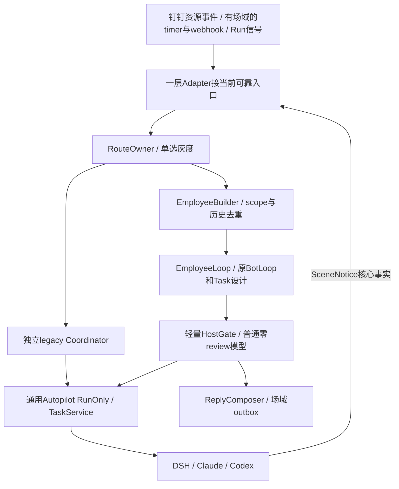

# EmployeeLoop 方案导读：直接复用 Go BotLoop，成为能持续办事的员工

创建：2026-09-30，修订：2026-10-01，R5。状态：设计提案，未实施。配套：[HTML阅读版](employee-loop-design.html)、[详细方案](employee-loop-design.md)、[13任务实施拆解](../2026-10-01/employee-loop-delivery-plan.md)。本轮交付方案、迁移清单和DWS Schema快照，业务代码尚未复制进仓库。

这次选择很明确：**直接复制 GawkBot 的 Go BotLoop 核心，新建独立 EmployeeLoop 新通道，旧 Coordinator 留作统一入口后的独立灰度通道。**权限、记忆、执行和发送能力继续使用我们现有的服务。新的员工循环以已实现的 phase、队列和控制结构为起点，主要补企业环境下的统一事件、持久等待、身份边界和对人的交互。

## 1. 复用到代码，改动集中在差异上

上一版把“不能从外部 import internal 包”过度推导成只能借鉴。实际可以把核心复制到本仓、改包名和 import，再做有来源清单的补丁。重新读取的 bot 包有13份源文件、10份测试，主要依赖标准库、uuid和一个运行目录配置函数；不需要整套GUI、Slack或搜索产品。

建议复制到 `server/internal/service/employeeloop/`，把 BotLoop/BotService 命名为 EmployeeLoop/EmployeeService。保留来源SHA、LICENSE、修改说明和原测试；不是在旧 Coordinator 外再包一个新名字。

| 直接复制的主体 | 差异化建设 |
| --- | --- |
| `loop.go` 的 Tick、phase、Start/Stop、Pause/Resume、Interrupt | 外部等待、轻量HostGate后提交、真正可取消的provider/tool调用 |
| `queues.go` 的 steer / human / follow-up 优先级 | 每个事项与授权范围独立key，队列由PG可靠保存 |
| `service.go` 的 worker、即时唤醒、空闲停止、状态快照 | 多副本lease/fence、按需恢复，不靠进程内map保存业务事实 |
| `tools.go` 的 registry与验证结构 | 注册我们有限的协调工具，业务MCP/shell留给执行器 |
| `session.go` 与压缩、运行日志辅助代码 | 原FileStore作隔离测试，生产接PG/OSS和Capsule统一生命周期 |

以新BotLoop直接试一条完整链路，按实际差异适配。核心接缝包括：StreamFn加ctx、阻塞tool/回调移到锁外、完整ToolCallID/batch、原生tool结果、EOF不能等于完成、durable wake及退出竞态。这些是实质改动，但可以保留原有主体；不需要重新写一整套Loop。

## 2. EmployeeLoop里怎样办事

保留原来的 `Idle → BuildContext → StreamLLM → ExecuteTool` 推进，在里面加员工需要的等待与唤醒。Loop自己决定这一件事接下来要协调什么；真正查业务、改文件、用连接器和完成专业分析，由已有执行器负责。

新通道先适配原BotLoop与我们的能力、Task、Builder和输出接口，不移植旧8轮主模型/独立finish_check/12秒审查流水线。HostGate快速核结构、scope、版本、授权和受众；模糊目标在主Loop澄清。旧通道独立保持原合同，灰度owner在受理时冻结，不同一事件跑两圈。

一轮Loop结束可以表示接单、问了一个问题或报告了进度，并不等于工作完成。它保存“等谁、等什么、什么时候醒”，释放worker；人回答、执行完成或约定timer到点后，再从同一个事项接着办。

### 挂在Employee上的Builder

EmployeeBuilder装配来源、场域、Task、历史和允许能力；配置挂员工，游标与材料按Task/Scope/principal隔离。它按消息ID去重current/quote/forward/history，保原作者与水位；历史失败不推进cursor，后到消息不改旧授权。群@/DM编译当前原句，ambient仅观察，timer/webhook编译固定定义与参数，Run信号只带当前结果，回答/控制带真实问题和目标。Builder不再调用第二个分类LLM。

名字也统一：EmployeePhase/EmployeeLoopState、ModelChunk、EmployeeTool、EmployeeJournal；目标为EmployeeTask，一次执行为ExecutionRun，既有队列task_id仍叫ExecutorQueueTaskID。

## 3. 群是场域，一件事才有自己的连续性

同一个员工可以在群里同时办多件事。张三让查故障，李四让整理周报，这是两个EmployeeTask，各自有自己的输入、执行和等待。王五补一句“周报加上延期风险”，经过目标和权限判断，可以进入原周报，不必为第三个人另开一个会改同一份文件的Worker。

钉钉没有强Thread心智，因此Episode先做轻量讨论锚点：保留原消息、引用、参与者与小摘要，帮助把离散发言接到相关事项。不要求每条消息都有永久Session，也不要求用户改成Thread聊天。只靠同人、同主题、时间近或唯一旧事项不能自动续接。

“周报做完了吗”读真实状态；“重发刚才那版”可以只重投原产物；“查最新数据”可能是新工作。角色都由稳定身份绑定，显示名只用于表达。未@消息可作为场域观察，主动参与按配置和逐句资格判断，观察本身不成为新的执行授权。

## 4. 统一事件层要是第一等设计

顶层钉钉入口是**钉钉场域事件**：消息、日程、文档@/评论、审批等都是资源事件，MessageRouter只是当前接入适配器。未来DWS直连或其他网关也可接入，不必都经过Router或先转成message.created。

最新develop `7c9158985`已经入仓Go DWS SDK、`events.Event/Typed()`、dwseventsource与connmgr，我们直接复用，不再写一套连接/订阅进程。Consumer补完整SubscriptionSpec和typed事件端口即可接现有入口。SDK目录28项（含卡片），旧CLI快照27项，二者版本范围分开。SDK没有完整原WS frame或JSON Schema generation，不能把兼容EventLine当无损原帧。

优先复用DWS定义的event key、envelope与业务payload Schema，保留字段名、类型和安全投影；我们的租户绑定、工作关联、权限引用和去重/fence放在HostMeta控制外壳。消息、文档或日程可以有不同Scene，不强制都带聊天CID。

统一事件不是把所有来源转成一句prompt，而是让每个事件都能回答：**谁带来的、来自什么场域、为什么唤醒、可用哪份授权、对应哪件事、结果交给谁。**

内部 EmployeeEvent 保存版本、来源、企业/工作区/员工、逐句作者、场域与业务对象、原时间、因果与去重锚点、授权引用、能力上下文、输出契约及typed payload。凭据只留私有执行身份存储。当前工作状态由EmployeeTask保存，事件用来可靠接纳、唤醒和解释状态变更。

事件按三类处理：人类/业务/定时输入；事项状态变更；执行进度、问题、控制和结果。token、thinking和原始工具流留机器日志，不逐条唤醒模型或发群。每类事件有自己的payload schema，未知kind不能交给模型猜着执行。

已附[DWS Schema快照](dws-event-schema-snapshot.json)：本机v1.0.61公开的27项事件及54份raw/flatten定义。日程、文档@纳入基本包装，但该版本公开目录尚未给出对应key/schema，需按DWS正式发布的定义登记；IM receive_at不能冒充文档@，产品里的日程查询或评论mention工具也不是入站事件Schema。

原envelope的type=event、event_type=原key、data为JSON字符串；flatten是派生视图，可能回退原envelope。订阅账号与实际操作者分开，不把被通知的人当发起者。详情见事件章5.0。

### MessageRouter现在线上的事件作为存量适配

| 当前事件 | 新事件层如何处理 |
| --- | --- |
| message.created | 保留整个窗口及每句作者/引用/附件，进入EmployeeLoop判断 |
| message.observed | 保留观察性质；Host验证主动开关，关闭或员工自发只回原回执 |
| emotionReply / 混合reaction | 保留贴/移除表情的人和目标消息；目标正文不是此人的新请求 |
| message.statistics | 继续自动化采集/规则窗口，不走普通LLM |
| conversation.summary | 已退役：继续原静默回执，不重新开启小时执行 |
| calendar.started | 保留资源场域、身份、原surface和输出要求 |
| approval.status_changed | 核workspace/归属后关联；auto_approve继续不派员工 |

保留 Dispatch `schemaVersion=2.0`、旧continuation、control、outbound和callback字段。即使新通道不运行Coordinator，`responsePolicy.version=1`里的 `multica_coordinator` 字面值也暂时保持，这是旧协议的回复归属名称。

HTTP202只证明事件可靠保存；execution-update是原有非终结回调；execution-result证明一次执行的结果；DWS response-receipt单独证明钉钉投递。Router dispatch ID、平台work ID、root task ID和terminal run ID不能混成一个ID。

新work定位、通用进度/问题、pause/resume和控制applied/quiescent回执通过vNext明确协商，不能偷偷改2.0含义。详细版第5章先定义DWS场域协议复用，再逐项说明旧Router的字段映射、认证、去重、七类事件、多人窗口、控制、回执与切换验收。旧7类不是未来钉钉事件目录的上限。

## 5. 场域和权限底座继续复用

`feat/context-capabilities`已经提供offer、scene/person binding、凭据、claim和connector调用解析。EmployeeLoop给它可信的事件范围，继续让同一resolver决定能用什么，不建设第二套连接器ACL。

需要区分员工绑定账号、当前发言人、工作请求者、执行principal、配置责任人和输出接收者。张三的个人日历不会因为李四在同群补一句话就变成李四可使用或可见的数据。引用同一事项也不等于可以改变它的权限。

当前能力分支主要支持group CID加单一触发staffId；cron/webhook没有人类dispatch时仅全局能力，DM、群共享opt-in与披露还需补齐。配置grant只是“谁能修改配置”，不能代替个人数据授权。第一期无人事件使用已验证employee/service/global能力，个人委托明确设计后再开放。

### 定时器和Webhook也有SceneBinding

群里设置就绑定该群，个人/单聊设置绑定个人，企业配置绑定enterprise；不能触发时再猜最近一个群。日程、审批等非IM钉钉事件先默认企业域，保存calendar/process等资源Ref；文档@同样保资源ACL。订阅使用个人OAuth不等于场域就是个人，企业域也不表示整个企业都可读私有数据。

绑定场域决定上下文、运行账本和默认回报对象；run_as、connector grant和个人delegation分别验证。source creator只承担责任，不自动把其个人权限给系统timer。新Loop与legacy owner也按Scene/Task冻结，比例变化不让执行中目标突然换圈。

## 6. 默认通用RunOnly，Issue是协作形态

EmployeeTask是目标，ExecutionRun是一次执行；两种形态都有Task。默认复用通用Autopilot RunOnly：即时目标、定时规则与webhook都可用同一运行机制，不要求为每条即时消息创建永久自动化规则或先建Issue。补充RunSpec快照、workspace/归属、场域与权限、串行组和capsule后，继续用原TaskService claim/wakeup/daemon/FC链。

用户给出的端到端中位数是RunOnly 9.3秒、建Issue再派单24.5秒，约快2.63倍；主要收益是进沙箱后避免Issue协议。本轮未重跑该基准，不把15.2秒差值全算成审查或冷启动。它支持简单目标默认直接做。

一次结果、同场域短期多步骤或答复续接都可以RunOnly。复杂多阶段、共享分工/依赖、跨场域协作、已有Issue或明确要求时才评估给同一EmployeeTask挂Issue。多次Run本身不强制Issue；其收益在协作管理和沙箱按需渐进加载相关历史。

Issue沿workspace访问规则，不能把私有场域材料自动公开。RunOnly的Run账本/结果也必须受SceneBinding/ACL约束，不能以“不建Issue”假装已隔离。升级Issue保留Task/Run身份，只共享获准摘要和引用。

同场域且principal/权限/环境兼容时，RunOnly与Issue可共享sandbox基底、技能和工具缓存；不同Task仍分开模型history、目录和控制epoch。同一Task升级形态可以续用兼容Session/capsule，但共享计算环境不共享私人凭据。

## 7. 对人说话要像记得分工的同事

有人味首先是连续负责：知道接了什么、做到哪、缺谁的输入、还遵守哪些约定。员工可以安静等待，发生实质变化再回来；被直接追问时回答当前问题。无需每轮都“收到”，也不靠编造忙碌或保证“马上搞定”表现积极。

一条完整的目标对话可以这样发生：

- 张三：“@菲迪 周四16点前整理试点周报，先给我看，不发客户。大家可补草稿，负责人不清楚问李四。”
- 工作提交后，菲迪：“这版先交你审阅，暂不发客户。负责人缺口我在这里问李四。”
- 阶段完成后，菲迪：“12个试点进展已整理好，两个延期项还缺负责人。@李四 A、B分别由谁跟进？”
- 王五：“B只是试用，还没决定采购。”菲迪：“这条更正已记到B的修订要求里，草稿还没更新；更新时会核对原记录。”
- 张三：“先停，等新版表。周四15点还没新版就提醒我一次。”保存命令后只说在等停止确认；确认和checkpoint后才说：“这轮已停，草稿已保存。15点如果还没新版，我在这里提醒你一次。”
- 李四随后补负责人，菲迪：“已记到待用补充里。周报仍暂停，等张三给新版后一起更新。”回答旧问题不擅自解除暂停。
- 约定timer到点且仍无新材料，提醒一次；张三给新版并说继续，员工带回“先给草稿、不发客户”的原约定。
- 最终：“@张三 《试点周报草稿》已整理好，两项延期补上了负责人。新版缺一个里程碑日期，我标了待确认。还没有发客户。”

这是示例，数量和结论上线时都要来自真实结果。暂停、更新、问题和最后产物分别有证据，不能将“要求已保存”说成“已经改好”。失败同样说明已做步骤、真实缺口与影响，不臆测原因。

ReplyComposer复用现有voice/persona/reply_tone，接收已验证事实与audience，只调整表达。它不重新路由工作或给权限。简单回执/进度模板优先；复杂表达可作为同一Loop里的有限render阶段，不为每个progress多开模型请求。纯闲聊renderer仍维持窄输入，私人工作数据不能为了“更连贯”混进来。

### 执行中核心信息有快速通知通路

Agent不只在最后完成时回来。通过scene_notice/TaskSignal报告关键发现、阶段成果、阻塞、真实问题或停止/保存回执，经当前入口Adapter持久化，HostGate核当前Run、scope与受众，再由ReplyComposer进场域outbox。自包含事实的Notice不重跑主模型，也不做旧review；只有需要决定下一步才唤醒Loop。

每条Notice有Task/Run、seq或结果版本、事实引用、audience和reply anchor，旧进度不能压掉最终结果，Executor已发过的消息不二次发。对人说“这两项还缺负责人，找谁补”“这轮已停，草稿已保存”等核心变化，thinking与每个tool log留机器轨迹。

## 8. “停一下”需要从保存命令走到确认停止

BotLoop自己的Interrupt只取消当前协调provider/tool；停止外部沙箱还需要独立durable control。记录已保存、执行器已收到、已应用及quiescent回执，各阶段自然表达不同。

不支持turn内注入的backend可以先停止、确认旧writer结束、保存现场，再带新要求resume；不能显示成实时吸收。活着且正在等人回答的Session优先向原handle送answer，不再开第二个Worker。取消后迟到的completed被generation/revision阻止，已经发生的外部操作另行回读，不能说停止进程就撤回了。

## 9. Capsule让现场可恢复，正式产物单独留

session-log、工作区增量、临时文件、context manifest和恢复摘要组成同一个Capsule，在重要阶段、等待和回收前保存完整checkpoint。临时现场同留同删；日志上传失败、只剩NAS目录或只存结果文本都不算完整Capsule。

删除时先停止writer、禁止新恢复/下载，再清理对象和本地副本。正式文档、报告、代码或PR经Promotion独立保存，使用自己的ACL和稳定链接。Capsule过期后仍能从工作状态及正式产物新开执行，但不能承诺恢复原现场。principal或授权改变时，旧私有日志也不能无条件灌进新Session。

## 10. 按三个里程碑和13个任务推进

1. **新Loop能直接试、旧通道能灰度。**一层Source Adapter接当前可靠入口，冻结RouteOwner；复制改名内核，统一Task/journal、Builder和轻量HostGate，复用新DWS连接底座。旧Coordinator独立保留，不先删除或迁移全部旧审查。
2. **默认RunOnly和及时场域回报。**通用RunSpec接原Autopilot/TaskService，场域绑定、Run账本、SceneNotice、真实问题与控制确认可用；普通独立review调用数为0，不等所有Runtime都有native steer。
3. **协作与恢复闭环。**可选Issue/history、跨场域依赖、Capsule/Promotion、隔离及计算环境复用；验证新旧epoch、私密场域可见性和给定性能基线。

具体责任文件、依赖、语义fixtures、TDD红绿/并发测试和canary边界见[13任务实施拆解](../2026-10-01/employee-loop-delivery-plan.md)。所有实现步骤仍未完成；本轮交付设计产物，提交develop并按授权发送钉钉结果。

源码分别固定：旧通道2a520dea5、新Go DWS/连接管理7c9158985、能力分支5aa21b5c3、GawkBot71e82a1。Schema快照只是定义，无真实数据；未实施Loop、未部署、未监听钉钉事件。核心原测试因当时缺Go工具链不能宣称通过，未来验收逐项完成。代码复制保留许可证和修改说明，内部业务/对外部署范围分别核对。
