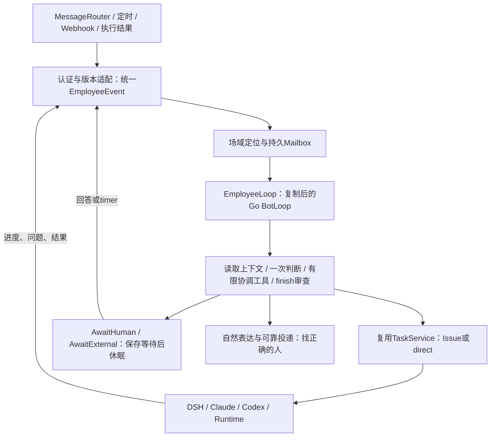

# EmployeeLoop 方案导读：直接复用 Go BotLoop，成为能持续办事的员工

创建：2026-09-30，修订：2026-10-01，R3。状态：设计提案，未实施。配套：[HTML阅读版](employee-loop-design.html)、[详细方案](employee-loop-design.md)。本轮交付方案与迁移清单，业务代码尚未复制进仓库。

这次选择很明确：**直接复制 GawkBot 的 Go BotLoop 核心，新建独立 EmployeeLoop，替换过去的 Coordinator 运行路径。**权限、记忆、执行和发送能力继续使用我们现有的服务。新的员工循环以已实现的 phase、队列和控制结构为起点，主要补企业环境下的统一事件、持久等待、身份边界和对人的交互。

## 1. 复用到代码，改动集中在差异上

上一版把“不能从外部 import internal 包”过度推导成只能借鉴。实际可以把核心复制到本仓、改包名和 import，再做有来源清单的补丁。重新读取的 bot 包有13份源文件、10份测试，主要依赖标准库、uuid和一个运行目录配置函数；不需要整套GUI、Slack或搜索产品。

建议复制到 `server/internal/service/employeeloop/`，把 BotLoop/BotService 命名为 EmployeeLoop/EmployeeService。保留来源SHA、LICENSE、修改说明和原测试；不是在旧 Coordinator 外再包一个新名字。

| 直接复制的主体 | 差异化建设 |
| --- | --- |
| `loop.go` 的 Tick、phase、Start/Stop、Pause/Resume、Interrupt | 外部等待、受审 finish 才终结、真正可取消的 provider/tool 调用 |
| `queues.go` 的 steer / human / follow-up 优先级 | 每个事项与授权范围独立key，队列由PG可靠保存 |
| `service.go` 的 worker、即时唤醒、空闲停止、状态快照 | 多副本lease/fence、按需恢复，不靠进程内map保存业务事实 |
| `tools.go` 的 registry与验证结构 | 注册我们有限的协调工具，业务MCP/shell留给执行器 |
| `session.go` 与压缩、运行日志辅助代码 | 原FileStore作隔离测试，生产接PG/OSS和Capsule统一生命周期 |

必须修的源码接缝包括：StreamFn加ctx、阻塞tool/回调移到锁外、完整ToolCallID/batch、原生tool结果、EOF不能等于完成、durable wake及退出竞态。这些是实质改动，但可以保留原有主体；不需要重新写一整套Loop。

## 2. EmployeeLoop里怎样办事

保留原来的 `Idle → BuildContext → StreamLLM → ExecuteTool` 推进，在里面加员工需要的等待与唤醒。Loop自己决定这一件事接下来要协调什么；真正查业务、改文件、用连接器和完成专业分析，由已有执行器负责。

我们把旧 Coordinator 的有用政策、上下文编译、引用校验和 finish 审查迁入新包，整理成逐Step的 EmployeePolicy；删除旧的独立模型循环和运行对象。**不能在新Loop的StreamFn或工具里再调用整轮Coordinator.Decide**，否则只是套壳。

一轮Loop结束可以表示接单、问了一个问题或报告了进度，并不等于工作完成。它保存“等谁、等什么、什么时候醒”，释放worker；人回答、执行完成或约定timer到点后，再从同一个事项接着办。

## 3. 群是场域，一件事才有自己的连续性

同一个员工可以在群里同时办多件事。张三让查故障，李四让整理周报，这是两个WorkObject，各自有自己的输入、执行和等待。王五补一句“周报加上延期风险”，经过目标和权限判断，可以进入原周报，不必为第三个人另开一个会改同一份文件的Worker。

钉钉没有强Thread心智，因此Episode先做轻量讨论锚点：保留原消息、引用、参与者与小摘要，帮助把离散发言接到相关事项。不要求每条消息都有永久Session，也不要求用户改成Thread聊天。只靠同人、同主题、时间近或唯一旧事项不能自动续接。

“周报做完了吗”读真实状态；“重发刚才那版”可以只重投原产物；“查最新数据”可能是新工作。角色都由稳定身份绑定，显示名只用于表达。未@消息可作为场域观察，主动参与按配置和逐句资格判断，观察本身不成为新的执行授权。

## 4. 统一事件层要是第一等设计

统一事件不是把所有来源转成一句prompt，而是让每个事件都能回答：**谁带来的、来自什么场域、为什么唤醒、可用哪份授权、对应哪件事、结果交给谁。**

内部 EmployeeEvent 保存版本、来源、企业/工作区/员工、逐句作者、场域与业务对象、原时间、因果与去重锚点、授权引用、能力上下文、输出契约及typed payload。凭据只留私有执行身份存储。当前工作状态由WorkObject保存，事件用来可靠接纳、唤醒和解释状态变更。

事件按三类处理：人类/业务/定时输入；事项状态变更；执行进度、问题、控制和结果。token、thinking和原始工具流留机器日志，不逐条唤醒模型或发群。每类事件有自己的payload schema，未知kind不能交给模型猜着执行。

### MessageRouter现在线上的事件都要接住

| 当前事件 | 新事件层如何处理 |
| --- | --- |
| message.created | 保留整个窗口及每句作者/引用/附件，进入EmployeeLoop判断 |
| message.observed | 保留观察性质；Host验证主动开关，关闭或员工自发只回原回执 |
| emotionReply / 混合reaction | 保留贴/移除表情的人和目标消息；目标正文不是此人的新请求 |
| message.statistics | 继续自动化采集/规则窗口，不走普通LLM |
| conversation.summary | 已退役：继续原静默回执，不重新开启小时执行 |
| calendar.started | 保留资源场域、身份、原surface和输出要求 |
| approval.status_changed | 核workspace/归属后关联；auto_approve继续不派员工 |

保留 Dispatch `schemaVersion=2.0`、旧continuation、control、outbound和callback字段。即使内部Coordinator退出，`responsePolicy.version=1`里的 `multica_coordinator` 字面值也暂时保持，这是旧协议的回复归属名称。

HTTP202只证明事件可靠保存；execution-update是原有非终结回调；execution-result证明一次执行的结果；DWS response-receipt单独证明钉钉投递。Router dispatch ID、平台work ID、root task ID和terminal run ID不能混成一个ID。

新work定位、通用进度/问题、pause/resume和控制applied/quiescent回执通过vNext明确协商，不能偷偷改2.0含义。详细版第5章逐项说明字段映射、认证、去重、七类事件、多人窗口、控制、回执与切换验收。

## 5. 场域和权限底座继续复用

`feat/context-capabilities`已经提供offer、scene/person binding、凭据、claim和connector调用解析。EmployeeLoop给它可信的事件范围，继续让同一resolver决定能用什么，不建设第二套连接器ACL。

需要区分员工绑定账号、当前发言人、工作请求者、执行principal、配置责任人和输出接收者。张三的个人日历不会因为李四在同群补一句话就变成李四可使用或可见的数据。引用同一事项也不等于可以改变它的权限。

当前能力分支主要支持group CID加单一触发staffId；cron/webhook没有人类dispatch时仅全局能力，DM、群共享opt-in与披露还需补齐。配置grant只是“谁能修改配置”，不能代替个人数据授权。第一期无人事件使用已验证employee/service/global能力，个人委托明确设计后再开放。

## 6. Issue是一种承接方式，明确工作可以直达

WorkObject保存目标、约定、参与者、当前状态和执行，不要求必须先建一个人工Issue。需要管理、协作或已有任务流程时，调用Issue能力服务；已定义的例行工作可以直接生成ExecutionRequest进入TaskService。

现有Autopilot `run_only`确实不建Issue，但claim、指令、完成和GC仍依赖Autopilot记录。要把它的共用执行部分抽出来，补上workspace、不可变指令、归属、能力与事项串行组。不能为每个聊天事项临时造一条自动化配置，也不能只改一次INSERT就说直达完成。

原Issue/Chat服务仍是可用承接能力，显式MessageRouter surface在兼容期保留。去Issue的速度收益要测warm/cold、模型、排队和启动阶段；不靠少一张数据库记录就承诺会快很多。

## 7. 对人说话要像记得分工的同事

有人味首先是连续负责：知道接了什么、做到哪、缺谁的输入、还遵守哪些约定。员工可以安静等待，发生实质变化再回来；被直接追问时回答当前问题。无需每轮都“收到”，也不靠编造忙碌或保证“马上搞定”表现积极。

一条完整的目标对话可以这样发生：

- 张三：“@菲迪 周四16点前整理试点周报，先给我看，不发客户。大家可补草稿，负责人不清楚问李四。”
- 工作提交后，菲迪：“这版先交你审阅，暂不发客户。负责人缺口我在这里问李四。”
- 阶段完成后，菲迪：“12个试点进展已整理好，两个延期项还缺负责人。@李四 A、B分别由谁跟进？”
- 王五：“B只是试用，还没决定采购。”菲迪：“这条更正已记到B的修订要求里，草稿还没更新；更新时会核对原记录。”
- 张三：“先停，等新版表。周四15点还没新版就提醒我一次。”保存命令后只说在等停止确认；确认和checkpoint后才说：“这轮已停，草稿已保存。15点如果还没新版，我在这里提醒你一次。”
- 李四随后补负责人，菲迪：“已记到待用补充里。周报仍暂停，等张三给新版后一起更新。”回答旧问题不擅自解除暂停。
- 约定timer到点且仍无新材料，提醒一次；张三给新版并说继续，员工带回“先给草稿、不发客户”的原约定。
- 最终：“@张三 《试点周报草稿》已整理好，两项延期补上了负责人。新版缺一个里程碑日期，我标了待确认。还没有发客户。”

这是示例，数量和结论上线时都要来自真实结果。暂停、更新、问题和最后产物分别有证据，不能将“要求已保存”说成“已经改好”。失败同样说明已做步骤、真实缺口与影响，不臆测原因。

ReplyComposer复用现有voice/persona/reply_tone，接收已验证事实与audience，只调整表达。它不重新路由工作或给权限。简单回执/进度模板优先；复杂表达可作为同一Loop里的有限render阶段，不为每个progress多开模型请求。纯闲聊renderer仍维持窄输入，私人工作数据不能为了“更连贯”混进来。

## 8. “停一下”需要从保存命令走到确认停止

BotLoop自己的Interrupt只取消当前协调provider/tool；停止外部沙箱还需要独立durable control。记录已保存、执行器已收到、已应用及quiescent回执，各阶段自然表达不同。

不支持turn内注入的backend可以先停止、确认旧writer结束、保存现场，再带新要求resume；不能显示成实时吸收。活着且正在等人回答的Session优先向原handle送answer，不再开第二个Worker。取消后迟到的completed被generation/revision阻止，已经发生的外部操作另行回读，不能说停止进程就撤回了。

## 9. Capsule让现场可恢复，正式产物单独留

session-log、工作区增量、临时文件、context manifest和恢复摘要组成同一个Capsule，在重要阶段、等待和回收前保存完整checkpoint。临时现场同留同删；日志上传失败、只剩NAS目录或只存结果文本都不算完整Capsule。

删除时先停止writer、禁止新恢复/下载，再清理对象和本地副本。正式文档、报告、代码或PR经Promotion独立保存，使用自己的ACL和稳定链接。Capsule过期后仍能从工作状态及正式产物新开执行，但不能承诺恢复原现场。principal或授权改变时，旧私有日志也不能无条件灌进新Session。

## 10. 迁移按三条实际链路验证

1. **新Loop接管。**复制bot核心及测试，patch关键接缝，迁入EmployeePolicy。完成MessageRouter现有事件Normalizer与旧回执契约；单员工/单backend试点，通过持久路由epoch把新输入切到EmployeeLoop，旧Coordinator运行路径退出。
2. **明确工作直达。**已注册timer/webhook定义到direct ExecutionRequest，补claim、workspace、指令快照、串行组和completion；证明真实无Issue执行并测性能，保留已有权限范围。
3. **交互与恢复闭环。**补durable control、停止确认、关键问题与进度、有人味表达、Capsule统一留存，再逐backend开放原生steer、更多执行方式及个人delegation。

新旧切换保留已受理receipt、幂等键、已保存计划、历史trace和仍在执行任务的正常callback，不让两套Loop同时处理一个事件。协议兼容放在入口与回执adapter；运行时不保留第二个Coordinator圈。

基线为develop `2a520dea5`、能力分支 `5aa21b5c3`、GawkBot `71e82a1`。本轮进行了源代码和契约分析、文档/HTML检查；未实施迁入或跑线上联调。隔离核心测试准备了原源文件与fake测试，但机器缺可调用Go工具链，不能报告编译通过。代码复制仍需按用途保留Sustainable Use许可，内部业务与对外商业部署范围分别核对。
