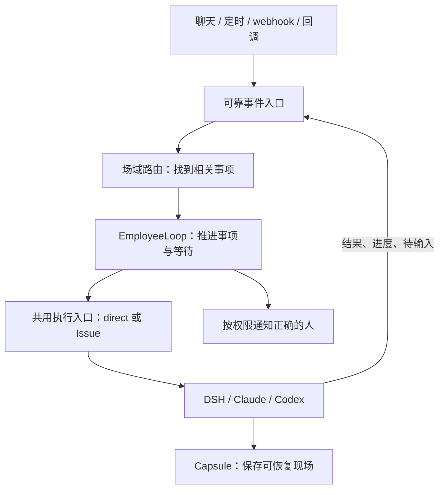

# EmployeeLoop 简版：让数字员工持续把一件事办完

日期：2026-09-30。状态：设计提案，未实施。实现依据、协议和验收用例见[详细方案](employee-loop-design.md)。

建议在现有 Coordinator 上增加“事项协调循环”：把聊天、定时触发、webhook、执行结果和人的回答接到同一入口，保存每件事的目标、权限、进度和等待。员工被新事件唤醒后判断下一步，具体工作仍交给 DSH、Claude、Codex 等执行器。等待别人回答或沙箱运行时，不持续占着模型请求。

这里最重要的变化是：**一件事的连续性由平台保存，不依赖某个群聊天窗口、Issue 或仍然活着的沙箱。**同群可以同时办多件事；同一件事默认只由一个主执行推进，避免两个执行器同时改一份文件。

## 群里多人说话时怎么处理

以下描述目标行为。张三在项目群说“查一下我周三的日历”，李四同时说“整理本周项目周报”，这是两件独立工作，可以并行。王五再说“周报加上延期风险”，可以补进李四的周报事项；员工仍需保存每句话是谁说的、引用哪条消息、是否允许修改这件事。

如果王五说“张三的日历也查周四”，不能因为大家在同群就继承张三的个人权限。超出张三原授权范围时，要形成明确授权等待。私人日历内容只给有权接收的人，群内协调只使用允许公开的摘要，执行现场也要隔离。

“周报做完了吗”只查真实状态，不重新执行。引用旧周报后说“查最新数据”，仍可能是新工作。唯一旧事项、同一个人或时间接近都不能直接判定续接。未 @ 的闲聊先作为观察材料，不自动变成执行授权。员工需要输入时，明确找允许回答的人；关键进度和结果引用原请求，交回正确对象，并核对实际送达。

## 定时和 webhook 不冒充配置者

定时事件的触发者是系统，webhook 的触发者是验证过的服务。规则创建者可以负责这项工作，但不能因此自动使用他的个人连接器。规则应明确保存“以谁的授权执行、允许做什么、在哪输出”，每次触发及敏感调用都重新检查，撤权后停止沿用旧权限。

Webhook 签名只能证明来源。正文里的群号、人员 ID、事项 ID 不能扩大权限，必须由受信订阅配置和资源检查限定。已确认的例行工作可以直接进入执行入口，省去每次重新理解需求；自由聊天仍保留现有协调审查。

## Issue 和直接执行是什么关系

平台新增独立的事项记录，保存目标、参与者、授权和当前状态。需要人工管理、协作或代码交付时，关联 Multica 任务（Issue）；轻量查询和明确自动化可以直接执行。两种方式都必须保存记录、共用调度与完成流程，直接执行不意味着跳过权限检查。

现有 `run_only` 已能不建 Issue 执行，但仍依赖自动化（Autopilot）的规则和运行记录。应先抽出共用执行入口，再让事项、Issue 和自动化都调用它，不能把现有函数换个调用者就视为完成。是否更快需要分开测量路由、模型、排队和冷启动，当前没有速度结论。

## “停一下”和“改一下”要有真实回执

平台分别记录“已保存命令”“执行器已收到”“执行器已应用”。只有最后一步得到证据，才能说修改已生效。当前取消、调整和会话恢复是可复用基础，各执行器是否能在运行中吸收输入仍需逐一验证。

第一期可以先停止当前执行，再带新要求恢复；不支持实时补充时明确排队或说明限制。暂停要有停止确认和完整检查点；取消后迟到的完成回调不能把事项改回成功。已经发生的外部操作也不能靠停止进程自动撤回。

## 执行现场和正式产物分别留存

Capsule 把会话日志、工作区增量、临时文件和恢复信息作为一个生命周期单元。在重要阶段保存完整检查点，过滤凭据，并按个人权限限制访问。删除时整体停止恢复和下载，再清理副本；对象存储和备份的物理清除可能有延迟。

正式报告、文档或代码交付，经明确提升后独立保存，不能依赖将来会过期的临时链接。Capsule 过期后，仍可基于事项状态和正式产物新开执行，但不能承诺恢复原现场。撤权或执行身份改变时，也不能直接复用旧私有会话。

## 推荐落地顺序与当前边界

先整合能力分支并测量基线，按三条完整链路交付：先用一个员工、一个执行器和原 Issue 路径证明持续协调及正确回报；再增加已定义定时/webhook工作到直接执行，形成包含无 Issue 执行的最小版本；随后补控制回执、关键交互和 Capsule。逐步推广更多执行器和个人委托，控制验收通过后才称为可交互长任务。

本方案依据 `develop@2a520dea5` 与独立的 `contextcap@5aa21b5c3`，能力分支尚未合入。后者当前支持群场域加单一触发者 `staffId` 的能力解析；cron/webhook 仍仅全局能力。配置 grant 也不等于某次执行已获授权，新增委托模式要另行落实。现有员工私有盘不能代替 Capsule。

本次只有方案，没有业务改动、部署或真实任务验收。GawkBot 的 Sustainable Use 许可带用途限制，代码移植需先确认服务使用范围；其生产执行以 headless Claude/Codex 为主，不能据此宣称 Go BotLoop 已在生产承担执行。外部复用判断及固定版本证据统一见[详细方案第 15 节](employee-loop-design.md#15-代码依据补充与外部复用评估)。
