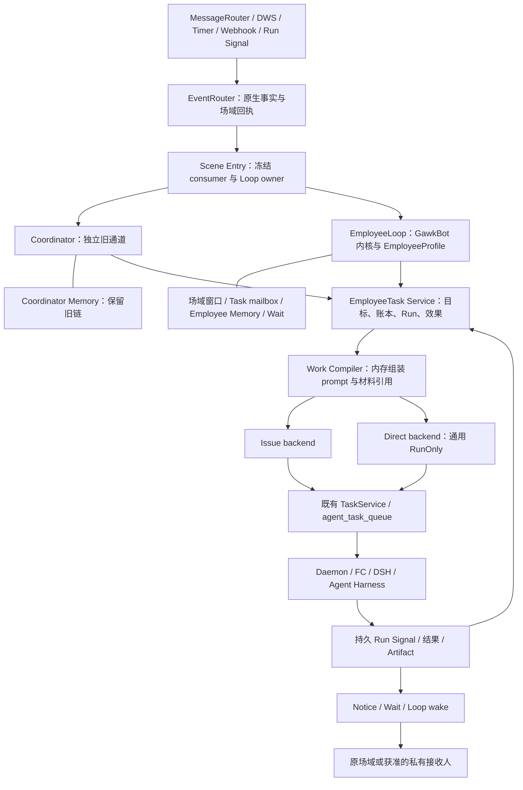

# EmployeeLoop 与 Task Service：独立目标、双派发后端、可切换处理循环

日期：2026-10-02。修订：R2，按用户反馈收轻 RunOnly、隔离新旧记忆、直接移植记忆/进化/表达机制，并限定前台最多 3 次 LLM 调用。状态：设计草案，待评审；未实施、未进行运行验收。

代码基线：`feat/tag-multitenant@7d1a398bb`。本文件接续 R5，以当前已落地的 AgentScene、EventRouter 和场域例行任务为基础，不重建它们。

## 1. 结论与本轮决策

下一步以“先快回复、直接派发”为主线，建立轻量 EmployeeTask 领域和两个派发适配器，再接入从 GawkBot 复制并适配的 EmployeeLoop。Coordinator 接同一 Task 接口，默认使用 Issue 后端；EmployeeLoop 默认使用 Direct 后端，复用 Autopilot RunOnly 的执行机制。完整快照、全局配置冻结和新的运行协议不作为首版前提。

用户提到的 Graboot / Gawkboot，按之前会话和方案中的固定仓库解释为 **GawkBot**：`najmuzzaman-mohammad/gawkbot@71e82a1809565281cbd0bf8185d3c125b715d934`。本轮已核对本地检出的该提交，读取 BotLoop、TaskDefinition、TaskLedger、Work Packet，以及 scoped memory、learnings、task distill、memory workflow、prompt builder 实现。

本方案的关键决定：

1. **Task 是持续目标，Run 是一次执行，Issue 是一种承载方式。** Direct Task 也能纠正、等待、恢复和多次运行。
2. **Task 的当前快照与追加账本一起保存。** 不把一个不断变长的 prompt 或 Issue description 当任务状态。
3. **新旧 Loop 独立。** 共享任务、能力和执行基础；EmployeeLoop 内不调用旧 Coordinator，不默认调用旧 finish_check。
4. **直接移植 GawkBot 的任务、记忆与表达实现。** TaskDefinition、Work Packet、LearningRecord、经验提炼、prompt builder 和口吻片段都列入来源清单；只适配存储、钉钉 scope、能力和工具名字，不重新设计一整套。
5. **Loop 的配套策略成组装配。** 场域窗口、任务 mailbox、记忆读取与刷新、等待、队列、预算和表达均有明确所有者，不留在旧 handler 中隐式执行。
6. **开关改变新目标的默认 Loop。** 已有目标、问题答复、Run 回调和已接收事件保持原 owner；切回不重放、不双派。
7. **一轮能答就一轮答，前台硬上限 3 次模型调用。** 回复、工作选择和接单表达在同次生成中完成；无独立分类、审核或润色模型。记忆提炼和进化在回复之后异步执行。
8. **新旧记忆独立。** 复用 PG/OSS 和存储工具，新 Loop 不沿用旧 flush 算法，也不与 Coordinator 共用记忆内容、游标、lease 或学习记录。

本轮按 Agent 级切换作为首版建议（粒度偏好尚待确认）。企业/场域级 override 不进入首版配置；底层所有记录仍保留 workspace、agent、tenant 和 scene 边界。

### 1.1 与两次讨论、R5 的衔接

| 来源 | 保留的决定 | 本轮收敛 |
| --- | --- | --- |
| [比较消息处理架构](chatgpt-conversation://6abcd6d8-c3f4-83e8-82ad-8d8a0881a925) | 云端维护长期工作状态；沙箱按需执行；消息不等于 wake；Task lane；Capsule 同生命周期 | 不新引入 Eino/Temporal；复用现有 Go/PG 底座和 GawkBot 固定代码 |
| Codex 会话“设计 EmployeeLoop 事件层”，`01a0f22a-a050-7ca1-b01e-6734517e8a1f` | 直接复制 Go BotLoop；Builder；DWS 原生 schema；轻量 HostGate；独立 legacy 通道；RunOnly 优先 | 在当前已落地的事件与场域基础上拆出 Task Service 和闭环工作包 |
| [R5 详细设计](../2026-09-30/employee-loop-design.md) | EmployeeTask / ExecutionRun / ExecutorQueueTaskID、权限与输出范围分离 | 明确表、事务、两个 backend、切换规则和首版验收 |
| [R5 实施拆解](../2026-10-01/employee-loop-delivery-plan.md) | 分阶段交付、fake 与真实 canary 分开 | 接入层部分已由 `eventrouter` 实现，不能照旧清单再建第二份 ingress |
| 本轮用户要求 | Task 独立于 Issue，叠加记录，Coordinator 可改接任务抽象，UI 可切换 | 以独立 Task 存储＋两个执行适配器为推荐方案 |

旧方案中的 personal 场域必须按现行 AgentScene 合同修正：只有 `group`、`dm`、`enterprise`；个人配置 scope 不等于场域，单聊必须有真实会话 ID。此前会话对第三方产品的分析作为设计背景，不作为本仓已实现或第三方现状的证明。

### 1.2 三种实现路线

| 路线 | 收益 | 代价 | 决定 |
| --- | --- | --- | --- |
| 独立 Task 快照/账本＋Issue/Direct 适配器 | 目标不依赖 Issue；连续任务可复用；保留底层队列 | 增加少量持久化及生命周期桥接 | 推荐 |
| 只给现有 Issue 加一个 Task 接口 | 接入较快 | Direct 仍没有独立持续目标，后续要二次迁移 | 不选 |
| 全面重建任务调度、队列和 Runtime | 结构统一 | 影响已有运行链、回执、统计和兼容，交付面过大 | 不选 |

## 2. 当前代码能复用什么，还缺什么

| 模块 | 当前事实 | 下一步接缝 |
| --- | --- | --- |
| `internal/scene` | `scene_id`、Resolve/Lookup/Get、租户 fence 已实现 | 所有新表与 Run 继续引用 SceneRef，不再造 scene key |
| `internal/eventrouter` | 保存 envelope、scene、route/config；同源事件重投幂等 | 在场域入口后增加持久 consumer admission 与 Loop owner，不改变既有回执 |
| `handler/event_admission.go` | unified 无 completion callback 时停在 durable scene entry | 为 EmployeeLoop 新增幂等业务消费者后，才可让该类事件启动工作 |
| `handler/inbound_coordinator_job.go` | PG job、lease、窗口、checkpoint、重试已存在 | 保留 legacy 路径；新 Loop 使用独立状态与 mailbox |
| `service.TaskService` | 执行队列、claim、Runtime 唤醒、取消、进度和终态 | 保持底层执行职责；增加通用直接入队和生命周期端口 |
| `service/autopilot.go:dispatchRunOnlyTask` | 不建 Issue，直接创建队列任务，带归责、readiness、通知 | 抽出接受 TaskRef＋prompt＋可信 scope 的薄入口，直接复用派发链 |
| `handler/daemon.go` 的 Autopilot claim 分支 | 从 `autopilot_run → autopilot` 读取执行描述与 workspace | 首版保留已有 Autopilot 语义；即时 Task 用自己的 prompt/context，补最小 claim 接缝，不推广全局配置冻结 |
| `service/issue.go`、`issue_comment.go` | 创建/续接 Issue 会通过域服务自动派发任务 | Issue backend 唯一调用该路径，返回实际队列任务，不再补一次派单 |
| `service/scenememory` | 按 `scene_id` 存储、lease/flush、revision 已实现 | 保留给 Coordinator；Employee 使用隔离存储与移植的 GawkBot 记忆机制，可复用底层数据库工具 |
| `service/scene_routine.go`、`handler/scene_routines.go` | 场域 routine 绑定 Autopilot，已有开始/终态 notice | 迁移选中的 routine tick 到统一 consumer；每次 tick 只有一个执行和回报 owner |
| `protocol/dsh_native.go` | 已有 queue/steer DTO 和部分 DSH 接缝 | 不等同通用运行中控制；按 Runtime/backend 能力逐项接入 |
| `agent-message-settings.tsx` | Coordinator 开关、主动参与、决策确认存在依赖 | 新增 Loop 选择与生效状态，解开主动参与与 Coordinator 的硬绑定 |

`service.TaskService` 已是大型执行服务，不整体重命名。领域 API 采用 `internal/employeetask.Service`；对调用者它就是新的 Task Service。两个名字分别表达持续业务目标和既有执行基础。

## 3. 总体架构与依赖方向



依赖约束：

- `eventrouter` 不依赖模型、handler 或 EmployeeLoop；只产出可信事件引用和持久回执。
- `employeetask` 定义 Task/Run、仓储、Compiler 与 Backend 接口，不反向 import `service` 或 `handler`。
- 现有 `service` 包实现 IssueBackend、DirectBackend 和执行生命周期桥；由 `cmd/server` 注入。
- `service/employeeloop` 依赖领域接口、Memory/History/Capability/Notice 端口；不依赖 `inboundcoord`。
- `handler` 做认证、DTO 转换和装配，业务事务与状态迁移移入领域/服务；不再继续把实现塞进 `agent_dispatch_v2_handler.go`。
- 一个场域内短时串行处理未归属输入；不同 Task 可以并行；同一 Task 同一时刻只有一个有效决策提交者和一个主执行 writer。
- 场域和 Task 两种 mailbox 复用同一个 EmployeeLoop 内核。场域轮若已经形成工作计划，派发 worker 直接执行已保存计划，不再让 Task Loop 对同一输入重新规划。

EmployeeLoop 是由有限 worker 驱动的持久状态机。等待时保存记录并释放 worker、模型连接和任务 lease，不为每个场域常驻一个推理 goroutine。

## 4. Task 模型：当前目标＋追加账本＋Run 记录

### 4.1 对象与权威边界

| 对象 | 保存什么 | 不代表什么 |
| --- | --- | --- |
| EmployeeTask | 当前目标、约束、负责人、场域、权限引用、进度、等待、Loop owner | 不是一条消息、一次沙箱或一个 Issue |
| TaskEntry | 原始请求、纠正、决定、派发、结果、控制及交付的追加记录 | 不是可以随时覆盖的“最近 human note” |
| ExecutionRun | 一次逻辑执行的定义版本、Work Packet、运行策略和结果 | 不等于目标完成 |
| ExecutionAttempt | 一次具体队列执行，与 `agent_task_queue.id` 对应 | 重试不能伪装成新目标 |
| Issue binding | 既有 Issue 的关联及执行/协作入口 | 不自动把目标或私有结果公开给工作区 |
| TaskWait | 等待谁、什么问题、哪个 revision、多久后唤醒 | 不占据运行中的 LLM 或沙箱进程 |

EmployeeTask 的目标定义与 ledger 是工作意图权威；Issue 仍拥有其协作流程状态，队列仍拥有 attempt 执行状态。不同状态显式映射：Issue `closed`、队列 `completed`、Task `succeeded`、Notice `delivered` 都不能互相直接替代。

首版接入 legacy Issue 时保留其既有业务行为，Task 记录以真实 Issue/执行事件推进；不做可任意双向编辑的状态镜像。历史 Issue 首次经新接口续接时建立唯一 binding，不批量回放历史事件、不自动再派一次任务。

### 4.2 建议表及核心字段

以下是完整领域模型，尚未创建，按功能逐步落地。首版先做 Task、entry、Run、业务消费/待处理记录，复用现有队列、执行回执与 outbox；attempt 可先关联已有队列 ID，Issue binding 可先放 Task 上。独立 wait/effect/binding 表及完整 packet_hash/authority_revision 快照在对应功能需要时增加，不以一次建齐为前置。UUID、租户、scope 和 actor 来自 Host；凭据只存受控引用。

| 表 | 核心字段/约束 |
| --- | --- |
| `employee_task` | id、workspace_id、agent_id、scene_id、tenant_org_id、owner_loop、route_revision、dispatch_mode、requester_ref、capability_context_ref、audience_ref、definition、goal_revision、state、checkpoint、next_entry_seq、active_run_id、version、generation |
| `employee_task_entry` | task_id、seq、kind、source_receipt_id、actor_ref、goal_revision、run_id、body/ref、dedupe_key、created_at；`(task_id, seq)` 与任务内 dedupe_key 唯一 |
| `employee_task_run` | id、task_id、ordinal、goal_revision、generation、state、compiled_packet、packet_hash、context_used、authority_revision、output_binding、created_at、result_ref；同 task/run ordinal 唯一 |
| `employee_task_attempt` | run_id、attempt、executor_queue_task_id、status、command_seq、runtime_capabilities、result_ref；queue task 唯一；同 run/attempt 唯一 |
| `employee_task_binding` | task_id、kind、external_id、workspace_id、agent_id；首版 kind=issue，按 workspace/agent/issue 保证唯一关联 |
| `employee_loop_mailbox` | scope_kind=scene/task、scope_id、receipt_id、item_key、owner_loop、priority、seq、state、available_at、lease_token、lease_until、generation、payload_ref；语义输入持久化，不用内存队列当权威 |
| `employee_task_wait` | task_id、wait_id、kind、question_ref、allowed_actors、goal_revision、deadline、state、answer_ref、dedupe_key |
| `employee_task_effect` | task_id/scene_id、wake_id、effect_key、kind、payload_ref、expected_version、state、attempt、next_attempt_at、external_receipt；同 owner/wake/effect_key 唯一 |
| `employee_event_consumption` | receipt_id、consumer、item_key、owner_loop、config_revision、state、mailbox_id/legacy_acceptance_ref；一个回执的同一消费项只分配一次 |

Employee 模式的场域任务要求非空 SceneRef。为承接现有 Web/Issue Coordinator，领域存储允许 legacy Task 的 scene_id 为空，并保存其经过验证的原始 chat/Issue scope；不虚构 DingTalk 场域，也不因少了 SceneRef 扩大访问。首版 UI 开关控制已接入 EventRouter 的钉钉场域来源，Web chat、A2A 等未接入来源明确保留既有入口并在支持列表标出；后续以独立 adapter 接入，不能悄悄应用这个开关。

每张表按 workspace 和 agent 限定查询。场域和个人材料还有授权检查，不能只有 workspace membership。表之间无 FK/cascade；每个索引独立单语句 `CREATE [UNIQUE] INDEX CONCURRENTLY`，迁移编号实施时使用当时空闲编号。删除工作区/Agent 时用显式事务清理，并与对象存储 GC 联动。

不再新建第二份 provider event 表：原始事实仍在 `scene_event_receipt`。执行通知、timer、webhook 通过可信 adapter 进入事件层；`employee_event_consumption` 只记录消费归属。

业务消费统一使用 `consumer='work'`，Coordinator/Employee 是该消费项的 owner_loop，不能分别注册两个 work consumer。唯一键为 receipt/consumer/item；Memory 等独立消费者可另有自己的消费键，但不得启动第二份业务执行。

### 4.3 “堆叠式”记录的具体语义

```text
Task T：分析本周客户反馈，生成一份报告
  entry 1  request       原始目标与消息证据
  entry 2  definition    revision 1
  entry 3  run_started   Run 1 / revision 1
  entry 4  amendment     “排除测试客户” → revision 2
  entry 5  control       对 Run 1 提交 stop/steer，等待应用回执
  entry 6  result        Run 1 的部分结果，仅记录，不完成 revision 2
  entry 7  run_started   Run 2 / revision 2，包含未消费修正和可复用材料
  entry 8  needs_input   Wait W：“统计口径按签约时间还是反馈时间？”
  entry 9  human_answer  指定人员对 W 的回答
  entry 10 result       新版本结果与 ArtifactRef
  entry 11 delivered    指定场域的发送回执
```

快照回答“现在在哪一步”；ledger 保留“为什么到这一步”。快照和 entry 在同一短事务用版本 CAS 更新。无需重放全部 ledger 才能读取状态；旧 entry 不能被覆盖。摘要可压缩，但必须携带覆盖到哪个 seq，原始纠正与控制约束保留。

状态建议：`ready → running → waiting_human / waiting_event / waiting_timer → ready`，以及 `succeeded / failed / cancelled`。取消过程另有 `stop_requested` 控制状态，收到请求不等于已停止；完成后的修改以新 revision 重新打开同一目标，明显不同交付物另建 Task。

### 4.4 三类版本不要混用

- `goal_revision`：目标、约束和授权要求发生修正，供 Compiler 冻结。
- `version`：普通聚合 CAS，任何持久状态更新都会推进。
- `generation`：执行/控制 fencing。writer 被替换、显式中断恢复或授权执行域改变时推进；旧回调可留证，但不得修改新目标状态、发结果或解除停止约束。

人类问进度不增加 goal revision，不重跑。范围收窄在记录成功后立刻约束后续效果；普通补充不能自动解除先前的禁止发送/停止指令。

## 5. Task Service 与两个派发后端

### 5.1 领域 API

对上层统一提供以下操作；名字为建议接口，不宣称现有符号已存在：

| 操作 | 输入/输出及规则 |
| --- | --- |
| `Create` | TrustedScope＋Definition＋来源证据＋幂等键 → Task；可与首次 Run intent 同事务 |
| `AppendInput` | TaskRef＋actor＋source ref＋原文/结构化修正＋expected version → 新 entry/快照；只记录不必执行 |
| `Dispatch` | TaskRef＋当前目标＋effect key → Run；Compiler 就地组装 prompt，然后直接入队 |
| `Control` | RunRef＋generation＋command seq＋queue/steer/cancel → accepted/applied/rejected/unsupported |
| `RecordSignal` | 可信队列/Runtime 状态或已验证结果 → Run/Task 更新及后续 effect |
| `Get` / `ReadEntries` | 授权范围内快照与按 seq 渐进历史 |
| `BindIssue` | 关联真实 Issue；不通过关联操作自动再派发，也不默认扩大 audience |

Backend 接口仅负责“怎样把已经定义的工作交下去”：`Submit(TaskRef, prompt, trustedScope, effectKey)`、`Control`、`Inspect`，返回稳定 BackendRef/queue task refs。首版无需完整 RunSpec 协议。它不调用主模型，不决定新建或续接，不改写用户目标。能力查询区分 cancel、queue、live steer、resume；不能用一个 `supports_interaction` 布尔值概括。

Scope 明确区分 endpoint/subscription principal、逐句 actor/requester、执行 capability principal 和审计 accountable human。前者认证通过不等于消息作者获得其所有权限；维护定时规则的人也不自动成为本次执行的实时授权者。所有映射来自可信绑定，保留 org 范围；无法解析的人类个人权限保持不可用。

### 5.2 IssueBackend

- Coordinator 的 start_work/continue_work 改为调用领域 API；其模型协议、finish_check、关联召回和回执先保持当前合同。
- Adapter 通过 `IssueService.Create`、`IssueCommentService.CreateExternalFollowUp` / `QueueCoordinatorFollowUp` 实现派发。复用已有 author、context、关联、待忙窗口、幂等键和后续任务逻辑。
- `IssueService.Create` 已可能自动入队，Adapter 必须接收它的返回值，不能再无条件调用 `EnqueueTaskForIssue`。
- 每项计划的稳定 action key 对应一个 Task effect；外层 checkpoint 保存 TaskRef、IssueRef 和 RunRef，部分成功只恢复尚未提交的项。
- 返回旧调用者需要的 Issue identifier、comment id、queue task id；线上 Dispatch callback 含义不改，工作受理回调不能映射为 EmployeeTask 成功。
- 首版同一 agent/Issue 的持续工作挂一个 Task。Issue 改派给其他 Agent 或进入 squad 协作时，保留 legacy 域服务处理，记录 binding 暂停/转交；不默默借原 Agent 的权限继续。

### 5.3 DirectBackend

把 Autopilot 里的直接运行部分提取为 `service/direct_task.go`（建议新增），同时供 Autopilot 和 EmployeeTask 调用。首版入口只接收 Task/Run 引用、组装好的 prompt、可信 scope、幂等键和可选来源 ref；不先建一个通用运行编译平台。

路径为：`当前目标＋必要上下文 → Work Packet 文本 → 现有 RunOnly 入队 → 现有 claim/Runtime`。Compiler 是进程内组装函数，不增加模型调用或额外工作流。Task/Run 与队列关联同次写入，提交后立即唤醒 Runtime。

保留已有 readiness、invoke gate、归责、MCP overlay、技能装配、empty-claim 缓存失效、`NotifyTaskEnqueued`、Runtime launch lease、统计和终态链，不另起一套检查流程。

本次任务的目标/prompt、TaskID/RunID、scene 与 requester/output 定位保存到现有 context 或最小新增字段即可。既有 Autopilot 仍可按原规则在 claim 读取配置；即时 Task 不伪装成永久规则。**完整配置快照、跨配置版本重放、packet hash/全量 manifest、专用 RunSpec daemon 协议都后置。** 首版接受沿用当前运行配置的行为，不承诺所有配置均按排队时冻结。

claim 只补识别这种任务所需的最小映射，优先使用已支持的执行输入；若现有字段确实不能承载，再增加必要字段及兼容测试，不为了设计完整先升级整套协议。不得给已发布的 Autopilot 字段悄悄换含义。

仍保留两个直接影响正确执行的约束：同一 Task 不产生竞争 writer；不同 Task 的私有上下文不混用。需要修改 SQL claim/FC scope 时，只改这些任务的分组接缝。完整 session 复用、通用控制和恢复优化随后分项实现。

### 5.4 Run 与外部效果的事务

模型/provider 不在数据库锁内调用。数据库内可完成的 Task/entry/Run/queue 写入走同一短事务，提交后立即唤醒；不要求每次 RunOnly 都额外经过一个异步 effect worker。发送、延时和需要重试的外部效果才用现有 outbox 或持久 effect intent。

Issue/队列均在本库时，使用事务绑定的现有服务，把 effect 的 submitted、Issue/queue task 创建和映射在外层事务中提交。`chat_coordinator_plan.go` 已有事务绑定服务与提交后广播的模式可复用。需要核对具体域服务是否在提交前发外部通知，并改为 commit 后唤醒。

崩溃发生在派发后、effect 完成记录前：按 effect key 恢复同一已有映射，不能以“没有 response”为理由再建 Issue/Run。外部发送用 outbox 和可查询的发送回执；provider 不保证幂等且结果未知时记录 `delivery_unknown`、先核验，不承诺端到端 exactly-once，也不盲目再发。

## 6. Work Object Compiler：保留 GawkBot 的任务组装

上游实际符号是 `normalizeTaskDefinition`、`BuildMessageWorkPacketWithContext` 和 `BuildTaskExecutionPacketWithContext`。本仓将这组职责封装为 WorkCompiler，不能把新接口名说成上游已有的完整编译器。

两个 Builder 分工：

- **EmployeeBuilder**：给云端 Loop 构造这次 wake 的材料，去除窗口与历史重复，说明已知/未知、记忆 revision、候选任务和可用工具。
- **WorkCompiler**：给执行器构造一次 Run 的工作合同，引用已确定 Task 和授权范围；纯组装/校验阶段不再调用分类 LLM。

Work Packet 顺序：

1. 尚未应用的人类停止、纠正、限制及其来源和 seq。
2. 本次目标、交付物、成功条件、当前阶段；Goal 必填，其他按需要填写。
3. 原始请求与当前 revision 的差异，不以旧 Task 标题替代新请求。
4. 已完成步骤、最新结果摘要、失败原因、允许复用的 ArtifactRef。
5. 依赖结果和按需读取的历史 handle；未加载/无权/失败/截断有区别。
6. 本轮可用能力和执行身份引用；`AccessNeeded` 是需求，不是实际授权。
7. 结果/提问应回到哪里、找谁、哪些内容不能公开。
8. 本次运行预算、可用控制能力、完成/等待协议及 ContextUsed manifest。

ContextUsed 由 Host 记录真实注入的材料引用与水位，不让模型自行声称读取过。首版直接调用移植的组装函数生成 Work Packet 文本，保存必要引用即可；结构化完整快照和所有材料 hash 不阻塞派发。测试验证目标和来源完整，不锁死中文套话。

编译是无消费副作用的读取：不得像上游 `consumeTaskHumanNote` 一样在“渲染过”时清除修正。仅在某个 Run/决策带着对应 entry seq 成功提交后推进消费游标。构建失败、模型取消或重试都不能丢纠正；停止/禁止外发等约束只通过明确获准的后续变更解除。

历史采用“当前快照＋最近有限条 entry＋可检索旧历史”，不复制上游只保留 20 条 ledger 的截断存储策略。不强制 wiki 检索、固定 reviewer、定义审批或英文占位符规则。

## 7. EmployeeLoop 配套能力

### 7.1 内核移植范围

复制固定 SHA 的 `internal/bot/{loop,types,queues,tools,session,service}.go` 中实际需要的代码；实施时核对文件清单和 imports，保存 LICENSE、SOURCE_MAP、修改说明和原测试。Task 相关纯函数从 `internal/team` 有界移植，不引入整个 Broker、GUI、SQLite 或 CLI launcher。

必须修复后才能接真实副作用：StreamFn 显式传 ctx；慢 tool/emit 在 mutex 外；完整 tool batch 与原生 ToolCallID；EOF 不等于合法结束；只有保存的 finish/wait/dispatch disposition 能结束 wake；journal 失败必须阻止依赖它的效果提交；旧 generation 不可提交。

状态阶段继续为 Idle → BuildContext → StreamLLM → ExecuteTool → Done/Await；Done 是本轮结束，不是 Task 成功。一次 wake 只做有界推理与工具调用，重活派发后等待新事件。

### 7.2 场域连续消息与任务队列

- Scene mailbox 保存未归属消息与参与资格所需事实。窗口保留逐句作者、mentions、引用、附件、原时间与 source ref，不将整窗归给最后一个人。
- 单聊/完整显式 @ 默认立即进入首轮。仅需聚合的连续输入采用静默 400ms、最长 1500ms 的初始试点参数；按实际回复时延和漏句率调整，已有可靠窗口不重复等待。
- 窗口封存后消息进入下一窗口；忙时不丢输入。不同人的请求可在同一推理窗口理解，但执行时按 principal/Task 分开。
- 已有 task/run/question/quote 结构绑定的输入直接入对应 Task mailbox。无结构绑定时由一次 Loop 根据有界候选理解；时间近、同人、标题像都不能单独决定续接。
- 一个 Task 的主 lane 串行，独立 Task 并行；写同一真实资源的额外资源 lane 只用于已解析的冲突对象。
- 控制优先，其次人类输入和终态/等待信号；普通进度允许合并为最新通知，但原始用户修正、终态和授权变化不得覆盖。高优先级持续输入时按配额给其他任务公平机会。
- Task mailbox 的队列容量触顶时拒绝新增计算或延迟受理，保留已持久输入及可见状态，不能 silent drop。外部 ACK 以实际 durable acceptance 为准。

### 7.3 场域记忆与工作记忆

**新 Loop 的记忆和进化采用 GawkBot 的实际实现，旧 Coordinator 保持原有机制。** PG/OSS、sqlc、事务/对象存储工具可以复用，内容、游标、学习状态和刷新机制独立。

建议旧数据继续在 `agent_scene_memory`，Employee 新增 `employee_memory_state` 和 `employee_learning`，复用同一 `scene_id`，不创造第二种场域身份。Employee 的逻辑键包含 workspace、agent、tenant、scene、scope、必要的 principal；独立维护 revision、cursor 和 lease。这样旧代码无法意外读取新记忆，两个 Loop 也无需互相等待。

首版不自动复制、合并或回退读取旧记忆。切换到 Employee 后从获准的原始历史和新事件逐步建立自己的记忆；切回 Coordinator 后继续其原有记忆。冷启动缺少的上下文按需取原始证据，不能把旧 Loop 的总结当作新 Loop 隐式状态。同一条原始消息可以被两套隔离的记忆流程各自消费，但每套内部去重，且不因此启动两份业务工作。

移植范围按核对过的源码确定：

| GawkBot 源码 | 实际已有能力 | 本仓适配 |
| --- | --- | --- |
| `scoped_memory.go`、`memory_backend.go` | private/shared scope、有限 brief、查询/写入接口 | 改成场域/任务/个人的精确授权范围；存储接 PG/OSS，不默认接 GBrain 服务 |
| `learnings.go` | LearningRecord 类型、来源、confidence、supersedes、去重、检索和随时间衰减 | 保留数据结构与可复用纯函数；增加 Loop/tenant/scene/principal 范围，scope 的模糊检索不得作为权限检查 |
| `memory_workflow.go` | lookup/capture/promote、引用和产物证据 | 保留这套过程和记录，前台回复不等待流程完成，不移植强制完成门禁 |
| `task_distill.go` | 任务完成后异步提炼；有 machine verification 才自动记 verified learning；部分步骤不调用 LLM | 接真实 Run 结果与验证证据；无验证的经验可留候选，不把执行器自述当已验证 |
| `session_memory.go` | 从运行任务、待答问题、最近消息重建 Focus/NextSteps/Highlights | 复用恢复摘要组装，替换 scope 和存储依赖；不能跨任务恢复私有材料 |
| `playbook_synthesizer*.go`、`prompts/synthesis_playbook_v2.tmpl` | 多次执行经验的综合与 playbook 生成 | 第二增量接后台进化 worker；产出可版本化的经验/方法候选，不在首轮回复前运行 |

首版闭环：`当前证据/纠正 → 记录 learning 或候选 → 后台去重/替代/必要提炼 → 下一次按 scope 读取 brief`。用户纠正立即进入当前 Task/输入，不依赖后台学习完成。经验改善后续材料和方法，但不扩大连接器权限、不自行覆写系统约束。上游允许输入的 `source=user-stated` 在本仓必须由 Host 对真实人类证据认定；模型不能自行把经验升级为 trusted。

回复路径只读已有简短记忆和最近状态，不等待远端检索、综合或 flush。任务结束后再异步运行 capture/distill；慢失败重试不影响回复/RunOnly。后台进化有独立预算和调度，不因每条普通消息启动新的模型链。

Task ledger 保存当前工作，Loop journal 保存本次推理，记忆/learning 保存可复用知识。个人 connector 的返回仍留在其授权域，不因使用 shared memory 实现就进入群记忆。

### 7.4 等待、唤醒和防自循环

TaskWait 记录真实问题、可回答的人、场域/输出锚点、目标 revision、deadline；问人后释放 worker。结构化 answer/control 回执优先验证 WaitID；自然回答由 Loop 结合本轮上下文解释，引用别人的“同意”不获得授权。

Timer/Watchdog 只检查持久状态并投递一次 Wake；不定期让模型无事思考。每次 wake 有 cause/root、预算和截止时间；重试有上限，超限进入可诊断失败/等待。普通 bot 输出和 audit 事件不自动唤醒，自己的发送回声被过滤。首版不开放自由 Agent↔Agent 自发委派，保留因果预算接口供后续协作。

新 Loop 不调用旧 finish_check，也不新增分类或润色模型。HostGate 是现有认证/权限检查加轻量结构与幂等检查，不成为独立串行审核阶段；语义决策与回复同次生成。关键事实不足时，主模型在同一总预算内读取，或将明确工作直接交执行器。

### 7.5 首轮回复与最多 3 轮的交互合同

这里的“轮”严格指一次模型请求：同一入站窗口/用户交互的前台预算 `max_model_calls=3`，主模型续轮、格式修复和模型请求重试共用计数；不另设 review/composer 调用额度，不以重新建内部 wake 绕过上限。Host 的数据库读写、工具执行和发送不计模型轮数，但分别有时延预算。

默认路径：`已有短上下文 → 第 1 次 LLM → 回复或派发＋回复 → 等待新事件`。

纯回复允许模型直接输出正文：provider 明确正常完成且正文非空时，Host 包装成 reply disposition；单纯连接 EOF/断流不算完成。工作路径的 dispatch 动作同时携带接单正文，Host 执行并提交后直接发送，tool 返回后无需再调用模型说一遍。沿用上游的流式和工具循环骨架，同时加这个终结出口，避免“回复也必须多走一次工具回合”。

| 情况 | 首选路径 |
| --- | --- |
| 问候、明确纠正、已有证据可回答的问题 | 第 1 轮直接生成可发正文，不强制调用工具/先查历史 |
| 工作目标已明确 | 第 1 轮同时生成目标和接单文案；Host 入队成功后发送该文案，不等沙箱启动、不再请模型润色 |
| 缺少一项可快速取得的上下文 | 第 1 轮工具读取，第 2 轮回复或派发 |
| 还需要一次必要读取/结构修正 | 第 3 轮收束，不能开启第 4 次请求 |
| 长查询、多步骤操作、复杂研究 | 第一轮优先 Direct 派发，后续工作在 executor 内完成；3 轮限制不套在执行器的整个任务上 |

第 3 轮未形成合法终结时，Host 不盲目派单、不把工具结果当成功：已提交的工作保留并回复真实受理状态；没有提交且目标/权限明确的工作须在预算内通过 dispatch 动作交接；仍不明确则给简短缺口/失败反馈并结束，不自动自唤醒继续推理。真实人类新输入或真正的执行结果才是下一次交互。

回复内容优先沿用上游 `prompt_builder.go` 的首句围绕工作、直接回应、不重复 poll、自然简短表达，以及 `teamVoiceForSlug` 的口吻片段和稳定 prompt 排序。直接复制可用 builder 函数与 prompt block 后映射 Agent 配置；仅替换 WUPHF/Slack/工具名、固定角色和不适用的 Issue/wiki 强制步骤。persona/reply_tone 是同一次主模型的输入，ReplyComposer 仅是格式化/发送端口，不再发起一次 LLM 请求。

上游 BotLoop 的流式文本事件也可复用到支持的回复渠道；不能把 thinking/tool trace 当正文。钉钉渠道不支持安全流式更新时，第一轮生成完整回复即发送。带“已接受/正在执行”含义的文案要与实际受理状态对应；有接单失败时使用 Host 的明确错误反馈，不先声称成功。

首轮上下文以已到达窗口、已有短 memory brief、必要 Task snapshot 和技能短目录为主，静态 prompt 字节稳定以便缓存。单聊或完整的显式 @ 默认立即进入首轮，不强制等待 400ms 合窗；仅对实际连续追加的输入使用有上限的聚合。后台记忆和额外上下文不得成为每次回复的固定前置步骤。

验收记录第一条有用回复的端到端 P50/P95、首轮回复比例、前台模型请求数、dispatch 时间、发送时间；强断言无 review/composer 模型且调用数不超过 3。简单回复与目标明确的派发样本应在第 1 轮完成。具体秒数以模型/渠道实测为准，不能用“一轮”冒充固定时延保证。

## 8. 运行中的补充、中断和结果闭环

控制能力必须按 backend 声明并验证：

| 控制 | 行为 |
| --- | --- |
| queue | 输入已保存，在下一安全轮使用；提供受理状态 |
| live steer | 只有实测支持的活跃 Runtime handle 才调用；记录 command seq 和应用回执 |
| cancel | 发停止指令；尚未确认停止时保持 stop_requested，不启动竞争 writer |
| cancel + resume | 旧执行已停止后，Compiler 使用最新 revision 和 checkpoint 开新 attempt/Run；明确不同于 live steer |
| reconstruct | 没有可用 session 时从 Task、ledger、正式产物重建，不伪称恢复了全部沙箱现场 |

云端 Loop 的模型取消与沙箱内执行取消是两件事；前者不能作为后者已停止的证据。授权域或 principal 改变时重新编译执行上下文，不复用旧人的 native session/私有工作目录。

执行侧结构化信号包括 `started`、`milestone`、`needs_input`、`completed`、`failed`、`cancelled` 和 `control_applied/rejected`。现有 queue 终态可直接桥接；原始 token、thinking、tool output 留在执行轨迹，不能直接变群消息。

终态持久化事务同时记录 signal/outbox，后续 worker 即使重启也能接着处理。`RecordSignal` 校验 queue task → attempt → Run → Task、workspace/agent/scene、generation 和结果版本，再推进 Task 或形成下一 wake。

关键场域通知走 Notice effect：开始、重要发现、阻塞、必须回答的问题、最终结果。Host 直接格式化已有可发送事实，或使用本次 Loop 主模型已经生成的正文；ReplyComposer 只渲染和发送，不再调用模型。新到达且确需语义整理的执行结果进入自己的有界 wake，同样最多 3 次前台模型调用。发送后保存 provider receipt，重复终态不能重复报告。legacy task_finished、SceneRoutine notice 和 Employee Notice 由 frozen delivery owner 单选。

Task 的计算成功与人类收到结果分开显示；发送失败保留 result_ready/delivery_pending，只重试交付，不重跑计算。群内不适合公开的结果走已有获准私有通道，没有合法通道则等待选择，不能把请求者 UID 当作任意私聊授权。

## 9. 开关与 EventRouter 的连接

### 9.1 两层 route 必须分开

现有 receipt.route=`legacy|unified` 是事件准入版本；新增 owner_loop=`coordinator|employee` 是业务消费者。不能把 `unified` 当成 EmployeeLoop，也不原地改写历史 receipt。

在 `admitDispatchEvent` 已得到场域结果后、进入 `handleObservedEvent`/旧执行之前接 SceneEntry consumer。unmapped 保持留存，不产生业务；统计专用入口仍沿现有合同。

首次消费的事务保存 `employee_event_consumption`、配置 revision、Loop owner 与 mailbox 或 legacy acceptance。可重试的 consumer 错误不能仅凭 receipt 已写入就回复“任务已受理”；重投恢复同一消费记录。没有 callback 的 unified 事件只有在这层业务受理已完成后才由 EmployeeLoop 处理。

优先级：可信 task/run/wait/continuation/quote 绑定的原 owner → 已冻结消费归属 → Agent 新目标默认 owner。混合窗口中结构上指向不同 owner 的项分开受理，父来源只在所有项有持久去向后 ACK，重投只补未完成项。

没有结构锚点的窗口保持一个 owner，不增加前置分类模型。若该 Loop 语义上才发现续接对象属于另一 owner，按 R5 在灰度期请求明确锚点/目标选择，不再转给另一 Loop 重跑同一输入，也不把旧工作改派。UI 切换提示这项体验边界。

### 9.2 配置与 UI

建议在 Agent 当前 Coordinator 配置区展示：`处理方式：Coordinator | EmployeeLoop`，其旁保留原启用/停用语义。后端明确保存 `coordination_enabled`、`coordination_mode`、配置 revision；不要用两个互不约束的布尔值表示两种 Loop。

现有 `inbound_coordinator` 是已发布 API，兼容限于 API 边界：旧读端返回当前是否启用 Coordinator，旧写端仅能修改 Coordinator 相关设置；Agent 处于 Employee 模式时，旧请求若试图以该字段改变整体处理模式，返回明确冲突提示使用新字段，不能悄悄覆盖。缺新字段的旧响应在新前端显示原 Coordinator 配置；未知模式禁止有歧义的写入。

配置保存使用预期 revision，成功后展示 `configured_mode`、`effective_for_new_work`、阻塞原因及两边在途 Task 数。Employee 尚未通过 server replica、Runtime 能力或场域准入门槛时，不显示为已生效；新受理明确报不可用，不自动回旧 Loop。运维紧急门禁关闭时停新 Employee 工作，已冻结任务仍可由支持该协议的 worker 收尾。

初始迁移默认 Coordinator，未启用的 Agent 保持停用。主动参与是两种 Loop 共用的产品能力，配置校验需从 `inbound_coordinator=true` 解耦；人工决策确认和旧 task_finished 设置只在 Coordinator 模式展示，但在途旧任务继续用其冻结策略。人格、语气、能力配置可共用，prompt 装配各自独立；记忆、学习与进化记录完全隔离。设置页明确当前记忆命名空间，重置/查看只操作选定 Loop。

落点：`packages/views/agents/components/agent-message-settings.tsx`、调用它的 `tabs/digital-employee-tab.tsx`、core 类型/API schema/mutation 和 Go Agent DTO/查询。服务端配置归 React Query 管；不能新建 Zustand 服务端配置镜像。Web/Desktop 共用组件。

### 9.3 切换与回滚

```text
10:00 Coordinator 创建 T1（Issue backend）
10:01 用户切到 EmployeeLoop
10:02 新目标 T2 → EmployeeLoop（Direct backend）
10:03 引用 T1 的补充 → Coordinator
10:04 T1 的 Run 回调 → Coordinator
10:05 切回 Coordinator
10:06 T2 的回答/回调仍 → EmployeeLoop，新目标 T3 → Coordinator
```

首版不提供活 Task 强制迁移。需要迁移时是单独的暂停、核对 effect、确认旧 writer 停止、导入目标/等待、提高 epoch 的管理操作，不能等价于点开关。代码回滚到不认识 Employee 的二进制前需 drain 或可靠暂停新 Task；配置切回不能替代二进制兼容检查。

旧任务恢复必须依据冻结的 owner/profile，不能因为 Agent 当前关闭 `inbound_coordinator` 就跳过原 Coordinator 的收尾；身份、租户和实际能力则继续使用最新授权检查。路由冻结与权限冻结是两件不同的事。

## 10. 事件缺口与开发顺序

| 事件 | 当前基础 | 本次闭环要做什么 |
| --- | --- | --- |
| Router message.created、DWS 单聊/@ | 现有 dispatch/eventrouter | 新 consumer、来源保真、逐句身份、窗口与 Task 绑定 |
| observed 群消息 | 现有 proactive 路径 | 单选 Loop；纯观察默认不授权新执行 |
| 修正、取消、人类答复 | 部分旧 control/userdecision/DSH 能力 | TaskSignal、WaitID、command seq、generation、应用回执 |
| Run started / completed / failed / cancelled | 现有 TaskService 生命周期 | 事务内 signal/outbox，路由回 frozen Task owner |
| milestone / needs_input | progress/部分交互基础 | 授权的结构化 signal，不能从任意 stdout 猜出来 |
| routine timer | 场域 routine＋Autopilot trigger 已存在 | 以真实 scene 和固定 schedule occurrence 受理，避免 routine 与 Loop 双派 |
| webhook | Autopilot 已有 delivery/admission | 显式 trigger→scene/principal/output binding；签名/secret 验证后入统一层 |
| Router calendar/approval | dispatch domain 可映射 enterprise | 首版能保留和路由事实；执行 policy 必须单独登记，不把所有观察变任务 |
| DWS approval / doc@ / calendar 等扩展 | SDK/来源支持程度各异 | 按发布 SDK key/shape 逐项加 adapter、fixture、scope；未支持者留存，不捏造 key |
| task deadline / stalled / dependency | 新 Task 状态可检查 | PG 定时 wake，幂等与预算；首版依赖只需保存已授权结果引用 |

完整“人—执行—人”闭环优先于全事件目录：首个可启用版本必须有 IM、新建/续接、纠正/停止、提问答复、真实运行终态、交付记录、重启恢复、切换回滚。Timer/webhook 接现有机制作为下一增量；未登记的资源事件没有执行能力，不因 Event 有对应 category 就宣称支持。

## 11. 轨迹、Capsule 与产物

沿之前讨论保持三个层次：Task ledger 保存持续工作事实；执行轨迹在已有 task_message / DSH trajectory 存储；Capsule 保存可恢复的 session log＋workspace delta＋manifest。正式 ArtifactRef 可独立保留。

首版 Direct 必须保证：Run 和结果持久化；本地产物上传并校验后形成稳定引用；绑定 scene/principal/audience；上传失败时不能发送临时路径或释放唯一副本。提交 result/signal 与通知 intent 可原子进行，但对象上传先完成，再以 immutable manifest 提交引用。

完整 Capsule 采用先上传对象、再提交 manifest、最后允许沙箱 GC 的发布协议。删除先 tombstone/撤销读入口，再异步删除日志、临时文件及 delta；部分删除可重试，对用户不暴露半个 capsule。正式交付物通过显式 promote 脱离临时保留周期，保留来源 Run 和证据摘要。恢复可用性独立报告，不把“有一段总结”称为完整 session 恢复。

同场域允许复用已授权的基础镜像/技能缓存，但不同 Task/principal 的模型历史、文件和凭据不能因此共享。FC 的终态清理和 scope key 需要适配，新日志/result/产物读 API 必须校验授权，不能直接复用宽松的 workspace 列表语义。

## 12. 分阶段交付

详见 [开发路线与验收](employee-loop-task-service-delivery.md)。这里给出依赖顺序：

1. **Task 领域＋IssueAdapter**：Coordinator 经 Task Service 派发，行为与现有保持一致；ledger 和 mapping 可回读。
2. **薄 Direct 入口＋移植的 Work Packet**：人工/测试入口即可直接派一个独立 Task，看到运行与结果；不以全量配置冻结和协议升级为前提。
3. **EmployeeLoop 内核＋首轮回复＋隔离记忆**：接 IM 和真实 consumer，前台 1–3 轮；移植 prompt/口吻、LearningRecord/后台 distill 和 mailbox，具备等待、纠正、终态及结果通知。
4. **开关与首个真实闭环**：配置页切换，原任务留原 owner，验证无双派与跨身份读取；通过门禁后才开放可选。
5. **Timer/webhook、更多资源事件和完整 Capsule 恢复**：逐来源验收，复用现有 routine/Autopilot，不新增第二套 scheduler。

不把多 Agent 自动协作、自动 Task→Issue 升级、Episode 向量系统、跨 Loop 活任务迁移或 Temporal 引入塞进首版。保留扩展点；只有需要实际共享管理时才显式创建/绑定 Issue。

## 13. 验收与观测

必须同时覆盖：

- 两个副本接同事件只产生一次消费/计划/派发；同源 ID 不同 payload 冲突。
- 效果入库前、入库后唤醒前、终态提交后发送前逐点崩溃，恢复不重复效果、不丢已接受输入。
- 同群 A/B 各发请求，各用自己的 capability context；A 的 correction 不改变 B 的工作。
- 连续“暂停→新补充→迟到完成”保持停止约束；Compiler 读取不消费输入；旧结果不完成新 revision。
- queue/steer/cancel 分别验证 accepted 与 applied；未知/旧 backend 返回 unsupported 或执行确认后的重建。
- 完成但发送失败只补交付；重复终态/多个回报入口只形成一个 notice owner。
- 切换后原 task/run/wait 仍到旧 owner；无结构锚点的跨 lane 模糊续接不会执行两遍。
- 新旧 Loop 的 memory/learning/revision/cursor/lease 均隔离，切换与重置不串读写；私有材料不进群记忆或公开 Issue。
- run_only 不创建 Issue/永久 cron；薄入口直接复用原队列，无额外模型规划或等待冻结配置的步骤；本次原始目标可回读，不同 Task 可并行。
- 简单回复和明确派发首轮完成；必要取证后第 2/3 轮终结。计入模型请求重试和格式修复后仍不超过 3，无独立 review/composer；慢记忆提炼不影响首条回复。
- Artifact 未落盘不可 GC；重启后可读结果与可用产物；完整 Capsule 能力单独测试。

链路字段：receipt_id → consumption_id → scene_id → wake_id → task_id → run_id → attempt/queue_task_id → effect_id → provider_receipt；另记 owner_loop/config revision、goal revision、generation、principal/audience 的非敏感标识、ContextUsed 和阶段耗时。

优先度量首条有用回复 P50/P95、首轮回复比例和前台模型请求数，再拆受理、可选合窗、Builder、排队、沙箱就绪、首次结果和终态。此前用户给的 9.3s/24.5s 仅作历史参考，不能当本轮承诺。新普通路径 finish_check/composer 模型调用数为 0，前台总调用数至多 3；后台 distill/synthesis 单列预算与耗时，不能把前台未处理工作转为后台自循环来绕过限制。

## 14. 源码阅读入口与证据限制

本仓：

- [场域合同](../../agent-scene.md)、[事件路由合同](../../event-scene-router.md)、[Coordinator 合同](../../inbound-coordinator-loop.md)。
- [事件消费接缝](../../../server/internal/handler/event_admission.go)、[Dispatch 主入口](../../../server/internal/handler/agent_dispatch_v2_handler.go)、[Coordinator continuation](../../../server/internal/handler/coordinator_window_plan.go)。
- [Autopilot RunOnly](../../../server/internal/service/autopilot.go)、[既有 TaskService](../../../server/internal/service/task.go)、[claim 构建](../../../server/internal/handler/daemon.go)。
- [事务绑定服务示例](../../../server/internal/handler/chat_coordinator_plan.go)、[IssueService](../../../server/internal/service/issue.go)、[IssueCommentService](../../../server/internal/service/issue_comment.go)。
- [场域 routine 服务端口](../../../server/internal/service/scene_routine.go)、[配置 UI](../../../packages/views/agents/components/agent-message-settings.tsx)。

GawkBot 固定源码（本轮以本地同 SHA checkout 核对，网页读取超时）：

- [BotLoop](https://github.com/najmuzzaman-mohammad/gawkbot/blob/71e82a1809565281cbd0bf8185d3c125b715d934/internal/bot/loop.go)。
- [TaskDefinition](https://github.com/najmuzzaman-mohammad/gawkbot/blob/71e82a1809565281cbd0bf8185d3c125b715d934/internal/team/task_definition.go)。
- [Work Packet](https://github.com/najmuzzaman-mohammad/gawkbot/blob/71e82a1809565281cbd0bf8185d3c125b715d934/internal/team/notification_context.go)。
- [TaskLedger](https://github.com/najmuzzaman-mohammad/gawkbot/blob/71e82a1809565281cbd0bf8185d3c125b715d934/internal/team/task_ledger.go)。
- [LearningRecord/去重/衰减](https://github.com/najmuzzaman-mohammad/gawkbot/blob/71e82a1809565281cbd0bf8185d3c125b715d934/internal/team/learnings.go)、[记忆工作流](https://github.com/najmuzzaman-mohammad/gawkbot/blob/71e82a1809565281cbd0bf8185d3c125b715d934/internal/team/memory_workflow.go)。
- [完成后经验提炼](https://github.com/najmuzzaman-mohammad/gawkbot/blob/71e82a1809565281cbd0bf8185d3c125b715d934/internal/team/task_distill.go)、[prompt/口吻装配](https://github.com/najmuzzaman-mohammad/gawkbot/blob/71e82a1809565281cbd0bf8185d3c125b715d934/internal/team/prompt_builder.go)。

本轮只核对代码与会话、产出方案；没有复制内核、修改业务逻辑、迁移数据库、切换运行配置或验证实际送达。以前方案中的兼容性/模型回放/真实 canary 结论不能自动转移为本方案已通过。
