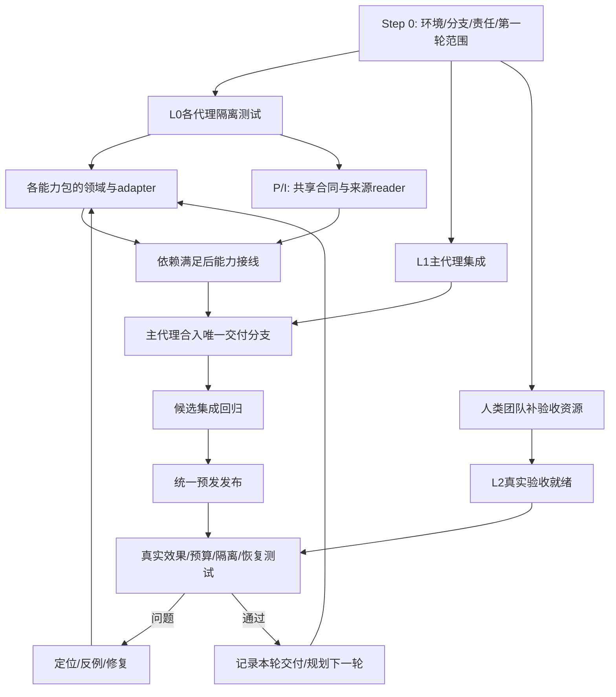

# Step 0：测试环境、协作拓扑与交付节奏的前置边界

> **整个项目从这里开始。**本步骤交付环境准入和协作约定，由主代理与团队共同补齐实际资源、负责人和第一轮计划；随后才大规模分派实现。下面是参考搭建路径，不是宣布环境已经就绪，也不替团队预定所有发布时间。

**目标：**让每个开发智能体知道在哪开发、在哪测试、怎样合入唯一交付分支、哪些验收依赖人，以及什么条件允许进入下一轮交付。

**输出：**一份由主代理维护的环境/资源就绪表、一张任务依赖图、第一轮发布范围、基线测试结果和可执行测试入口。最终产品准则见 [交付标准](10-delivery-standard.md)，总体范围见 [README](README.md)。

## 1. Step 0 的职责与边界

主代理负责核对目标分支、现有实现、依赖、资源状态和第一批任务；人类团队协助提供其掌握的验收资源/权限。子代理负责自己的工作树/隔离库和相应测试，不能私自修改共享验收环境。

Step 0 必须明确：

- 唯一交付分支为 `feat/tag-multitenant`；子代理可以有临时分支/工作树，但验收和发布均以主代理合入后的该分支为准。
- 本地、主代理集成、真实预发三个层级各自的入口、数据边界、权限和负责人。
- 哪些资源已经可用、待团队提供、当前阻断哪个具体验收，谁协助以及怎样检查恢复。
- Task/Loop、自动化、媒体、记忆的依赖和共享文件写者；同一能力不由多代理重复接线。
- 首次基线、局部测试、合入后测试、部署后真实测试分别证明什么；哪些是最终交付必须项。
- 每轮选范围、合入、发布、验证、修复和回退的最小流程。具体波次/容量/日期由主代理按真实状态规划。

本步骤不强制具体部署工具、表结构、函数名、worktree名字或提醒阈值。等价更好的方法可以采用；权限、幂等、独立Task、真实效果、可恢复和明确验收范围必须保持。

## 2. 测试环境的三个层级

| 层级 | 用途 | 最小组成 | 谁维护 | 通过后能声明 |
| --- | --- | --- | --- | --- |
| L0 子代理本地 | 业务反例、领域/协议测试 | 独立worktree、PG库/schema、必要时专用Redis、fake/httptest模型与渠道 | 各开发代理 | 代码与相应存储/协议回归通过 |
| L1 主代理集成 | 合入目标后验证模块互通与竞态 | 最新交付分支、已迁移隔离PG、专用Redis、共同fixture、集成配置 | 主代理/I，Q复核 | 分支集成通过，可以成为发布候选 |
| L2 真实预发 | 模型理解、真实执行/退出、IM文件/消息、到点/验签与记忆复用 | 明确预发profile、授权workspace/Agent/Tag、候选Runtime、真实模型/DWS、Langfuse/SLS、测试对象 | I/Q与人类资源负责人 | 对应版本/范围的真实交付验收通过 |

L0可以先就绪，A/B/C/D/F/G的隔离工作并行推进。L1在首次合入前就绪；L2所需账号/对象/工具在安排相关发布与真实case前就绪。缺三个外联对象只阻断跨场域真实验收，不阻断领域测试；缺vision路径只阻断实际视觉验收，不能伪报图片支持。

## 3. L0/L1参考搭建：以仓库脚本为准

开工先读 `Makefile`、`scripts/init-worktree-env.sh`、`scripts/ensure-postgres.sh`、`scripts/test-go.sh`、`.env.example`；脚本更新时用实际实现修正本说明。

### 3.1 获取源码与确认工具

```bash
git fetch origin feat/tag-multitenant
git rev-parse origin/feat/tag-multitenant
git status --short
go version
docker compose version
```

Go按项目当前版本（当前1.26.1），PostgreSQL与CI匹配（当前PG17/pgvector）。Node/pnpm只有涉及FE、完整本地应用或`make setup-worktree`时需要，当前参考Node22、package.json的pnpm10.28.2。无需为了纯Go领域测试先启动全套FE。

首次在server目录执行`go mod download`准备当前go.mod/go.sum的依赖；不为了搭环境顺便升级依赖。私有DWS/内部模块需要相应网络与源码访问权限，缺失时由团队协助配置，登记为构建资源阻断，不能靠替换成空实现让测试通过。

主代理分配临时worktree与包所有权。Codex可用其managed worktree能力；Claude/Grok可用标准Git worktree。不要让不同代理同时占用用户原始checkout或主代理delivery工作树。

### 3.2 标准Docker PostgreSQL路径

在自己的新工作树根目录：

```bash
make worktree-env
make migrate-up ENV_FILE=.env.worktree
```

`make worktree-env`生成按工作树路径区分的DB/应用端口；已有文件不会覆盖。`make migrate-up`通过现有ensure脚本启动共享本地postgres容器、建立本工作树DB并迁移。先确认.env.worktree确实指向授权本地实例，不能把预发URL填入该文件后跑setup/migrate。

若需要完整应用，则执行：

```bash
make setup-worktree
make start-worktree
```

它们额外安装pnpm依赖并启动后端/FE，不是纯后端测试的必要条件。共享postgres容器可供多个worktree使用，数据库名隔离；不要执行compose down/db-reset去影响他人的运行。

### 3.3 已有本地Postgres/无Docker路径

可以复用授权的本地PG实例，另建独立库；用该实例的工具建立数据库，再显式配置当前shell的DATABASE_URL，仅在确认host/database后于server目录执行：

```bash
go run ./cmd/migrate up
```

注意：目前`ensure-postgres.sh`的local分支总是走Docker标准容器，不适合直接套在本机55462这类自定义实例上。不要以为改POSTGRES_PORT就完成了Docker映射。非Docker具体连接/建库由该环境负责人提供，不能复用别人的测试库或临时脚本里失效的地址。

### 3.4 Redis与模型/渠道桩

现有Docker Compose只定义postgres，没有Redis。涉及缓存/跨节点通知测试时，另用专用本地Redis实例或经授权的隔离Redis服务，并显式设置`REDIS_TEST_URL`。完整本地应用需要`REDIS_URL`时单独配置，不把正式Tair地址当测试地址。

参考临时Redis容器方法（名称与host端口由Step 0登记为无冲突、仅供该测试的资源）：

```bash
docker run -d --name employee-step0-redis -p 127.0.0.1:16381:6379 redis:7.4.2 redis-server --save '' --appendonly no
docker exec employee-step0-redis redis-cli PING
```

这是临时测试实例参考，不要求项目长期固定该版本/名称。其他机器已有Redis时可以直接使用。`newRedisTestClient`会flush逻辑DB12；因此不能连接共享Tair/其他人的同DB，平行测试最好每代理独立实例或互斥测试时段。清理仅删除自己登记的容器/实例。

模型/渠道本地使用fake、httptest以及项目已有fixture，不需要真实密钥；默认测试不访问用户安装的agent CLI或消耗真实模型额度。保留真实请求形状/native roles/预算/journal/效果语义，桩输出不能用于宣称模型理解或渠道送达。

### 3.5 环境变量与最小基线

只在自己的可信本地env上使用以下加载方式，不回显文件/凭据：

```bash
set -a
. ./.env.worktree
set +a
export EMPLOYEE_MEMORY_TEST_DATABASE_URL="$DATABASE_URL"
export REDIS_TEST_URL=redis://127.0.0.1:16381
```

示例Redis URL只对应上述自己新建的实例，实际使用先登记确认。不同fixture的开关不同，不能把无配置导致的SKIP当PASS。

在server目录跑当前已存在的最小基线：

```bash
go test -race ./internal/employeetask -count=1
go test -race ./internal/employeeentry ./internal/service/employeeloop -count=1
go test -race ./internal/service -run '^TestDirectTaskCommitBeforeNotifyRecovery$' -count=1 -v
go test -race ./internal/service/employeememory -count=1
```

全schema handler/service库先正常migrate；Task/memory的独立schema fixture会安装它们所需迁移。handler/service不同包若使用同DB则串行，DB触发器/failpoint不得泄漏到另一个代理。首次登记命令、退出码、实际PASS/SKIP、DB名字/host（不含密码）及基线失败归属。风险变大或发布切片需要时再扩展 [I/Q回归清单](08-integration-and-release.md)，无需每次小改跑无关全量。

## 4. L2：需要团队协助提供的资源

| 资源 | 最小信息 / 权限 | 谁提供 | 缺失时影响 |
| --- | --- | --- | --- |
| 预发业务访问 | 显式pre endpoint/profile、workspace/Agent/Tag scope及当前管理/调用权限 | 环境/账号负责人 | L2配置和业务读写，不阻断L0 |
| 模型 | shared Coordinator/Employee配置、可用provider/配额；视觉case需真实vision路径 | 模型/平台负责人 | 实际理解/视觉case |
| Runtime | 可用候选FC，必要时隔离失败注入及持久本地设备 | Runtime负责人 | 实际运行/退出、failed/rolling case |
| DWS | 数字员工原生身份/授权、实际资源读/发权限、既有DM/群测试场域 | DWS/数字员工负责人 | 实际IM、附件、文件送达 |
| 跨场域对象 | 三个明确允许联系的对象/场域；同人两Task场景与停止测试窗口 | 业务验收负责人 | COL真实case；不能随机挑人 |
| Cron/Webhook | 测试routine/端点创建权限、测试签名secret、回调/网络可达性 | 环境/业务负责人 | 到点和外部事件case |
| 存储 | 需要时授权的OSS对象/产物服务、读取与验证权限 | 存储负责人 | 文件/验证/晋级产物case |
| 观测 | Langfuse、跨副本SLS、精确Task/Run/action状态查询 | 观测/平台负责人 | 证明链；仅截图不足 |
| 发布 | Aone pipeline/CR访问、实际分支绑定、发布队列协调 | 发布负责人 | 预发部署，不影响本地实现 |

这些资源不用都立即齐备。主代理应尽早收集、记录`ready/pending/unavailable`和具体检查结果，提前暴露依赖，安排当前可运行的case。团队提供帮助不等于让其把secret写入文档；用现有安全profile/secret provider配置。

L2使用明确预发host断言，不能依赖全局默认Multica profile。预发迁移由发布链runner执行，不手工改库；Runtime镜像由内部repo提交自动构建，不本地build。故障注入/重启只在授权隔离实例，不能为了验收干扰共享预发。

## 5. 任务与环境拓扑



产品依赖同时登记：Task目标/Run区分→收集waiting；typed wake→origin汇总/decision/follow-up；自动化reader→Cron/Webhook producer；资源源证明→附件/引用效果；verification与Task基础验收→生产memory evolution。可替换实现，但不能在依赖尚未满足时生成旧worker读不懂的工作。

## 6. 一个交付分支、多代理的工作协议

1. 主代理登记任务、写者、base SHA、接口与依赖；子代理从交付分支当前已提交版本建自己的工作树。
2. 子代理局部反例→实现→本地验证→原子提交→交主代理。提交不等于已经合入/部署。
3. 主代理审查、与最新目标同步、集成子代理提交；优先rebase/cherry-pick等保持清晰历史，禁止强推覆盖他人工作。独立同步代理核对目标remote和最终head。
4. 在交付分支合入后的版本跑关联集成测试，确认migration/reader/producer组合和旧功能；通过才成为本轮发布候选。
5. 主代理/发布负责人统一触发预发，核实际server SHA，再由Q跑真实验收。子代理不各自争抢流水线或修改共享Tag。
6. 问题保留证据，修复再合入→测试→发布→复测；通过后标注本轮实际交付范围，再分派下一轮。已经受理的工作不能因新分支/配置切换被改写或丢掉。

“一条交付分支”不等于所有代理直接在同一个脏目录编辑。任务开发可以并行，公共接线/合入/部署/有状态IM剧本需要主代理协调串行。

## 7. 节奏由主代理规划，Step 0只定最小规则

每轮遵循：**明确测试目标与可用环境 → 分派实现 → 局部验证 → 合入交付分支 → 集成验证 → 发布 → 真实验收 → 复盘/修复或下一轮**。

主代理根据依赖、实现风险、资源就绪和上一轮结果决定切片大小、并发数量、发布时间及case集合；可以合并/拆分A–G任务或调整S1–S6波次。稳定reader先行、新producer受门禁、真实效果可验证、旧能力不退化是必要条件，具体几轮、哪天发布不在本计划冻结。

每轮开始写清`目标结果/依赖资源/待合入范围/验证方法/发布负责人/失败回退/退出准则`；每轮结束留下`实际commit/server/效果/失败与修复/下一轮依赖`。资源临时不就绪时调整顺序继续独立工作，但不得把未跑真实case的范围标为验收通过。

## 8. Step 0退出准则

- [ ] 主代理和资源协助角色明确，唯一交付分支/远端及各代理所有权登记。
- [ ] 至少一套L0可运行必要PG测试；Redis相关任务有专用可用实例，或明确在该任务开工前提供。
- [ ] L1入口、隔离库与首次集成基线可执行；不存在“大家各跑成功但合到一起没人测”的空档。
- [ ] L2资源表及具体阻断case已登记，待人类协助的资源有承接角色；真实外联/失败注入尚缺授权时不擅自执行。
- [ ] 最终交付标准与当前首轮范围已区分，现有能力、未实现、已测试、已部署状态可追溯。
- [ ] 第一轮拓扑/接口/合入负责人、发布与复测流程可执行；具体节奏由后续主代理规划。

Step 0可在开发过程中持续更新。部分L2 pending不要求全员停工；未满足对应环境条件的验收保持pending。完成该准入不代表产品已经完成，也不要求本次文档编写者当场搭建共享预发或替团队决定日历。
