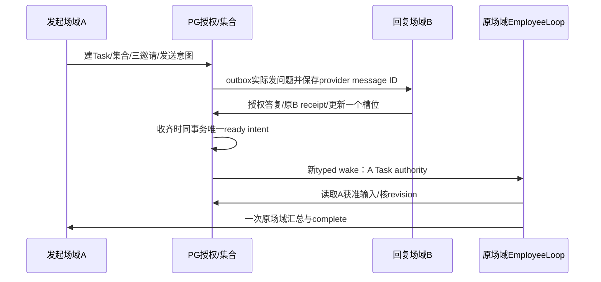

# A 包：跨场域输入、等待与一次原场域汇总

> **验收与实现方针：**先读 [Step 0](00-step-0-environment.md) 与 [交付标准](10-delivery-standard.md)。本包的内部API/表结构/阈值/步骤是参考路线，可由主代理协调优化；业务结果、权限、幂等、恢复、真实证据及已合入公共合同必须保持。

> **执行方式：**A1领域可立即独立开发；A2接线依赖P1/P2已合入。A3真实E2E由Q安排名单与发送时段。

**目标：**同 workspace/agent/tenant 的一个独立 Task 接收多场域获准输入，正确计数与续行；参与者始终只看自己的问题。

## 1. 文件所有权与参考

拟新增：`server/internal/taskinput/{types,store,collection,invitation,input}.go` 与同目录测试；`server/internal/service/employee_task_inputs.go`。A拥有领域表和索引设计，编号交I登记。handler工具/worker/路由由I接，不由A直接改共享文件。

先读：`employeetask/types.go`和P合同，`assoc/bind.go`、`assoc/store.go`、`inboundcoord/tools.go`，Gawk的`task_addressing.go`、`notification_context.go`、`task_ledger.go`。

**已核实坑：**assoc_task 的 issue_id 必填，BindOutbound 无Issue只记event，Coordinator input推进调用Issue评论。可以复用独立身份/事件/边的机制，不能把EmployeeTaskID塞进issue_id，也不能通过虚构Issue获得outreach。

## 2. A1：集合、邀请和输入领域

建议PG表：`employee_task_collection`、`employee_task_invitation`、`employee_task_input`。它们是输入与授权账本，不是第二个执行队列。ready intent 写入P共同定义的持久Task wake intent。所有表包含workspace/agent/tenant/task归属；不加FK。

- collection：ID、origin scene、original authority/delivery anchor引用、goal_revision、revision、状态、expected/received counts、deadline（可选且明确时区）。首版完成规则all_required，不从消息猜“够了”。
- invitation：稳定ID、collection revision、target scene、规范化participant identity、授权范围、有限question、delivery action ID/provider message ID、到期/撤销状态。
- input：invitation ID、原receipt/message ID、Host发生时间、answer body或引用、版本、唯一source key；源receipt所在Bscene保持不变。

invitation lifecycle：pending_delivery→delivered→answered；取消/撤权为revoked，明确到期为expired。发送unknown不可重发猜测是否送达；先查询原action。只有可信delivery映射或明确邀请引用才能关联。

collection lifecycle：open→ready→summarizing→completed；cancelled/revoked/expired不复活。expected slots首次冻结；同invitation重复答复不增加人数，明确更正按input版本替换有效槽位但保留历史。更正在summary发送前会改变revision，旧summary CAS失败；发送后新更正只形成用户明确授权的修订流程，不偷偷再次汇总。

拟服务方法（名称可在首次接口提交中统一，语义不可省）：CreateCollectionTx、RecordInviteDeliveryTx、AcceptInputTx、ReadOriginInputs、ReadParticipantInvitation、CloseCollectionTx。每个写法都含ExpectedRevision、Source和Host授权证据；跨scope返回not_found，同源有效内容不同conflict，late/expired返回closed而非新Task。

- [ ] 写 `TestCollectionRunSuccessLeavesGoalWaiting`、`TestInputCountsInvitationOnlyOnce`。
- [ ] 写 `TestSamePersonTwoTasksRequiresInviteOrReplyTo`：一人两个邀请，乱序reply-to正确；无引用不猜最近任务。
- [ ] 写 `TestOriginReadsAuthorizedAnswersParticipantCannotReadOthers`：C/D用不同隐私sentinel，B视图/序列化/编译输入都不得包含它们。
- [ ] 写 `TestConcurrentFinalRepliesCreateOneReadyIntent`、`TestReadyIntentCrashRecoveryKeepsRevisionAndOccurredAt`。
- [ ] 写授权过期/撤销、错actor/targetscene/org、Task取消、集合关闭、source冲突、工作区删除竞争的PG反例；先RED再最小实现。
- [ ] `go test -race ./internal/taskinput -count=1`，无Issue表fixture完成领域链；每类事务单独提交。

## 3. A2：发送与双 wake 接线

1. 发起者授权联系名单和问题后，Host验证可信身份桥、目标场域及发送权限。Question可由Loop组装；身份/target不能按正文授予。持久发送意图及invite ID后，使用现有response/outbound outbox，不在PG锁内调用DWS。
   身份桥读取权限和跨组织历史read grant不等于联系/participant权限；各自校验，首版不因此放开跨tenant。
2. B回复最好携provider replyToMessageID；Host映射invite+actor+target scene。无reply-to只在唯一有效候选且上下文可证明时接受；多个候选交Loop澄清。模型不能自由选择另一Task UUID。
3. B wake仅见本问题、自己的答复、自己的邀约状态；禁止提供整Task、C/D答案、origin私聊历史或私人记忆。最后回复者也不在B同轮做全量汇总。
4. AcceptInput同事务记录输入、计数和唯一ready intent。不要持有B scene锁再进入A admission；由现有周期reconciliation从intent创建A typed receipt+job，提交后Notify。不是只发一次goroutine消息。
5. 派生source建议employee.collection/type collection.ready，稳定ID=collection ID/revision；首次时间冻结。A范围从原Task授权/当前fence/目录定位，不能把B principal搬到A。
6. A wake加载冻结input边界下的授权答案。freshread→汇总effect/CompleteGoal校验同revision与mandatory waits；唯一outbox意图保证一次。原场域撤权/租户变化则held，不猜替代收件人。
7. 现有记忆命名空间均不迁移。收到同事答复不自动学习，也不自动成为永久共享资料。

工具建议create_collection / read_collection / accept_collection_input，由I以完整native schema注册；effect回执包含真实invite/input/revision/counts，不能自述“已发出”替代delivery proof。read_task等待视图由P提供。

- [ ] I用真实handler/native来源测试接线：当前外层授权、群@门禁、read_ref/source、批次冲突、lease丢失、tool journal失败全回滚。
- [ ] 断言B模型请求、回复及历史无C/D sentinel；A有获准答案；source receipt仍是B scene。
- [ ] 双wake分别记录generation，正常最后答复链最多2×3；普通部分答复不另起总结模型。
- [ ] 新工具/typed输入全部在线副本兼容后开启producer，不影响Coordinator assoc路径。

## 4. A3：真实验收

Q登记三个同组织真实对象和允许场域、取得具体外联授权；名单未确定时开发PG/协议，不任意联系同事。独立测试账号/群可以补技术测试，但三个场域内同一人不等于三名真实参与者。

剧本COL-01：数字甲7、乙11、丙13，乙/甲乱序答；A询问进度确切2/3；丙后A收到合计31一次，B/C/D不收到总表。COL-02：同一人两Task不同invite引用乱序答，不串；无引用歧义澄清。COL-03：同receipt技术重投无新增人数/汇总；Task取消/撤权后迟答不复活。

须交collection/invite/input/receipt/Task/wake/action/provider message/trace关联；实际消息、状态、权限和一次投递共同成立才算A完成。不能以一个Run成功或工具return200关闭A。
