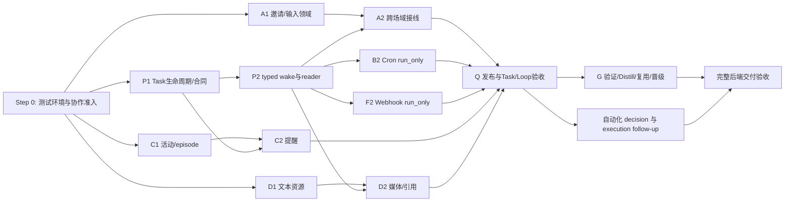

# EmployeeLoop 后端完整交付与并行开发计划

> **给开发智能体：**首先完成 [Step 0：环境与交付前置边界](00-step-0-environment.md) 的准入登记，再读本总控、[最终交付标准](10-delivery-standard.md)、[共享上下文](00-context-and-contracts.md)和自己的任务包。可以使用当前平台的 subagent-driven-development 或 executing-plans 技能；其他模型平台按同样的结果标准交付。

**目标：**交付可部署、可恢复、可观测的 Employee 后端：持续理解同一事项，独立 Task，跨场域收集，明确停止，执行事件推进，Cron / Webhook，停滞提示，附件理解，以及有证据的记忆复用与受控晋级。

**架构：**事件层只受理和定位场域；Host 管授权、持久事实、队列与投递；EmployeeLoop 理解上下文并选择动作。PG 保存 Task 和控制/等待/效果账本，Redis 加速既有唤醒；所有执行仍落到现有 agent_task_queue，所有发送复用现有 outbox。

**技术栈：**Go 1.26.1、pgx/PostgreSQL、Redis/Tair、sqlc、现有 scheduler、DWS、Langfuse/SLS。GawkBot 参考固定在 `71e82a1809565281cbd0bf8185d3c125b715d934`。

编写日期：2026-10-03（Asia/Shanghai）。这是开发与交付计划，不是新增能力已完成声明。核对的目标分支基线为 `29ec9c49988c4f9274a1f4ba4b383418eebe5599`，开工时必须 fetch 最新 `feat/tag-multitenant`。最近有完整发布及 IM 证据的本会话版本是 `7074cd29ea844552bda1682d04887e7d4e2965c1` / 预发流水线 `3110341321`；后续目标提交不能自动视为已部署。

> **执行板：**本机实际环境、分工、迁移编号预留（9900–9989）与发布循环见 [11-execution-board.md](11-execution-board.md)，它更正本目录中写于另一台机器的过时事实。

## 首位：Step 0 与总体实施方针

先准备可运行的隔离测试环境、主代理集成入口和需要团队协助的真实验收资源，再按任务拓扑分派。[Step 0](00-step-0-environment.md)给出本地PG/Redis/模型桩搭建参考、环境就绪条件、资源协助表和单一交付分支协议；部分真实资源pending时继续独立开发，不伪报验收通过。

**按交付结果验收，实现细节主要参考。**既有架构与固定GawkBot提供方向，函数名、表结构、DTO、阈值和示例剧本允许主代理及强模型优化；权限、独立Task、可靠事实、真实效果、预算和兼容边界必须守住。公共接口一旦合入，依赖方按已约定版本实施，优化需同步变更和验证。

**主代理规划迭代节奏。**子代理在隔离工作树开发，经局部验证交主代理合入唯一 `feat/tag-multitenant`，合入后集成测试、统一发布、真实验收，再修复或推进下一轮。下面的人员/波次是参考安排，主代理依据资源和依赖调整；Step 0定义流程边界，不替团队冻结日历或发布次数。最终以 [交付标准](10-delivery-standard.md) 判断完成。

## 设计沿革与阅读顺序

本分工接续之前的 GawkBot / Employee 架构设计，以下文档应随任务包一起阅读：

| 文档 | 作用 | 本轮对应 |
| --- | --- | --- |
| [R5 方案导读](../../2026-09-30/employee-loop-overview.md) | 从 GawkBot Go BotLoop 到持续办事员工的整体思路 | Loop、Builder、Task、等待与队列的职责 |
| [R5 详细架构设计](../../2026-09-30/employee-loop-design.md) / [HTML 阅读版](../../2026-09-30/employee-loop-design.html) | 事件/场域、独立 Loop、轻量 HostGate、Task/Run、输出与权限边界 | P 的共享合同及各包接线；保留原设计背景 |
| [R5 十三任务实施拆解](../../2026-10-01/employee-loop-delivery-plan.md) | 最初的迁入、mailbox、执行、通知及验证路径 | 核对已落地部分，避免重建入口/内核/队列 |
| [R2 EmployeeLoop 与 Task Service 设计](../../2026-10-02/employee-loop-task-service-design.md) | 独立目标与追加账本、Issue/Direct 双后端、新旧记忆隔离、三次模型预算 | 本轮 Task 生命周期、Compiler、自动化、记忆的直接设计依据 |
| [R2 Task Service 交付路线](../../2026-10-02/employee-loop-task-service-delivery.md) | 把 R2 拆为可验证、可部署的增量 | 本轮按 reader/producer/E2E 切片继续交付 |
| [当前实现合同](../../../employee-loop.md) / [真实验收记录](../employee-loop-e2e-results.md) | 已实现行为和实际交付证据 | 判断哪些无需重写、哪些仍需完成 |

推荐顺序：Step 0 → 最终交付标准 → R5 导读/R2 Task Service 设计 → 当前合同/验收 → 本总控与自己的任务包；遇到对象关系或移植细节再查 R5 全文和 SOURCE_MAP。旧方案中的“未实施”、旧 SHA、personal 场域等是当时状态，不覆盖现行 AgentScene/scene_id 合同和后续已通过的验收。

## 1. 原 A–G 分工怎样调整

| 原包 | 调整 | 原因 |
| --- | --- | --- |
| A 跨场域 | 保留，先领域后 Host；前置 P 包 | 当前 Run 成功会完成 Task，必须先区分整件事项和一次执行 |
| B Cron | 保留，来源 reader → run_only producer → decision wake 三段 | 避免旧 claim、终态和通知读者误处理新来源 |
| C watchdog | 保留，先观测/意图；首版确定性提醒 | 不把无输出推断成失败，也不增一层提醒模型 |
| D 附件 | 拆文本、图片、reaction 三批 | 文本下载成功不等于视觉能力或表情效果成功 |
| E stop | 转为 Q 包的已完成回归门禁 | 独立 stop 已实现、发布并真实确认进程退出，无需第二人重写 |
| F Webhook | 保留，独立验签/绑定，复用自动化来源 adapter | 不伪造 Cron occurrence，也不借 payload actor 授权 |
| G memory | 扩展为验证事实 → Distill → 复用 → 受控晋级/撤回 | 原文仅离线候选，不足以满足完整进化交付 |
| 新 P | Task 生命周期、typed wake、Task 运维读取、共享来源合同 | A/B/C/F/G 的共同依赖；由一名基础/集成负责人持有 |
| 新 I/Q | 接线、回归、发布、E2E、回退 | “代码完成”到“完整交付”需要明确责任人 |

当前 stop、基础记忆、Execution Event 事实记录、原生文件策略均有实现，具体状态见上下文文件。原分工文档以 e2cda04 为基线且把 stop 列为待开发，该状态已过时。

## 2. 任务包与文件

| 包 | 文档 | 责任 / 首批可独立交付 | 首批依赖 | 可并行程度 |
| --- | --- | --- | --- | --- |
| Step 0 | [00-step-0-environment.md](00-step-0-environment.md) | 本地/集成/预发测试环境、团队资源协助、分支协议与第一轮范围 | 无 | 先准入；真实资源可以分项补齐 |
| P | [01-foundation.md](01-foundation.md) | 生命周期 v2、Task wake、来源 reader、Task 查询合同 | 无 | 共享接缝唯一负责人 |
| A | [02-collection.md](02-collection.md) | 输入集合、邀请授权、计数、ready 意图 | 初期仅依赖书面合同；接线依赖 P | 领域及 PG 测试可立即做 |
| B | [03-cron.md](03-cron.md) | schedule 的可信来源、确定性派发、到点恢复 | reader 与接口依赖 P | 来源测试和 compiler 可立即做 |
| F | [04-webhook.md](04-webhook.md) | 验签、来源绑定、冻结输入、真实触发 | producer 依赖 P 自动化来源 reader | ingress 回归可立即做 |
| C | [05-watchdog.md](05-watchdog.md) | 活动水位、episode、一次提醒 | 状态接线依赖 P；发送依赖 I | 纯 reducer、PG episode 可立即做 |
| D | [06-resources.md](06-resources.md) | 文本附件、视觉输入、引用定位、轻反馈 | 媒体/引用接线依赖 P/I | 安全读取和 DTO 可立即做 |
| G | [07-memory-evolution.md](07-memory-evolution.md) | verification、Distill、真实复用、晋级/撤回 | 激活依赖 Task/Loop 本批 Q 验收 | 证据与治理测试可立即做 |
| I/Q | [08-integration-and-release.md](08-integration-and-release.md) | 工具/worker 接线、独立审查、预发与 E2E | 每个候选包 | 从开工持续参与 |
| 分派 | [09-agent-handoff.md](09-agent-handoff.md) | 可复制的完整指令、接手和交付格式 | 本总控与上下文 | 发给外部智能体即可 |
| 最终验收 | [10-delivery-standard.md](10-delivery-standard.md) | 结果标准、可优化实现、最终签收 | 覆盖所有包 | 作为验收权威，不按参考实现逐字评分 |

## 3. 推荐人员安排

先按职责分配，不按模型品牌绑定。Claude、Grok、Codex 都可以承担任一开发包；实现者与最终审查者应分开。

- 1 名基础/集成负责人：P 和 I，独占共享 worker、Host、路由、marker 和公共 DTO。
- 1 名任务协作开发者：A；后续参与引用续接与 Task 交互回归。
- 1 名自动化开发者：B，再 F。资源足够时拆为两人，但不能各写一套自动化派发核心。
- 1 名资源/体验开发者：D。
- 1 名恢复/观测开发者：C；也可由 D 完成 D1 后承接。
- 1 名独立验收者：Q；Task/Loop 本批通过后再给 G 一名开发者。

只有三名开发者时：P/I 一人、A/C 一人、B/F 一人；D/G 后续串行。不能为了名义并行让多人修改同一共享文件。

## 4. 开发波次与发布切片

| 切片 | 应部署的具体结果 | 必须通过才进入下一片 |
| --- | --- | --- |
| S0 环境与准入 | 测试环境/团队资源表、所有权与拓扑、现有基线、首轮结果标准 | 按 Step 0 分层准入；对应真实资源未ready的case保持pending |
| S1 reader / foundation | v1/v2 读者、typed wake 解码、waiting 查询；新 producer 关闭 | 旧快照字节、旧任务结果/通知、混版恢复不退化 |
| S2 跨场域 | 授权邀请 → 乱序输入 → 发起场域汇总一次 | 三真实对象、同人两 Task、取消/撤权、隐私 sentinel |
| S3 自动化与基本体验 | Cron run_only、Webhook run_only、文本附件、确定性 watchdog | 实际到点/暂停、合法签名/重投、附件内容、一次提醒 |
| S4 持续推进 | 预授权 execution follow-up、routine decision、图片、引用续接/停止、reaction | 条件链有界、权限不变、模型/效果账本完整、真实视觉与引用回归 |
| S5 记忆进化 | VerifiedRun、持久 Distill、后续 Task 复用、受控共享晋级/撤回 | 私有隔离、证据真实、撤回不再召回、旧源不复活 |
| S6 完整交付 | 全部必须项通过、健康指标/运行手册/回退演练 | Q 的发布清单签收，不能以“多数通过”关闭 |

S1–S6是参考切片，可根据任务拓扑、资源和结果合并/拆分/调整顺序，不要求固定六次发布。共享合同依赖、reader先于producer、合入后的集成测试和真实验收仍需满足；主代理规划每轮范围、风险、发布窗口及复测。

## 5. 什么叫“基本齐全”

本次明确承诺后端能力闭环，而不是复制 GawkBot 的所有产品界面和办公室角色系统。

| 能力 | 当前证据 | 本计划最终要求 |
| --- | --- | --- |
| 快速回复 / 共用模型 / native history / Langfuse | 已通过所列真实剧本 | 各次发布不退化，实际调用预算仍可审计 |
| 独立 Task / 工作包 / Run / steer / stop | 已通过核心 IM、PG 和 Redis 回归 | 增加 goal lifecycle 与等待、引用输入、运维读取，不耦合 Issue |
| 跨场域收集 | 尚未实现完整链路 | 受控参与者输入、乱序/重投/并发、一次原场域汇总 |
| Execution Event | 终态事实消费通过；不触发模型 | 显式预授权的后续工作能 typed wake；普通终态保持零额外调用 |
| Cron / Webhook | 旧设施已有；Employee adapter 未验收 | run_only、decision、停用/暂停、来源证明、真实 E2E |
| 主动跟进 | 尚未接通 | 停滞提醒和等待状态可观察；不自动扩大外联授权 |
| 附件 / 图像 / reaction | 产物交付已验；输入理解未独立验 | 文本内容、真实像素与图形关系、表情效果/Quiet，引用可安全定位 |
| 场域能力 / 自管理 | MCP 实际读写清理有证据；H5 登录未验 | 后端目录与权限继续对齐；原生身份、文件及连接能力可用 |
| 记忆 / 进化 | private capture/correct/forget 通过；inferred 与移植库存在 | verification、Distill、召回复用、共享授权、晋级/撤回/恢复 |
| 发布 / 恢复 / 运维 | 基础发布与局部恢复有证据 | 多副本、滚动兼容、失败/取消真实案例、完整证据索引和可执行 runbook |

跨租户协作、任意多 Agent 团队编排、办公室角色模板、强制 Wiki、全量 GawkBot FE、向量检索/额外总结服务不属于本次必要范围。它们不阻塞上述后端能力交付。用户新要求应先登记新增验收项。

## 6. 完成与分派规则

- Step 0先落实环境/分支/协作边界；具体实现路线与迭代由后续主代理规划，遵循最终交付标准。
- 每个包先交领域与接口测试，再交接线，再交部署和 E2E；分别记录 `implemented / locally_verified / integrated / deployed / e2e_verified`。
- I/Q 是完整交付责任人；开发者不能只交一个库就宣布功能上线，也不能自行与其他开发者争抢部署。
- 每个提交后用独立同步智能体 fetch/rebase 最新目标、验证再非强推交付；保留别的 session 提交。最终返回 `git log -1 --pretty=%B`。
- 本目录的合同是拟开发增量；当前已上线行为以仓库 `docs/employee-loop.md` 及代码为准。开工时把变动反馈到本目录，不拿旧计划覆盖新事实。
- 跨场域真实 E2E 尚缺三个明确测试对象及允许联系的场域；A 的领域开发和隔离测试不因此停工。Q 在对外发送前补齐名单。
