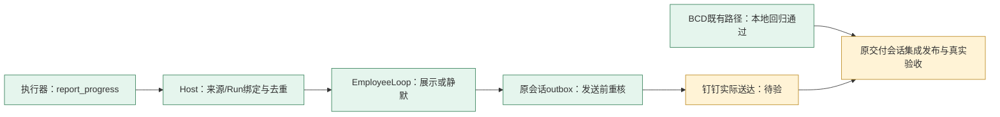

# B/C/D + 主动进展 P：本轮开发执行入口

用户最新要求已经进入开发：同步代码、取得流程、设计测试后实施，并筛选其他并行会话提交、保持远端与执行记录同步。本轮不再使用“只做Plan”的旧停止条件。

## 范围、基线和所有权

- 当前开发树为本session独立worktree，分支 `codex/employee-short-progress`。10-04 11:24后远端tag更新为79645b5b7b（共享流程提交），已重基到该版本；筛选复用原交付已提交的四项修复及报告115252fbd7，不碰原交付树WIP。共享流程582cba1f73/远端79645b5b7b已按语义合入：历史批次状态保留，新任务按共享合同执行，不继承前批停止新范围的限制。
- 原交付会话继续拥有其BCD/记忆收口和共享预发窗口；A2UI会话拥有人工选项/答复，评测展示会话拥有HTML呈现。本轮新增P的可调用producer、display-only wake及中间outbox；对B/C/D仅复用/核验影响范围，相关仍有真实失败则不签整体完成。
- 本session负责 `employee_progress*.go`、必要task_wake/MCP/claim/injection接缝、10020–10023迁移、契约/来源映射与定向测试。修改共享接缝前后核远端/其他提交，绝不覆盖WIP。
- GawkBot固定71e82a1的活动/状态/关键通知分层是参考；本仓用TaskToken、scene.Ref、PG receipt/journal和已有Loop/outbox实现。具体研究见proactive-progress-design.md。

## 最小切片与完成标准

单scene、一个请求人、一个正在运行的Employee Direct Run提报可读阶段信息。专用MCP仅暴露report_progress，不给Direct重新挂整套平台MCP。Host冻结作用域/Run/revision并持久接纳；`execution.progress`只允许reply/quiet，不计自动推进轮次、不派新Run、不完成目标、不写人类记忆。沿既有TaskWake和HostNotice/outbox发原会话，并在发送前拒旧Run/纠正/停止/终态。

第一切片限制：非automation的场域Direct、支持现有managed MCP的Runtime；summary是执行器报告而非独立验证完成。每Run有限额，原样内容重复无需新推理；不扫描thinking/tool/raw text，暂不做通用跨provider抽取/卡片问答/Capsule。报告接纳、决定、实际送达分开，旧ID冲突拒绝；final通知独立。

## 测试和环境

| 测试 | 要抓的真实风险 | 证明边界 |
| --- | --- | --- |
| MCP→真实PG→真实Loop→outbox→provider readback（本地） | 非终态报告能展示/quiet；无新Run、目标/预算不变；工具可发现、scope不可由body改 | scripted provider只证装配/事务/恢复，不算真实模型语义或钉钉E2E |
| 同ID重投/冲突与重启 | 一receipt/job/意图，0额外generation或重复效果 | 真实PG，假外部HTTP可控 |
| 纠正/停止/完成穿发送窗口 | 已判pending旧进度不得发送；progress不抑制final | 原Task/Run和outbox事实，不用字符串自报退出 |
| 权限/租户/非Direct/已停止 | 当前token和Host origin匹配，错误作用域拒绝，旧reader不受理新kind | 正反例和混版门，缺库/skip不算通过 |
| 当前现有B/C/D | 读真实进度、同Task新Run、在途纠正 | 优先复用未受影响已证路径；保留前批模型失败 |
| 后续当版短E2E | 实际Runtime发现/调用report_progress，Loop有限决定，原IM准确一次交付 | 只在本轮独占场域和共享publisher安排就绪后运行；未做就明确待验 |

使用Go1.26.1缓存工具链和新独立本地数据库，禁止默认共享库/预发库；无需Redis新增状态。10020–10023单独迁移；无FK，并发索引独立文件。结束删除本轮库并回读。真实路径按docs/employee-delivery-operations.md固定source/release/pods/markers/Runtime/actor/scene/能力，不沿用历史值。Runtime线协议不改；只复用已存在MCP注入，实际旧/新能力仍需证明，不自动cutover共享镜像。

## 同步、提交和停止边界

完成设计→最窄实现/检查→独立审查→本轮独立远端分支提交/MR→按授权及共享窗口集成/当版复验→证据与恢复。每个里程碑更新本文件，记录远端head、筛选/排除提交及未证明项。实时同步指提交/远端变化时拉取并按语义整合、每分钟内有意义反馈，不在他人的分支强推或自动关闭其验证门。

相关缺陷在本轮范围内处理；新能力、混版或长外部等待预计越界时先交可审查切片和精确接手动作，不无限构建/发布。缺publisher窗口不会阻塞独立开发和只读取证；共享环境写入需要明确操作负责人。

## 当前里程碑（10-04 11:35后）

| 项目 | 当前事实 | 收益 / 未完成项 |
| --- | --- | --- |
| B 查真实进度 | 复用read_task，当版影响范围本地回归通过 | 查当前Task；真实问句选择/旧候选歧义仍按原失败复验 |
| C 完成后续改 | 同Task真实新增Run/执行方法继承的本地回归通过 | 沿原工作续做；保留BASE-TASK已发生的模型直答失败，不据此签完成 |
| D 在途纠正 | 复用steer/原Task和退出屏障，影响范围本地回归通过 | 新要求作用于正确工作；当版真实新旧执行与交付待验 |
| P 主动可读进展 | 专用producer、16条硬界限、持久去重、展示/quiet、原outbox、发送门已实现并本地通过 | 有用阶段可呈现且不刷原始日志；真实Runtime发现/调用、模型语义和钉钉效果待验 |
| 独立复审 | 三项身份/发送/marker问题已修，最终两处窄复审无剩余阻断 | token owner不代替业务principal；失效身份取消；已展示上下文取实际送达回复 |
| 远端/集成/真实验收 | 远端提交准备中；用户已授权原交付会话负责集成发布 | 不占用共享预发，也不以本地测试替代真实验收 |

本地证据：**32主用例＋29子用例通过，无skip；race覆盖4主＋6子；server/migrate构建及handler/employeeentry vet通过**。用真实独立PostgreSQL、真实Auth/Host/事务/Loop装配/outbox；LLM和外部Send/Query为可控fake。最新两项补验分别证明identity_changed持久取消，以及近期上下文取实际送达正文而非候选全文。详细映射见[本轮验收数据](implementation-acceptance.json)，持久本地证据见 `/Users/yuanzhan/d1/employee-e2e-evidence/EMPLOYEE-PROGRESS-20261004-LOCAL/summary.json`。本轮独立数据库已删除，pg_database回读计数0；共享数据库/预发/Redis/Runtime未改，结果写入交接报告。

图中绿色表示代码/本地机制已验证，黄色表示真实待验，不能据节点数算线上完成百分比。勾选范围仍为BCD；未选A/E/F不扩展。

## 并行提交筛选与集成提示

- 本树仅引入原交付已提交的四项修复（46ee/5048/865b/7880）和完整结果1152；重基后commit身份改变，业务diff与重基前基线一致。它们不是本session新增feature，发布方已有则仅摘取本轮feature提交，不重复cherry-pick基础历史。
- 原交付会话当前名为「发布和验收」（用户授权时名为「接手会话并评估剩余工作」，同thread id），已核其reader18和迁移10020–10023未占用；发布前仍核最新Code远端和其他候选。
- 11:32后只读发现A2UI会话已有较大WIP（reader17、迁移9977–9982、human_response与outbox接缝），未提交，不纳入此批。router/worker/outbox等为集成交叉点；组合后必须审查语义和重新声明综合reader，不能直接用旧17覆盖19。
- 「优化细节」在主checkout另做前台首轮反馈；与本轮后台执行阶段进展含义不同。本轮未引入其WIP。评测展示会话仍拥有其HTML应用。本session仅更新自己已有的短任务选择页和JSON状态。
- 主checkout存在配置/OAuth/runtime等无关WIP；完全未复制。Code tag远端本次确认79645b5b7b，employee/backend-delivery远端11d6eb5061，本轮分支此前尚不存在。没有强推、共享tag改写或共享环境操作。

## 原交付会话接手动作

1. 读取后续交接报告的精确feature SHA；以当前交付分支为底按语义摘取本轮feature，确认10020–10023及reader marker与A2UI/首轮反馈无冲突。
2. 用当波manifest确认release/全副本marker、Runtime managed-MCP实际能力、身份、tenant和独占scene；只对新claim做工具发现，旧冻结claim不热改。
3. 按PRG-01先跑一个仍在running窗口的短任务，阶段核验→report_progress→Loop决定→原IM实际一次交付；对PRG-02/05/06补去重、纠正/终态和明确静默反例。采完整generation/Task/Run/report/journal/action/messageId读回，不用ACK签完成。
4. 再按已选B+C、D小轮串联，只复验原失败和当版影响面；模型语义失败继续保留，不扩大为全88回归。
5. 每例落盘更新当前执行入口并回报；恢复仅本波测试状态。共享部署和真实验收由用户授权的原会话执行，本树结束时无后台共享写操作。
