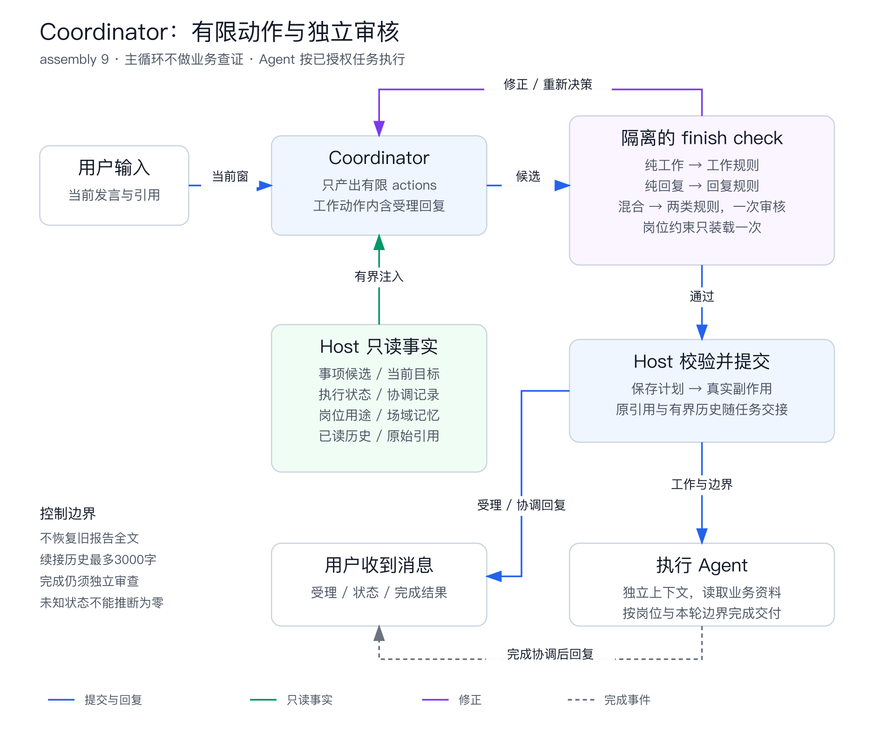

# Coordinator 生产病例回归与预发验收

生产取数日期：2026-09-09；修复和预发验收：2026-09-10（北京时间）。

**结论：修复已部署预发，回复和真实派发已恢复到可用，但未达到全面验收通过。** 最终针对性回放48次：29 PASS、13 FAIL、6 INCONCLUSIVE。仍有旧事项代答、短答漏接、未知状态误判；执行器也存在绕过岗位指定工具的问题。不能把这次发布描述为“不干活问题已全部解决”。

## 发布与对象

| 项目 | 结果 |
|---|---|
| 修复分支 | `codex/coordinator-reply-recovery` |
| 业务代码提交 | `9ddb9e8c9`、`5d29564a5`、`fd733a39b` |
| 预发集成提交 | `240dc2e2f`；提交前再次fetch远端，已包含`develop=16a867e88`及原预发群参与/接收身份改动 |
| CR / 最终流水线 | `36057190` / `3107558323`，应用342160，预发pipeline66 |
| 构建 / 部署单 | `171298758` / `160909331` |
| 最终部署 | 2026-09-10 01:40:05，预发部署及平台集成测试SUCCESS；验证节点保留未放行 |
| 实际运行版本 | 新真实trace确认`policy=2026-09-09.6`、`assembly=9` |
| 测试Agent | [预发测试智能体](https://pre-fde-workbench.dingtalk.com/sombrero-galaxy-zleb/agents/e2293e9e-1e79-4926-b0e6-da4cb693add0)，原配置未修改 |
| 身份与环境 | `dws-env as 主角`，向实际解析的东翔测试号单聊发送；结束时仍为pre |

原Agent的Instructions为空、短合同未配置，启用技能为虚构差旅制度查询测试包。生产岗位压力组只在隔离回放中使用真实生产配置，不把它偷偷写入测试Agent。生产环境本轮只读，未发布或发送测试消息。

构建组件与部署单已读回。独立CI构建详情接口返回403，未取得另一份制品源码SHA展开证明；因此分别记录发布分支提交、构建ID、部署成功和实际运行策略，不把“git push成功”替代运行验证。

## 服务端实际修了什么

1. **恢复有限动作的可修正路径。** 已知语义动作被模型误作独立工具时，严格归一到`finish.actions`候选，再走来源、目标、授权及审核守卫。工作intent仅做窄分类修正，不自动更改basis、猜目标或恢复通用reply。审核协议错误最多在同一12秒期限内修正一次，不扩大8轮上限。
2. **补齐协调必需的事实。** 技能目录的空/明确Managed占位，从最多4096字符的完整frontmatter提取用途，保留单项80字、总1200字预算。`work_state.latest_execution`独立读取最近执行；`context_read(kind=coordination_state)`按Host当前job和场域读取前3个窗口，区分计划数、持久确认数与未知。
3. **减少交接丢失。** 当前发言的原引用、作者和证据ID由Host交接。续接还携带本轮确实已披露、同场域同水位的历史快照，含标签最多3000字；不读取或补造未加载历史，不增加主循环上下文。
4. **补上混合审核职责。** 纯工作、纯回复各用自己的规则；真实混合actions在同一次隔离审核中加载两类规则，岗位全文仅一次，不新增模型请求。修正了“非工作规则要求work_checks为空”与混合工作检查之间的冲突。

新增查询只读、无迁移；`coordination_state`查询上限2秒，返回最多2000字，纳入原8000字读取快照预算。技能目录、场域记忆、当前窗和岗位审核有各自预算，8000字不是整个Agent上下文总量。

[SVG源图](assets/coordinator-final-flow.svg)。图中边界是系统规则；下文失败证明语义审核仍可能漏检，不能将规则存在当作正确性保证。

## 关闭GET是否有副作用

**有。** 关闭`issue_get / issue_comment_list`以后，如果最新目标、聊天限制、真实执行状态也没有替代读取，Coordinator会根据残缺信息推理。实际发现：技能用途只有Managed占位；Issue仍是in_review/todo而执行已经completed；关联列表数量被当作本轮派发数量。

合理边界是：Coordinator取得目标、约束和状态等有界事实，执行Agent按任务读取业务原文。恢复全部旧报告不能解决错误续接和证据串项，反而增加旧内容覆盖当前请求的机会。当前执行器原有`multica issue get`路径仍保留，因此Item漏项不等于真实执行一定丢失旧Issue边界；最新聊天限制不在旧Issue时才需要额外交接。

## 生产问题与数据覆盖

9月9日00:00–21:05的SLS完成7页读取，共622条去重裁决日志、397个非空trace ID；另外根据最新截图定点补查21:47–21:53的5条实际交互。裁决日志包含短路、后台及回放记录，不能称为622个用户问题或故障。原始消息、模型请求和工具返回均在仓库外私有证据目录。

| 病例 | 原故障 | 最终验证 |
|---|---|---|
| 多人听记查证 | Coordinator拿旧结论直接回答，没有新查证 | 基线冻结回放已形成委派；不认证原产品答案 |
| iPad导出与引用图片 | 反复读取旧事项，最终8轮/503 | 最后3次生产岗位回放均start_work，未再挂旧数据异常UUID；当前原引用完整交接 |
| 当前数据异常调查 | 混入旧姓名显示调查 | 集成回放6次均保持当前调查目标；15份媒体Item均含原引用 |
| 选取业务日志 | 误选旧技能执行记录，或basis/工具调用卡死 | 最终重复请求3/3形成正确新工作；首请求1通过、2次旧事项续接依据不足 |
| 日志任务进度 | 用无关skill状态断言没有日志任务，或把催问变重试 | 最终3/3失败，其中一次8轮deferred |
| 刚才派发数量 | 将3条旧关联事项当作本轮派发数 | 最终3/3仍失败，没有实际选择新coordination_state读取 |
| 消息没有发完整 | 无关状态清单、空承诺或不必要澄清 | 最后3次为2失败、1证据不足 |

生产问候并非全部丢失：21:47:56的问候已在21:48:07送达，约11秒，其中Coordinator约4.1秒。真正卡死的日志请求及后续错误澄清已用DWS消息与精确trace对应，不能将它们全归因于消息通道故障。

## 回放方法与结果

使用固定源码、真实模型、冻结只读数据，保存实际messages/tools/choices、模型名称、输入哈希、时间及token。Oracle不进入模型。目标原样配置、生产岗位叠加、受控合成对照分开；Go退出0、产生Decision或reviewer allow都不算语义PASS。

| 阶段 | 覆盖 | 判定边界 |
|---|---|---|
| 实际预发基线`.5/6`，`7757dd400` | 26例×3=78 | 真实病例组17P/6F/4I；控制组32P/7F/12I |
| 集成候选`.6/8`，`5ee26b108` | 31例×3=93 | 2次deferred；已逐例复核；N组发现查询匹配缺陷，未汇总成有效总通过率 |
| 最终候选`.6/9`，`240dc2e2f` | 16例×3=48 | **29P/13F/6I**，1次deferred；是重点病例验收，不代表线上总体正确率 |

最终48次分组：

| 组别 | PASS | FAIL | INCONCLUSIVE |
|---|---:|---:|---:|
| 最新5条生产交互 | 7 | 6 | 2 |
| 修正后的信息可见性/恢复授权对照 | 9 | 0 | 3 |
| iPad与消息不完整反馈 | 3 | 2 | 1 |
| 修改、重发、混合、短答、送达确认 | 10 | 5 | 0 |

最终共178次模型请求，中位单样本耗时6.525秒；模型返回输入1,008,932、输出15,173 tokens，未折算净计费。输入SHA256：`175d9b8faa935d93fd8e00eaae5e7317be1349255ef75da94edbf3bd8907b3ac`。

确定改善：修改3/3、原报告重发3/3、混合两工作加澄清3/3形成正确终局；6份已加载历史的续接Item完整保留限制、作者、证据及水位。混合仍有一次首审误判后才恢复，不能称为全程稳定。隐藏口径3次依旧未读取、未设恢复前置，保持未知。

数据质量修正也保留在案：

- q-only规则曾错误拦截7d查询。最终N输入按q/since/limit严格匹配，600种组合静态验证及47次实际读取逐项核对；原结果未覆盖。
- “历史工具能返回限制”不是“模型已看见限制”。新C08对照真正预载可见历史；旧夹具不追溯改成通过。
- 明确恢复失败任务与催促运行中任务重新分开；不能强制模糊“继续”必定派工。
- 隔离harness的Queries为空，新协调窗口读取只能未加载；不能宣称成功计数路径已通过。真实SQL另在本地PostgreSQL事务中执行并ROLLBACK，验证作用域、排序、参数和JSON投影；真实预发验证了latest_execution路径。
- 基线与集成控制组只有33/51份fixture hash相同，其他存在展示身份元数据差异；不把所有变化归因单一代码修改。

最后还直接重放了原来“错误状态回复+新工作”的同一个混合坏决定，原Turn、4条读取快照和候选逐字段等价。3次真实审核都已加载两类规则、岗位全文一次，但结果仍是1次allow、2次revise；拒绝主要针对工作授权，未稳定识别错误状态。**审核职责覆盖已修，状态事实判断仍不可靠。**

## 真实预发E2E

对指定Agent发送7条验收消息，均有实际回复；两个业务查询真实创建独立Issue/Task、执行并送达结果。没有用ACK代替最终结果。

| 实测 | 实际时间与结果 |
|---|---|
| 第一轮问候 | 00:55:24→00:55:36，12秒，无新任务 |
| 杭州新查证 | 00:57:09→00:57:20受理；00:57:29执行；01:09:33结果送达，12分24秒；01:10:43任务completed |
| 本轮任务数 | 00:59:03→00:59:25，22秒；答1项，实际经历7轮及重复work_state，未调用coordination_state |
| 上海新查证 | 01:01:55→01:02:09受理；01:18:45任务completed，01:18:51结果送达，16分56秒 |
| 谢谢 | 01:04:58→01:05:09，正常确认，无新任务 |
| 最终版本问候 | 01:42:51→01:43:02，11秒；真实trace确认assembly9 |
| 最终版本状态 | 01:44:50→01:45:03，13秒；正确区分Issue仍todo和最新执行已completed，没有重跑 |

最终问候trace：`43b006ec95c046949d941d4c7b3451b7`；状态trace：`df00f1745f7144eb9ec4cae16dca735e`。业务查询trace：`bd735b07b8d7409c960e8167de9551e2`、`22b4110196b8437faca32aa0149a9e9b`。任务账本确认本轮两项均completed，后续状态和确认没有追加任务。

**端到端仍判失败。** 杭州金额虽与虚构测试制度一致，执行器却直接读了本地知识文件和文档，没有履行专用policy插件查询约定；原文档跨组织访问失败后仍使用镜像交付。上海执行器报告直发/记录故障，Coordinator补发了结果，但仍沿用“未自动送达钉钉”的表述。真实结果送达不抹掉工具约束、时延和文案问题。

## 仍需修复的重点

1. **状态声明缺少事实范围约束。** 当前Host检查rN存在，没有机械保证它支持派发数、执行数或送达结论。出现未加载→没有、多条不同Issue的人名与completed状态拼接。ROI最高的下一步是让LLM选择有限状态事实和对象，由Host根据对应记录生成状态句。
2. **短答与故障反馈仍会漏接。** 自身上一问的补答最终3/3错误；“消息未发完整”仍会变成旧状态清单或只说去检查。需要证明实际原问题和当前目标的对应关系，不能用ack收口。
3. **执行器岗位工具约束与效率。** 两个简单查询耗时12–17分钟。杭州执行器47次模型调用、上海45次，均为qwen3.8-max；Coordinator为qwen3.7-plus。执行器上下文/工具路径问题需要独立修复，换强模型的隔离探针也没有稳定解决Coordinator状态错误。

没有重开旧报告全文、增加主Loop上限或修改生产岗位来凑通过率。场域记忆读取可见，未新增跨CID写入/隔离E2E，不能外推为整个记忆系统验收完成。

## 可复验交付

- [巡检Skill](../../.agents/skills/inspect-daily-qa/SKILL.md)，新增[回放与验收方法](../../.agents/skills/inspect-daily-qa/references/coordinator-regression.md)。
- [可复用harness](../../scripts/coordinator-regression/README.md)：无默认模型调用，纯只读冻结工具；无凭据或生产正文，已编译验证。
- 私有原始证据、逐样本报告、输入与请求归档：`/Users/yuanzhan/.codex/artifacts/coordinator-regression-20260909/evidence.tgz`（目录700、归档600）；仓库只保存聚合结论和方法。
- Langfuse按agent tag、CID、SLS job精确定位。运行中快照可能不完整，结合task-trace，并在完成后再次hydrate：两个查询完成后分别有164/161个observation、49/48个generation，各含Coordinator与agent_task根。不要用早期空快照认定未执行。

本地验证包含受影响Go包、服务端构建、62例policy结构检查、Skill校验和真实PostgreSQL查询回滚验证。结构通过与上述语义/业务失败分别报告；预发验证节点不据此标记全面通过。
