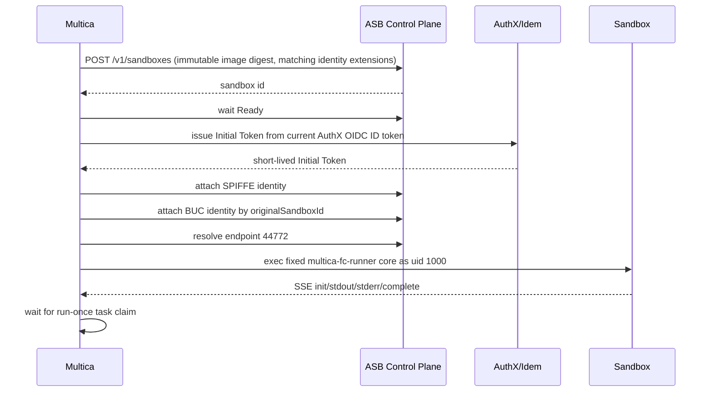

# ASB 企业私有化 Runtime — 设计

Date: 2026-07-29
Status: implementation-ready
Owners: Multica Runtime / Identity
Related:

- `docs/custom-runtimes.md`
- `server/internal/service/fc_e2b.go`
- `server/internal/service/fc_e2b_stable.go`
- `server/migrations/249_fc_e2b_stable_channel.up.sql`
- `packages/core/runtimes/cloud-runtime.ts`

## 1. 目标

把 Aone Sandbox（下文简称 ASB）作为 Multica 的企业私有化云沙箱后端，与现有阿里云 FC/E2B 并列：

1. Runtime 创建时可选 `aliyun_fc` 或 `asb`。
2. 两种后端都支持稳定通道、候选通道、全局 Runtime 视图和分批滚动发布。
3. ASB 使用内网镜像仓库；Runtime 镜像从 GitHub 上游同步到
   `dingtalk-ai-lab/multica-fc-hermes-runtime`，由 Aone CI 镜像模板 `10004545`
   持续构建。
4. 用户在 Agent 设置页绑定集团员工身份。新 ASB 任务沙箱得到：
   - BUC 零信任网络身份，用于集团应用免登；
   - AuthX Agent Identity，用于 `a1`、`mw` 等工具的 Agent 身份访问。
5. 身份和权限失败时关闭执行，不允许静默降级为平台账号、共享账号或匿名访问。
6. 第一阶段只开放只读能力；权限由 AuthX AIP 能力和下游授权控制，不依赖提示词。

## 2. 已验证事实

### 2.1 ASB 运行和网络

- ASB 创建接口支持内网镜像 URI、资源限制、环境变量、入口命令、元数据和扩展能力。
- 命令通过 sandbox 的 `44772` 端口执行，`POST /command` 返回
  Server-Sent Events（SSE）事件流。
- Agent Identity 沙箱创建时必须声明 `spiffe.lazyAuth=true`。
- 首次创建 BUC 身份锚点时声明 `wireguard.lazyAuth=true`。
- 任务沙箱复用锚点身份时声明 `wireguard.worker`、`wireguard.uemCredentials`
  和 `buc.originalSandboxID`。`wireguard.worker` 与 `wireguard.lazyAuth` 互斥，
  不能同时声明。
- Agent Identity 和 BUC 隧道当前只支持 `ali-test`，不支持 `agent-vpc`。
- 创建请求的 `timeout` 范围是 60 秒到 24 小时；续期后的到期时间最多为
  当前时间后 7 天。身份锚点先按创建上限启动，BUC 注入和探针成功后再续至 7 天。
  任务沙箱仍按 Multica 会话复用，但必须在到期前续期或重建。

### 2.2 Agent Identity

- SPIFFE 注入接口：
  `POST /v1/sandboxes/{id}/identity/spiffe?sync=false`
- 请求包含员工工号、Agent SPIFFE ID 和一次性 Initial Token。
- Initial Token 由当前员工的 BUC OIDC ID Token 向 AuthX/Idem 签发，短时有效，
  仅交给 ASB 控制面；Multica 不持久化 Initial Token。
- ASB Egress 用 Initial Token 换取正式 AIT，并在 Agent 出站请求上签名。沙箱进程看不到
  AIT、APT 或私钥。
- 同一沙箱可以刷新同一身份，不能切换成另一个员工或另一个 Agent。

### 2.3 BUC 免登

- BUC 注入接口：
  `POST /v1/sandboxes/{id}/identity/wireguard?sync=true`
- 首次注入需要 BUC OIDC 的 ID Token、Access Token、Refresh Token、员工工号、
  BUC Agent ID 和 WireGuard 客户端凭证。
- 注入完成后，平台不得继续持有或使用这套 BUC Refresh Token；它由 ASB/AliLang
  独占维护。
- 后续沙箱可通过 `originalSandboxId` 继承同租户内前一个沙箱的 BUC 身份目录。
- BUC CLI 必须以 `CLI_HUB_INSTALL_DIR=/usr/local/bin` 安装。

### 2.4 两条令牌链可以安全拆开

同一次 BUC OIDC 授权回调按固定顺序处理：

1. 校验 `state`、OIDC `nonce`、`iss`、`aud`、`exp`，并确认 ID Token 中员工工号
   与用户选择的员工一致。
2. 用 BUC OIDC ID Token 调用 Normandy OIDC SDK 的
   `NewBucOidcIdTokenSpec`，签发 AuthX 专用 ID Token 和可轮换 Refresh Token。
3. 用原始 BUC 三件套创建并注入一个 BUC 身份锚点沙箱。
4. ASB 确认注入成功后，立即丢弃原始 BUC ID/Access/Refresh Token。
5. 只加密持久化 Normandy 返回的 AuthX Refresh Token；它不是 ASB 使用的 BUC
   Refresh Token，不存在双写或竞争刷新。

Normandy 的 Refresh Token 每次续期都会轮换。数据库更新必须比较
`token_version` 并原子写入新令牌，不能用后返回的旧版本覆盖已经落库的新版本。

## 3. 核心模型

### 3.1 四个正交维度

| 维度 | 字段 | 值 |
| --- | --- | --- |
| 沙箱后端 | `sandbox_backend` | `aliyun_fc`, `asb` |
| 运行器 | `provider` | `hermes`, `opencode`, `pi` |
| 制品类型 | `artifact_kind` | `e2b_template`, `oci_image` |
| 发布通道 | `artifact_channel` | `stable`, `candidate` |

不能复用 `provider` 表示沙箱后端。现有 Agent、模型选择和 Runner 命令都依赖
`provider` 表示运行器。

新 Runtime 元数据统一为：

```json
{
  "kind": "cloud-sandbox",
  "sandbox_backend": "asb",
  "provider": "hermes",
  "artifact_kind": "oci_image",
  "artifact_channel": "stable",
  "artifact_ref": "hub.docker.alibaba-inc.com/...@sha256:...",
  "artifact_build_id": "aone-run:123456",
  "artifact_alias": "multica-runtime-asb:stable",
  "manifest_version": 3,
  "runner_protocol": "root-log-v1",
  "capabilities": ["dws", "dws.im_event", "mcp", "a1", "mw", "buc"],
  "component_versions": {
    "multica": "...",
    "a1": "...",
    "mw": "...",
    "buc": "..."
  }
}
```

旧 `kind=fc-e2b` 元数据继续可读、可启动、可被旧接口管理。新创建的 FC Runtime 也写
统一元数据；兼容解析器把旧字段映射到新模型。

镜像 manifest 与单个 Runtime 元数据不同：同一个 OCI 制品可供两个后端使用，因此
manifest v3 以 `capabilities_by_backend` 和 `identity_modes_by_backend` 分别声明
`aliyun_fc`、`asb` 的能力。顶层 `capabilities` 固定为 FC 的明确能力集合，供现有 E2B
alias 发布链路编码；服务端创建 Runtime 时必须读取所选后端对应的集合，不能把 ASB 的
a1/mw/buc 能力投射到 FC。

### 3.2 后端接口

服务端引入内部接口：

```go
type SandboxBackend interface {
    Kind() SandboxBackendKind
    ValidateArtifact(context.Context, Artifact) (VerifiedArtifact, error)
    Create(context.Context, CreateSandboxInput) (Sandbox, error)
    WaitReady(context.Context, Sandbox) error
    Exec(context.Context, Sandbox, ExecInput) (ExecResult, error)
    Renew(context.Context, Sandbox, time.Duration) error
    Terminate(context.Context, Sandbox) error
}
```

身份是 ASB 的显式扩展接口，不给 FC 伪造空实现：

```go
type EnterpriseIdentityBackend interface {
    AttachAgentIdentity(context.Context, Sandbox, AgentIdentityGrant) error
    AttachBUCIdentity(context.Context, Sandbox, BUCIdentityGrant) error
}
```

当 Runtime 要求 `a1`、`mw` 或 `buc`，但后端不实现身份接口、Agent 未绑定、令牌已过期
或注入失败时，任务在启动边界失败，并记录不含凭证的错误分类。

### 3.3 会话隔离

现有会话唯一键只有 `(runtime_id, scope_type, scope_id)`，不足以阻止跨身份复用。
新键增加：

- `sandbox_backend`
- `identity_fingerprint`

`identity_fingerprint` 是以下稳定字段的 SHA-256：

```text
workspace_id || agent_id || raw_emp_id || agent_spiffe_id || buc_agent_id || buc_anchor_sandbox_id
```

不包含令牌。身份锚点 ID 表示一次具体绑定代次；同一员工重新授权也会更换锚点并创建
新沙箱。任何一项变化都创建新沙箱并终止旧会话。ASB 沙箱绝不跨 Agent、跨员工、
跨工作区或跨绑定代次共享。

## 4. Agent 员工身份绑定

### 4.1 数据表

`agent_enterprise_identity`：

| 字段 | 用途 |
| --- | --- |
| `agent_id`, `workspace_id` | 绑定目标，联合唯一 |
| `raw_emp_id` | 不带前导零的员工工号 |
| `display_name` | 展示用 |
| `buc_agent_id` | BUC OIDC/零信任 Agent ID |
| `agent_spiffe_id` | AuthX 注册后的稳定 Agent SPIFFE ID |
| `aip_id` | AuthX AIP ID |
| `buc_anchor_sandbox_id` | BUC 身份锚点，只是非秘密标识 |
| `authx_refresh_token_encrypted` | Normandy/AuthX Refresh Token 密文 |
| `authx_refresh_expires_at` | 主动轮转门限 |
| `token_version` | 并发轮转比较交换 |
| `status` | `active`, `needs_reauth`, `revoked` |
| `bound_by`, timestamps | 审计 |

表中禁止出现 ASB BUC ID/Access/Refresh Token、Initial Token、AIT、APT、
WireGuard 凭证或 ASB API Key。

`agent_enterprise_identity_attempt` 保存单次 OAuth 的随机 `state` 摘要、`nonce` 摘要、
Agent/用户/工作区、回跳地址和过期时间。回调以事务消费，防重放。

### 4.2 OAuth 接口

- `GET /api/workspaces/{id}/agents/{agentId}/enterprise-identity`
- `POST /api/workspaces/{id}/agents/{agentId}/enterprise-identity/oauth/start`
- `GET /api/agent-enterprise-identity/oauth/callback`
- `POST /api/workspaces/{id}/agents/{agentId}/enterprise-identity/test`
- `DELETE /api/workspaces/{id}/agents/{agentId}/enterprise-identity`

开始接口返回后端生成的 BUC authorize URL。回调为公开路由，但只接受一次性签名状态。
回跳地址只能是请求同源路径。

解绑时：

1. 标记绑定 `revoked`；
2. 清空 AuthX Refresh Token 密文；
3. 终止该指纹的热沙箱；
4. 删除 BUC 锚点沙箱；
5. 不在日志中记录任何令牌。

### 4.3 主动轮转

后台工作器每 5 分钟扫描一次，并在 AuthX Refresh Token 距过期 30 分钟内主动轮换；
BUC 身份锚点每 24 小时检查和续期一次：

1. 解密当前令牌；
2. 调 Normandy `RenewToken`；
3. 加密新 Refresh Token；
4. 使用 `token_version` 比较交换；
5. 清零内存中的明文字节。

轮转连续失败或已过期后标记 `needs_reauth`。任务启动明确返回“员工身份需要重新授权”。

### 4.4 AIP 权限

为 Multica 注册一个平台级 AIR，并为每个 Agent 注册稳定 AIP：

```text
spiffe://<trust-domain>/ns/<namespace>/agents/<agent-uuid>
```

第一阶段不在 Idem AIP 中伪造静态能力字符串。AIP 的
`capabilities.declared` 保持为空，实际访问由 AuthX 动态授权和下游 ACL 决定：

- Aone Code/知识库只读；
- Middleware 资源发现和查询只读；
- 禁止发布、部署、配置修改、资源创建和删除。

服务端不通过命令字符串拦截写操作；真正边界必须是 AuthX scope、AIP capability 和下游
ACL。UI 将“只读企业身份”作为能力说明，不承诺提示词级别的安全。

## 5. ASB 生命周期

### 5.1 创建顺序



固定顺序不可交换：只有两个身份都成功注入后才能执行 Runner。任一步失败都终止新沙箱。

### 5.2 ASB 配置

必需环境变量：

- `MULTICA_ASB_ENABLED`
- `MULTICA_ASB_API_URL`
- `MULTICA_ASB_API_KEY`
- `MULTICA_ASB_SERVER_URL`
- `MULTICA_ASB_OPENAI_BASE_URL`
- `MULTICA_ASB_OPENAI_API_KEY`
- `MULTICA_ASB_OPENAI_MODELS`
- `MULTICA_ASB_TIMEOUT_SECONDS`
- `MULTICA_ASB_IDENTITY_ANCHOR_TIMEOUT`
- `MULTICA_ASB_READY_TIMEOUT`
- `MULTICA_ASB_IDENTITY_PROBE_TIMEOUT`
- `MULTICA_ASB_RESOURCE_CPU`
- `MULTICA_ASB_RESOURCE_MEMORY`
- `MULTICA_ASB_WG_CLIENT_CREDENTIALS`
- `MULTICA_ASB_IDENTITY_ANCHOR_IMAGE`
- `MULTICA_ASB_IDENTITY_SECRET_KEY`
- `MULTICA_ENTERPRISE_IDENTITY_ENABLED`
- `MULTICA_BUC_CLIENT_ID`
- `MULTICA_BUC_CLIENT_SECRET`
- `MULTICA_BUC_AGENT_ID`
- `MULTICA_BUC_REDIRECT_URL`
- `MULTICA_BUC_JWKS_URL`
- `MULTICA_AUTHX_SERVICE_ID`
- `MULTICA_AUTHX_AUDIENCE`
- `MULTICA_IDEM_BASE_URL`
- `MULTICA_IDEM_OPERATOR_TRUST_DOMAIN`
- `MULTICA_IDEM_AGENT_TRUST_DOMAIN`
- `MULTICA_IDEM_AGENT_NAMESPACE`

API Key、Client Secret、WireGuard 凭证和主密钥只通过 Aone 环境密文或服务凭据注入，
不写仓库、Runtime 元数据、日志或前端配置。

### 5.3 命令执行

- 只允许服务端根据已验证 manifest 选择固定 Runner 命令。
- 用户输入不会拼成 shell 命令。
- 环境变量使用 JSON `envs` 字段注入，不拼到命令行。
- 必须保留 CA 相关变量：`SSL_CERT_FILE`、`REQUESTS_CA_BUNDLE`、
  `NODE_EXTRA_CA_CERTS` 和 `OPENSANDBOX_*`。
- SSE 解析只接受 `ping/init/stdout/stderr/result/error/execution_complete`；
  `ping` 是无输出、无完成语义的 Execd 心跳，除此之外的未知事件仍然失败。
- ASB 命令接口不能显式指定 root。任务命令省略 `uid/gid`，由 ASB 以镜像默认的
  uid/gid 1000 执行，并直接启动共享的 `/usr/local/libexec/multica-fc-runner`。
  仅 FC 后端继续使用 root 接管容器日志后降权的包装器。

## 6. 制品与滚动发布

### 6.1 通用发布模型

现有 `fc_e2b_stable_*` 表迁移为后端感知模型，不复制第二套发布状态机：

- release 增加 `sandbox_backend`、`artifact_kind`、`artifact_ref`、
  `artifact_build_id`、`artifact_digest`；
- stable channel 主键改为 `(sandbox_backend, channel)`；
- 活跃 release 唯一约束改为每个 `sandbox_backend` 一条；
- target 保存前后制品字段；
- 所有 worker 查询都带 `sandbox_backend`；
- FC 仍保存 E2B template ID/build ID；
- ASB 保存 OCI image URI、Aone CI run ID 和不可变 digest。

兼容 API：

- 旧 `/api/runtimes/fc-e2b/*` 固定映射 `sandbox_backend=aliyun_fc`；
- 新 `/api/runtimes/cloud-sandbox/*` 显式传后端；
- 旧响应字段继续保留，通用响应新增 artifact 字段。

### 6.2 候选验证

FC 保持当前 E2B 原生 smoke。

ASB 候选必须按顺序验证：

1. 制品引用包含不可变 `sha256` digest，且与 Aone CI 输出一致；
2. 创建无用户身份的 smoke sandbox；
3. 校验 manifest version、Runner protocol 和组件版本；
4. 在无员工身份的隔离沙箱内执行完整 `runtime-smoke-test`；
5. 销毁制品验证沙箱；
6. 进入开发者 Runtime rollout；
7. 开发者 Runtime 的首个真实任务在执行 Runner 前注入员工身份，并验证
   `a1 auth whoami`、`mw auth whoami` 与绑定员工一致，同时通过 BUC/AuthX
   只读身份探针；
8. 人工确认后开始普通 Runtime 分批发布。

探针结果只保存成功/失败、耗时、错误分类和 trace ID，不保存命令输出中的员工信息。

### 6.3 Runtime 更新

滚动到新 ASB digest 时：

1. 原子更新 Runtime 元数据；
2. 标记旧 artifact + identity fingerprint 会话失效；
3. 新任务创建新沙箱；
4. 正在执行的任务不抢占；
5. 观察窗内按真实任务 claim、完成率和身份探针判定；
6. 回滚恢复旧 digest，并再次失效对应热沙箱。

ASB 与 FC 共用同一套固定发布时序：开发者验证通过后人工启动，依次在
T+0、T+2h、T+8h、T+20h 推进到 5%、25%、50%、100%，T+24h 完成最终
观察。人工提前推进只会打开下一阶段，不改写原始时间表；推进和完成观察都
必须通过对应门禁。回滚只恢复本次发布实际更新过的 Runtime。

发布完成的定义不是 Aone CI 绿色或 image push 成功，而是：

```text
Git commit
→ 内网 OCI digest
→ ASB native smoke
→ stable channel binding
→ target Runtime metadata
→ 新任务 claim
→ 新任务完成
→ a1/mw/BUC 只读身份探针成功
```

## 7. 前端

### 7.1 Runtime 创建

现有 FC/E2B 对话框改为“云沙箱 Runtime”：

1. 沙箱后端：`阿里云 FC` / `Aone Sandbox（集团内网）`
2. 发布通道：稳定 / 候选
3. 运行器：Hermes / OpenCode / Pi
4. 名称和可见性

选择 ASB 时展示：

- “需要 Agent 绑定集团员工身份”
- “支持 BUC 免登、a1、mw”
- “第一阶段为只读权限”

候选制品列表按当前后端过滤，不能选到另一后端制品。

### 7.2 全局视图

全局页增加后端筛选和列：

- 后端
- 制品类型
- 当前 digest/template build
- 身份状态
- 当前稳定匹配
- 活跃发布匹配
- target 状态

指标和发布动作都限定在所选后端，FC 和 ASB 可以各有一条活跃发布，互不阻塞。

### 7.3 Agent 设置

Identity Tab 增加“集团员工身份”卡片：

- 未绑定：显示权限说明和“绑定员工身份”；
- Active：员工展示名、工号脱敏、AIP、BUC/Agent Identity 状态、下次轮转时间；
- Needs reauth：阻止使用 ASB Runtime，并显示“重新授权”；
- 可执行“验证只读访问”和“解绑”。

非 Agent owner/管理员只能查看非敏感状态，不能绑定、重授权、测试或解绑。

## 8. 内网仓库和 Aone CI

代码仓库沿用已存在的：

```text
dingtalk-ai-lab/multica-fc-hermes-runtime
```

同步规则：

1. GitHub `multica-ai/multica-fc-hermes-runtime` 是上游源。
2. 内网 `master` 只做可审计镜像同步；内部适配通过主题分支和 MR 合入。
3. Aone CI 必须使用模板 `10004545`。
4. 构建输出到 Multica 同组的内网镜像仓库。
5. 稳定发布只接受 digest，不接受可变 tag。
6. CI 不使用个人 A1/AIT；只使用 Aone CI 服务身份和密文变量。
7. 现有流水线中的历史明文海外仓库凭据不得复用，必须从新 ASB 流水线删除。

镜像新增：

- `a1`
- `mw`
- `buc`
- 集团 CA bundle
- ASB manifest 校验脚本

镜像不得包含员工凭证、ASB API Key、BUC Client Secret、AuthX Refresh Token 或
WireGuard 凭证。

## 9. 可观测与审计

新增结构化事件：

- `asb_sandbox_create_started|ready|failed`
- `asb_identity_spiffe_attached|failed`
- `asb_identity_buc_attached|failed`
- `asb_runner_submitted|claimed|failed`
- `enterprise_identity_bound|rotated|needs_reauth|revoked`
- `cloud_sandbox_release_*`

允许字段：workspace/runtime/agent/task/sandbox/release ID、后端、制品 digest、错误分类、
trace ID、耗时。

禁止字段：任何 Token、Authorization/Cookie、endpoint headers、员工姓名、完整工号、
ASB API Key、OAuth code、state、nonce、WireGuard 凭证。

## 10. 失败语义

| 边界 | 行为 |
| --- | --- |
| ASB 未配置 | 创建 ASB Runtime 返回 503；UI 标记不可用 |
| Agent 未绑定 | 任务启动失败，提示绑定集团员工身份 |
| AuthX 需重授权 | 任务启动失败，提示重新授权 |
| BUC 锚点失效 | 绑定标记需重授权，不用共享账号继续 |
| SPIFFE/BUC 注入失败 | 终止新沙箱，任务失败 |
| 镜像 manifest 不匹配 | 候选验证失败，禁止发布 |
| SSE 中断但执行态未知 | 查询 command status；仍未知则失败，不重复提交 |
| ASB 到期 | 无运行中任务时续期；否则让当前任务结束后重建 |
| 稳定发布失败 | 暂停当前后端发布；不影响另一后端 |

## 11. 迁移和兼容

1. 先部署只增加字段/表/索引的数据库迁移。
2. 后端同时读取旧 `fc-e2b` 和新 `cloud-sandbox` 元数据。
3. 新通用 API 上线，旧 FC API 保留。
4. 前端切换到通用 API。
5. 新建 Runtime 使用通用元数据。
6. 后台按批次把旧 Runtime 补齐 `sandbox_backend=aliyun_fc` 和 artifact 字段。
7. 至少跨一个稳定版本后再讨论移除旧字段；本次不删除。

## 12. 测试和验收

### 12.1 自动测试

- ASB HTTP 客户端：create/get/endpoint/exec SSE/renew/delete/两种身份注入。
- 所有凭证字段不进入 error、日志和 JSON 响应。
- OAuth：ID Token 签名/JWKS、state/nonce/replay/aud/empid/agentid/回跳同源。
- AuthX Refresh Token 加密、轮转、并发比较交换、过期。
- 会话 identity fingerprint 隔离。
- FC 旧元数据和旧 API 兼容。
- 稳定发布按后端隔离、候选过滤、回滚。
- 前端后端选择、ASB 身份门禁、全局筛选和 Agent 身份卡片。

### 12.2 预发真实验收

1. Aone CI 从内网代码构建 ASB 镜像，记录 commit、run ID、digest。
2. 建立 ASB 候选 Runtime。
3. Agent 设置页完成一次真实 BUC OIDC 绑定。
4. 创建真实任务，确认新 ASB sandbox、两个身份注入、Runner claim 和完成。
5. 沙箱内验证：
   - `a1 auth whoami`
   - Aone 知识库只读查询
   - `mw auth whoami`
   - Middleware 资源只读查询
   - 一个 BUC 应用免登读取
6. 验证写操作被下游权限拒绝。
7. 发起 ASB stable release，完成开发者目标和普通目标滚动。
8. 验证 FC stable channel 与 ASB 发布并行且互不影响。
9. 验证日志和数据库没有明文凭证。

## 13. 外部门禁

以下对象需要平台审批或管理员配置，但不改变代码设计：

- ASB tenant/service 集成和长期 API Key；
- BUC OIDC 应用、redirect URL、`user_authorize`/`authorize_app` 范围；
- WireGuard 客户端凭证；
- AuthX AIR/AIP、OIDC Token 兑换 service ID 和只读能力审批；
- Aone CI 内网镜像仓库写权限；
- 预发环境密文变量。

代码和测试在这些门禁前仍可完成；真实身份端到端和预发发布只有在门禁就绪后才算完成。

## 14. 实现顺序

1. 数据库迁移和通用模型。
2. ASB HTTP 客户端、SSE 解析和单元测试。
3. BUC/AuthX OAuth、加密存储、轮转工作器。
4. ASB Launcher 和 identity fingerprint 会话隔离。
5. 通用 Runtime API，保留旧 FC API。
6. 通用 stable release，按后端隔离。
7. Runtime 创建和全局视图前端。
8. Agent 集团员工身份卡片。
9. Runtime 镜像和 Aone CI。
10. 预发发布与真实任务验收。

## 15. 实现前自审结论

- 不把 BUC 身份和 Agent Identity 合并成一套令牌。
- 不持久化 ASB 使用的 BUC Refresh Token。
- 不把 DWS UID 当员工工号。
- 不跨 Agent 或跨员工复用 ASB sandbox。
- 不用提示词实现只读权限。
- 不让 ASB 可变 tag 进入 stable channel。
- 不让旧 FC stable release 阻塞 ASB release。
- 不把 CI 绿色、镜像 push、Runtime online 或 run-once submitted 当成最终验收。
- 不加入匿名、共享账号或平台账号的降级路径。

据此可以进入实现。
