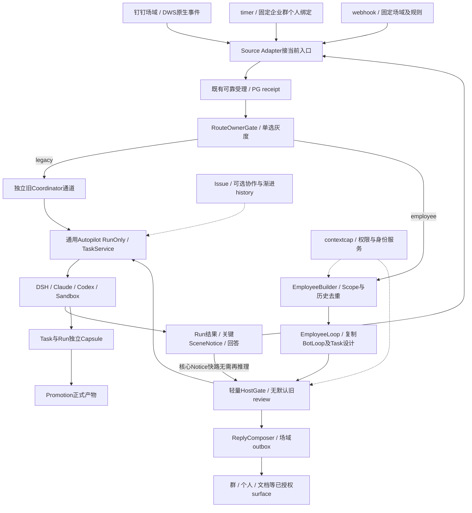
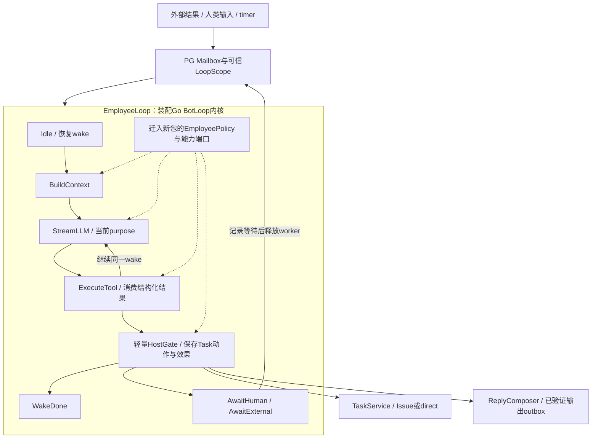
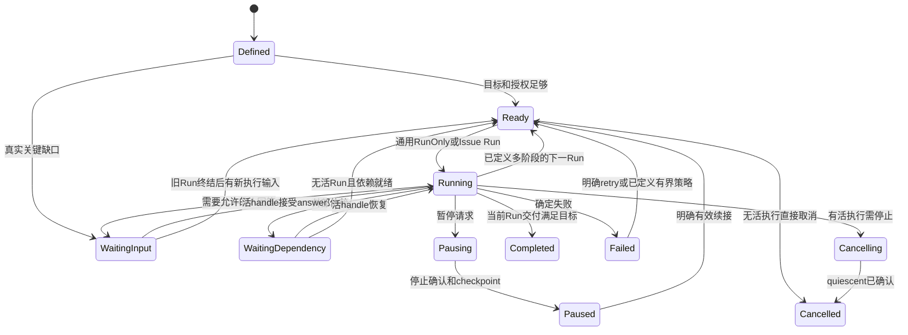

# EmployeeLoop：事件、事项与执行的统一协调方案

创建：2026-09-30。修订：2026-10-01，R5。状态：设计提案，未实施。配套：[方案导读](/evals?tab=runtime&doc=docs%2Fplans%2F2026-09-30%2Femployee-loop-overview.md)、[HTML阅读版](employee-loop-design.html)、[实施拆解](/evals?tab=runtime&doc=docs%2Fplans%2F2026-10-01%2Femployee-loop-delivery-plan.md)。直接复制Go BotLoop核心，新建独立EmployeeLoop新通道，Coordinator保留独立legacy灰度；能力服务复用。R5纳入全部浏览器评论：Employee Builder、带场域的timer/webhook、企业默认资源域、统一Task/Run、RunOnly默认与Issue协作形态、关键场域通知、轻量校验和独立legacy灰度通道；优先复用最新DWS Go SDK。本轮交付方案、HTML、Schema快照与实施拆解，不迁入业务代码。

## 1. 结论与代码基线

建议将GawkBot的Go `BotLoop`核心代码按固定版本直接复制到新包`server/internal/service/employeeloop/`，以EmployeeLoop命名这个独立运行主体。保留`Tick`、phase推进、队列优先级、工具注册、会话journal及运行控制结构；优先适配BotLoop及其任务管理设计，接EmployeeBuilder、EmployeeTask、通用RunOnly、场域通知及轻量HostGate；旧Coordinator仅保留独立legacy通道。

EmployeeLoop是复制后的BotLoop在员工场景下的装配与扩展，负责跨事件、跨等待、跨执行协调。**新EmployeeLoop不嵌套Coordinator；统一事件入口后的RouteOwner单选新通道或独立legacy Coordinator通道，保留可灰度能力。**具体业务执行继续交给DSH、Claude Code、Codex等Harness；能力解析、可靠入站、事实引用、执行及送达基础继续复用；不把旧Coordinator的完整提示词和独立LLM审查迁入新通道。

上一版将“不能从外部直接import internal包”过度推导为“只能借鉴设计”。重新读取完整bot包后，技术上可以vendor核心、替换少量边界并保留原测试。产品全仓依赖很多，但bot包主要是标准库，额外依赖uuid及RuntimeHomeDir配置函数。采用代码迁入优先；具体接缝见3.1–3.5，许可范围见15.4。

本次事实基线：

| 对象 | 固定版本 | 用途 |
| --- | --- | --- |
| 旧通道源码基线 | `2a520dea5ce616c05861aec0e72192c7c09fb596` | 前轮固定引用、旧Coordinator/Dispatch合同 |
| 本轮最新develop/提交基线 | `7c91589854e06d6907cce18b944b46b66a34a553` | 新增Go DWS SDK、连接管理/交接/重平衡 |
| `origin/feat/context-capabilities` | `5aa21b5c31a74ae99529509719eff7b65ea1f512` | 已建设但未合入的场域能力底座 |
| 两分支共同祖先 | `3cc998050d4dc8ef58ade627ffb574e8d48ab454` | 区分功能差异和 develop 后续演进 |
| 本方案分支 | `codex/employee-loop-design-20260930` | 只保存方案 |
| 讨论来源 | [比较消息处理架构](chatgpt-conversation://6abcd6d8-c3f4-83e8-82ad-8d8a0881a925) | 读取全部 11 轮；作为需求和设计讨论，不作为代码证明 |

上轮固定`2a520dea5`与能力分支的比较分别有36/8个独有提交，以下merge-tree结果是该旧基线证据。只读 `git merge-tree --write-tree` 检查发现 7 个冲突文件：连接器文档、四份 agents 翻译、`handler/daemon.go`、`handler/internal_connector.go`。此次没有合并能力分支；实施应先把能力分支 rebase 到最新 develop，处理 claim 和连接器鉴权冲突，再做本方案。文本自动合并不等于权限行为正确。

下文区分 **已存在**、**建议新增**、**待测目标**。不将旧讨论中的阈值、开源生产状态或未运行验收升级为事实。

## 2. 当前可以复用什么

| 当前事实 | 代码依据（develop，除注明者） | 设计含义 |
| --- | --- | --- |
| Coordinator 已有 inbound、task_finished、finish_check 等循环类型 | `server/internal/service/inboundcoord/coordinator.go:72`；`docs/inbound-coordinator-loop.md` | 统一Task信号，能力服务复用；旧圈独立灰度，新圈不继承复杂review |
| 当前有限动作以 start_work / continue_work 提交业务工作，结果回报只处理当前 result_ref | `docs/inbound-coordinator-loop.md:121`；`policy/registry.json` 的 F04/F07/F12/F13/F17 | 不回退旧通用 reply 协议，不把分析塞进协调回复 |
| 自动化有 `create_issue`、`run_only` 两种执行模式 | `server/internal/service/autopilot.go:474`、`:510` | 不建 Issue 的执行能力已存在 |
| run_only 创建 agent_task_queue 并唤醒原 TaskService | `server/internal/service/autopilot.go:917`、`:952` | 复用任务队列、调度、claim、启动与完成链 |
| 但 run_only 的归属、任务构建和运行状态仍依赖 AutopilotRun/Autopilot | `server/internal/service/autopilot.go:893`；见第 8 节 | 不能只换一次 INSERT 就宣称支持 EmployeeTask direct |
| 定时自动化已有 PG lease、planned_at 幂等与过期恢复 | `server/internal/scheduler/jobs_autopilot.go:40`、`:55`、`:89` | 复用现有 scheduler，增事件 materializer |
| webhook 已有认证、签名、过滤、delivery 去重、持久受理和异步恢复 | `server/internal/handler/autopilot_webhook.go:345`、`:547`、`:562` | 复用 ingress；签名只证来源，不能证明业务授权 |
| 群观察消息已进入普通可靠 Coordinator 入口；proactive 标记由 Host 产生 | `server/internal/handler/agent_event_trigger.go:108` | 不另建一条群消息直派执行路径 |
| 旧 EventTriggerService 有 PG inbox / frozen batch / 事务派发模式 | `server/internal/service/event_trigger.go:125`、`:219`、`:381` | 可复用可靠性模式；不能当现行群处理入口重开 |
| events.Bus 是进程内同步 pub/sub | `server/internal/events/bus.go:28`、`:58` | 可用于本地通知，不能作为企业服务的可靠事件层 |
| 员工私有盘和工作区共享盘已分离；私有盘挂载 `/mnt/multica` | `docs/workspace-storage-boundaries.md:3` | 沙箱结束不等于所有文件消失，但现有盘仍不等于 Capsule |

本方案用Go BotLoop内核与这些存量能力补齐：统一事件边界、独立事项事实、运行控制协议、过程输出与执行现场生命周期。BotLoop提供持续推进的主体，本仓服务提供企业环境下的事实、权限和可靠副作用。

## 3. 分层与对象关系




三个循环分别回答：

1. **Scene Router**：在什么场域，这条信息对应哪个讨论/事项？先做Host确定性定位和有界候选投影，只串行化场域的路由状态变更。
2. **EmployeeLoop**：用迁入的BotLoop主体推进这件事，在事项内串行处理输入、等待、决策、工具及回报。
3. **Execution Loop**：怎么完成业务工作？由已有 Harness 执行，可异步并行。

Employee Identity 是租户内的稳定数字员工；一个员工可服务多个 Scene。一个群只有一个对外员工身份，内部可以有多个 EmployeeTask。Actor 亲近度用于候选排序，不作为员工或事项 Session 的唯一键。

没有确定工作绑定的输入，在scene窗口装配一个EmployeeProfile协调wake；有可信绑定的输入，在work mailbox恢复同一profile。它们都由同一EmployeeLoop+EmployeePolicy推进。计划提交/拆项后mailbox只执行或恢复已保存效果，不再对同份输入跑第二轮语义路由与业务决策。图中的层次表示调度范围，不表示两次串联模型调用。

第一期 Episode 只存锚点、相关事件、参与者和小摘要，可没有 EmployeeTask；产生明确持续工作时才绑定 EmployeeTask。不为每条群消息创建永久认知 Session，不为所有 ambient 消息调用 LLM 分段。

**最小实现粒度：**Scene 的有界协调窗口 + 每个 EmployeeTask 的 durable mailbox。Episode 可先作为轻量归属记录，不另增加常驻执行器。不同事项并行；同一事项默认只有一个主执行 lane。允许显式拆子事项，但不能为了同群多人 @ 自动多开会操作同一业务对象的 Worker。

### 3.1 直接复用的代码范围

将固定SHA的`internal/bot`核心直接复制到`server/internal/service/employeeloop/`，保留来源SHA、原LICENSE、修改说明与patch清单。`BotLoop`/`BotService`类型在新包中命名为`EmployeeLoop`/`EmployeeService`，核心方法继续保留和patch；不再在外面包另一套Loop。移植是代码复用，不是`go get`整套GawkBot产品。当前仅是移植方案，仓库尚未新增这些Go文件。

| 原文件/符号 | 保留的实现 | 本仓必须适配的边界 |
| --- | --- | --- |
| `loop.go`：BotLoop、Tick、Start/Stop、Pause/Resume、Interrupt | phase推进主体、控制入口、观察事件及错误/卡住处理结构 | ctx传播、锁外执行/回调、terminal disposition、外部等待；详见3.4 |
| `types.go`：BotPhase、BotState、StreamChunk、BotTool | 内核状态和调用契约主体 | Scope/epoch、ToolCallID、完整tool batch、result disposition |
| `queues.go`：Steer/Human/FollowUp与Drain | 输入优先级及队列操作结构，保留测试 | 从botSlug改为可信LoopScope；生产由PG mailbox供给/确认，内存不作权威 |
| `service.go`：Create/Start/Stop、runBotWorker、状态快照 | worker对Tick的驱动、按需启动/空闲停止及生命周期代码 | PG lease/fence、wait恢复、不同work并发；不用永久全局bots map持有业务事实 |
| `tools.go`：ToolRegistry的Register/Get/Validate | registry的查找/结构验证代码 | 注入本仓允许的协调工具；不将本地shell/search等业务工具注册给协调层 |
| `session.go`：SessionEntry/SessionStore及history | journal格式、append/history和分支思路；原FileStore用于隔离测试 | Store接口接受限PG/OSS/Capsule；业务写失败必须可恢复而非仅打日志 |
| `task_runtime.go`：token估算、compaction切分等 | 适合日志/执行摘要的算法及测试 | 配置、任务ID和路径注入；EmployeeProfile提示词由现有有界编译，不直接套通用摘要 |
| `adoption.go`、packs/templates/log reader等 | 构成bot包的可编译依赖与可用测试辅助 | 不接入角色权限/产品模板；CredibilityTracker可不启用，不能成为授权判定 |

重新读取的隔离包包括13份源文件、10份测试；无需迁入Wails/Bleve/Slack等全产品依赖。最初可完整迁入bot包以保存出处和测试，再移除无使用者的产品模板/local tool入口；不为追求“原样率”暴露额外执行权限。拆包分析不代表测试已通过，当前机器无可调用Go工具链，详见第16节。

复制交付清单：`loop.go / types.go / queues.go / service.go / session.go / task_runtime.go / tools.go / tools_shell_unix.go / tools_shell_windows.go / adoption.go / packs.go / templates.go / task_log_reader.go`及相关原测试；其中local-tool执行实现仅为原包依赖/测试来源，生产不注册。记录每文件原路径、固定SHA和内容hash；把config.RuntimeHomeDir换成注入的受限存储路径，不迁整个config产品模块。与本仓google/uuid依赖对齐，不复制一个新的模型SDK或CLI launcher。

分三类提交便于审查：固定来源复制与名称变更；内核安全/协议patch；EmployeeLoop业务端口与迁移。每一份修改注明来源函数和为什么必须改。检验直接复用的标准是fake轨迹实际经过复制后的Tick/StreamLLM/ExecuteTool，而不是目录里存一份未调用源码。

队列主键是LoopScope：已有work用workspace+employee+work+安全scope/epoch，尚未绑定工作用scene+冻结window/receipt。trigger actor是每条事件内容，不是Loop主键；不将上游botSlug或ActorKey机械替换成“一个人一个会话”。

### 3.1.1 类型命名与Task层一起适配

| 原符号 | 新包名称 | 含义 |
| --- | --- | --- |
| BotLoop / BotService | EmployeeLoop / EmployeeService | 唯一新Loop内核及worker调度 |
| BotPhase / BotState | EmployeePhase / EmployeeLoopState | 一次wake的内核阶段与状态，不等于业务Task状态 |
| StreamChunk / StreamFn | ModelChunk / ModelStream | 模型输出与可取消调用 |
| BotTool / ToolRegistry | EmployeeTool / EmployeeToolRegistry | 经能力约束的工具协议 |
| MessageQueues | EmployeeInbox | 可信Task/SceneScope的输入优先级，PG为权威 |
| SessionEntry / SessionStore | EmployeeJournalEntry / EmployeeJournalStore | 员工wake记录；与外部Harness Session分开 |
| WorkObject（上一版） | EmployeeTask | 目标级任务，RunOnly与Issue共享同一个Task |
| queue task_id | ExecutorQueueTaskID | 既有agent_task_queue中的一次执行，不改成目标ID |
| 一次自动化执行 | ExecutionRun / AutopilotRunID | 一次执行记录及原服务绑定 |

不仅复制bot包，也牵引GawkBot的任务细节：TaskDefinition及normalizeTaskDefinition（仅Goal必填，Deliverables/SuccessCriteria/AccessNeeded可选）、TaskLedger的结果/ContextUsed、依赖携带上游成果、HumanNotePending和资源lane设计。纯函数/数据结构可port；原完整Broker、强制定义审批、强制wiki/retrieval和reviewers pipeline不进入默认路径。

Human note不复制上游单槽覆盖/整槽清空实现：改append-only的note ID/seq，逐note确认消费。暂停/停止/禁止外发等限制独立形成restrictive fence；普通追加材料、后到回答或note已读不解除它，只有对应有授权的resume/clear动作能改变。覆盖stop→普通补充→迟到完成的对照，不因后一句“好”丢掉暂停。

任务身份固定为EmployeeTaskID+RunID+goalRevision+SceneBinding+principal，避免按员工/channel/时间窗猜最后一条输出。上游ledger只保有限brief，不能把它宣称成完整渐进历史；本仓按Task/Run引用追加history handle。详细来源见15.4。

### 3.2 EmployeeLoop在BotLoop里面怎样运行

新包里的`EmployeeLoop`直接来自复制后的BotLoop，实现绑定Scope、EmployeePolicy、持久store和执行/表达端口。它拥有唯一的模型/工具推进器；EmployeeProfile决定使用哪些上下文、工具、停止条件和等待方式，复制后的Tick依然推进状态。



保留基础`Idle→BuildContext→StreamLLM→ExecuteTool`推进；新增`AwaitHuman/AwaitExternal`和明确的wake结束处置。工作完成与本轮Done是两层状态：一轮接单、问题或进度协调结束，不表示整个EmployeeTask完成。

新通道用主Loop的Task动作推进；表达只调整已有事实。正常路径不设route/render/review串联流水线，确定模板可直达，复杂表达才选有限render。确定模板的timer/webhook可从BuildContext直接产出已验证effect plan，跳过不必要的主模型调用，权限和持久化门槛仍在。

### 3.3 我们适配BotLoop，新通道不移植旧审查流水线

以复制后的Tick、工具注册、队列和Task接口为主线，先接当前能力服务完成一条新的RunOnly链路，再按真实差异补端口。旧Coordinator的8轮主模型、独立finish_check、岗位全文审查、12秒review repair和旧checkFinish缓存，不作为新通道前置。

新的EmployeePolicy只装配当前任务、员工表达、允许工具与最小行为合同；模型用同一个Loop判断继续、修正、等待、发起Run或回报。工具/动作参数由Host确定性校验，敏感工具调用和发送继续查真实授权。模糊目标由当前Loop澄清，不能用第二个模型的allow来替代权限。

| 需要复用的能力 | 接法 | 不要求迁入 |
| --- | --- | --- |
| assoc、任务证据与历史读取 | Builder按范围调用，返回有水位的事实和引用 | 原runLoop/roundTools的整套调度与累计修复状态 |
| contextcap与DWS身份/工具代理 | 授权结果作为AllowedTools/ExecutionContext；调用时再核 | 模型读取记忆或SOP来判断MCP权限 |
| persona/reply_tone与自然表达 | EmployeeProfile/ReplyComposer，直接表达已有任务事实 | 每条普通回复、进度都追加独立LLM审查 |
| TaskService、RunOnly、Issue和outbox | EmployeeTask/ExecutionRun适配现有服务 | 默认先建Issue、再走Issue协议才能干活 |
| 旧响应/回执协议 | 当前入口后的LegacyWireAdapter冻结和转换 | 在新Loop内部调用Coordinator.Decide |

`inbound`与`task_finished`在新模型中是Task输入和Run完成信号，不是两套独立认知Loop；`finish_check`是旧通道的实现机制，不定义一个Task生命周期状态。统一TaskSignal可以表达 input/amendment/answer/run_progress/run_completed/dependency_changed/timer_due/cancel。

旧通道在统一事件接入后的独立legacy lane原样保持行为合同，便于比较、按场域灰度及退回；新通道拥有自己的简短合同和版本。各自的行为来源、trace和RouteOwner明确，不同一事件跑两遍或共享可变推理状态。

### 3.3.1 轻量HostGate

正常链路为：Builder → BotLoop主判断或已定义模板直达 → 本地/数据库HostGate → 保存effect → 执行/投递。HostGate检查结构、scope、actor/principal、目标归属、当前版本、操作授权、结果引用、幂等键和输出受众；它不再调用一个模型评价整段回复文风或要求将来结果提前存在。

- 普通聊天、真实进度、已确定的Run结果和已授权控制：不跑独立review。
- 已注册的timer/webhook TaskDefinition：无新的语义缺口时直接RunOnly，不重做需求规划。
- 新目标或实质修改：只在主Loop内判语义；必要读取仍可调用工具，保留BotLoop工具循环。
- 真正缺授权/收件目标、版本冲突或相互矛盾的输入：停止对应effect、具体澄清或重建当前Context；不拉长成重复主模型—review死锁。
- 只有用户/业务规则明确要求的审批、或显式配置的特定审核才建立等待/定点审核。已经明确授权且规则允许的动作不再机械二次确认。

可把确定性gate耗时作为独立指标，目标本地检查p95≤50ms，数据库检查另计；这是实施SLO而非当前成绩。普通路径独立review模型调用数必须为0。旧通道保留原成本用于对比，不把旧长审查借重命名搬进来。

### 3.4 必须修的内核接缝

| 修改 | 原因 | 验收 |
| --- | --- | --- |
| `StreamFn(ctx, request)` | 原StreamFn缺ctx，内核取消不能证明provider停止 | fake阻塞provider收到ctx取消；原turn总截止贯通 |
| 把provider/tool/observer调用移出mutex | 原Tick/Execute/emit与Interrupt共享锁；阻塞调用可能挡住控制 | 阻塞tool期间能及时受理Interrupt；回调重入不死锁，提交核revision |
| ToolCallID与完整调用batch | 原单pendingToolCall不足以保存本仓读取batch及finish独占规则 | 多read的call/result一一匹配；read+finish同批被拒 |
| 原生tool role + Host证据状态 | 通用journal的tool结果转换不能被当成新的user授权 | 原限制、水位、author不丢；tool错误不变成人类指令 |
| 明确continue/reply/terminal/await/deferred | 模型结束不等于业务完成；普通对话可结束wake，任务效果要有结构化动作 | HostGate与保存后发reply/dispatch；不要求旧finish_check，不把EOF推进Task完成 |
| durable Scope和store端口 | 原botSlug+本地JSONL/内存queue不支持企业多副本 | tenant/work/principal/epoch隔离、lease steal、重启恢复与确认消费 |
| Await状态与typed wake | 外部工作需释放worker，后续结果/回答再推进 | 等待不轮询LLM、不触发普通stuck阈值；wake幂等且不重派 |
| candidate事件与人类输出隔离 | 原EventMessage不能直连DWS，人类输出必须有已验证事实 | 未审流式正文、tool噪声不发群；已验证intent按原outbox发送 |

这些patch集中在loop/type/store边界，保留能安全复用的原函数和测试。它们不是可忽略的小补丁，也不需要因此重写整个BotLoop。实施按来源patch清单评审，不承诺没有依据的代码复用百分比。

### 3.5 外部执行是可等待的effect

EmployeeProfile按实际能力注册Task、Context与场域工具；耗时或明确可执行工作用通用RunOnly，业务Harness继续执行。结构化Task动作经HostGate后生成RunSpec；保存effect/wait后kernel进入AwaitExternal。外部结果携带work、attempt、result_ref重新入mailbox，作为新wake事实，调用同一EmployeePolicy的完成合同。

人类补充进入原队列优先级，但要带结构化ActorRef/authority而非仅一段文本。“先别上线”可产生明确control effect；本地BotLoop.Interrupt只终止协调阶段的provider/tool，并不自动停止另一个沙箱Worker。真正运行控制仍走第9节的durable command和quiescent证明。

这保留BotLoop的持续性：它可以读上下文、有限思考、调用协调工具、结束一轮、等待外部世界再接着办；平台对外是同一个员工，计算现场可以替换。

### 3.6 挂在Employee上的Builder

EmployeeBuilder是员工的上下文与触发装配器，配置属于Employee；游标、任务材料和权限快照按Task/SceneScope/会话epoch隔离。它在Loop的BuildContext阶段工作，复用能力/历史/任务服务，不再做第二个LLM路由器。

| 输入 | Builder处理 | 输出 |
| --- | --- | --- |
| Native事件+可信订阅身份 | 保原DWS数据，读取已绑定Scene/Rule与Task定位 | TriggerContext及明确来源/actor/资源状态 |
| SceneBinding+TaskDefinition+最新修正 | 按enterprise/group/personal范围编译，保留用户约定 | TaskContext、必需限制和引用 |
| 历史、quote、forward、Task ledger | 按source+scene+native message ID去重，当前请求只投影一次 | 历史delta、ContextUsed manifest、loaded/unavailable/truncated |
| cursor/watermark与会话epoch | 只加入尚未投喂且有权读取的材料；重试保持原水位 | ContextReceipt及下一游标候选 |
| contextcap与Run profile | 解析AllowedTools、固定principal、运行目录/恢复资料 | 有作用域的RunSpec或主Loop上下文 |
| trigger策略 | 已定义直达、交互、观察聚合、恢复、控制分别编译 | RunOnly意图、普通wake、receipt-only或ControlIntent |

Builder不按正文相同去重，也不按“最近一个任务”选目标。原消息、引用和被转发消息保留身份；current input与older history重复时优先保存当前原文与限制。只有成功且记录了消费/投喂证据才推进cursor；历史读取失败、截断或未知不越过未覆盖区间。重复wake从同一ContextReceipt恢复，不把后来消息倒灌旧授权。

不同触发方式有不同装配策略：群@/DM带当前原句与相关delta；ambient只观察或有界聚合；timer/webhook使用绑定场域、固定TaskDefinition和本次参数；Run信号使用当前Run/Task事实，不重新载入整群历史；回答只带真实question及最新输入；控制优先带目标、权限和控制seq。

Employee人格可共享，Builder材料不可跨Task/principal混用。文档/日程/审批资源事实读取仍核ACL；场域默认企业不等于人人可读全文。Builder只“编译已有事实”，语义判定由原BotLoop主循环做，权限由Host服务决定。

## 4. 身份、场域和权限模型

### 4.1 ID 必须分开

| 身份/范围 | 含义 | 不能被替代成 |
| --- | --- | --- |
| `workspace_id` | Multica 数据隔离域 | 任意 webhook body 声明的 workspace |
| `tenant/org binding` | 外部企业及安装/账号的验证映射 | 群 CID 或单独 UID |
| `employee_id / agent_id` | 稳定员工及执行配置 | 当前发言人 |
| `employee_external_identity` | 员工绑定的企业账号 UID/org | 连接器的个人凭据主体 |
| `scene_ref` | 可信安装下的平台群、单聊或资源场域 | 当前执行器 Session ID |
| `trigger_actor` | 这一条事件是谁触发；系统事件可为空 | 配置创建者或责任人 |
| `requester / accountable` | 谁提出工作、谁对规则/事项负责 | 使用个人连接器的自动授权 |
| `capability_principal` | 此执行能使用哪份已授能力 | 最新说话人，或 LLM 推断的人 |
| `output_recipient` | 此次输出应找谁、在哪说 | 当前 sender 或配置 owner 的默认替代 |

企业与工作区不假设一一对应。保留外部 org + uid/staffId 的命名空间和 Host 绑定；数值字符串也不跨 org 混用。`externalIdentity.dws.uid` 是执行身份描述，`event.data.sender` 是触发者事实，两者按可信契约处理（`docs/agent-dispatch-v2-execution-contract.md:220`）。

Scene Actor key 建议为 `(workspace, employee, verified scene_ref)`；组织/安装边界包含在 scene_ref 中。Work lane key 为 `(workspace, employee, work_object_id)`。执行复用再加 principal、安全上下文版本、runtime、session epoch。引入这些字段不另造一套连接器 ACL。

### 4.2 接续 context-capabilities

能力分支提供能力 offer、场域/个人 binding、配置 grant、凭据和任务 claim/call-time 解析；由它继续决定“能用什么”。EmployeeLoop 只提供可信的事件场域、当前授权请求和执行身份，不复制 binding 表、不让模型根据 memory/catalog 判权限。

`context_config_grant` 仅授权修改场域/个人配置；到期并不自动撤销已保存的binding或credential。它不能当作工具数据授权、个人例行任务的delegation或群披露授权。后文的AuthorityRef标明原请求/规则授权证据；连接器可用性仍查原binding与credential。确需个人无人任务时，新增可撤销的invocation delegation应与原resolver集成，而非再建平行Connector ACL。

必须明确当前边界：群场域能力与单一触发者个人能力已建设；DM 配置、`share_in_groups` 等字段不能仅因 UI/DB 存在就当成有效控制；cron/webhook/plain chat 没有匹配 dispatch 时目前仅全局能力，不能宣称已支持所有事件的场域授权。详细代码证据见第 15 节。

新增 `CapabilityRequest` 是对原 resolver 的输入扩展：origin scene、operation、validated principal、授权证据、配置 revision、purpose boundary；resolver 返回引用和有效快照。凭据不放进 InputEvent、模型 prompt、公共日志或 EmployeeTask JSON。

**建议新增/保留的复查边界：**受理 → 启动/claim → 敏感工具调用 → 恢复 Session → 产物与输出披露。当前connector每次调用已有复查，但skill bundle prepare只重验仍offered，不重新核scene/person binding；旧模型上下文不会自动清除。权限快照/fingerprint只帮助定位和复用，不能代替在线授权复查。撤权后旧日志、工具结果和Session内存也可能携带数据，不能只禁后续MCP调用就宣称已经隔离。

当前credential选择为person→scene→workspace，可在个人凭据不可用或场域层读取失败时回落。对于“查我的日历”或长期无人规则，必须保存实际选定的credential/account身份和显式fallback policy；默认固定主体，失效则阻塞/重新授权，不能悄悄换企业共享账号继续做另一份数据。群使用opt-in须同时控制person binding和person credential覆盖global connector的路径。

### 4.3 群里多人补充

张三请求查自己的日历，李四补一句“也考虑周三”，可以归入同一讨论。是否能把它转成对张三日历的新查询，必须检查张三原授予的范围及允许参与者；李四不因进入同一 Episode 就继承凭据，也不成为张三的授权代理。

遇到新主体、新资源或超出原 purpose：新建执行范围，或形成明确授权等待。不同 principal 的私有工具正文、native Session、工作目录及 Capsule 不相互注入。共享EmployeeLoop协调上下文只接收可在该场域披露的摘要；私有结果保留在对应执行域，通过独立的授权输出送给本人。

文件夹路径分离不构成安全隔离。若两个执行挂同一可读写员工盘，命令行工具仍可读另一个目录；需验证挂载、运行身份/ACL或使用独立受限工作区。做不到时，该 runtime 不承接个人私有连接器并行任务。`/mnt/workspace/shared` 更不能作为个人 session-log 的默认存放处。

### 4.4 SceneBinding：企业、群与个人都可以挂触发器

SceneBinding是上下文/运行记录/输出的归属，不是工具授权本身。最低字段为scope_kind=enterprise/group/personal、tenant/org、employee、可信scope_key、owner/participants、visibility、配置revision、OutputPolicyRef；资源Ref另存。由授权的配置流程产生，不从webhook body或最近聊天推断。

| 来源 | 默认场域 | 必须明确的绑定 |
| --- | --- | --- |
| 群内设置的timer/webhook | 该群group Scene | 群CID、允许管理者/参与者、可见运行记录与默认回报场域 |
| 单聊/个人设置的timer/webhook | personal Scene | 所属本人、可见性、允许执行的principal与回报对象 |
| 企业配置的例行任务/订阅 | enterprise Scene | 企业范围、规则责任人和明确资源/输出范围 |
| 钉钉日程、审批等非IM业务事件 | **先默认enterprise Scene** | 事件所属企业+calendar/process等资源Ref；显式绑定才关联群/个人 |
| 文档@/评论等资源事件 | enterprise归属并保存文档资源Ref；显式配置可收窄 | 文档ACL、真实actor、回复锚点，不伪造聊天CID |
| 群消息/单聊 | 可信group/DM自然场域 | 原消息参与者与输入权限，不能用subscriber替代sender |

解析顺序：受信显式SceneBinding优先；IM的自然group/DM其次；其他DingTalk资源事件先enterprise默认。订阅使用个人OAuth不自动让审批变个人场域；企业默认也不改变原资源ACL、扩大工具权限或让私有结果对整个企业公开。

定时器actor是system，webhook actor是验证后的service/provider。绑定场域记录“在哪推进这件事”，rule owner只承担配置责任，不自动成为个人connector授权者。规则保存run_as授权引用、固定TaskDefinition、参数schema、overlap policy和OutputPolicy；每次触发核规则及grant版本。

个人无人执行需要真实delegation：本人、被委托employee/service、操作/资源/范围/期限和撤销版本。已有employee/service/global授权可以先完成企业或群内例行工作；personal Scene归属不等于个人连接器能力已完整落地。context_config_grant仅配置权，不能用裸UID或旧sender补出执行权限。

Webhook callback locators只供定位；Host用subscription绑定范围验证。收到事件不能由body改Scene、Task、principal或recipient。原触发配置的SceneBinding沿Task和ExecutionRun保存，沙箱退出不抹掉场域运行账本。

## 5. 统一事件层：复用DWS场域协议，兼容既有MessageRouter

这是新EmployeeLoop的基础协议，独立于模型提示词与执行backend。第3节说明Loop怎样推进，本节定义它究竟接收什么、信任什么、如何恢复与如何回执。

设计分三层：**钉钉/DWS等原生协议 → 认证与版本化Source Adapter → EmployeeEvent控制外壳**。钉钉场域事件包括消息、日程、文档@/评论与审批等资源事件，未来可以由DWS Stream、业务事件网关、MessageRouter或其他受信连接器送入；不要求都经过MessageRouter，也不要求都先转换成message.created。周期scheduler、外部webhook与Runtime回调是另外的来源族，接同一durable inbox和唤醒机制。

### 5.0 DWS Schema优先复用，不重新发明平台事件正文

**最新develop直接复用Go DWS，而不是再造CLI订阅器。**本轮fetch到`7c91589854e06d6907cce18b944b46b66a34a553`，已入仓`server/pkg/dws`、`server/pkg/dws/events`、`server/pkg/dws/redisstore`以及`internal/dwseventsource/connmgr`。SDK从`xdxer/dws-for-tag@ae29c2914dd9108e7ce451329bceeca411464b6b`同步；上游SDK修改在那里完成再resync。

| 可直接复用 | 本轮核验边界/需要的适配 |
| --- | --- |
| Client.Events、SubscriptionSpec、订阅/Ticket及Fingerprint | 复用group/target/roles/filter等原生契约，不另定义订阅DTO |
| events.Event及Typed()业务类型 | 保ID/Key/SubscriptionID/CorpID/OccurredAt、Body/Data RawMessage，新Loop直接接此类型 |
| SDK registry | 当前28项，旧CLI27+互动卡片1；calendar/doc@ typed key仍未发布，Lookup/Available gate不允许凭空订阅 |
| dwseventsource.Consumer | 当前只EventKey+Identities+Handle(bytes)，需扩原生SubscriptionSpec及typed HandleEvent；不要经EventLine来回投影 |
| connmgr/Redis ownership、keepalive与交接 | 复用连接、凭据、重连、ready、重平衡；交接可能短暂重叠，PG仍业务去重 |
| Listener持久后ACK | Handle成功后MarkHandled/ACK；业务Adapter先事务记录receipt再返回成功，失败不ACK |

新版Event没有完整公开EventEnvelope类型：Body/Data保解包业务数据，但headers/specVersion/eventBornTime/原WS字节未全部保留。不能把兼容EventLine重建的CLI wrapper当无损原帧；可先记录SDK实际可得数据及缺失状态，需要完整安全packet时再经上游SDK hook扩展。SDK typed projection已移入，但JSON Schema generation尚未port，目录元数据也不是完整JSON Schema。旧CLI snapshot保留为结构证据，不与SDK当前28项混同。

固定引用（7c9158985）：`server/pkg/dws/SYNC.md:3`、`events.go:59`、`:93`、`events/event.go:27`、`events/typed.go:1`；`server/internal/dwseventsource/source.go:37`、`:297`；`internal/connmgr/manager.go:626`。未带server前缀的SDK相对路径在server/pkg/dws下。


**复用原则：**DWS已发布的event key、原生envelope和业务payload保持其字段名、类型与含义；EmployeeLoop新增的租户绑定、工作关联、权限引用、去重和fence位于HostMeta外壳。Scene/Actor是有出处的派生索引，不回写DWS payload。MessageRouter Dispatch 2.0仍沿原响应/续接/控制/callback契约适配，属于载体，不是钉钉场域的定义。

本轮只读查询本机DWS `v1.0.61 / commit 50eb73a0`，build `2026-08-31T14:46:17Z`。公开catalog包含IM16、OA7、VoIP1、Todo3共27项；`--include-pending`也未给出calendar或文档@的事件key。这只限定本机该版本的公开目录，**不表示DWS整个产品没有这些事件**。日程、文档@是必须支持的协议槽位，其正式key/payload schema需从DWS发布的对应目录/接口登记；不把IM的receive_at冒充文档@，不捏造`user_doc_*`或`user_calendar_*`键。

已保存[只读Schema快照](dws-event-schema-snapshot.json)：27项catalog以及每项raw/flatten，共54份原Schema输出，含CLI版本、binary hash、查询命令和每份export hash。后续代码生成/验证优先导入这些DWS Schema或对应发布包，避免手写一套同义JSON字段。快照是协议证据，不含真实业务事件、凭据或订阅状态；本轮未启动监听或订阅。

| 层 | 直接复用的内容 | EmployeeLoop增加什么 |
| --- | --- | --- |
| DWS原生envelope | 已发布type/event_type/event_id/data及transport元数据 | ProviderSchemaRef、NativeEventRef，保留完整默认安全输出的frame |
| DWS业务schema | event key对应的payload/flatten字段定义、类型、可选性 | SchemaRegistry引用及有版本的Decoder，不改名再包装成IM |
| HostMeta | 不由DWS/body声明 | workspace/employee、订阅主体绑定、来源版本、本地seq、receipt、authority/fence |
| 派生场域索引 | 按具体DWS Schema读取真实资源与操作者 | SceneRef、ActorRefs、Work/WaitRefs、OutputPolicyRefs及字段来源路径 |
| 旧MessageRouter | Dispatch 2.0 DTO及已有回执语义 | Legacy adapter；不声称该DTO等于完整DWS原始schema |

示意结构为`{host_meta, provider_event}`：provider_event保存`{schema_namespace, provider_event_key, schema_ref, native_event_ref, projection_ref?}`，native_event_ref指向按DWS安全边界保留的完整frame/payload；host_meta保存平台独有的协调事实。既有EmployeeEvent的SourceID/Kind/ActorRef等是控制元数据或派生索引，不是对DWS同名业务字段的覆盖。

**当前raw envelope有14个已声明字段：**`type`、`event_type`、`event_id`、`data`、`headers`、`event_born_time`、`event_corp_id`、`event_scope`、`event_unified_app_id`、`received_at_unix_ms`、`seq`、`source_id`、`subscribe_id`、`rule_type`。`type="event"`、event_type为原event key，data是JSON字符串，业务读取路径为`.data | fromjson`。该raw schema没有进一步定义data内部的强类型结构；不能自行宣称解析后的任意对象已通过DWS业务schema。

flatten是DWS的派生业务视图，type为event key、jq_root_path为`.`，包含字段映射与脱敏，**不等同于只JSON.parse(data)**。生产优先保留默认安全的native envelope，再引用同key的flatten/projection帮助模型理解。选择flatten的consumer可能回退raw envelope，Decoder必须识别已注册形状，不能固定假设每条都有content/sender。

54份当前Schema均未声明`schema.required`；列在properties不等于每次必有。保留DWS可选性，执行所需的身份/目标/幂等等门槛由Host单独验证。未知字段保留在受限native frame中，不因DTO投影丢失，也不因为存在一个字段就授予工作权限。

| 场域/事件族 | 已核验的协议依据 | 基本包装与复用路线 |
| --- | --- | --- |
| 消息、已读、撤回、reaction及群生命周期 | 当前16项`user_im_*` raw/flatten Schema | event key原样保留；sender/reader/recaller/operator依事件取，不只支持新消息 |
| 审批任务/实例 | 当前7项`user_oa_approval_*` Schema | task/process资源场域；可无明确actor；状态字段保原值，不推断完整枚举 |
| 日程资源事件 | 本仓已有Router calendar.started；本机DWS公开catalog未给原生key | 同一DingTalkDomainEvent包装，待登记真实DWS schema；不是给日程强造CID或IM正文 |
| 文档@/评论/协作事件 | 需求明确；本机公开event catalog未给正式key | DocumentScene+原生schema引用；文档/块/评论/@对象定位按发布schema取，不猜字段名 |
| Todo、VoIP与后续业务族 | 当前Todo3/VoIP1 Schema可直接引用 | 同一个平台schema registry扩展，不为每种产品另造Loop |
| 卡片人工操作 | 仓库已消费user_card_action_triggered，独立parser合同 | 保留实际frame变体和operator验证；不假装属于上述27项CLI目录 |

文档@与IM @是不同资源语义：文档事件不一定有chat CID；资源读取权限来自对应账号和文档ACL，不因“被@”就默认可读全篇或可向群披露。日程或审批也不因为最终回报某群而继承该群的连接器能力。缺失scope/actor/资源定位保持未知或阻塞，不能用订阅账号代替操作人。

回复锚点也按资源类型保存：聊天用原消息，文档事件保留DWS提供的文档/评论上下文，日程/审批保留对应资源定位；可用的文档评论回复、IM回报或仅记录由已验证OutputPolicy/渠道权限选择。不能为适配旧dws IM发送接口捏造群CID，也不能无依据把私有文档结果发到某群。

**订阅主体与事件actor分开。**Host从受信profile/OAuth/员工绑定和订阅记录建立`SubscribedPrincipalRef/SubscriptionBindingRef`，不是从payload的sender、参与者或target_uid反推。IM取sender，read取reader，recall取recaller，reaction/群操作取operator；OA/系统事件可能只报告资源状态。`event_corp_id`是来源声明，不能改写Host租户；账号组织与资源所属组织也分别记录。

当前IM flatten有sender_open_dingtalk_id，不提供通用staffId。接contextcap个人能力层时，如需staffId只能通过受信且有组织范围的身份映射核验；未解析保持person scope未知/空，不把openID换个字段名或用订阅账号填成触发人。DWS安全投影也不能被当成当前已有group/person resolver已经支持所有新资源场域的证据。

避免同名字段误用：Todo flatten的source_id是来源业务ID，不是raw envelope的transport source_id；flatten没有统一org/receiver/source字段。VoIP的corp_id/org_id/target_uid与caller/callee类型不同，按原Schema保留，不统一转成可丢精度的number。SchemaRegistry记录字段路径、形状和版本，再派生索引。

**SchemaRegistry登记单元：**provider namespace + event key + shape(raw/flatten/已验证frame变体) + DWS发布版本/hash + decoder/projection版本 +敏感字段策略+场域/actor解析规则。日程/文档@正式Schema发布后只新增登记与fixtures，不改核心信封或重写Loop。当前未注册的Schema可保留为受限待映射receipt，不能交LLM猜字段并自动执行；显式登记后可按原receipt/效果键受控重放。

保存“原生frame”沿DWS默认脱敏输出边界，不打开debug-raw-events恢复已删敏感值；例如VoIP roomCode默认不进安全frame。JSONB保存语义字段不保证原字节，若需要完整frame digest或重放，另外存受限byte/blob及hash；派生对象只是索引。现有Dispatch固定DTO会丢未知业务字段（`server/internal/handler/agent_dispatch_v2_handler.go:188`、`:113`），新DWS入口应在认证后、投影前保存原frame。

生产代码直接复用Go SDK的events.Event/typed payload与SubscriptionSpec；schema_ref/native ref是其出处及持久化引用，不再维护同义业务结构。CLI下述导出仍用于协议审计和补JSON Schema证据，不能代替Go typed实现。

可复现只读查询：`dws event list --include-pending --format json`、`dws event schema <已发布event_key> --format json`、同命令加`--flatten`。`dws schema --cli-path "event schema"`查询的是CLI命令参数，不能替代event输出Schema；calendar event get或doc comment update是产品操作，也不能当Stream订阅key。

存量DWS消费可复用来源：`server/internal/dwsclient/a2ui.go:90`接NDJSON frame bytes；`server/internal/service/userdecision/transport.go:7`与`event.go:43`处理卡片事件。它们是transport/parser模式，不作为所有钉钉事件的必填字段。DSH native的type/seq/time/data属于执行轨迹，不冒充DWS业务协议。

后续5.1–5.11规定共同控制语义与旧Router兼容；这些规则不会把未来DWS事件限定为Router当前7种类型。

内部统一信封不将所有输入压成一条user text。来源、逐句作者、观察/请求/控制、业务状态、执行状态和披露对象都有类型；纯观测不会因进入事件层就授权工作。PG保存当前EmployeeTask状态，事件保存因果和审计，不要求回放全量日志才能查状态。

### 5.1 三种事件，三种证据

| 类别 | 示例 | 是否唤醒 | 持久用途 |
| --- | --- | --- | --- |
| InputEvent | message.addressed、message.observed、timer.due、webhook.received、human.answer | 按规则唤醒/仅观察 | 可靠输入、来源、去重、原授权水位 |
| TaskEvent | task.defined、task.amended、task.waiting、task.cancelled | 投影/依赖者按规则 | 状态迁移证据；EmployeeTask 行仍是当前状态权威 |
| ExecutionEvent | started、progress、needs_input、checkpointed、completed、failed、control_ack | 状态事件唤醒；遥测不逐条推理 | 过程事实、输出锚点、执行回执 |

token/text delta、thinking、工具原始输出留在执行流/日志，不进入高优先级业务 mailbox，也不默认发群。可靠执行终态和等待事件应先入库；现有 events.Bus / Tair 只做唤醒与实时展示提示。

以下为建议内部协议示意，不是已实现Go类型。InputEvent/TaskEvent/ExecutionEvent是事件class，共用EmployeeEvent信封；`schema_version=1`是内部契约版本，不是Router的`schemaVersion=2.0`：

```go
type EmployeeEvent struct {
    SchemaVersion int
    ID, SourceID, SourceEventID string
    Class, Kind string
    WorkspaceID, EmployeeID string
    SceneRef, SubjectRef string
    TriggerKind string
    ActorRef *ActorRef
    AuthorityRef string
    OccurredAt, ReceivedAt time.Time
    CausationID, CorrelationID string
    OriginMessageRef, ReplyToRef string
    PayloadRef string
    SourceRevision int64
    AdapterVersion, PayloadSchemaVersion string
    ProviderEventKey, ProviderSchemaRef, NativeEventRef string
    ProjectionRef, SubscriptionBindingRef, SubscribedPrincipalRef string
    IngressReceiptID, NativeLocatorRef string
    DeliveryContractRef, CapabilityContextRef string
    IdentityBindingRef string
    NativeDWS *dwsevents.Event
    TaskRef, WaitRef, ExecutionRef string
    Sensitivity, AudiencePolicyRef string
}

type EmployeeTask struct {
    ID, WorkspaceID, EmployeeID string
    OriginSceneRef, EpisodeID string
    DefinitionRevision int64
    Goal, Deliverable string
    RequesterRef, AccountableRef string
    DefinitionRef, AuthorityRef string
    State string
    CurrentExecutionID string
    LastAppliedEventSeq int64
    Revision int64
}
```

Actor/Authority/Scene 是 Host 在验证阶段构建的描述或引用。`payload_ref` 可以保存有界原文快照与平台证据引用；权限敏感正文放受限 blob。最小机器日志需要当前授权原句、引用、作者、水位、摘要/hash，不能只存一个将来可能读不到的钉钉消息 ID。

Class固定为`input/task/execution`三值；`observation.message.*`只是input的Kind命名空间。Retired summary选择receipt-only，不进业务mailbox；statistics走专项采集，不因Class=input默认唤醒LLM。Envelope admission与业务唤醒是两个动作，receipt-only来源沿原回执合同可靠提交后结束。

输出送达采用`Class=task / Kind=delivery.receipt`，只推进对应OutputIntent覆盖状态；不当作业务execution.completed。Raw delta、thinking和BotLoop本地observer callback是遥测信号，不等于持久EmployeeEvent，也不自动进业务mailbox。

IdentityBindingRef引用受理时不可变的`{workspace, employee, platform, org_id, employee_external_uid, binding_epoch}`。source/subscription revision、routing epoch与adapter version各有用途，不能代替绑定版本。claim、恢复、工具调用和输出前比较当下绑定；同org换账号也形成漂移，不自动让旧credential/log沿新账号使用。

钉钉仍是人类对话历史的主来源；不额外镜像所有群历史作为机器唯一事实。现有可靠入站副本用于短期恢复、去重与协调审计；平台回读失败时明确 `unavailable`，不将缓存替代品伪装成完整历史。

### 5.2 来源与幂等

| 来源 | 去重锚点 | 场域/权限来源 | 路由策略 |
| --- | --- | --- | --- |
| IM addressed / observed | verified source/install + native event ID + employee | 安装绑定、原事件作者/CID | 现有资格判断和有界窗口 |
| 周期规则 | trigger + canonical UTC planned_at | 已版本化规则、run_as grant | 可已定义直达；无需虚构聊天发言 |
| 一次性等待 timer | wait_id + generation + due_at | 所属事项已有等待边界 | 只唤醒对应等待；旧 generation 失效 |
| webhook | subscription + provider delivery ID | 签名/credential + subscription 允许范围 | 已注册模板直达，或有界协调 |
| 人工审批/回答 | request_id + submission_id | 待答问题、允许回答者、有效期 | 先校验真实等待，再解除 |
| 执行回调 | execution_id + attempt + event_id/seq | 已绑定 runtime 身份 | 核验 generation/revision，不接受越界结果 |

缺稳定 provider ID 的事件不能仅以正文相同无条件去重；采用调用方幂等键，或为该 subscription 定义明确的有限去重策略。重试仍指同一受理事件；人工“重做”是新事件、新 execution attempt。

可靠受理事务写入 input row、mailbox 路由/待路由记录和受理结果后才 ACK。业务效果通过同一事务内 effect intent/outbox提交，不在事务持锁期间调用模型、provider 或 DWS。稳定唯一键包含 workspace/employee/source，保证不会跨租户命中。

一次输入可产生多个明确工作，保存 `event_work_link(relation, source_refs, authority_ref)`，不能把 Event 与 EmployeeTask 建成一对一。一个事项可接多个事件；源 webhook、cron occurrence 和最终输出之间保留 causation。

### 5.3 PG actor 与多副本

使用短事务、`FOR UPDATE SKIP LOCKED`、租约、revision CAS 和 fencing generation。PG 持有当前业务事实、mailbox、控制命令及副作用 intent；Tair 负责跨副本唤醒、速率限制和短期协调，OSS 存受限大对象。无须给每个员工/群/事项保持永久 goroutine。

逻辑串行不等于一整轮推理独占数据库锁。读取版本后在锁外决策；提交时比较 revision、最新控制边界与授权快照，变化则重新编译。旧 lease owner 的提交、迟到执行完成、旧 output intent 必须被 fence 拒绝。

执行 lease 过期也不证明旧外部 Worker 已停止。重开主 lane 前确认停止，或撤销其工具/写入能力并隔离 workspace；结果 fencing 只能防止状态污染，不能撤回外部业务副作用。对同一资源有并发变更风险的 EmployeeTask，还需资源版本/幂等策略，单事项单写者并不足以保护跨事项资源。

### 5.4 信封字段、场域与权限的来源

| 字段/对象 | 生成或验证来源 | 设计要求 |
| --- | --- | --- |
| `event_id` | Host首次可靠受理后生成；重投从原receipt恢复 | 不用显示名、正文或native session ID作全局主键 |
| `class/kind/payload_schema_version` | Source Adapter注册的判别式schema | 无注册kind不交LLM猜；payload是对应类型，不能只用`any`万能正文 |
| `source_id/adapter_version/source_revision` | 可信endpoint、installation/subscription或scheduler规则 | 记录来源及Normalizer版本，重试不重新解释已受理的事件 |
| workspace/employee/org/binding epoch | endpoint认证、安装绑定和当前配置校验 | payload不可改租户；同org账号换绑也要核epoch |
| ActorRef | 受信来源的sender claim、逐句作者或验证service identity | 分开UID/staffId/openID命名空间；未知保持未知；system不填配置owner |
| SceneRef | 受信平台资源定位与允许范围 | group/DM用真实CID；calendar/approval可用resource scene，不虚构聊天群 |
| SubjectRef | 原消息、表情目标、calendar、approval或业务资源 | 资源定位不是资源访问/执行授权 |
| AuthorityRef | 原始请求、受信规则、真实wait和批准记录 | 配置grant≠调用grant；author≠credential owner；关联≠新操作授权 |
| CapabilityContextRef | contextcap resolver所需的可信上下文引用 | 不携带token；固定principal与fallback policy，恢复/调用再验证 |
| DeliveryContractRef | Host冻结的Router callback及原发送策略 | output scene可不同于origin scene；输出目标不能反向赋予工具权限 |
| Causation/Correlation/Work/Wait/ExecutionRef | 原绑定、受理receipt及验证后的关联 | 先做scope/归属检查；任意body work_id不可直接唤醒他人事项 |
| OccurredAt/ReceivedAt | 原平台时间 + Host接收时间 | Router毫秒时间归一UTC并保留原值；封窗/history cutoff不变 |
| NativeLocator/OriginMessage/ReplyTo | 原平台ID和当前引用 | 本地uN不是消息ID；引用作者与新触发作者分开 |
| PayloadRef/敏感标签/audience | 受限规范化payload + 来源材料 | token、callback凭据和个人明文不进公共event JSON/trace |

DWS来源的业务类型从已发布Schema导入/生成，不另写同义的MessagePayload、ReactionPayload或ApprovalChangedPayload字段模型；保留原key与字段。MessageRouter旧DTO属于独立schema namespace；TimerPayload、WebhookPayload、ExecutionPayload、HumanAnswerPayload、ControlPayload仅描述非DWS或平台内部协议。封包按具体Source Schema验证后再进入EmployeePolicy，派生索引不回写原payload。

Calendar/Approval的资源场域与结果发布到的群分别记录。当前contextcap的group能力不会因为“最后想发到某群”自动应用到一个没有group invocation的calendar事件；第一期无人/业务事件仍按可验证的employee/service/global授权执行，后续扩资源场域resolver。权限只收窄，不由正规化字段拼接扩大。

### 5.5 当前MessageRouter事件逐项映射

这里的MessageRouter是当前业务Router，入口为`/api/webhooks/agent-dispatch/{endpointId}`，不是GawkBot的英文follow-up router。按`2a520dea5`代码核验如下；当前schema只接受精确Dispatch `2.0`进入v2路径。

| Router domain/type | 当前source与限制 | EmployeeEvent映射与处理 |
| --- | --- | --- |
| `channel/message.created` | robot或digital_employee；issue/chat/auto；dws/robot_sdk；CID、messages及每条openMsgId | `input.message.received`；保留整窗结构。每句资格与新工作/续接在EmployeeLoop中判断，不能一概视为新task |
| `channel/message.observed` | 仅digital_employee、group、DWS身份；无control/continuation | `observation.message.observed`；Host复查proactive开关，启用时允许同一EmployeeLoop判资格；关闭/自发消息只原回执 |
| `channel/emotionReply` | 仅digital_employee；reaction add/remove；也可混在created窗口 | `input.message.reaction_changed`；Actor是贴/移除表情的人，text/attachment是目标消息快照，不冒充新请求原文 |
| `channel/message.statistics` | 仅digital_employee、DWS、outbound none；eventId/sourceId及有效时间/CID；无control/continuation | `observation.message.statistics`；交MessageAutomation采集/规则窗口，不进入普通LLM；保留当前validator行为 |
| `channel/conversation.summary` | 历史shape可校验；已retired | `observation.legacy_summary_retired`或仅receipt；返回原202/hourly_summary_retired及silence callback，不重新执行 |
| `calendar/calendar.started` | 仅digital_employee、仅issue；calendarId/subject/startTime/aiReadableContent；身份材料 | `input.calendar.started`；resource scene，按原surface/outbound执行；不在v2偷偷改direct |
| `approval/approval.status_changed` | 仅digital_employee、仅issue；formCode/approverUids/aiReadableContent；身份材料 | `input.approval.status_changed`；auto_approve继续不派员工；普通事件核workspace/assignee再关联原Issue |
| legacy userPrompt dispatch | 旧parser与endpoint认证 | `input.legacy_command.received`；保留原入口语义，身份缺失不猜；不因换Loop扩大个人能力 |

来源依据：`server/internal/handler/agent_dispatch_v2.go:393`、`:541`、`:607`、`:635`；`agent_event_trigger.go:110`；`agent_dispatch_message_statistics.go:10`；`agent_dispatch_conversation_summary.go:11`；`agent_dispatch.go:138`。

新增scheduler的`timer.due`、subscription的`webhook.received`直接通过各自Adapter生成EmployeeEvent，不伪装成某人的钉钉message.created。它们可以采用同一WorkDefinition，但actor、授权证据、收件契约和去重源都独立。

### 5.6 Dispatch 2.0外壳如何保留

| 原字段 | 归一化设计 | 必须保留的边界 |
| --- | --- | --- |
| `source.platform/type` | source descriptor | v2允许dingtalk与robot/digital_employee；不是任意provider字符串 |
| `event.domain/type/data` | registered kind+typed payload+原raw ref | 附件、quote、reaction、作者和时间保留；不只转成prompt |
| `surface.type` | RequestedSurface | v2 issue/chat/auto保持原语义；内部执行选择不能无协商覆盖显式surface |
| `agentId/continuation` | Endpoint binding + LegacyWorkLocator | first-dispatch/continuation互斥；只能映射已校验Issue/Chat，不能把work UUID塞进issueId |
| `externalIdentity` | 私有ExecutionIdentityRef | dws UID/org是员工执行账号描述；contextToken与expiresAt成对；不代替触发作者 |
| `contextPrompt` | 带来源标记的执行材料 | 不是Host授权配置，不用prompt扫描拼主体或授予工具 |
| `control` | 可验证ControlEvent或新的dispatch turn | 验证target scope后入durable command；原HTTP结果语义不升级成applied |
| `outbound` | 原策略的DeliveryContract | dws/robot_sdk/none及replyTo约束不因新Loop更名改变 |
| `responsePolicy` | 内部ResponseOwnership映射 | v1 literal仍为multica_coordinator/legacy；禁止v2直接改employee_loop |
| `completionCallback` | Host绑定Router target的私有合同 | 请求path同Router dispatch ID；baseURL/target由Host验证，禁止任意origin |

认证顺序仍为endpoint-specific Bearer→DB workspace/agent/endpoint actor→body校验。body agentId只能相等。Endpoint ActorUserID是平台持久化/调用身份，不等于每句真人作者；data.sender与message sender不等于externalIdentity.dws.uid，更不等于connector credential owner。

公开AgentDispatchV2Request没有`ProactiveConversation / TaskFinishedTaskID / ExtraCompletionCallbacks / WindowEvidenceID / Callback.Target`。这些Host事实只能由服务器产生。旧wire兼容不把内部事件类、能力主体或proactive开关开放给调用方自己填。

字段依据：`server/internal/handler/agent_dispatch.go:47`、`:75`、`:371`；`agent_dispatch_v2_handler.go:113`、`:278`、`:536`、`:560`；`server/pkg/protocol/dingtalk_response.go:3`。

### 5.7 一个Router窗口包含多人消息时

先保存一个**IngressReceipt**，记录原Dispatch请求、fingerprint、callback contract及规范化版本；typed payload保留每条MessageRecord，含openMsgId、作者、时间、mentions、attachments、quote/reaction以及parent receipt。

原请求的可恢复快照也分层：先按现有算法取fingerprint，再把contextToken、telemetry token等私有材料分离为受限secret reference；公开事件、HTML示例与模型上下文只得到允许的原文和非秘密locator。大对象通过payload_ref保存，不让临时下载URL/credential成为持久能力。

同一次受理可以形成多个原句事实和多个WorkLink，但不为每句随意复制一份terminal callback。协调窗口按原水位编译，各EmployeeTask只得到它获授权的source_refs。拆项输出绑定本项trigger/recipient，而不是沿窗口首人的route兜底。

`mentions=null`是未知，`mentions=[]`是确证无@；保持跨durable serialization区别。quote作者只证明材料来自谁，reaction target的文本只证明对哪个消息操作。正文“停止”是否控制仍经目标/权限判断，不用关键词把所有同群运行全部停掉。

Receipt记录子事项/效果outcome、待提交和已提交项，重试只恢复剩余效果。原Router回调何时结束严格按LegacyCompletionMode办理：旧2.0确有“接单即completed”的合同，必须保留，不能统一改成等工作完成；同时这个completed不能推进EmployeeTask为Completed。业务生命周期与旧Router一次dispatch回执含义分开，详见5.9。

### 5.8 去重、ID与恢复

| ID/锚点 | 权威 | 相互关系 |
| --- | --- | --- |
| ingress receipt ID | Host受理记录 | 保存adapter版本、原返回status/content-type/body及事件ID映射 |
| Router dispatch ID | callback路径 | 关联该Router调用；不是Multica work/task/session ID |
| native openMsgId | 平台消息 | 与当前scene/source绑定；reaction还需操作标识/时间，不能只按目标openMsgId吞掉后续add/remove |
| EmployeeEvent ID | Host durable inbox | 同受理重投恢复原ID；Normalizer升级不为旧受理生成新事件 |
| EmployeeTask ID | 独立工作事实 | 可绑定旧Issue/Chat locator；不冒充它们的UUID |
| externalTaskId / externalRunId | 原root/terminal task绑定 | callback继续返回真实旧含义；sync无executor时允许空，不强塞work ID |
| execution attempt / command seq / wait ID | EmployeeLoop控制与等待 | fence迟到结果、绑定真实问题和应用回执 |

保留已有Dispatch去重：Idempotency-Key有效且≤256时优先；否则calendar为calendarId:startTime、approval为formCode:status，其余为messages JSON hash。Acceptance在endpoint namespace下去重，同键不同fingerprint冲突，已受理重放原HTTP响应。切换Loop不能把旧key换前缀后再次执行已受理请求。

Observed消息继续按workspace/agent/`dingtalk:org:employeeUID`/CID/openMsgId去重并识别旧inbox。Statistics继续按trigger/sourceId/eventId；sourceId须匹配真实active channel installation，不能由body指向其他订阅。统一信封在这些旧边界去重之后建立稳定事件，不假装当前所有source已经只有一个键。

Statistics订阅不匹配时，保持原`202 / message_statistics_accepted / automations:0`及按需silence callback，不升级成Normalizer的403。它表示没有任何规则采集，不授予其他订阅权限；这个兼容no-op与认证失败/agent不匹配的拒绝不是同一种情况。

新timer以trigger+canonical planned_at、一次性wait以wait+generation、webhook以subscription+provider delivery ID去重。内部event_work_link允许一事件多事项；当前事实仍读EmployeeTask行。原生数据出现更正/不同reaction version时保留有意义的新事实，不用正文hash代替用户新授权事件。

去重分三层：来源delivery/receipt重投、同平台消息事实合并、同一授权effect幂等。一个native消息先被observed记录，后来被addressed输入接到时，不因“已见过事实”吞掉待响应请求；两条source receipt可以指向同一事实，执行效果按已保存授权计划只提交一次。员工自发消息通过绑定UID及send receipt/native message ID识别，不根据正文相同或昵称猜；自己的出站/receipt不会重新触发一个新任务。

依据：`agent_dispatch_v2_handler.go:174`；`agent_dispatch_v2.go:1866`；`agent_dispatch_acceptance.go:65`、`:286`；`proactive_conversation.go:36`；`server/internal/service/autopilot_messages.go:67`、`:99`。本段未加server前缀者均为`server/internal/handler/`。

### 5.9 Callback、执行状态与送达兼容

| 边界 | Dispatch 2.0保留语义 | 新EmployeeLoop内部扩展 |
| --- | --- | --- |
| HTTP受理 | 202 accepted只证明durable admission；重投原body/status，旧direct路径可能有continuation/taskId | event/work/mailbox先提交，不能返回模型承诺冒充执行 |
| callback presence | 决定是否走durable terminal，独立于source/surface/outbound | DeliveryContract冻结后不猜新增callback |
| execution-update | 仅现有非终结delegated_to_issue，冻结resultMessage并先于终态 | progress/question另有内部OutputIntent，不塞进旧updateType |
| execution-result | completed/failed/**canceled**（单l），保留可选shouldReply/replyReason；缺失不等于false | 内部cancelled通过明确映射；root用当前provider output，comment用对应reply |
| response receipt | delivered/silent/failed/**cancelled**/unknown（双l）；真实CID/message ID | 每条输出另有版本/kind/audience，不把任意已发送当最终已交付 |
| callback target/ACK | path同Router dispatch ID；Host配置target；不能只认2xx，需要原success/code和对应ID/status回显 | 保留旧sender隔离与可靠outbox，不向未验证地址回传私有数据 |
| managed response | 独立response_action发送后，Router result采用shouldReply=false避免二次发 | DWS Query/receipt证明送达；execution-result不证明人收到了 |

同一事项可以有多条OutputIntent，同一旧callback也可能按不同requestId收到接单与sync-wrapup；不得施加“每dispatch只能一个终态报告”的新去重规则。发送unknown走Query/reconciliation，不能回一条“已送达”再重复发。Sync wrapup需携带真实per-work/per-output origin，而不是只把task ID拼进requestId，这属于第10节现有缺口修复。

**LegacyCompletionMode冻结在DeliveryContract内：**

| mode | 原触发条件与回调 | 新Loop的解释 |
| --- | --- | --- |
| `delegated_then_terminal` | task_finished_loop开启、task有效、不是proactive且存在updateUrl：先delegated_to_issue，再沿原执行/完成路径回调 | 保留原先后顺序和幂等键；EmployeeTask状态依执行事实推进 |
| `ack_completed` | 上述条件不成立时，经EnqueueSynchronousWorkReceipt发送completed接单 | 只代表旧Router受理回执完成，不是Worker或EmployeeTask完成 |
| `sync_reply_or_silence` | 原纯协调回复、忽略或专项receipt，按原completed/silence结果 | 只结束本次沟通；不产生或关闭无关业务工作 |
| `sync_wrapup` | 已有task_finished回原callback，独立sync-wrapup request kind | 可以与ack_completed共用callback但requestId不同，不被接单去重吞掉 |

沿用`multica-terminal:sync-completed:{routerDispatchId}`和`multica-terminal:sync-wrapup:{taskId}:{routerDispatchId}`等原requestID组成及冻结receipt恢复规则。读取的是实际配置和Host proactive事实，不由payload选择mode。来源：`server/internal/handler/agent_dispatch_v2_handler.go:1545`、`:1562`；`server/internal/service/task_completion.go:575`、`:583`、`:626`。新的语义事件不得把ack_completed回调反向当作execution.completed输入。

依据：`server/internal/integrations/agentmessagerouter/execution_update.go:14`、`execution_result.go:16`、`completion_worker.go:324`；`server/internal/service/task_completion.go:112`、`:434`；`server/internal/service/dingtalkresponse/worker.go:139`、`:181`。

### 5.10 控制事件与协议升级

当前v2只接受dispatch和cancel。dispatch的sessionMode为continue/fresh，queueMode为enqueue/steer；steer的202/queued不表示运行turn已消费。cancel要求合法chat continuation、canonical target UUID、无新的command callback，200/cancelled或already_terminal只证明当前数据库控制结果。

新EmployeeLoop内部将其变成有seq/id与authority的ControlEvent。旧target经workspace/agent/endpoint actor及task→work binding校验；fresh表示按原规则新Session，不能等同于一定产生新业务交付物；steer不自动继承别人principal。运行中的Worker停止与新的协调候选中断是两项控制，分别取证。

归属检查还不足以证明真人控制权：多人可能共用同一个endpoint actor。Host必须用当前逐句ActorRef、原Work AuthorityRef、requester及明确允许的控制角色，生成`controlled_targets`合法集合，之后才能入高优先级command。CID、continuation和endpoint actor只帮助定位，不能让李四暂停张三的私有工作；系统事件也需真实service/delegation grant。目标不可唯一定位或控制授权缺失时保留未决/具体澄清，不停全群，也不复制原principal给新发言人。

已授权的旧控制可以通过显式Source service grant或逐人authority继续生效，保留原响应shape。Router代表某个真人传来控制时，不能用服务的广泛权限绕过该真人的工作控制范围；身份缺失或未经验证的跨人操作作为边界缺口处理，而不是以兼容为理由保留越权。

**需要vNext而不能偷偷改2.0的能力：**显式work continuation、新progress/question/blocked output、result/stage version与audience、command_id及received/applied/quiescent ACK、pause/resume、新的responsePolicy名称。版本协商必须有显式parser分支或新endpoint；当前非精确2.0会落legacy userPrompt parser，发送2.1不会自动得到新协议。

内部schema可以先升级，Source Adapter继续读2.0并输出原外部契约。对已安装daemon/runner同样按版本能力选择控制路径，unsupported显式返回。公开API兼容位于adapter；EmployeeLoop内部不保留旧Coordinator执行路径，也不长驻两套工作事实。

控制依据：`server/internal/handler/agent_dispatch_v2.go:500`；`agent_dispatch_v2_handler.go:804`；版本依据：`agent_dispatch.go:138`。

### 5.11 一层Adapter接当前事件入口，两条独立灰度通道

MessageRouter v2/legacy wire和DWS SDK事件先通过Source Adapter进入当前接入/receipt层，保留原认证、幂等键和callback合同；不要求本轮重做整个入站平台。Adapter保存native/ref和必要HostMeta，不叠加一套业务模型分类器。

当前入口后由RouteOwnerGate单选：`legacy_coordinator`或`employee_loop`。旧Coordinator为额外独立通道，新Loop不在内部调用它；它们可以复用能力/执行/回执服务，但不双处理同一业务事件。Transport开关runtime.use_dws_for_tag与Loop灰度是两种开关，不互相替代。

- 首次目标按employee+SceneBinding+来源支持能力/明确cohort选owner，并持久化routing epoch及Task绑定；continuation/Run回调保持原Task owner。
- 新消息、timer、webhook和DWS资源事件不能因为“刚换灰度比例”跨圈恢复一个仍在推进的目标。
- 切流只针对新目标或已确认迁移的等待点；旧已认领/已提交计划留legacy完成，沿原requestId/效果键恢复。无需先搬完所有历史受理记录才能试新Loop。
- 新Loop失败保持真实失败/未决，不能自动再调用legacy重派；需要切回时先核已有effect、停止/交接旧writer，再用更高routing epoch变更owner。
- 新DWS key不在旧协议能力里时，不硬转一份虚构Dispatch；先按支持矩阵选新通道或受限receipt，不给legacy猜。

未绑定输入的lane选择必须写清：先用TaskRef、continuation、quote/reply、真实questionRef或固定规则绑定归原Task owner；无结构锚点的输入走该场域持久SceneDefaultOwner。试点优先按场域整体灰度，旧活目标未drain前不随机按每条消息切owner。mixed-lane场域若主Loop才发现候选属于另一owner，只产生具体澄清/结构锚点请求，不改冻结receipt再跑第二圈，也不重派跨lane任务。明确的新目标/固定规则可选new，状态或续接仍按原目标；这一限制作为灰度期体验边界单独测试。

灰度可按企业/员工/群/个人场域和任务模式配置，保留旧通道作为对照/回退。后续退役legacy是单独的验收决定，本方案不要求先删除它才能接入新Loop。相同Task只一个owner；跨节点路由状态、lease与幂等由数据库/既有服务保障，不靠进程内bool。

事件验收：v2原7类及控制/callback响应保持；retired summary/statistics no-op不复活；DWS Native/Typed及订阅principal不混；sameorg rebind隔离；reaction/mentions保语义；legacy completed接单不推进Task完成；灰度不双派、回退不重放；SceneBinding参数不会变授权；RunOnly/Issue同Task的Run与关键Notice可回原场域。

## 6. 钉钉离散讨论、历史与事项关联

顺序采用“结构证据优先，语义判定补齐”：显式 EmployeeTask/Issue 引用 → 被引用消息/已发问题的绑定 → 同场域已确认工作链接 → 有界召回候选 → 新Loop对当前目标/推进关系的一次语义判断。

**引用只解决定位，不能自动授权执行。**“做完了吗”即使精准引用也只是 report_status；“再发一次原报告”是明确 redelivery；“查最新 VOC”即使主题相同也可能是新交付物。唯一候选、同一个人、时间接近、排名第一都只用于检索。歧义保留未绑定或必要澄清，不自动 steering 任意忙任务。对应现行 F05/F07/F08/F13。

不强制用户使用 Thread。员工对外的引用回复、交付物名和短事项摘要逐步产生结构锚点；后续顶层散句由场域路由找候选。用户说“停一下”但同群有两项且缺指向，保留安全暂停意图并询问具体事项，不猜一个 task，更不停止全群。

合窗保留每句 source_ref、稳定 actor、平台 message ID、引用及原时间。工作定义从本次原文生成，不继承员工曾自行扩写的步骤。容量沿用现行“场景×委托人”的公平性，加 workspace/employee/runtime 总预算；先判定聊天/状态/控制，再判断执行容量。控制消息不能等在 4 秒静默/12 秒普通收集窗口后面；仅在明确目标和控制权限已由 Host 验证时走控制快路。

上下文编译建议顺序：

1. 当前触发与精确来源/限制；不能被摘要剪掉。
2. EmployeeTask definition、真实等待、当前 attempt、最新 control seq。
3. 有水位的 quote/reply chain 和 Episode 相关消息。
4. 场域稳定记忆及已允许共享的 delta；不包含他人私有工具结果。
5. 按需读取历史、相关业务产物引用、Capsule resume manifest。

ambient 消息是场域观察材料，默认不成为 user turn，也不成为新授权。主动参与继续用现有 Host 配置及 qualification / participation checks。只订阅平台真实可获取的历史；不假设钉钉能够读取加入前全量消息。`last_seen_seq` 是编译水位而非用户授权范围；跨权限变化不因“上次看过”就继续可见。

Scene Memory 延用已提交 revision、CAS、容量和来源规则；Episode 摘要、工作状态及稳定记忆分开。已完成/取消的事项不能因 ambient 摘要中的旧承诺复活。

## 7. Task信号、内核状态与轻量动作提交

EmployeeTask状态回答“目标做到哪”，EmployeePhase回答“当前wake推进到哪”，ExecutionRun状态回答“这一轮执行如何”，Delivery状态回答“核心信息送到了谁”。旧inbound/task_finished统一成Task输入/Run事件；finish_check不进入新Task状态机。



图是常见边；任何未终结Task取消时，无活执行直接Cancelled，有活执行走Cancelling。停止未知保持Pausing/Cancelling并记录错误。Ready不允许有冲突活writer；回答与依赖先送原handle，只有旧Run终结/停止后才Start新Run。多次Run不自动意味着Issue，也不由Loop从结果正文发明新业务步骤。

普通Run完成直接提交结果/状态，不增加Reviewing→独立审查模型的默认阶段。业务规则明确要求验收、审批或peer review时作为真实Task依赖/等待或独立执行，保留目的和允许的人；不能把所有输出都塞进旧Coordinator审核。

一次wake：Builder编译Context → 主BotLoop工具/语义动作，或模板直达 → HostGate → 原子保存Task变更/RunSpec/NoticeIntent → 返回。等待不持有模型请求，出错不自动绕过授权；恢复已提交效果只查receipt和幂等键，不重做路由判断。

Task动作最小集合可为reply、update_task、run_task、wait_input、wait_dependency、control_run、scene_notice、complete_task。动作名字是新接口设计；仍由原BotLoop工具推进，不要求旧finish.actions/quote_options/work_checks协议迁入。Actor、Target、Scope、GoalRevision和EffectKey由Host核验，动作只使用当前合法目标。

主Loop负责语义：引用/同主题只是候选线索；状态询问不重跑；同一交付物实质补充才续接；不确定就具体澄清。Host校验数据结构、身份/授权/目标归属，不声称靠关键词或标题能确定业务语义。对照样本和真实模型回放验证这层质量，默认不再追加一个review模型来重复裁决。

优先级：撤权/有效cancel与安全限制 > 人类修正/真实回答 > 可靠Run终态/需要输入 > 普通补充 > 例行timer > ambient。保持每类seq/因果，等待不被stuck阈值误报，低优先级有aging。控制目标集合由真实角色与AuthorityRef形成，不按群成员身份全放行。

多副本使用当前ingress/任务服务的PG幂等、租约与effect提交；运行内核没有数据库长锁。旧lease owner、旧goalRevision或旧Run generation不能提交/发消息。HostGate是执行边界，既不是第二个业务模型，也不是对外“我在审查”的员工人格。

## 8. 统一Task与通用RunOnly：Issue是协作形态，不是默认入口

### 8.1 目标Task、一次Run与队列任务分开

| 概念 | 含义 | 关系 |
| --- | --- | --- |
| EmployeeTask | 用户希望达成的目标、Owner、修正、约定、依赖与等待 | 默认run_only，可选issue_ref；场域账本承载任务和运行记录 |
| ExecutionRun | 围绕同一目标的一次执行 | 绑定TaskID、goalRevision、SceneBinding、principal、context/capsule及结果 |
| ExecutorQueueTaskID | agent_task_queue中的执行任务 | 复用现有claim/取消/daemon/FC链，不冒充目标TaskID |
| Autopilot机制 | 通用运行、归属、记录及执行调度能力 | 定时规则只是它的一种触发；普通事件也能run_now |
| Issue | Task的跨场域协作/持续管理投影 | 挂在同一Task上；继承已有关联Run，不能产生竞争的第二目标权威 |

默认路径：`Event → EmployeeBuilder → EmployeeTask/RunSpec → 通用Autopilot RunOnly → TaskService → Harness`。简单目标可以随首次Run/capsule原子保存轻量Task定义，不引入“建Task—规划—审查—建Issue—派单”的强制仪式。Goal必需，成功条件和产物格式有需要再明确，不能要求普通单次查询先填完整任务书。

inbound、修正、人类答复、执行进度/终态、依赖与timer统一为TaskSignal；模型工具围绕Task操作，具体信号来源仍保留。内核一轮Done不是Task完成；结果回报也不是另一套业务Task。

### 8.2 RunOnly与Issue的选择边界

| 情况 | 默认选择 | 理由 |
| --- | --- | --- |
| 一次执行就能交付的查询、整理、分析或明确操作 | RunOnly | 直接给目标和当前材料，避免沙箱内Issue协议 |
| 同场域内需要工具多步骤或短期人类答复 | RunOnly仍可适用 | 步骤数/运行时长本身不要求Issue，Task/capsule可保存等待与续接 |
| 复杂目标、多阶段反复执行、明确分工/依赖和共享管理 | 评估Task+Issue | Issue提供可管理的阶段、历史入口和协作状态 |
| 跨群、单聊、文档等多场域协同且需要共享目标视图 | Task+Issue优先评估 | 可追踪各场域责任与多次Run，需先验证可见范围 |
| 已有Issue继续、用户明确要求建Issue | Issue形态 | 沿已有目标与权限推进，不转换成另一个任务 |
| 跨场域但资料私密、不允许workspace可见 | 不自动建Issue | 先收窄共享摘要/授权；必要时继续受限Task，不能靠Issue扩大披露 |

复杂性与跨场域性质是选择因素，不按一个耗时阈值强制建Issue。多次运行也不是Issue的独占能力；其收益是业务协同、共享状态和沙箱按需渐进加载相关history。RunOnly任务可逐步升级Issue形态，保留TaskID/历史Run/产物来源，不重做已经完成的步骤。

Issue一般沿Multica工作区访问规则可见，不能默认等同场域私有。RunOnly也不会天然更私密：必须给场域运行账本、结果、日志和产物加SceneBinding/ACL，授权查询不能只看workspace membership。自动升Issue时只放获准共享的目标/摘要，私有材料保留在受限ContextRef；“多个场域参与”本身不授权公开给整个工作区。

### 8.3 直接复用通用Autopilot，而非再造执行器

当前run_only已有agent readiness、调用权限、归责、agent_task_queue入队、wakeup和完成记录。保留它作为默认运行机制。需要适配的主要是**输入快照和场域归属**：不把每个即时任务伪装为一条永久cron规则，也不另起与Autopilot竞争的DirectRunner服务。

建议内部通用调用：`RunTask(ctx, RunSpec) → ExecutionRun`。RunSpec包含EmployeeTaskID/goalRevision、Goal/DefinitionSnapshot、TriggerEventRef、SceneBindingRef、CapabilityContextRef、RuntimeProfile、HistoryContextRefs、OutputPolicyRef、幂等键；TriggerRegistrationRef可空。模式默认为run_only，IssueRef仅在任务协作形态需要时给出。

保留并复用现有`dispatchRunOnlyTask`及TaskService启动链；将claim/prompt/workspace/归属/完成所需的当次资料固定为RunSpec快照，使它们无需重读变化中的Autopilot description。静态规则仍保留Autopilot/Trigger配置，普通任务调用同一运行内核并挂场域Run记录。这是对运行接口的适配，不是为了全平台抽象先重构所有来源。

必要接缝：workspace与principal明确传递；serialization scope按Task/共享资源，不落到所有quick-create统一串行组；`NotifyTaskEnqueued`保留empty-claim bump/wakeup/launch lease；进度与消息用同一workspace/scene解析；终态GC等待capsule完整保存。旧2.0显式issue/chat surface在LegacyWireAdapter兼容；新的默认RunOnly不要求旧协议立即改变。

### 8.4 Task上下文与渐进历史

默认RunOnly capsule：当前目标、最新授权/修正、必要材料、最近结果brief、ContextUsed和引用。Task ledger按TaskID/RunID收集，不按同一员工在频道的时间窗猜最后输出。GawkBot有限ledger/brief可直接port，但它本身不是完整渐进history系统。

Issue形态额外提供受限history handle，沙箱需要时按目标、Run、comments和产物逐段读取；不把整个Issue史或整个场域史固定注入每个prompt。上游依赖除了状态，还带已授权的结果/产物引用；review/unknown不冒充已验证完成。

每次Builder记录实际ContextUsed与水位。权限变化、材料过期、读失败和截断都可见；任务连续不依赖同一个模型Session。回头重发原产物可只做redelivery，不因旧目标标题触发新研究。

### 8.5 同场域复用计算环境，Task上下文仍隔离

RunOnly与Issue形态在同场域可以复用符合条件的sandbox、repo基底、技能安装和工具缓存。计算环境key包含workspace/employee、SceneBinding、安全principal、权限版本、runtime/image和workspace policy；同group并不意味着不同人的个人凭据可以共享。

Native模型Session和Task材料按TaskID/principal/epoch隔离。同一Task从RunOnly升为Issue且授权/环境兼容时可以继续原Session/capsule；不同Task只共享允许的基础环境，不自动共享模型历史、工作目录正文或私人文件。新writer开始前确认旧writer停止，共享资源由lane串行保护。

首次M2 RunOnly交付也有最低持久化门槛：DB保存本轮结果/状态；本地文件产物必须先上传校验、形成稳定ArtifactRef与场域ACL，确认后才GC。没有保存回执时不得给人临时本地链接或删目录。完整workspace delta/native session恢复可留M3，但最低结果与正式产物保存不可留到M3。M2对活handle问答、跨沙箱resume仅开放已实测backend路径，其余可靠排队/停止后续接并诚实表达。

当前FC暖复用主要按Issue/Chat、run_only默认新目录且终态可立即GC；这是要补的适配点，不把希望复用说成已经全部实现。员工NAS也不能证明隔离；同场域可见性之外的文件仍需受限挂载/目录ACL或独立实例。

### 8.6 性能基线与解释

用户提供的端到端中位数：

| 路径 | 中位数 | 来源/解释 |
| --- | --- | --- |
| 自动化直接RunOnly | 9.3秒 | 用户提供的已有测量；本轮未重新跑基准 |
| 手工建Issue再派单 | 24.5秒 | 用户提供的已有测量；含Issue工作协议 |
| 相对倍率 | 约2.63倍 | 24.5/9.3；两路径差15.2秒，不全部归因于review |

按用户对测量的说明，主要收益是**进沙箱后无需再走Issue协议**，不是声称沙箱冷启动消失。该数据支持简单目标默认直接RunOnly；不再用“没有性能证据”为理由把所有工作强制绕Issue。

后续基准固定目标/Runtime/provider/材料，记录admission、Builder、HostGate、enqueue、sandbox ready、provider start、Issue协议调用数、first meaningful result和terminal，分warm/cold与样本量。独立review调用数在新普通路径应为0；9.3/24.5是端到端指标，不能从差值反推出某一阶段实际耗时。

## 9. 沙箱 Session 的补充、中断和恢复

当前 TaskService 的 steer/cancel 和 runtime session resume 是可复用基础，但必须区分“结束当前任务再开下一次”与“将新输入插入正在运行的 turn”。原生DSH协议已接受queue/steer并能传给loopback Host（`pkg/protocol/dsh_native.go:125`），但native浏览器/反向输入入口已撤回（`internal/dshhost/README.md:129`）；因此应复用原语补齐受信控制传输，不宣称公共平台已具备运行中插话。原生DSH路径和传统CLI backend分别核验，见第15节。

建议 durable control command：`command_id, execution_id, attempt, expected_work_revision, expected_generation, actor_ref, authority_ref, input_seq, kind, body_ref, expires_at`。所有 input 先保存，明确 ACK 阶段：persisted → received → applied；supported/rejected/superseded/expired/unknown 分开。HTTP 202 只证明 persisted，不能回复“已经改好了”。

| 命令 | 语义 | backend 不支持时 |
| --- | --- | --- |
| append | 当前合法范围的补充，下一安全边界消费 | 可靠排队，告知尚未应用 |
| steer | 更新当前执行要求，需消费后方可声称遵循 | 停止当前 turn，保存边界，再 resume/new attempt |
| interrupt | 停止当前 turn，保留可恢复工作 | 使用既有取消路径，但等待停止确认 |
| pause | interrupt + checkpoint，进入可恢复等待 | 停止失败保持 Pausing；不伪造检查点 |
| cancel | 撤销该执行后续动作，不自动续跑 | fencing +取消 +对已产生效果记账 |
| answer | 对真实 question_id 的已验证答复 | 转成已绑定的续接输入 |

每个 backend 报告 `append/steer/interrupt/checkpoint/native_resume/needs_input` 等能力及版本；宿主也需支持传输与隔离。 unsupported 是显式结果。第一期可以交付诚实的 cancel+resume steering，但界面不能显示“正在运行的任务已实时吸收”。原生 turn 注入只在真实 canary 证明后打开。

数据库cancelled仅证明平台受理停止。当前steer事务取消旧task后立即唤醒下一task（`service/task.go:2824`、`:2859`），旧daemon可能随后才收到取消。复用DSH已有workspace lock/witness与`NativeHostTaskQuiescent`原语，在重用同一工作区或Capsule前等quiescent receipt；未确认停止则不开新writer。新控制回执因此还应有`quiescent`阶段，不把applied ACK等同于进程/子进程已停止。

**控制竞争：**EmployeeTask 的 control seq/revision 和 execution attempt/generation 是提交门槛。cancel 已在数据库受理时，旧 Worker 的 completed 不能把工作改回成功；新 execution 已启动时旧结果只留审计。steer 与 completion 竞争时，Host判断该输入是否已被消费：未消费的合法变更需要下一步，旧结果不能覆盖它。最终群输出也校验同一结果版本/限制，不因迟到回调重复刷屏。

“先别上线”需迅速撤销后续部署权限；单靠对 CLI 发 SIGTERM 不能保证已发 HTTP 的外部动作未发生。对可经平台网关的写动作使用 operation/idempotency token 和在线 fence；CLI 可直接走外网的动作不能宣称零竞态，需以步骤执行、确认边界和外部回读证明真实效果。不支持可控写动作的 backend 不能承担需要强即时停写保障的工作。

恢复三级：同一健康且安全上下文一致的 Session → 从 Capsule 恢复受限文件/摘要并重新授权 → Capsule过期后只用工作状态与正式产物新开 execution。native session ID 是优化项，不是工作连续性的权威。权限、principal、runtime/workspace不匹配时重建，不盲目 resume。

长任务还必须处理计算和token期限：当前FC默认沙箱约80分钟、daemon token约1小时；本机AgentTimeout=0不能据此推断FC可无限运行。需要按固定镜像/协议能力验证续租、凭据轮换、网络断开后恢复，以及期限前checkpoint。续租失败形成blocked/可恢复停止，而不是等provider销毁才保存现场。这是代码路径风险，尚未做跨60/80分钟现场测试。

## 10. 有人味的员工交互：记得约定、适时开口、知道找谁

### 10.0 SceneNotice：执行中核心点直接回到场域

Agent执行过程中必须有一个可靠的`scene_notice`/`EmitTaskSignal`端口，不仅等最终CompleteTask。Worker用当次任务token报告TaskID、RunID、goalRevision、signal seq、kind、事实/产物引用和NoticeIntent；Host取Task的SceneBinding与OutputPolicy，不能由Worker正文任意指定另一个群或人。

| signal kind | 典型核心点 | 处理 |
| --- | --- | --- |
| milestone/finding | 某段材料已整理、重要发现会影响下一步 | Host检查当前Run和事实引用，形成有意义的场域通知 |
| needs_input/action_required | 需要某人决定/提供缺口 | 建立真实question/等待，找允许回答的人；不能等Run结束才问 |
| blocked | 真实依赖故障和已完成部分 | 明确影响与缺口，有限提醒，不臆测原因 |
| control_applied/checkpoint | 修改已应用、执行已停止、现场已保存 | 按各阶段回执表达，saved不等于applied/quiescent |
| result | 阶段产物或最终结果 | 引用本轮产物和版本；旧进度不覆盖新结果 |

快速路径为`Worker signal → 当前事件接入Adapter → 持久TaskSignal/NoticeIntent → 轻量HostGate → ReplyComposer → 场域outbox/DWS`。已有自包含事实/收件绑定的核心通知不必重跑主模型，更不进入旧finish_check。需要语义判断下一步时才唤醒EmployeeLoop；生成表达不改目标与授权。

notice key包含Task/Run/seq或stage/result version+kind+audience；按真实变化节流，重复信号不刷屏。数据量、thinking和每个tool log不成为群进度。Doc/日程/审批场域按已授权回复surface发送，群/个人规则回其SceneBinding；消息送达独立receipt确认。

只有产物ref而不包含需披露的敏感正文时也检查audience权限。当前TaskService ReportProgress仅做realtime展示、DWS shim可直接发送业务消息；新端口统一关键语义和幂等receipt，避免Executor发过一次、EmployeeLoop再发一次。对legacy lane保持原callback协议，不把progress塞成delegated_to_issue。


EmployeeTask 保存 requester、accountable、允许参与者和每个输出目标；真实 `HumanQuestion` 保存 question_id、work_revision、询问目的、允许回答者、answer schema、deadline、origin message、所用 grant。发出问题是协调效果，收到答复后精确关联真实问题，不把“好/行”泛化成任意权限批准。

原请求群里的关键里程碑引用原消息并 @正确请求者；替某人问第三方时，第三方是 question recipient，结果仍回原 requester。webhook来源与人类结果目的地可以不同，但须在受信规则里明确绑定；无 output target 的事件不猜一个群发送。

| 输出 | 是否值得打断人 | 谁/哪里 | 证据 |
| --- | --- | --- | --- |
| 受理 | 一次，真实保存/提交后 | 本次请求来源 | event/work/queue commit |
| 关键阶段进度 | 新阶段、重要阻塞或实质变化 | 工作 output policy 指定对象 | 确定 progress/checkpoint |
| 请求输入/授权 | 明确问题且需要此人 | question recipient | 等待记录与可用选项 |
| 执行失败 | 应说明真实阻塞与已做步骤 | requester/规则责任人按授权 | failed attempt/error code |
| 最终结果 | 当前结果尚未覆盖本目标 | result audience | result_ref +产物 +送达证据 |
| token/tool 噪声 | 默认不发 | 机器日志 | 不冒充业务进度 |

复用existing response outbox、引用回复、DWS receipt与去重。增加唯一键`(work, execution attempt, result/stage version, audience, output kind)`；每条output保存可信`recipient principal / CID / anchor message / anchor author`元组，区分原requester与本轮trigger actor。sync wrapup实际传递work/task/输出身份，不能只把task ID拼入requestID。sender/昵称不作为recipient identity。

“已覆盖本目标”要求权威receipt匹配输出kind、当前result/stage版本和准确audience/recipient；执行器直接DWS发送的receipt也记录相同身份。已发question/progress不能覆盖final result；引用回复已有正确作者mention时无需重复@。

**新增发送门槛：**发送前在线验证AuthorityRef/有效grant、work revision、execution generation、output policy revision与目标元组；当前worker只发送冻结快照，需补这个guard（`dingtalkresponse/worker.go:135`）。撤权/取消可原子撤销未提交的pending intent；已进入unknown/provider_accepted的输出只reconciliation，不宣称还能撤回。门槛校验与外部网络写仍存在边界竞态，应以发送attempt/fence记录受理顺序；平台不保证撤销已经向DWS提交的消息。

当前`SandboxResponseState`按task/issue/CID汇总任意delivered，中间问询或进度可能使最终结果被当AlreadyToldScene而静默（`dingtalkresponse/sandbox.go:159`→`handler/task_finished_loop.go:115`）；需改成明确输出类型和覆盖版本。合窗后每项输出保存它自己的trigger actor/message，不沿最初窗口route一概兜底；现有sync wrapup未保留root/terminal task ID的链路须专项验证。这些是代码结构发现/推断，不是已重现的线上事故。

执行器输出只提报语义事件/结果；EmployeeLoop通过轻量HostGate与OutputPolicy生成可发文本；新普通路径不做旧终结审查。关键进度模板可在Host验证事实后直接形成intent，避免每个progress再走长协调推理。原始 connector数据必须先确定披露 audience；具有工具权限不等于可以在群公开。对确实需要执行器直接发业务通知的岗位工作，沿当前已授权 DWS路径留下receipt，避免与EmployeeLoop二次发送。

发送不确定要进入 reconciliation，回读平台 receipt/message，不能自动重发造成重复。个人明文不经群outbox；需要本人单聊且路径不可用时保存待交付，不能退化群发。通知频控以真实stage/change计，同一问题超时提醒按授权规则有限次处理；成功完成不由“assistant说完成”证明。

### 10.1 人味来自连续的员工行为

员工对外有稳定身份，能接着上次的约定办事：记得谁提出工作、哪些人允许补充、要交给谁、“先给草稿”和“暂不外发”等限制。模型、执行器和沙箱可以替换，这些工作约定由EmployeeTask、真实问题和已提交场域记忆维持。它可以说“我”“这份周报”“上次你要求先给草稿”，不能把账号主人的生活、其他人的发言或自己的旧推测当成现实经历。

开口时回答人现在关心的变化。受理后说具体目标与关键边界；有新阶段、重要阻塞、需要人的决定、控制状态改变或最终结果再说。安静等待也可以是可靠行为，不用每个tick发“我还在处理”。被直接追问则忠实回应当前问题，不能因为没有新进展就静默，也不能把旧接单回执再发一次。

当前已有persona/reply_tone与voice模块：`server/internal/service/inboundcoord/coordinator.go:333`、`policy/voice.md:1`。但接单在`work_receipt.go:51`和NormalizeWorkReceipts中被固定为“收到，我来处理”一类文案；只增加persona字段不会自动改变这条Host路径。迁到EmployeeLoop时应一起改这一处表达接口，继续保持所有工作真实提交后才发送的门槛。

自然表达应给人有用的判断和下一步，只从已经验证的事实出发。失败说明已做步骤、真实缺口与影响；纠正说明哪条要求已经保存、哪份草稿是否已更新；暂停说明是否已停止，不用含糊“放心”。未知原因可以简短承认未知，不能编造网络、权限、个人忙碌或承诺没有依据的完成时间。

### 10.2 ReplyComposer是表达端口，不是第二个业务协调器

建议把已选合法输出投影为受限SpeechFrame，接EmployeeLoop的render purpose或确定性表达函数：

```go
type SpeechFrame struct {
    Kind, WorkRef, ResultRef, StageRef, QuestionRef string
    TriggerActorRef, RequesterRef, RecipientRef string
    AudiencePolicyRef, OriginMessageRef string
    KnownFactsRef, RemainingGapRef, RequiredConstraintsRef string
    DefinitionRevision, ExecutionGeneration int64
    VoiceRevision string
}
```

字段是内部引用，不对人展示ID。Host先决定事实范围、output_kind、收件人和允许意义；Composer只调整措辞、顺序和篇幅。不能改变target、source_refs、work goal、grant，不能新增专业结论、扩大代问范围或删掉用户的禁止外发要求。

| 输出 | 需要表达的事实 | 生成方式 |
| --- | --- | --- |
| 受理 | 本次目标、已保存/提交、关键限制 | 从Host验证的目标投影和边界生成短句；不重新解释原始prompt |
| 阶段/阻塞 | 具体已做步骤、尚缺材料、真实错误 | 有意义变化才创建Frame；确定事实模板优先，复杂组织可有限render |
| 请求输入 | 问谁、什么业务对象、缺什么决定、为什么现在需要 | 绑定真实question_ref，问一个具体问题；可查询资料不转嫁给人 |
| 修改/暂停 | saved/received/applied/quiescent各阶段事实 | 根据回执自然表述；没有停止确认不说“已停下” |
| 最终结果 | 当前产物、主要结论、限制与后续需要的人类决定 | result_ref忠实回报；交付链接为已Promotion的稳定产物 |
| 日常交流 | 本轮有资格响应的对话 | 沿已迁入的窄对话renderer；不把工作/私有工具正文填进闲聊背景 |

大多数receipt、控制与简单进度不增加模型调用。主Loop已有事实明确的文本时直接走HostGate/保存/发送；仅复杂表达选择有限render，不再默认追加独立review。原`conversationReplyInput`故意排除work records与执行事实（`conversation_reply.go:46`、`:129`、`:183`），保留这个边界；为工作输出新增有事实引用的Frame，而不是向纯闲聊输入塞全量事项历史。

**什么情况下值得发消息：**有明确直接待答请求、已受理的新目标、实质阶段变化、需要此人回答的问题、重要阻塞、控制状态变更、未覆盖的当前结果或用户明确授权的提醒。缺少新事实的轮询、thinking、原始tool输出不转成群消息。这个判断结合现行参与资格及结果覆盖，不能作为漏掉已明确请求的借口。

### 10.3 一件事怎样像同事一样持续推进

以下为目标交互示例，数量、名字与产物为示例，不是当前线上证据。每句话需要对应事实；群里最终使用稳定身份、引用回复与授权audience，不依赖昵称定位。

1. **张三提出工作并定边界。**“@菲迪 周四16点前整理试点周报，用这张表和共享文档。大家可以补草稿；先给我看，不要发客户。负责人不清楚就问李四。”

   菲迪：“这版先交你审阅，暂不发客户。负责人缺口我在这里问李四。”

   依据：工作定义及请求已可靠提交；这是接单，尚未声称读取了资料。

2. **阶段已做成，再带具体问题回来。**“表里的12个试点进展已整理好，两个延期项还缺负责人。@李四 A、B分别由谁跟进？给名字就行，我补进周报。”

   依据：执行器已完成这部分读取/整理、真实question已保存。问题的代问范围来自张三请求，不因为同群就允许任意外联。

3. **王五补充原范围内的纠正。**“B只是试用，还没决定采购。”

   菲迪：“这条更正已记到B的修订要求里，草稿还没更新。更新时会核对原记录，把试用和采购决定分开。”

   依据：王五可补草稿，输入已经保存；业务核对交Worker，没有把保存变更说成已经改完。

4. **依赖失败只说具体影响。**“共享文档这次读取被拒绝，详细里程碑还补不上。试点表的整理结果已保存，缺失部分会保留待确认。”

   依据：真实错误及阶段保存证据。不自行展开账号维修，不把读不到写成没有里程碑。

5. **张三暂停，并明确提醒。**“先停周报，等周四新版表。15点还没收到新版，提醒我一次。”

   命令保存后：“暂停要求已保存，我在等这轮执行的停止确认。”

   确认停止并checkpoint后：“这轮已停下，现有草稿和引用已保存。周四15点如果还没新版，我在这里提醒你一次。”

   依据：两条回复分别对应saved和quiescent+checkpoint；不能用一条假的“已停”省略真实等待。

6. **李四在暂停期间回答。**“A是陈敏，B是赵毅；B下一次评估在周五。”

   菲迪：“两项负责人和B的评估时间已记到待用补充里。周报仍暂停，等张三给新版表后一起更新。”

   依据：命中原question并验证回答者；回答负责人问题不解除张三的暂停。

7. **约定的timer到点，没有新表才提醒一次。**“@张三 目前还没收到你说的新版表，周报仍暂停。离原定16点还有一小时；新版到了后可以从保存的草稿接着整理。”

   依据：该提醒已明确授权，Host复查新版事件/事项状态；不假装整天在后台工作，也不承诺一小时一定完成。

8. **张三给新材料，接着原约定。**“新版在这里，继续，还是先给我草稿。”

   菲迪：“新版和续接要求已保存。我从原草稿接着更新，带上负责人补充；仍先交你看，不发客户。”

   依据：新输入、授权与resume请求已提交；旧worker仍活着时走Control，停止后才新attempt。对人无需说明沙箱实现。

9. **交回本轮真实产物。**“@张三 《试点周报草稿》已整理好。B已区分试用进展和采购决定，两项延期补上了负责人。新版缺一个里程碑日期，我在文中标了待确认。还没有发客户。”

   依据：当前result_ref与正式产物证明内容；送达另由receipt证明。张三审阅草稿不自动授权发客户。

### 10.4 人类体验也要独立验收

使用上述完整会话做真实模型回放和Host对照：修改要求仅saved时不得说已更新；pause未quiescent不得说已停；暂停期间回答不自动resume；旧进度不覆盖最终结果；人称始终来自绑定员工；提问找正确的人；同一问题已回答不再追问；已给材料不要求重复；新私有结果不泄露给群；工具报错原因不臆造。

另外人工阅读接单、失败与结果样本，确认回复回答了当前关切、信息具体、口吻连续，必要细节没有被“简短”删掉。不要用句子长度、禁词表或“收到”出现次数代理有人味；F14的自然表达与F03/F04/F12/F17事实义务同时成立。

## 11. Session Capsule 与产物

按讨论约束：**session-log、工作区增量、临时产物和恢复元数据用一个生命周期单元；正式交付产物经明确 Promotion 独立保存。**这不是现有员工私有盘的简单改名。

建议结构：

```text
capsule/{workspace}/{employee}/{capsule_id}/
  manifest.json
  session-log.jsonl
  summary.md
  context-manifest.json
  workspace/base.json + delta + allowed-untracked
  temporary-artifacts/
  tool-receipts.jsonl
```

manifest 包含 source execution/attempt、native session ref、principal/sensitivity labels、权限安全上下文、base image/repo SHA、checksums、checkpoint seq、retention deadline。Capsule 的 log不要求模型提供隐藏思考内容；保存可获得的会话、工具、结果、运行事件与摘要即可。

重要文件、HITL前、外部等待、阶段完成、回收前和正常终结时checkpoint；保留最近完整checkpoint。代码工作保存base commit+commits/diff+允许untracked；分析工作保存输入引用+脚本+必要输出。目录明确allowlist，过滤credential/config/token/cookie/env/cache。工具正文也可能有密钥，需递归脱敏；业务敏感数据仍按principal受限保存，不能当普通公共日志。

当前run_only终态会立即清整个taskDir（`internal/daemon/gc.go:544`），Codex sessions与其他memory又各有不同TTL；必须将清理改为Capsule提交确认后进入统一retention。`task_message`流式flush失败没有本批可靠重投（`daemon/daemon.go:7240`），不能当完整session-log；可复用DSH加密immutable trajectory存储，但通用CLI日志/工作区需补传输确认和manifest。删除Chat/Issue投影也不等于按Capsule删执行现场。

PG与OSS之间无法用一个数据库事务物理原子保存/删除，采用 **逻辑原子可见性**：staging上传 → 校验manifest/hash → PG事务发布完整revision；失败staging不可恢复并由GC回收。删除事务先置deleting、撤销恢复/下载并阻止并发promotion，再异步删整prefix/本地native session副本；核验无残留后置deleted。每组件不设互相独立TTL。

GC需覆盖native Session、私有盘临时目录、对象版本/缓存及备份保留边界；对象存储/备份受既定保留策略时，明确物理清除延迟，不能把索引删除当成字节立即清零。最小审计元数据可保留hash/来源/删除receipt，不保留被删除session正文。

Promotion 记录 artifact ID、source capsule/execution、hash、业务类型、独立存储ref、ACL、发布者及交付receipt。复制并校验成功后才提交promotion；不能只给临时文件换名字。正式产物不依赖将来会删的Capsule链接。引用已有PR/钉钉文档时保留外部ACL和稳定ref；删除本地Capsule不等于自动删除外部正式产物。

Capsule只能恢复到兼容安全域；撤权或principal变化不能重新注入旧私有对话。共享学习/记忆只从经过审批或授权的脱敏总结另行提升；不默认把session-log当员工公共记忆。

## 12. 决策：新通道直接试BotLoop，旧通道保留灰度

选择复制并适配Go BotLoop及可复用Task设计，不先把旧Coordinator完整拆解迁入。最初完成source adapter、SceneBinding/Builder、单员工单backend、通用RunOnly和关键Notice；先以fake/只读canary证明模型与任务推进，再打开有授权的执行。

| 决策点 | 本版选择 |
| --- | --- |
| 主循环 | EmployeeLoop复制BotLoop主体；Task/工具/上下文按本仓能力适配 |
| 旧Coordinator | 当前事件层后的独立legacy lane，不嵌套、不双执行，保持可灰度 |
| 默认任务执行 | 通用Autopilot RunOnly；Run和Task挂场域 |
| Issue | 已有明确Issue目标或复杂/跨场域协作且可见范围获准时选择 |
| 校验 | 快速HostGate，普通没有独立LLM review；明确审批单独等待 |
| 中间结果 | SceneNotice进场域outbox，关键问题/阻塞不等final |
| 原生事件 | 直接复用最新Go DWS SDK/连接管理；现有入口做一层Adapter |
| 共享环境 | 同场域且principal/权限/任务隔离允许时复用sandbox，历史与凭据不混 |

实际风险集中在ctx取消、锁外调用、工具关联、PG幂等、scope/actor、可见性和writer停止确认。按触发的差异修补，不能因为这些边界需要正确就先搭完整旧审查体系。旧通道与当前服务给试点退路，新通道失败不自动切旧重派。

## 13. 拆解与交付顺序

详细执行清单见[13任务实施拆解](/evals?tab=runtime&doc=docs%2Fplans%2F2026-10-01%2Femployee-loop-delivery-plan.md)，含责任文件、依赖、语义fixtures、fake-only/TDD步骤、PG并发和真实canary验收。所有步骤尚未实施。

| 里程碑 | 交付 | 明确不作前置 |
| --- | --- | --- |
| M1 新Loop可试且可灰度 | 入口Adapter/RouteOwner、复制改名内核、Task/journal/mailbox、DWS native及Builder、轻量HostGate | 不删除旧Coordinator，不迁全旧policy/review，不回填所有历史Issue |
| M2 场域RunOnly与及时回报 | 通用Autopilot RunSpec、SceneBinding账本、关键Notice/问题、控制确认、任务12A最低结果/产物保存后GC、同scope隔离 | 不为单次任务强制建Issue，不等全部backend都支持live steer |
| M3 协作与恢复闭环 | 可选Issue形态、history handle、依赖、多场域、Capsule/Promotion、扩源schema和更多Runtime | 不将私有材料发布整个workspace，不把原生session当工作真相 |

13个具体任务覆盖：入口及lane、内核与命名、持久Task/三ID、DWS订阅/typed event、Task细节与依赖、Builder、HostGuard、通用RunOnly、SceneNotice、控制、Issue/history、Capsule、灰度可见性与基准。

新表/关系按最小需求复用/扩当前PG结构，不另造所有已有outbox。任何新增迁移使用未占用fork9000+范围、无FK/cascade、每个index单独CONCURRENTLY；租户删除、deployment fence和旧节点不认新状态的滚动边界分别验证。

正式切流之前确认Source Consumer支持完整SubscriptionSpec、shared stream handoff双投递可PG去重；选定Runtime/image不可变版本，按仓库fc-runtime-dev-loop验证本机/FC及old/new protocol。私有并行任务若文件隔离无法证明，缩小试点scope，不以persona或目录名冒充权限边界。

用户提供9.3/24.5秒作为RunOnly/Issue端到端基线；每个里程碑补采样来源/Runtime/样本数及分阶段时间。新普通review calls=0、没有Issue协议额外步骤、关键Notice早于Run结束，都是单独可验证的目标，不拿“健康”当实际任务正确。

## 14. 可测试验收与运行证据

### 14.1 核心用例

| 用例 | 必须观察到 | 禁止效果 |
| --- | --- | --- |
| 同群三人同时@做不同事 | 三个EmployeeTask，身份各自正确，受公平容量控制 | 群级串行长任务；一个人的额度占掉别人 |
| 第三人补同一报告范围 | 原事项输入有seq和authority；只一主lane | 无依据继承个人connector；多worker改同工作区 |
| 唯一旧事项但新样本请求 | 新事项；或确有缺口才澄清 | 自动continue唯一候选 |
| 精准引用但问“做完了吗” | 真状态回报，无新增execution | 引用自动触发重跑 |
| 未@聊天 | 观察/资格判断，有界上下文 | 每句变执行授权；自己消息自激 |
| cron两副本同planned_at | 同一occurrence产生一个工作执行 | 重复启动/过期连续补跑 |
| 签名webhook伪造他人scene/UID | 资源校验拒绝；事件/错误可追溯 | 使用body身份扩大权限 |
| 工作定义更新时旧事件重试 | 恢复旧不可变definition，重新查当下grant | 静默执行新范围 |
| 人工选项/批准后重启 | 原wait和submission恢复，只提交一次 | 丢选择；把旧批准转给新定义 |
| cancel与completed交错 | 取消门槛阻止旧终态推进；真实副作用可回读 | Cancelled变Completed；虚报完全撤回 |
| backend无turn注入 | 明确unsupported或cancel+resume及应用回执 | HTTP202宣称已吸收 |
| 私有查询输出群 | 私有结果只到授权audience或等待交付 | 共享coord/memory含个人工具明文 |
| DWS发送成功但响应丢 | send_unknown reconciliation、回读去重 | 无脑重发两份结果 |
| capsule上传半失败 | 不发布不完整manifest；旧完整revision可恢复 | 半log半workspace被当可恢复 |
| 删除和恢复/promotion并发 | deleting之后不能新恢复；完整清理回执 | 残留可下载session-log |
| Capsule过期但正式产物仍在 | 新execution使用工作+正式产物 | 承诺能恢复原现场；正式链接失效 |

单测采用真实边界输入/状态转换，避免复制实现；fake backend只证Host合同。PG并发测试使用独立connection/transaction，包含lease steal、callback重投、outbox失败与旧节点拒绝新kind。

实施验证命令以仓库Makefile/SPEC为准：受影响Go包先定向`go test`、`go test -race`；Coordinator协议修改运行`python3 scripts/check-coordinator-policy.py`；SQL修改`make sqlc`及migration/fence测试；TS API修改schema+malformed response验证。不把结构检查当模型语义或钉钉送达证明。

如果涉及daemon/FC运行协议，按仓库 `fc-runtime-dev-loop` 做不可变镜像溯源、本机与FC的old/new滚动兼容矩阵和真实任务canary；真实agent测试遵守`agentintegration`门禁。模型冻结回放覆盖F01/F03/F04/F05/F07/F08/F09/F10/F12/F13/F17；预发真人同CID回读证明@对象、quote和receipt，再报告“真实送达通过”。

### 14.2 预先验尸

1. **权限串场**：同群或同盘session误复用，李四可读张三日历。缓解：principal+安全上下文分域、调用与披露复查、撤权重建、负向文件可见性canary。
2. **失控或重复执行**：两副本lease竞争、cancel迟到、Webhook重投产生重复发信。缓解：PG唯一键、generation fence、共享ExecutionRequest入口、外部操作幂等及receipt reconciliation。
3. **看似保存实则丢现场**：沙箱回收前只保存结果文本，恢复缺文件；删log留下临时附件。缓解：manifest完整性发布、重要边界checkpoint、Capsule统一GC、promotion独立存储和故障注入。

### 14.3 当前证据边界

本次完成代码/分支/讨论分析和方案文档。没有修改业务代码、部署、发钉钉消息或跑真实任务；上表的目标和canary都是未来验收。性能数字为建议SLO，尚未测量。具体代码证据与开源复用评估见下节。

## 15. 代码依据补充与外部复用评估

这一节归集本次固定版本的代码评估；文中的设计类型/模块路径是建议新增。当前行为以 `docs/inbound-coordinator-loop.md` 与registry为准，旧dispatch文档的历史段落不得恢复已撤回的“唯一事项就续接”等行为。

本节`handler/`、`service/`、`daemon/`、`contextcap/`为`server/internal/`下路径，`pkg/`为`server/pkg/`；带`internal/`的路径从`server/`开始。

### 15.1 旧Coordinator/Dispatch与共享送达能力（2a基线）

| 可复用点 / 缺口 | 精确依据 | 改造方式 |
| --- | --- | --- |
| reliable admission + read-only Chat + acceptance落同事务 | `handler/inbound_coordinator_job.go:667`、`:731` | 复用可靠受理；Chat是界面投影，不是EmployeeTask权威 |
| claim lease / 同CID候选排他 | `pkg/db/queries/inbound_coordinator_job.sql:24` | 扩展work mailbox；跨副本/故障注入再证正确性 |
| 4s/12s窗口与逐句callbacks | `handler/inbound_coordinator_collect.go:16`、`:72` | 分离控制快路，普通窗口仍保水位/封存 |
| source_refs整窗覆盖与委托人 | `service/inboundcoord/window_plan.go:261`、`:381`；`handler/assoc.go:594` | 原生ActorRef传递，取消显示名桥接 |
| 容量在source actor精确回填前仍有name overlay | `handler/agent_dispatch_v2_handler.go:1235`对比`:1297` | 容量预判也按source_ref可信身份 |
| 快圈仅channel/message.created | `handler/agent_dispatch_v2_handler.go:1617`；`handler/inbound_coordinator_job.go:1026` | cron/webhook/DSH schedule通过新adapter，不只改enum |
| 现有finish唯一审查通路 | `service/inboundcoord/loop.go:184`；`service/inboundcoord/finish_check.go:57` | legacy保持原合同；新Task目标/授权和HostGate重新适配，不迁默认review |
| 场域记忆不含Session，不存任务状态/权限 | `service/scenememory/model.go:64`；`service/scenememory/flush.go:434` | 独立work状态、Episode摘要与稳定memory |
| TaskService progress仅事件总线 | `service/task.go:5665` | 新ExecutionEvent到IM output materializer |
| 当前执行器已有DWS发送shim与receipt | `daemon/execenv/dws_shim.go:176`；`daemon/execenv/dws_shim_policy.go:250` | 保留直接业务发送证据，避免Host重复发 |
| 任意已发送内容被汇总为已告诉该群 | `service/dingtalkresponse/sandbox.go:159`；`handler/task_finished_loop.go:115` | 按question/progress/result版本+audience分别覆盖 |
| 合窗Host最终兜底route可能仍引用第一人 | `service/task_completion.go:591`；`pkg/db/queries/task_completion.sql:227`；`integrations/agentmessagerouter/completion_worker.go:324` | 每output绑定实际work/execution/trigger；多同名/多作者canary |
| 可靠发信底座及发送unknown/Query确认 | `service/dingtalkresponse/service.go:26`；`service/dingtalkresponse/worker.go:139`、`:181` | 扩展事实字段，复用outbox而非重写渠道 |

### 15.2 能力场域（能力分支固定版本）

所有本节行号指向`origin/feat/context-capabilities@5aa21b5c3`，不是当前develop已有文件。

| 能力 | 依据 | 状态与接入要求 |
| --- | --- | --- |
| org / group cid / single trigger staffId | `contextcap/scope.go:101`、`:228`、`:276` | 多人/身份不明清person层；不能给一个混合窗口强填首人 |
| TaskBindings offer+scope过滤 | `contextcap/store.go:226` | 复用workspace/agent/org/scene/person与enabled offer |
| 配置grant与已知scene管理 | `handler/context_capabilities.go:342`；`handler/agent_scenes.go:98`；`contextcap/store.go:603` | 配置授权，非数据或invocation授权；manager不能代用个人 |
| 同org换员工UID未纳入drift判定 | `handler/context_capabilities_task.go:51`、`:92` | 输入加employee binding epoch，恢复时校验 |
| skill claim / bundle prepare | `handler/daemon.go:2046`、`:3550`；`service/task.go:5758` | skill prepare只重验offered，不可泛称撤权即时清上下文 |
| connector每次调用重验task及授权tool | `handler/internal_connector_mcp.go:266`、`:347`、`:364` | 复用现有resolver和audit |
| person credential可覆盖global connector | `handler/context_capabilities_task.go:241`、`:251` | share_in_groups控制同时覆盖binding和credential路径 |
| credential密封scope及OAuth刷新 | `contextcap/seal.go:38`、`:140`；`handler/internal_connector_oauth_refresh.go:140` | 保留密封和并发刷新，不复制token |
| credential默认可回落 | `handler/context_capabilities_task.go:209`、`:278` | 长任务选定账号固定；显式fallback，失败不偷偷换principal |
| MCP transport缓存按connector+token hash | `handler/internal_connector_catalog.go:329`；`pkg/remotemcp/session.go:63` | 传输session优化，不代表模型/工作区隔离 |
| DM、scene prompt、share_in_groups未runtime生效 | `docs/context-capabilities.md:136`、`:145`；`contextcap/scenes.go:326` | 作为后续接入工作，不依UI存在宣称实现 |
| cron/webhook/plain chat/机器人限制 | `docs/context-capabilities.md:188`、`:190`、`:574` | 无可信dispatch当前global-only；以真正事件invocation扩resolver |

### 15.3 执行抽取与生命周期

| 抽取点 / 风险 | 代码依据 | 方案要求 |
| --- | --- | --- |
| run_only claim取run→Autopilot配置 | `handler/daemon.go:2813` | workspace/指令由不可变ExecutionRequest供给 |
| run_only prompt依赖autopilot描述 | `internal/daemon/prompt.go:744` | 不为每work造临时规则；运行配置快照 |
| completion和workspace lookup依赖run/ap | `service/autopilot.go:1018`；`service/task.go:6642` | 共用completion/归属解析器，显式work binding |
| claim串行组主要按Issue/Chat | `pkg/db/queries/agent.sql:829`、`:870` | work primary lane及runtime预算进入SQL |
| queue wakeup/cache/launch现成 | `service/task.go:5908`、`:6339` | 所有materializer同入口通知 |
| 无Issue progress/workspace推送不完整 | `handler/daemon.go:4029`、`:4895` | 共用workspace解析，不因消息DB有记录就声称群/工作台已展示 |
| run_only workdir终态立即清理 | `daemon/gc.go:544` | Capsule先完整commit，再按统一deadline清 |
| stream message batch失败不可靠重投 | `daemon/daemon.go:7240` | session-log单独可靠上传，不用UI流替代 |
| DSH加密trajectory与事务index已有 | `handler/dsh_trajectory.go:220`；`handler/dsh_trajectory_store.go:22` | 存储模式可复用，扩完整capsule manifest |
| native DSH queue/steer原语 | `pkg/protocol/dsh_native.go:125`；`pkg/agent/dsh_native.go:212` | typed调用复用；公开持续输入和应用ACK需新增/验证 |
| 原生浏览器/反向输入已移除 | `internal/dshhost/README.md:129` | 不沿废弃入口重开权限绕行 |
| 多scope共员工私有盘 | `internal/dshhost/README.md:1`；`docs/workspace-storage-boundaries.md` | 工作目录分离不证私有权限隔离 |
| native DSH workdir与普通scratch不同 | `service/fc_e2b.go:1766`、`:1777`；`daemon/daemon.go:6108`；`daemon/config.go:570` | 明确要checkpoint的真实路径；挂NAS不证所有CLI HOME/log持久 |
| FC期限与token风险 | `service/fc_e2b.go:79`、`:82`、`:1797`；`daemon/run_once.go:42`；`pkg/db/queries/daemon_token.sql:8` | 补续租/rotation/checkpoint；实际长期canary待做 |

backend能力不能以一个统一“支持Session”布尔字段表示；实施必须分开native DSH与传统CLI，具体矩阵在真实控制canary后回填。

**仓库当前实现矩阵（尚未做现网控制canary）：**

| Backend类别 | 后续turn/恢复 | 当前运行中人类输入 | 可复用的停止基础 |
| --- | --- | --- | --- |
| Claude / CodeBuddy stream-json | resume session | Claude保持stdin，但只接初始帧/工具授权响应；无用户追加控制接口 | context取消及进程组清理 |
| Codex app-server | thread/resume + turn/start | 未调用turn/steer或turn/interrupt | context取消杀进程组 |
| ACP adapters | session/resume或session/load + prompt | Session接口没有再次输入的控制handle | context取消与子进程清理 |
| OpenCode / Cursor / Pi / Qwen等CLI | provider session/文件resume | 初始prompt/EOF，无平台live通路 | context取消；按provider检查清理完整性 |
| Managed native DSH | scope/epoch、native session/request绑定 | typed queue/steer原语已有；公共持续输入闭环尚缺 | Host task.cancel/release、quiescent收据 |

通用`agent.Backend`和`Session`证据：`pkg/agent/agent.go:17`、`:142`。Claude：`pkg/agent/claude.go:150`、`:491`；Codex：`pkg/agent/codex.go:1407`、`:995`。DSH：`pkg/agent/dsh_native.go:212`、`:399`；任务steer：`service/task.go:2785`；daemon默认5秒状态探测：`daemon/daemon.go:4759`。Runner的calls_cancelled取消的是工具call context（`cmd/multica/cmd_runner.go:794`），不能当模型turn中断实现。

适配优先级：先对试点已有backend证明cancel+quiescent+resume；对native DSH复用typed control；Codex/Claude原生steer若要接入，先核目标安装版本的协议，再实现driver及真实安全边界。未来支持不从CLI名称、README或SessionID推断。

### 15.4 GawkBot：复用设计，避免误判Go代码可直接导入

讨论里GrokBot/Grwkbot对应的目标仓库是`najmuzzaman-mohammad/gawkbot`，本次固定SHA为`71e82a1809565281cbd0bf8185d3c125b715d934`。Grok作为模型provider是另一概念。以下是源码核验，不代表对方现网运行测试。

**现成的公开Go包不能直接import，但核心代码可直接复制到本仓。**模块名仍为`github.com/nex-crm/wuphf`，目标实现位于`internal/`，核心teamTask未导出，依赖包括Wails/BubbleTea、SQLite、Bleve、Slack和完整产品服务。Go的internal可见性规则不允许本仓从外部直接import这些包；`replace`也不会产生公共API。采用本地复制与改import解决包可见性问题；bot核心不需要全产品依赖，事实/权限/协议仍接本仓服务。[固定go.mod](https://github.com/najmuzzaman-mohammad/gawkbot/blob/71e82a1809565281cbd0bf8185d3c125b715d934/go.mod#L1)、[Go官方internal规则](https://go.dev/doc/go1.4#internalpackages)。

许可也需计入技术决策：该版本为Sustainable Use License，正文限制使用/修改为内部业务、个人或非商业用途，对外提供/分发限于免费且非商业用途，并要求保留通知。它不能按MIT/Apache依赖的假设直接移植到对外商业服务。本方案技术路线明确采用核心代码复制，内部业务用途按该许可约束保留来源、LICENSE和修改说明；若部署面向第三方商业客户，则在发布前确认相应授权范围。许可影响部署范围，不据此否决内核可复制的技术结论。[固定LICENSE](https://github.com/najmuzzaman-mohammad/gawkbot/blob/71e82a1809565281cbd0bf8185d3c125b715d934/LICENSE#L24)。

| 部件 | 已核实行为 | 本仓复用判断 |
| --- | --- | --- |
| Go BotLoop | 有context/reason/tool phase、输入优先级；生产Claude/Codex绕过它 | **直接复制为EmployeeLoop内核**；生产headless路径的事实不否定核心可复用性，业务Harness继续保留 |
| Task/Owner/Channel/Thread | 结构归属优先，歧义才内容评分 | 在assoc与TaskRef上实现结构锚点；同产物/实质推进由新Loop一次判断，保留对照验收而不迁旧review |
| WorkPacket / ContextUsed | 线程根、工作、owner、回帖目标、使用过的上下文可明确交接 | 用本仓有界context compiler和Capsule manifest重新实现契约 |
| HeadlessEvent / manifest | provider-neutral task/turn/parent、工具与结果摘要 | 拓展现有protocol/trace，保留ExecutionEvent与input journal区别 |
| Headless queue | task/worktree资源定义lane；human输入可cancel同lane再处理下一轮 | 借鉴单资源串行/不同工作并行，新增PG durable control与quiescent证明 |
| Session/ledger | bot JSONL及有界task ledger，不是本仓多副本可靠inbox | 保留SessionEntry/FileStore及测试，生产替换存储端口；task ledger接工作事实，PG/OSS持久化 |
| 回频道/owner通知 | packet保存原channel/reply_to；有最终输出补发、任务卡及owner DM | 借鉴显式输出地址；DWS真实receipt与披露权限继续用本仓底座 |
| Cron/automation入口 | office cron和automation HTTP可汇入同通知；operator routine另有TS/Bun sidecar | 复用本仓scheduler/webhook，不复制它的cron/parser和整套运行时 |

对应固定源码：[生产headless与BotLoop关系](https://github.com/najmuzzaman-mohammad/gawkbot/blob/71e82a1809565281cbd0bf8185d3c125b715d934/internal/team/event_sink.go#L16)、[结构归属](https://github.com/najmuzzaman-mohammad/gawkbot/blob/71e82a1809565281cbd0bf8185d3c125b715d934/internal/team/routing.go#L23)、[WorkPacket](https://github.com/najmuzzaman-mohammad/gawkbot/blob/71e82a1809565281cbd0bf8185d3c125b715d934/internal/team/notification_context.go#L456)、[HeadlessEvent](https://github.com/najmuzzaman-mohammad/gawkbot/blob/71e82a1809565281cbd0bf8185d3c125b715d934/internal/team/headless_event.go#L14)、[资源lane](https://github.com/najmuzzaman-mohammad/gawkbot/blob/71e82a1809565281cbd0bf8185d3c125b715d934/internal/team/headless_codex_queue.go#L37)、[Ledger](https://github.com/najmuzzaman-mohammad/gawkbot/blob/71e82a1809565281cbd0bf8185d3c125b715d934/internal/team/task_ledger.go#L24)、[输出地址](https://github.com/najmuzzaman-mohammad/gawkbot/blob/71e82a1809565281cbd0bf8185d3c125b715d934/internal/team/notifier_delivery.go#L272)、[cron入口](https://github.com/najmuzzaman-mohammad/gawkbot/blob/71e82a1809565281cbd0bf8185d3c125b715d934/internal/team/scheduler.go#L600)。

三个不能照搬的点：

1. MessageRouter的follow-up基于英文前缀和30秒最近bot，缺少scene/work维度；不能把它当中文多群事项resolver，更不能恢复本仓已经撤回的时间阈值/关键词授权。[message_router.go](https://github.com/najmuzzaman-mohammad/gawkbot/blob/71e82a1809565281cbd0bf8185d3c125b715d934/internal/orchestration/message_router.go#L99)。
2. Claude headless每轮`--print`并用StringReader喂stdin；Codex使用`exec --ephemeral --json`。human输入在同lane取消旧turn后重启，不能称为原Session运行时热注入。Go StreamFn不带context参数，也不能只因BotLoop取消本地ctx就声称provider请求已停止。[Claude runner](https://github.com/najmuzzaman-mohammad/gawkbot/blob/71e82a1809565281cbd0bf8185d3c125b715d934/internal/team/headless_claude.go#L42)、[Codex runner](https://github.com/najmuzzaman-mohammad/gawkbot/blob/71e82a1809565281cbd0bf8185d3c125b715d934/internal/team/headless_codex_runner.go#L78)、[human抢占](https://github.com/najmuzzaman-mohammad/gawkbot/blob/71e82a1809565281cbd0bf8185d3c125b715d934/internal/team/headless_codex_queue.go#L271)、[StreamFn](https://github.com/najmuzzaman-mohammad/gawkbot/blob/71e82a1809565281cbd0bf8185d3c125b715d934/internal/bot/types.go#L104)。
3. human/system在其workspace/channel访问中有特定放行策略；它不是钉钉企业/触发者/个人connector的权限设计。完整通用webhook framework、Employee Episode实体及Capsule同生共死契约本次也未确认。[访问策略](https://github.com/najmuzzaman-mohammad/gawkbot/blob/71e82a1809565281cbd0bf8185d3c125b715d934/internal/team/broker_channel_access.go#L45)。

### 15.5 DWH及现有服务底座比较

DWH读取可访问fork`D1-2004/dingtalk-workforce-harness@e75312695f432430b857ca8f950b332544d90604`；本轮没有核验到hugozhu上游内容，不假设与fork同步。

| 项目 | 值得吸收 | 不应移入本仓的整体 |
| --- | --- | --- |
| GawkBot Go产品 | **直接复制bot核心**，复用WorkPacket、结构锚点、资源lane和执行manifest设计 | 完整Broker/权限/CLI launcher、GUI和TS sidecar不整体引入 |
| DWH Node/CJS + DSH插件 | 规范事件journal、consumer cursor/ACK、decision→effects、业务执行与投递分离 | 另一套员工state、conversation排队、Node插件运行平面 |
| 当前Multica Go服务 | PG受理/claim/lease、scheduler、webhook、TaskService、contextcap、DWS outbox、native DSH session/trajectory | 域服务接入新EmployeeLoop；旧Coordinator独立legacy灰度，单Task owner避免竞争事实权威 |

DWH事件接纳和cursor/ACK更接近本需求的服务事件层；EmployeeLoop coordinator做decision→sideEffects/nextState/events，DSH负责基础AgentLoop。普通聊天通过conversation的tail串行，调用followup不证明运行中steer。Session Bridge已实现Codex exec resume；根README“Codex仅发现”与源码不一致，因此本方案不沿用旧对话里的该断言。DWH为Apache-2.0，但实现仍非Go库。[事件bus](https://github.com/D1-2004/dingtalk-workforce-harness/blob/e75312695f432430b857ca8f950b332544d90604/lib/event-bus.cjs#L4)、[effect coordinator](https://github.com/D1-2004/dingtalk-workforce-harness/blob/e75312695f432430b857ca8f950b332544d90604/plugins/employee-loop/coordinator.cjs#L1)、[conversation排队](https://github.com/D1-2004/dingtalk-workforce-harness/blob/e75312695f432430b857ca8f950b332544d90604/plugins/dingtalk-event-bridge/index.cjs#L1194)、[Codex resume](https://github.com/D1-2004/dingtalk-workforce-harness/blob/e75312695f432430b857ca8f950b332544d90604/plugins/session-bridge/structured-cli.cjs#L8)、[投递与业务状态](https://github.com/D1-2004/dingtalk-workforce-harness/blob/e75312695f432430b857ca8f950b332544d90604/plugins/employee-loop/service.cjs#L115)、[LICENSE](https://github.com/D1-2004/dingtalk-workforce-harness/blob/e75312695f432430b857ca8f950b332544d90604/LICENSE)。

Go实现复用的最终选择：**Go BotLoop核心直接复制并扩展；本仓能力、执行和发送服务直接复用；新的EmployeeTask、统一事件、durable控制、表达与Capsule合同按本仓边界补齐。**不引入新消息中间件或通用actor框架作为第一期前提，现有PG/Tair/OSS足以验证纵向切片。

## 16. 本轮修订覆盖与证据边界

本版按全部浏览器评论细化：钉钉场域协议与DWS复用、Task细节与名称、EmployeeBuilder、timer/webhook场域、日程审批企业默认、SceneNotice及时告知、轻量HostGate、独立legacy灰度、RunOnly默认、Issue协作/可见性边界及sandbox复用。用户9.3/24.5秒作为给定端到端基线，明确不是本轮测量。

事实来源分别固定：旧Coordinator/Dispatch合同为2a520dea5；本轮最新develop及Go DWS/connmgr为7c9158985；能力分支5aa21b5c3；GawkBot71e82a1。旧CLI27与SDK28两个目录范围分开，calendar/doc@的未来key不编造。Schema快照只有定义，无真实业务事件或凭据。

独立源码分析与设计复审覆盖事件身份/回执、直接复制与任务设计、执行与数据生命周期；文档检查、JSON schema export哈希、HTML source digest/链接/原生截图分别核验。Coordinator policy checker只能认证旧合同结构，不能证明新轻量Loop行为。

本轮交付设计/HTML/Schema快照和13任务实施拆解，不实施EmployeeLoop源码，不部署、不运行真实Agent/模型回放/FC或DWS监听。隔离原bot包准备了13源+10测试但机器当时无Go命令，exit127，不作测试通过结论。未来实现的红绿、并发与真实canary按拆解文档执行，全部任务当前未完成。

用户已授权本轮设计产物提交develop并在钉钉通知本人；提交以最新develop为基线做fast-forward，不覆盖其他worktree未提交工作，不触发未请求的部署。结果通知沿DWS产品命令与可核验发送回执，不把通知文案当成功证据。
